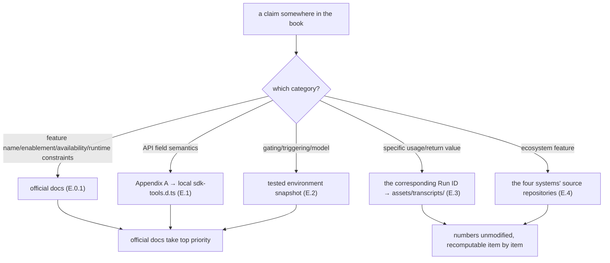

# Appendix E · Sources

> This is a "facts-first" book. This appendix lists, one by one, the **real sources** the whole book rests on, in six categories: ① official documentation (`code.claude.com/docs/en/workflows`); ② official type definitions; ③ tested environment and version; ④ the book's own real runs (with Run IDs and the mechanisms covered); ⑤ the source repositories of the four community systems; ⑥ reference readings (noted as "reference, not copied").
>
> Any claim in the book about an API field/behavior/number should trace back to one of this appendix's entries. **Truth priority: official docs / official type definitions ≥ local Run-ID testing > third-party material.** If something disagrees with your local testing, **defer to the official docs and your local type definitions/runs**. This is an official **research preview** feature, and fields may evolve across versions.

---

## E.0 Honesty Statement

**This book is an independently written third-party practice manual, not affiliated with Anthropic.** The feature is now officially documented as **Dynamic workflows (research preview)** at [`code.claude.com/docs/en/workflows`](https://code.claude.com/docs/en/workflows), which this book aligns to as a **first-tier authoritative source**; but the book itself remains a third-party practice summary, not official documentation. Its entire content is based on four classes of public/reproducible fact sources:

0. **Official documentation**: Claude Code's official Dynamic workflows page (the feature's name, version requirement, paid-plan/Bedrock/Vertex/Foundry availability, `/config` enablement, behavior & limits, the bundled `/deep-research`, etc., all defer to it);
1. **The public distribution and type definitions**: Claude Code's npm distribution and the tool type definitions it contains;
2. **Product-behavior analysis**: environment variables, tool receipts, and completion notifications observed in real Claude Code sessions;
3. **Real runs**: the workflows we ran ourselves on this machine. The table in [E.3](#e3-real-run-records-first-batch-10-completed-runs-9-unique-run-ids-and-the-mechanisms-covered) is the **first batch of 10 completed runs**; [§E.3.1](#e31-r4-real-runs-reproducing-third-party-claims) adds the R4 batch (runs #11–#19), plus an R3 baseline-reverification group. Through the R4 round that totals **19 run records (18 completed + 1 failed on a 30s sync timeout) / 17 unique Run IDs** (a resume reusing an existing Run ID, and submit-time rejections, are not counted as separate IDs). Afterward, rounds R5 and R6 each ran 3 more application-level workflows (review-spa / dead-code-scan / feedback-themes), bringing the book's **curated real-run corpus to 23 unique Run IDs** (R4 17 + R5 3 + R6 3). Rounds R7–R11 each added a batch of **verification probes**, for example R11's `wf_03e38250-1bb` / `wf_614e6e6b-c6f` / `wf_71b563fd-37a`, which re-verified the runtime invariants and the Opus 4.8 environment on v2.1.156. R13 then added four internals probes that back [Appendix G](#/en/app-g): `wf_b1d45b4c-445` (subagent runtime, covering the seven-tool registry, repo-root cwd, auto-approved file edits, and the async and `pipeline` failure shapes), `wf_b7c75d40-c26` (the synchronous-`throw` failure semantics), `wf_4248177d-c90` (resume, with a full cache hit on an unchanged rerun and a longest-unchanged-prefix re-run on an edit), and `wf_f8398424-dcd` (a seven-agent discovery run confirming the `<task-notification>` usage fields). By this book's convention these probes serve **verification only and are not folded into the headline curated-23 count**, handled the same as the R7/R8/R9 probes. All usage/return values are recorded verbatim in `assets/transcripts/`.

Any script that was **not actually run, serving only as illustration**, is clearly marked "(illustrative, not run)" in the text. Any citation of real data notes the Run ID and provenance. We **do not fabricate** APIs, parameters, or outputs.

---

## E.0.1 Official Documentation (First-tier Authoritative Source · added in R11)

The feature is now officially documented, and that docs page is one of the book's highest-priority sources.

| Source | Status | Use (facts the book aligns to it) |
|---|---|---|
| [`code.claude.com/docs/en/workflows`](https://code.claude.com/docs/en/workflows) ("Orchestrate subagents at scale with dynamic workflows") | Feature named **Dynamic workflows**, status **research preview**; fetched 2026-05-29 this round | Version requirement **v2.1.154+**; **available on all paid plans** (incl. Anthropic API, Amazon Bedrock, Google Cloud Vertex AI, Microsoft Foundry), **Pro turns it on from the "Dynamic workflows" row in `/config`**; trigger keywords `workflow`/`workflows` (`alt+w` to ignore a false trigger); `/effort ultracode` (xhigh + automatic orchestration); runtime & limits (no mid-run input, the script has no direct fs/shell access, up to 16 concurrent, 1,000 agents per run); resume within the same session (`p` in `/workflows`), **after exiting Claude Code the next session starts the workflow fresh** ("the next session starts the workflow fresh"); **the only bundled workflow is `/deep-research`** (needs WebSearch available) |

**How this docs page changes the book's source tiers**: before it shipped, the community (including this book's early drafts and the third-party readings in §E.5 below) sometimes described the feature as "a hidden tool not in the official docs." **That premise no longer holds.** It is an official feature, and its naming, availability, enablement, and runtime constraints all **defer to this official docs page.** This book's incremental value over the official docs lives in the **tested layer** the docs don't detail: the version drift of the named-workflow registry ([E.3](#e3-real-run-records-first-batch-10-completed-runs-9-unique-run-ids-and-the-mechanisms-covered) / [Appendix A · A.13.1](#/en/app-a)), serialization traps, a synchronous `throw` in `parallel` failing the whole run, worktree on-disk behavior, and so on. These layer "official docs + local testing" together; they don't conflict with the docs, they fill in the corners the docs leave unexpanded.

> Two confirmed points about the official "resume" paragraph: ① **resume works within the same session** (select a stopped run in `/workflows` and press `p`; completed agents return cached results, the rest run for real); ② **after you exit Claude Code, the next session starts the workflow fresh** (official wording: "the next session starts the workflow fresh"), i.e. resume does not survive across sessions.

> **The official ways to turn it off (three personal + org-wide)**: ① toggle "Dynamic workflows" off in `/config`; ② add `"disableWorkflows": true` to `~/.claude/settings.json`; ③ set the environment variable `CLAUDE_CODE_DISABLE_WORKFLOWS=1` (read at startup). Any one of the three works, and they all persist. To turn it off for a whole team/org: set `"disableWorkflows": true` in managed settings, or use the toggle on the Claude Code admin settings page. Once off, the bundled commands (like `/deep-research`) are gone, the `workflow` keyword no longer triggers, and `ultracode` disappears from the `/effort` menu.

---

## E.1 Official Type Definitions (the Authoritative Source for API Fields)

The book's API field semantics ([Appendix A](#/en/app-a)) are compiled against the tool type definitions inside Claude Code's official distribution.

| Source | Use | Coverage |
|---|---|---|
| **`sdk-tools.d.ts`** inside the `@anthropic-ai/claude-code` package | The fields and types of the two interfaces `WorkflowInput` / `WorkflowOutput` | `script` / `name` / `args` / `scriptPath` / `resumeFromRunId`; `status` / `taskId` / `runId` / `transcriptDir` / `scriptPath` / `sessionUrl` / `warning` / `error` |
| **The Workflow tool definition** (the tool's runtime description) | The signatures and semantics of the script-body global hooks, the triggering methods, concurrency and scale constraints | `meta` / `agent()` / `parallel()` / `pipeline()` / `phase()` / `log()` / `args` / `budget` / `workflow()`; the `min(16, cores−2)` concurrency limit, the 1000-agent fallback, one-level nesting |

`sdk-tools.d.ts` is **a type-definition file inside the distribution**, not a file in this book's repository; it ships with your installed Claude Code. To verify, view the file in your local `@anthropic-ai/claude-code` install directory. If fields differ across versions, **your local `sdk-tools.d.ts` is the final authority** ([Appendix A](#/en/app-a)'s ending says the same).

---

## E.2 Tested Environment and Version (the Basis for Behavioral Claims)

The following environment facts were **verified by testing** in real Claude Code sessions (environment-variable existence, version number, model identifier), and are the basis for the book's "gating / triggering / model" claims.

| Fact | Tested value | Nature |
|---|---|---|
| Claude Code version | **v2.1.156** (≥ the official minimum v2.1.154; early base mechanisms tested on v2.1.150) | `claude --version` verified |
| Low-level switch environment variable | `CLAUDE_CODE_WORKFLOWS=1` | Tested session environment variable present (not the official enablement path; see the note below) |
| effort lock | `CLAUDE_CODE_EFFORT_LEVEL=max` | Tested environment variable |
| Related experimental flag | `CLAUDE_CODE_EXPERIMENTAL_AGENT_TEAMS=1` | Tested environment variable |
| subagent model | `claude-opus-4-8[1m]` (**Opus 4.8**, set by `CLAUDE_CODE_SUBAGENT_MODEL`) | Tested environment variable (`examples-r11.md` R11-P4) |
| Run month | 2026-05 | The transcripts' recording time |
| Return nature | Always async: the receipt arrives first (`taskId`/`runId`), the result via `<task-notification>` | Type definitions + testing |

> **About `CLAUDE_CODE_WORKFLOWS=1`**: this is an environment variable our test environment actually had set, but it is **not** the way the official docs tell you to turn workflows on. The official enablement path is the "Dynamic workflows" row in `/config` (available on all paid plans, with Pro required to enable it there; the docs don't state whether the other plans default on or off, so check your own `/config`, see [E.0.1](#e01-official-documentation-first-tier-authoritative-source-added-in-r11)), and the only environment variable the docs record is `CLAUDE_CODE_DISABLE_WORKFLOWS`, which turns workflows **off**. So don't treat it as "required to make it work"; think of it as a low-level switch.

> These are a **tested snapshot at the time of this book's writing.** Research preview features evolve; if the version has changed by the time you read this, defer to your local testing.

---

## E.3 Real Run Records (First Batch: 10 Completed Runs, 9 Unique Run IDs, and the Mechanisms Covered)

The table below is this book's **first batch** of real runs: **10 completed runs**, corresponding to **9 unique Run IDs** (run #4 reuses run #1's Run ID via resume, not counted as a separate ID), all **actually run on this machine.** The full real-run corpus goes beyond this batch: it also includes the R4 batch (runs #11–#19) in [§E.3.1](#e31-r4-real-runs-reproducing-third-party-claims) and an R3 baseline-reverification group (**19 records / 17 unique Run IDs** through the R4 round), plus the 6 application-level runs from rounds R5 and R6, for a **curated total of 23 unique Run IDs** across the book (R4 17 + R5 3 + R6 3). The raw records are all kept in the repository's `assets/transcripts/`, with all numbers unmodified.

> **Evidence screenshot**: a live capture of Claude Code's built-in `/workflows` panel. The screenshot shows **10 completed** runs in this session (i.e. this E.3 batch), each line showing agent count / tokens / duration, matching the table below one-for-one. Note `hello-workflow` appears twice: once as a script run (~26k tokens / 10s), once at `0s`, a `resumeFromRunId` **cache hit** (0 tokens, corroborating [Chapter 22 · Resume & Caching](#/en/p4-22)). The book's real corpus is **not limited to this screenshot**; it also includes the R3/R4 transcript records (see [§E.3.1](#e31-r4-real-runs-reproducing-third-party-claims)), plus the 6 application-level runs from R5/R6, for a **curated total of 23 unique Run IDs** across the book.

| # | Workflow | Run ID | Task ID | Mechanisms covered | Key real data | Record file |
|---|---|---|---|---|---|---|
| 1 | hello-workflow | `wf_dacbd480-d5d` | `wi7ye81mb` | Single agent + `schema`-forced structuring; async receipt | `agent_count=1`, `tokens=26,338`, `5,506ms`; `sum` strictly the number `4` | `primitives.md` |
| 2 | parallel-demo | `wf_52957913-6d2` | `wjqmilq04` | `parallel()` barrier, 3 concurrent, thunk form | `agent_count=3`, `tokens=78,844`, `8,395ms` (≪ 3×5.5s) | `primitives.md` |
| 3 | pipeline-demo | `wf_bf086b98-6ec` | `w60ugs3lk` | `pipeline()` two stages, no barrier between stages, stage signature `(prev, orig)` | `agent_count=6`, `tokens=158,982`, `26,743ms` | `primitives.md` |
| 4 | hello-workflow (resume) | `wf_dacbd480-d5d` (reused) | `w7pxch4w6` | `resumeFromRunId` cache hit, replayability | **`tokens=0`, `tool_uses=0`, `8ms`**, return value identical to the first | `advanced.md` |
| 5 | nested-parent | `wf_85e22b38-126` | `wwxi71uvf` | `workflow()` inline nesting, child agents count toward parent, one-level nesting | `agent_count=1`, `tokens=26,338`, `6,050ms` (sub-flow counts toward parent) | `advanced.md` |
| 6 | frontend-review | `wf_4c5caabb-b73` | `wss21eu0x` | Multi-dimension PR `parallel` review + synthesis; `opts.phase` explicit grouping; dogfooding | `agent_count=4`, `tokens=221,648`, `272,643ms`; 26 findings deduped to 16 | `frontend-review.md` |
| 7 | gcf-slugify | `wf_7472ceac-daa` | `wchxy8dbm` | Generate-Critique-Fix sequential three stages; adversarial critique | `agent_count=3`, `tokens=96,468`, `180,724ms`; caught 10 genuine defects | `gcf-slugify.md` |
| 8 | judge-panel | `wf_f5b69668-b18` | `w7rykwriv` | Judge panel: `parallel` drafting + independent judges, rubric, vote-tallying | `agent_count=5`, `tokens=201,852`, `79,462ms`; judges converged 3:0 | `judge-panel.md` |
| 9 | bug-hunter | `wf_53da9a06-915` | `wsj4ypt3x` | Bug Hunter + adversarial verification: `parallel` inside `pipeline` dispatching 2 "default-falsify" falsifiers, vote-confirmed | `agent_count=11` (1 hunter + 5 bugs×2 falsifiers), `tokens=311,134`, `61,660ms`; 5 seed bugs each passed verification 2:0 | `bug-hunter.md` |
| 10 | deep-research | `wf_6090decc-8a5` | `wva3qtdps` | Deep research (Ch.13): Research (`parallel` orthogonal retrieval) → Verify (independent cross-verification + source quality) → Synthesize (citation-forced); subagents did real web sourcing | `agent_count=4` (2 retrieval + 1 cross-verify + 1 synthesis), `tokens=148,975`, `tool_uses=31`, `298,530ms` (~5 min, includes real web retrieval) | `deep-research.md` |

**Three dogfooding runs deserve special mention**: run #6 (frontend-review) genuinely used Workflow to review the book's own `index.html` and fixed 16 items accordingly; run #7 (gcf-slugify)'s resulting `slugify` experience was used precisely to improve the book's frontend heading-ID generation; run #10 (deep-research) independently verified that "marked v12 does not sanitize, so you should use `DOMPurify.sanitize(marked.parse(input))`", which conversely **confirmed that the XSS fix landed after frontend-review was correct**. None of these three are demos; they're real sources of improvement to and verification of the book's frontend.

**Run #8's unexpected gain**: the 3 judges noted in their scoring rationale that they **actually read `docs/en/p2-08` and `assets/_grounding.md` to cross-check the numbers**, verifying item by item before ruling "zero factual errors," effectively verifying the accuracy of the real data in this book's Chapter p2-08 along the way.

**Run #9's unexpected gain**: adversarial verification filters false positives, and it also **corrected the hunter.** `applyDiscount`'s falsifier, while confirming the bug is real, pointed out that the seed comment's reasoning "percent as a string would concatenate" is wrong (`*`/`/` coerce a string to a number; only `+` concatenates). A verifier that merely agrees would miss this; only a "default-falsify, rule refuted when uncertain" verifier would scrutinize it. See [Chapter 15 · Bug Hunter](#/en/p3-15) and [Chapter 17 · Adversarial Verification](#/en/p4-17).

### Companion Real Samples

| Asset | Use | Location |
|---|---|---|
| `buggy-cart.js` | The real hunting target of the **Chapter 15 Bug Hunter** recipe: containing 5 deliberately planted defects (missing validation, off-by-one, missing `await`, `==`, shared-reference mutation) | `assets/samples/buggy-cart.js` |

> Before writing a recipe chapter, read the corresponding transcript record first; it's the sole basis for that chapter's data. More real runs will be appended to `assets/transcripts/` over time.

### E.3.1 R4 Real Runs (Reproducing Third-Party Claims)

The table above (#1–#10) is this book's first batch of real runs. The **R4 round** added a set of **further tests** specifically targeting the sandbox mechanisms and the third-party repo's claims, recorded in five `*-r4.md` files under `assets/transcripts/`. The purpose of these runs is **not to take the third-party repo on faith**: either reproduce its claims as facts by testing, or mark them "unverified."

| Record file | Mechanisms covered | Key Run IDs |
|---|---|---|
| `sandbox-r4.md` | The determinism **dual-layer ban** (literal rejected at submit + aliased thrown at runtime); injected globals (`console`/`setTimeout`/`log`/`budget`); `args` passed through unchanged (object stays object); host APIs (`require`/`process`/`fetch`) absent; `CLAUDE_CODE_SUBAGENT_MODEL` overriding the per-call model | `wf_59bf3654-183` (sandbox introspection, 0 agents), `wf_9c94951d-58c` (model resolution, 5 agents) |
| `api-facts-r4.md` | `agentType` validated (an unknown value throws at 0 tokens and lists available agents); resume = 100% cache hit (0 tokens); nested `workflow()` one-level cap + args passthrough | `wf_a222f20f-0f5`, `wf_9c94951d-58c` (resume), `wf_2b04881f-6a9` |
| `repo-claims-r4.md` | Testing the third-party repo's claims item by item: meta reserved keys rejected, `isolation:'remote'` disabled (+ the correction that an unknown isolation is silently ignored), `model` not validated at submit, the 30000ms VM sync timeout | `wf_dace2fc6-966`, `wf_e3b2b123-5f4` (sync timeout, failed) |
| `r3-reverification.md` | R3 baseline reverification (re-running the hello / parallel / pipeline trio) + the **budget probe**: `budget` returns `{totalIsNull:true, spentIncreased:true, remaining Before/After:"Infinity", guardRounds:0}` (1 agent / 26,211 tokens / 6,933ms; cited by [Part 2 · p2-09](#/en/p2-09) and [Appendix F](#/en/app-f)) | `wf_2e7d82d6-d13`, `wf_3b5bbac7-e96`, `wf_58225d5c-1e8`, `wf_fd09a6ed-38a` (budget probe) |
| `validator-r4.md` | The **real-run behavior** of the third-party `validate-workflow.mjs`: a valid script `ok…passes` (exit 0); a broken script erroring item by item (meta must be first, banned nondeterministic calls, host-API warning, `parallel` bare-promise warning, exit 1) | (run on this machine with Node v22.22.0, not a Workflow Run ID) |
| `mcp-access-r4.md` | A subagent can use MCP: the default `workflow-subagent` holds 0 `mcp__` tools (deferred environment), but loads on demand via ToolSearch and calls context7 end-to-end successfully | `wf_1d4c6a71-56a` (tool introspection), `wf_d8aa0772-ced` (end-to-end) |

**How this R4 batch changes the source tiers**: it **promotes several entries** previously in "third-party claim" **to tested facts** (citable with Run IDs): meta reserved keys rejected, `isolation:'remote'` disabled, `model` not validated at submit, the 30000ms sync timeout, `args` passthrough, injected globals. Still in "third-party, unverified": `stallMs` default/retry counts, the budget-exhausted in-flight-agent behavior, whether the resume cache key's remaining fields (`schema`/`model`/`isolation`/`agentType`/`phase`) are in the key (`label`/`prompt` were tested in R8, see A.10), the exact schema-retry count (see the relevant entries in [Appendix B](#/en/app-b) and [Appendix D · D.6/D.8](#/en/app-d)). (Note: the error class names `WorkflowAgentCapError`/`WorkflowBudgetExceededError` were also on this list originally, but R10 binary inspection has since confirmed they exist and they've been moved off it; see A.14.)

---

## E.4 The Four Community Systems (the Source Repositories for Ecosystem Borrowing)

Part V "Ecosystem"'s analysis of the four forerunner systems comes from a **genuine reading of their respective source repositories** (rather than secondhand paraphrase). They all were born before native Workflow, **simulating** deterministic orchestration via "prompts + Hooks + state files." The deterministic skeleton and JSON Schema constraints they lacked are exactly what native Workflow fills in; and the resilience layer they honed (verification gates, persistent loops, disk state, boundary guardrails) is exactly what native Workflow is worth borrowing.

| System | Form | Gems (this book's distillation) | Chapter |
|---|---|---|---|
| **ccg-workflow** (Claude+Codex+Gemini multi-model collaboration) | A prompt state machine + JS Hook + Go binary bridging heterogeneous CLIs | Disk state `task.json` + per-turn Hook breadcrumb injection against context compaction; the Ralph Loop clean-context iteration; file ownership + Layer-based parallelism; Spec Evolution; deadlock detection | [Ch. 23](#/en/p5-23) / [Ch. 24](#/en/p5-24) |
| **superpowers** (obra, a methodology across 7 harnesses) | Pure skill + a SessionStart hook injecting a "behavioral constitution," probabilistic orchestration | A two-stage review loop (spec compliance → code quality, each looping until it passes); a Brainstorming-first hard gate; the TDD Iron Law; Verification-before-completion; structured status returns | [Ch. 23](#/en/p5-23) / [Ch. 24](#/en/p5-24) |
| **oh-my-claudecode (OMC)** | hooks + state files simulating orchestration, no JSON Schema constraint | The `Stop` hook persistent loop ("boulder never stops"); control plane / data plane separation + Artifact handles; declarative-delegation enforcement; echo-guard; PRD-driven + independent reviewer sign-off; 20 roles | [Ch. 23](#/en/p5-23) / [Ch. 24](#/en/p5-24) |
| **oh-my-openagent (OmO)** (built on opencode, not Claude Code) | Tool-layer guardrail throws + system-reminder injection for correction | The planner physically cannot write code (tool-layer throw); Category (semantic intent) delegation rather than by model name; cross-session `boulder.json` + notepad externalized memory | [Ch. 23](#/en/p5-23) / [Ch. 24](#/en/p5-24) |

> For the through-line insight, see [Chapter 23 · Four Systems Compared](#/en/p5-23); for how to rewrite these gems as reusable Workflows with `phase`/`schema`, see [Chapter 24 · The Art of Extraction](#/en/p5-24) and [Chapter 25 · Build Your Own Library](#/en/p5-25).

---

## E.5 Reference Readings (Reference, Not Copied)

The following third-party readings served as **background reference** and **perspective comparison** during writing, helping to understand the feature's design motivation and community perception.

**Strictly distinguish reference from copying.** All of this book's cases, scripts, and data are **original, real output** (see [E.3](#e3-real-run-records-first-batch-10-completed-runs-9-unique-run-ids-and-the-mechanisms-covered)), with **nothing copied** from any reference material's examples. Reference readings serve only to build background understanding; wherever they conflict with the official type definitions or this book's real runs, **defer to [E.1](#e1-official-type-definitions-the-authoritative-source-for-api-fields)/[E.3](#e3-real-run-records-first-batch-10-completed-runs-9-unique-run-ids-and-the-mechanisms-covered).**

| Type | Description | How used |
|---|---|---|
| The "AI Meta-Domain" blog (community reading) | An early community reading of and perspective on the Workflow feature | **Reference**: background motivation and terminology understanding; cases are all original, not copied |
| Related explainer videos | The community's explanations of multi-agent orchestration | **Reference**: building intuition; specific numbers defer to this book's real runs |
| **`claude-code-workflow-creator`** (third-party GitHub repo) | A YouTuber's companion repo to their video `c0gVowvMR-g`, **not official Claude/Anthropic output.** Contains `references/api-reference.md`, `references/patterns.md`, 6 example workflows, 3 templates, `scripts/validate-workflow.mjs` (a pre-submit lint). | **Borrow ideas, not authority**: **anything touching the feature's naming, enablement, availability, or runtime constraints now defers to the official docs ([E.0.1](#e01-official-documentation-first-tier-authoritative-source-added-in-r11))**; this third-party repo serves only as idea inspiration — **never copy its text, never treat its claims as truth.** Those of its claims this book could reproduce by testing (e.g. meta reserved keys rejected, `isolation:'remote'` disabled, the 30000ms sync timeout, `model` not validated at submit) have been promoted to tested facts with Run IDs (see [E.3.1](#e31-r4-real-runs-reproducing-third-party-claims)); those it couldn't reproduce and the official docs don't mention either (`stallMs` default/stall-retry counts, etc.) are all marked "a community third-party source claims this; this book did not independently verify it" (**the error class names are an exception**: originally a third-party claim, later confirmed to exist via R10 binary inspection). Its bundled `validate-workflow.mjs`, this book **did run to confirm its behavior** (see [E.3.1](#e31-r4-real-runs-reproducing-third-party-claims)). |
| The video `c0gVowvMR-g` (the above repo's companion video) | The YouTuber's video explaining multi-agent orchestration/workflows | **Content not quoted**: the video page is a SPA, **captions cannot be retrieved**, so this book quotes none of its specific statements; only its companion relationship to the above third-party repo is recorded. |
| **The zenn article (`lumichy`, Japanese community reading · added in R8)** | Zenn author lumichy's reading of ultrawork (~2,500–3,000 chars + 7 images), titled "MCPとSkillsに続く第3の革命：Claude Code Workflowがultraworkで Agentをコードに焼き付ける." **Written before the official docs shipped**, it says "not in the official docs (as of May 2025)," and a comment additionally claims v2.1.150 needs `export DISABLE_GROWTHBOOK=1` to enable it. **Not official Claude/Anthropic output.** | **Dialectical reference, not truth**: ① its "not in the official docs" line reflects its writing-time status and is **now outdated** — the feature is officially documented at [`code.claude.com/docs/en/workflows`](https://code.claude.com/docs/en/workflows) (see [E.0.1](#e01-official-documentation-first-tier-authoritative-source-added-in-r11)), and enablement/availability defer to the official docs; ② any statement about API shape/fields defers to the official type definitions ([E.1](#e1-official-type-definitions-the-authoritative-source-for-api-fields)) and this book's real runs ([E.3](#e3-real-run-records-first-batch-10-completed-runs-9-unique-run-ids-and-the-mechanisms-covered)), with this book winning any conflict; ③ its environment/UX claims (e.g. "v2.1.150 needs `DISABLE_GROWTHBOOK`") go onto a **to-test list**, marked "a third-party claim, unverified" until this book reproduces them by testing. Full dialectical verification record in `assets/transcripts/examples-r8.md` §6. |

> The reason they're listed separately and "not copied" is repeatedly stressed: this book's promise is **facts-first + original and real.** Reference material can inspire understanding but cannot replace "running it by hand and recording the real numbers," which is the foundation of every claim in this book. **In particular, `claude-code-workflow-creator` is a third-party YouTuber's repo, not official**: this book borrows only its ideas, and any of its claims must be reproduced by this book's own testing before being promoted to fact, otherwise explicitly marked "unverified."

---

## E.6 How to Trace a Claim (for the Scrupulous Reader)

If you want to verify any number or field in the book, follow this chain:

- **Feature name/enablement/availability/runtime constraints** → [E.0.1](#e01-official-documentation-first-tier-authoritative-source-added-in-r11)'s official docs (top priority).
- **API fields** → [Appendix A](#/en/app-a), with your local `sdk-tools.d.ts` as the final authority.
- **Environment/version** → [E.2](#e2-tested-environment-and-version-the-basis-for-behavioral-claims)'s tested snapshot (research preview features evolve, defer to local).
- **Usage/return values** → follow the Run ID to the transcript file pointed to by [E.3](#e3-real-run-records-first-batch-10-completed-runs-9-unique-run-ids-and-the-mechanisms-covered); all numbers are kept verbatim and recomputable.
- **Ecosystem gems** → [E.4](#e4-the-four-community-systems-the-source-repositories-for-ecosystem-borrowing)'s source repositories + Part V.

> Companion reading: field quick reference [Appendix A · Full API Reference](#/en/app-a); pitfalls and troubleshooting [Appendix B · Pitfalls & Troubleshooting](#/en/app-b); best practices [Appendix C · Best Practices](#/en/app-c); terms [Appendix D · Glossary](#/en/app-d).

---

> **Acknowledgments and boundaries**: thanks to the authors of the four community systems for their exploration before native Workflow. This book is an independent practice summary standing on their shoulders and the official distribution; all errors are the book author's, and all original real data can be re-checked via `assets/transcripts/`. This is a book that will need updating as the feature evolves; when your local testing disagrees with the book, trust your testing.
