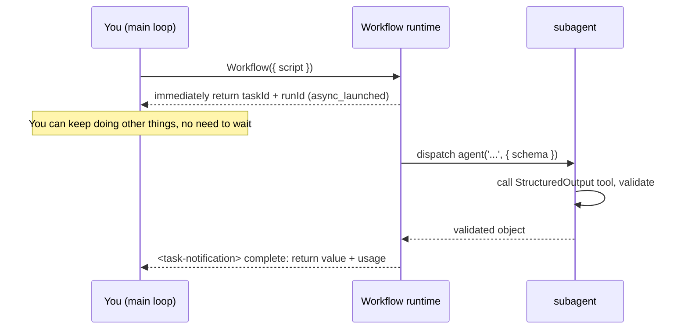

# Chapter 01 · What Workflow Is

**Dynamic workflows are a built-in tool in Claude Code.** You write a single pure-JavaScript script, and it orchestrates hundreds of subagents in the exact order you specify (official caps: up to 1,000 per run, up to 16 concurrent). The official status is research preview; the rest of this book mostly shortens it to "workflow."

This chapter is in no rush to write complex scripts. First we nail down three things: what this thing actually is, what happens at runtime, and why it is worth spending time on. That is the bedrock for every recipe that follows.

According to the official documentation, workflows are best suited for:

- **Codebase audits**: fan out agents to scan different modules or dimensions in parallel
- **Large-scale migrations**: run every file/module through the same pipeline, handling dependencies automatically
- **Cross-source research**: multi-path retrieval + cross-validation + consolidation
- **Multi-perspective plan review**: split a single plan across different reviewer roles, then consolidate scores

---

## 1.1 Starting from a Real Run

The fastest way to understand something is to watch it actually run. The script below is the first Workflow this book ran in a real Claude Code session.

```javascript
export const meta = {
  name: 'hello-workflow',
  description: 'Smoke test: one subagent returns schema-constrained structured output',
  phases: [{ title: 'Greet', detail: 'One subagent confirms the runtime' }],
}

phase('Greet')
const r = await agent(
  'You are a smoke test for the Claude Code Workflow runtime. Return a one-sentence ' +
  'confirmation message, the integer value of 2+2, and a boolean confirming you ran ' +
  'as a workflow subagent.',
  {
    label: 'smoke',
    schema: {
      type: 'object',
      properties: {
        message: { type: 'string' },
        sum: { type: 'number' },
        runtimeConfirmed: { type: 'boolean' },
      },
      required: ['message', 'sum', 'runtimeConfirmed'],
    },
  }
)
log(`smoke result: ${JSON.stringify(r)}`)
return r
```

Handed to the Workflow tool to execute, the **real** return value is:

```json
{
  "message": "The Claude Code Workflow runtime smoke test executed successfully as a workflow subagent.",
  "sum": 4,
  "runtimeConfirmed": true
}
```

The runtime also came with a real usage report:

```text
agent_count = 1   tool_uses = 1   total_tokens = 26338   duration_ms = 5506
```

> Source: the raw record of this run is in the repository's `assets/transcripts/primitives.md` (Run ID `wf_dacbd480-d5d`). Every "real run" in this book can be traced this way.

In just over twenty lines, this script already hits almost every key point of Workflow. The sections below take it apart one piece at a time.

---

## 1.2 Dissecting a Script: Warp and Weft

Back to the "Loom" metaphor. A Workflow script is made of two parts:

### The Warp: `meta` and `phase` — the taut structure

A script **must** begin with `export const meta = {…}`, and it **must be a pure literal**: no variables, function calls, spread operators, or template interpolation inside it. If the format is wrong, the runtime rejects the script outright.

```javascript
export const meta = {
  name: 'hello-workflow',                       // required: workflow identifier
  description: 'Smoke test: ...',               // required: one-line description, shown in the permission dialog
  phases: [{ title: 'Greet', detail: '...' }],  // optional: phase declarations, driving the progress display
}
```

Why must `meta` be a pure literal? The runtime reads it **before it actually executes the script**, so it can tell you in the permission dialog "what this workflow is called, what it does, how many phases it has." That step is static parsing only; it does not run your code. If `meta` contained a `Date.now()` or some variable, there would be no way to compute the value at parse time.

`meta`'s fields (per the official type definitions and tool description):

| Field | Required | Role |
|---|---|---|
| `name` | Yes | Workflow name |
| `description` | Yes | One-line description, shown in the permission confirmation dialog |
| `whenToUse` | No | Use-case description, shown in the workflow list |
| `phases` | No | Phase array, each item `{ title, detail?, model? }`, driving the progress-tree grouping |

`phase('Greet')` **switches the current phase** in the script body: every `agent()` call after it groups under "Greet" in the progress display.

### The Weft: `agent()` and other global functions

The script body runs in an `async` context, so you can `await` directly. The runtime drops a set of **global functions** into the script; you use them as-is, no import needed:

| Function | Role |
|---|---|
| `agent(prompt, opts?)` | Dispatch a subagent, return its output |
| `parallel(thunks)` | Run a set of tasks concurrently, **barrier**: wait for all |
| `pipeline(items, ...stages)` | Have each item flow independently through stages, **no barrier** |
| `phase(title)` | Switch the current phase |
| `log(message)` | Output a line of progress info to the user |
| `workflow(name, args?)` | Inline-call another workflow (a sub-process) |
| `args` | The arguments object passed in by the caller |
| `budget` | The token budget object for this turn |

`hello-workflow` uses only the most basic `agent()`: dispatch a subagent, wait for it to return, get the result.

<div class="callout warn">

**Scripts cannot use `Date.now()`, `Math.random()`, or arg-less `new Date()`.** This restriction is enforced at two layers:

1. **Pre-execution source scan.** The runtime scans the script source before execution; if any of these literals appears **anywhere** (including comments, strings, or unreachable code blocks), the entire script is rejected. Since the script never runs, `try/catch` cannot capture this error.
2. **Runtime interception.** Even if the source scan is bypassed through dynamic means (e.g., referencing `Date` indirectly so no literal token appears in the source), these globals have been replaced at runtime and **still throw when called.** This layer can be caught with `try/catch`, but relying on this is not recommended.

Why this restriction? Section 1.7 explains in detail. These three functions return different values on each call, which breaks the premise that "the same script produces the same execution," making resume impossible. For timestamps, pass them in via `args` or add them externally after the workflow finishes. For randomness, vary the prompt using the agent's index.

</div>

---

## 1.3 `agent()`: The Birth of a Subagent

The core of `hello-workflow` is this line:

```javascript
const r = await agent(prompt, { label: 'smoke', schema: {...} })
```

Its purpose: **dispatch a subagent to execute `prompt`, then return its output as the value.**

Two key designs are at work here, and they are what distinguishes this from spinning up subtasks manually.

**First, the subagent is explicitly told "your final output is the return value."** An ordinary subtask returns text written for a human reader. A Workflow subagent knows its output will be consumed by a **program**, so it returns **raw data** without extraneous description.

**Second, `schema` turns "raw data" into "structured data."** Pass in a `schema` (a JSON Schema) and the runtime forces this subagent to call an internal `StructuredOutput` tool, then checks **at the tool-call layer** whether the return value conforms to the schema. If it does not conform, the model **retries** until it does. Therefore, when `agent()` carries a schema, the return value is an **already-validated object**, requiring no additional parsing or error-handling code.

Look back at the real output: the `sum` requested (2+2) came back as the number `4`, **not the string `"4"`**. The schema declared `sum: { type: 'number' }` and the validation layer locked the type down. This is precisely where structured output proves its value, and Chapter 07 covers it in depth.

> **What if you skip the schema?** Per the tool definition, without a `schema`, `agent()` returns the subagent's final text (a string). Only with a schema does it return a validated object.

`agent()`'s common options (full list in Chapter 06 and Appendix A):

```javascript
await agent(prompt, {
  label: 'smoke',          // the label in the progress display, auto-numbered by default
  schema: {...},           // JSON Schema: force structured output
  phase: 'Greet',          // explicitly group into a phase (especially important inside pipeline/parallel)
  model: 'haiku',          // override this agent's model; omit to inherit the main loop's
  isolation: 'worktree',   // run in an independent git worktree (use when parallel file edits collide)
  agentType: 'Explore',    // use a custom subagent type instead of the default
})
```

---

## 1.4 What Happens at Runtime: Async, taskId, Background

This is the most easily misunderstood point: **the Workflow tool does not "return when it finishes." It returns immediately.**

Per the official type definitions `sdk-tools.d.ts`, `WorkflowOutput`'s `status` has only two values: `"async_launched"` and `"remote_launched"`. In other words, **once the Workflow tool is called, it immediately starts running in the background and returns a handle.**

```text
Workflow launched in background. Task ID: wi7ye81mb
Run ID: wf_dacbd480-d5d
Script file: .../workflows/scripts/hello-workflow-wf_dacbd480-d5d.js
You will be notified when it completes. Use /workflows to watch live progress.
```

Several **real** pieces of information in this output are worth noting:

- **`Task ID`**: the ID of this background task.
- **`Run ID`** (like `wf_...`): this run's identifier, needed for resume (see section 1.7).
- **Script on-disk path**: every time you call, the runtime **saves your script as a file on disk.** To modify and retry, `Write`/`Edit` that file and re-invoke with `{ scriptPath: ... }`, without resending the entire script.
- **`/workflows`**: a slash command for watching the progress tree live.

When the workflow finishes, a **completion notification** (`<task-notification>`) arrives carrying the final return value and usage statistics. `hello-workflow`'s completion notification is the JSON from section 1.1 plus `agent_count=1 … duration_ms=5506`.



<div class="callout tip">

**Async + background means multiple workflows can run simultaneously.** Fire off several workflows in parallel, continue with other work, and each one sends a notification when it finishes. The rest of this book uses this pattern extensively. One important point: because it is async, **the Workflow tool's return value is not the workflow's result**. It is a "launched" receipt; the actual result arrives in the completion notification.

</div>

---

## 1.5 How to Get Claude to Use Workflow

To get Claude to actually run a Workflow, two **separate concerns** must be distinguished. They are frequently conflated, and that is the single biggest source of beginner confusion:

1. **Available**: is the Workflow tool enabled in the current environment?
2. **Will use**: once the tool is enabled, how do you get Claude to actually use it on this turn (or for the whole session)?

Two separate things, managed separately, and covered one layer at a time below.

### Layer 1 · Available: the official entry first, the underlying flag second

For whether the tool is enabled in your environment, **the official user-facing entry is `/config`**. A binary-level feature flag also exists underneath, but that is a mechanics-layer detail, covered after.

**The official entry (what you should do; source: official docs):**

1. **Check your version**: `claude --version` must be **v2.1.154 or later** (the official minimum).
2. **To turn on**: workflows are **available on all paid plans** (Pro, Max, Team, Enterprise), plus the Anthropic API and Amazon Bedrock, Google Cloud Vertex AI, and Microsoft Foundry. On **Pro**, you switch them on from the **Dynamic workflows** row in `/config`. The default state for the other plans (Max/Team/Enterprise) is not stated in the official docs; check the same toggle in your own `/config` to confirm.
3. **Verification**: include the `ultracode` keyword in your input; if the word appears **highlighted in violet**, workflows are enabled in your current session. Alternatively, type `/effort` and check whether the menu offers an `ultracode` setting (see section 1.6).

No longer needed? **To turn off**, use any one of four switches: the toggle in `/config`, `"disableWorkflows": true` in `settings.json`, the `CLAUDE_CODE_DISABLE_WORKFLOWS=1` environment variable, or `"disableWorkflows": true` in managed settings to turn it off org-wide. Once off, bundled commands, the `ultracode` trigger keyword, and the `ultracode` setting in `/effort` all stop working. For these disable switches and the scope each one covers, see [The Official Control Panel](#/en/p2-ops).

**The underlying flag (mechanics layer / power-user; source: client binary + local `printenv`):**

The above path (the `/config` toggle plus the three disable methods) is the switch path the official docs provide. Beneath the surface there is also an environment variable, `CLAUDE_CODE_WORKFLOWS`, but to be clear: it is **not** the way the official docs prescribe for turning workflows on. The only environment variable they document is the one that turns workflows **off**, `CLAUDE_CODE_DISABLE_WORKFLOWS`. `CLAUDE_CODE_WORKFLOWS` is a low-level switch observed in the client binary (this book's test environment happened to have it set), and should not be treated as "required to make it work." On the mechanics: whether the tool lights up depends jointly on this environment variable, the server-side flag `tengu_workflows_enabled`, and the account type, with the deciding logic in the client being a function called `FX5`. In the session where this book was written, `printenv` confirms the variable is present with value `1`, and the tool is indeed available:

```text
CLAUDE_CODE_WORKFLOWS = 1
```

Reading the real logic of the client's `FX5`, availability comes in three cases:

- Explicitly set `CLAUDE_CODE_WORKFLOWS=1`: it reads the server-side flag `tengu_workflows_enabled`, **defaulting to "on" locally when no value comes back**, so it is available by default unless the server explicitly turns it off;
- Explicitly set `=0`: **force off, cannot be overridden**;
- Not set: it looks at the same server-side flag, gated by your account type; when the flag is not explicitly off, the tool is treated as **on**. The official docs do not state which plans are pre-enabled, so confirm via `/config`.

<div class="callout info">

**The relationship between `=1` and `/config`.** This is the **underlying mechanism** read from the binary; the official user-facing entry is **`/config`**, and Pro users especially need to go through it. `=1` suits power users as an explicit switch, and this session's `printenv` confirms `=1` with the tool available. The server-side flag (`tengu_workflows_enabled`) is a growthbook gate under Anthropic's control; users cannot modify it directly, but it only vetoes when **explicitly turned off**; otherwise (including when no value is returned) it is treated as "on." Thus `=1` is a reliable explicit switch on the power-user side, but **it is not the only method and does not replace the official `/config` entry**; both coexist, with the official path taking priority.

</div>

If you are a power user setting `=1` explicitly, two ways:

```bash
# Set at launch (effective for the current session) — macOS / Linux syntax
CLAUDE_CODE_WORKFLOWS=1 claude
# Windows CMD: run set CLAUDE_CODE_WORKFLOWS=1 first, then claude on its own line
# Windows PowerShell: $env:CLAUDE_CODE_WORKFLOWS="1"; claude

# Or write into the env section of ~/.claude/settings.json (persistent, cross-platform)
{ "env": { "CLAUDE_CODE_WORKFLOWS": "1" } }
```

<div class="callout warn">

**This switch serves as an "intent confirmation" gate.** A single workflow can fan out dozens of subagents and consume a significant number of tokens. The switch ensures that users are aware of this. The tool definition repeatedly emphasizes the same point: **Claude only calls a workflow when the user has explicitly chosen multi-agent orchestration**, and will not launch one on its own simply because "this task might go faster in parallel."

</div>

### Layer 2 · Will use: four ways to get Claude to orchestrate

Once the tool is enabled, any one of the following triggers Claude to use it. This is the official list the client injects into the model (each item confirmed against the client binary):

| Way | Scope | Notes |
|---|---|---|
| Include the `ultracode` keyword in your message | **This turn** | Per the official docs, Claude Code **highlights the word in violet** in your message and switches to writing a workflow script instead of working through it turn by turn. The lightest trigger (the word `workflow` no longer triggers as of 2.1.160; see the end of this section). **Triggered it by accident? Press `alt+w` to ignore it for this prompt** (the official move). For the full command-line operation once triggered (pre-run approval, watching, pause/resume, saving as a command), see [The Official Control Panel](#/en/p2-ops). |
| `/effort ultracode` | **Standing, this session** | Makes Claude orchestrate a workflow by default on every substantive task, with reasoning bumped to xhigh at the same time. See section 1.6. |
| Ask in your own words | This turn | e.g. "run a workflow," "fan out agents," "orchestrate this with subagents." |
| Skill / slash command | This turn | Some skills' or slash commands' instructions already say to use a workflow, so invoking one triggers it. (Note: you or a script can also **call the Workflow tool directly** or run a **named workflow** `{ name: 'xxx' }`; that is a programmatic launch, not part of this "model opt-in" list.) |

> `ultracode` now pulls double duty: dropped into a message on its own it is a **single-turn** trigger (row 1 above); set as an effort tier with `/effort ultracode` it is **standing for the session** (row 2). After 2.1.160 renamed the single-turn trigger keyword from `workflow` to `ultracode`, the two became the same word.

<div class="callout warn">

**`ultrawork` is no longer a trigger.** Early community lore said "type `ultrawork` in the box and it triggers," but in the official 2.1.154 client `ultrawork` exists only as an **internal event name** (`ultrawork_request`), and **typing it triggers nothing.** The official trigger keyword is now `ultracode` (renamed in 2.1.160; it used to be `workflow` / `workflows`, and that word no longer triggers either). (Separately: the third-party system oh-my-openagent does use `ultrawork` as an entry word, but that implementation belongs to a third-party project, unrelated to official Claude Code; Chapter 23 covers it.)

</div>

### Version prerequisite: Claude Code has to be new enough

The official requirement is **v2.1.154 or later** (dynamic workflows' minimum version). This book's testing spans **v2.1.150 through v2.1.160**: the foundational mechanics in Parts I-IV mostly ran on 2.1.150, `/effort` and ultracode (section 1.6) were tested on **v2.1.154**, and R11 re-verified the core invariants on **v2.1.156**, where they still hold (see `assets/transcripts/examples-r11.md`); **R16 (this round) verified one behavior change on v2.1.160 — the single-turn trigger keyword was renamed from `workflow` to `ultracode`, and the word `workflow` no longer triggers** (tested first-hand this session: typing `ultracode` in a message fired the workflow opt-in, while `workflow` appearing in the same message did not; cross-checked against the official CHANGELOG 2.1.160 and the client `--version`). Per community reports an early form showed up around **2.1.148**, but **this book has not independently verified the exact starting version**, so treat that as a rough lower bound. Check your version:

```bash
claude --version
```

### Confirm "does it actually work" at a glance: a 0-token probe

The version number is only a reference; **the real test is whether the tool can actually be invoked.** Rather than checking version numbers, run a minimal workflow to verify directly: it dispatches no agents and consumes no tokens, and a clean return confirms the runtime environment is ready:

```javascript
export const meta = {
  name: 'check-runtime',
  description: 'Verify the Workflow runtime is available (0 agents, 0 tokens)',
  phases: [{ title: 'Check' }],
}

phase('Check')
log('Workflow runtime is live — 0 agents, 0 tokens')

// 0 agents, 0 tokens: just read back the runtime state and return
return {
  ok: true,
  budgetTotal: budget.total,                    // = null when no +Nk budget directive is given
  budgetTotalIsNull: budget.total === null,     // confirms it's literally null, not just falsy
  remaining: String(budget.remaining()),        // correspondingly = "Infinity"
  argsIsUndefined: typeof args === 'undefined', // = true when no args were passed
}
```

This book's run (`wf_580909ca-b32`): returns `{ ok: true, budgetTotal: null, budgetTotalIsNull: true, remaining: "Infinity", argsIsUndefined: true }`, at **0 agents / 0 tokens / 4ms** (the comments in the block above are explanatory annotations; strip them and you have the exact script this book ran). If the tool is not present in the current environment (version < v2.1.154, the account-level `/config` gate not turned on -- which matters most on Pro -- or the underlying flag unavailable), this step cannot be issued at all. In that case, go back and check the two layers in section 1.5.

---

## 1.6 `/effort` and ultracode: getting Claude to orchestrate by default

In that table above, `/effort ultracode` is the only "standing, this session" option. It is worth its own section, because it pulls in Claude Code's whole **effort** system.

### `/effort`: a knob for "how hard to try"

`/effort` is a slash command that sets, for the current session, how hard Claude **thinks.** In 2.1.154 it has seven settings (confirmed against the client; each setting's official description below):

| Setting | Official description (verbatim) | In a phrase |
|---|---|---|
| `low` | Quick, straightforward implementation | Simple stuff, in a hurry |
| `medium` | Balanced approach with standard testing | Everyday |
| `high` | Comprehensive implementation with extensive testing | **Opus 4.8 defaults here** |
| `xhigh` | Extended reasoning with thorough analysis | Official pick for "your hardest tasks" |
| `max` | Maximum capability with deepest reasoning | Deepest reasoning |
| `ultracode` | **xhigh + dynamic workflow orchestration (this session only)** | See below |
| `auto` | Use the default effort level for your model | Let the system decide |

You use it like `/effort xhigh`. Opus 4.8 starts at `high`; for the toughest tasks, the startup banner recommends `/effort xhigh`.

### What ultracode actually does

ultracode pins the reasoning setting to `xhigh`, not max. Examining the 2.1.154 client's real effort-parsing code confirms this:

```javascript
// The 2.1.154 client's real logic for parsing /effort arguments (excerpt; variable
// names humanized — the original minified code is in
// assets/transcripts/effort-ultracode-r10.md)
if (effort === "ultracode" && workflowsAvailable())
    return { value: "xhigh" };   // ← ultracode's reasoning depth = xhigh
```

The division of labor is as follows:

<div class="callout info">

**On reasoning depth, `max` is deeper than `ultracode`.** ultracode uses xhigh-level reasoning; what it provides in exchange is a different capability. Per the official description: **with it enabled, Claude proactively plans a workflow for each substantive task without being asked.** A single request can spawn several workflows in succession (one to understand the code, one to make the change, one to verify it); the cost is that every request in the session consumes more tokens and takes longer.

</div>

The two settings serve different purposes:

- **`max`**: for the **deepest reasoning** -- a single agent digging into one hard problem.
- **`ultracode`**: for **proactive multi-agent orchestration by default** -- xhigh reasoning plus automatic fan-out.

When a task is best solved by a single agent thinking deeply, `max` is usually the better fit; `ultracode` earns its place when a task benefits from splitting, parallelizing, and cross-checking.

### Three constraints you must know

1. **This session only; a new session resets it.** ultracode is repeatedly tagged "this session only" in the client: closing the window clears it, it is not written to settings, and a new session resets it. To return to routine work, **drop back with `/effort high`**. Other settings (low through max) are saved and persist across sessions.
2. **Only models that support xhigh display this setting; seeing it means "available."** The official docs state ultracode **only appears on models that support `xhigh`**; on other models the `/effort` menu does not include it. Combined with the `workflowsAvailable()` gate in the code above, **the `ultracode` option only appears when workflows are available.** This makes it a built-in availability test: if the option is visible, the prerequisites from section 1.5 are met.
3. **An env var overrides manual selection.** Setting `CLAUDE_CODE_EFFORT_LEVEL` (e.g., `=max`) **force-overrides** the setting chosen in `/effort`, with the UI prompting "clear it and ultracode takes over." This book's writing session happened to be locked at `CLAUDE_CODE_EFFORT_LEVEL=max`, which is noted here to prevent readers from encountering the same issue.

<div class="callout info">

**Easter egg: `ultrathink`.** It uses the same "keyword highlight in your message" mechanism as the `ultracode` trigger keyword, but does something different: include `ultrathink` in your message and Claude will only "reason more deeply on this turn" (official wording: "requesting deeper reasoning on this turn"), without triggering workflow orchestration.

</div>

<div class="callout warn">

**Watch out for silent downgrade.** Effort settings get quietly discounted by what your current model can handle: pick a high setting your model cannot sustain, and the client **silently drops to a setting it can run** (the official code mentions "after any silent downgrade"). So "I picked max" does not mean "it is actually running at max"; it still depends on whether the model can sustain it.

</div>

---

## 1.7 Three Runtime Features That Make It "Stand Out"

Beyond "deterministic + structured," Workflow has three more features that matter significantly in practice. These are what make it genuinely reusable, testable, and shareable.

### Concurrency limit: auto-throttled, no manual management needed

Within each workflow, concurrent `agent()` calls top out at **`min(16, max(2, CPU cores - 2))`** running simultaneously; any beyond that queue up and run when a slot frees. Passing 100 items to `parallel()` / `pipeline()` is fine -- they will all complete, but only about 10 run at any given moment. A global cap also exists: across a single workflow's lifetime, the total agent count is limited to **1000**, preventing runaway loops from exhausting resources.

### Resume: the same script, second-level cache hits

The "no `Date.now()`" rule from section 1.2 is directly related to this feature. Workflow supports **resume**: re-invoke with `{ scriptPath, resumeFromRunId }`, and **unmodified `agent()` calls return cached results directly** (in seconds); only modified calls and those following them re-run.

Resume works **only within the same Claude Code session**: while the session remains open, pausing and resuming preserves the cache. After exiting Claude Code, the next session runs the workflow **from scratch**. The official docs state plainly that "the next session starts the workflow fresh," with no cross-session persistence.

> "The same script + the same args = 100% cache hit." This requires the script's execution to be **exactly replayable.** `Date.now()` / `Math.random()` return different values each time, preventing replay alignment, which is why they are banned. For timestamps, add them externally after the workflow finishes, or pass them in via `args`.

This feature is particularly valuable when **iterating on a long pipeline**: after modifying only step 8, the slow, expensive results from the first 7 steps are reused as-is, without starting over. Chapter 22 covers this in detail.

### The script is a file: iterable, savable, shareable

Every call saves the script to a `.js` file under the session directory. Two payoffs: one, it is **easy to tweak** (edit the file + re-run with `scriptPath`); two, it **stacks up**, so you can file a validated workflow script into `.claude/workflows/` and later reuse it like a named command with `{ name: 'my-workflow' }`. This is exactly what Part V, "Build Your Own Library," is built on: [Chapter 27](#/en/p6-27) teaches you to author a workflow from scratch, and [Chapter 25](#/en/p5-25) teaches you to settle it into your own library.

---

## 1.8 What It Is Not: Drawing the Boundaries First

Beginners often mix Workflow up with Claude Code's other extension mechanisms. The table below provides a quick boundary sketch; Chapter 03 covers the full "positioning matrix" comparison.

| It **is not** | The difference |
|---|---|
| MCP | MCP is a protocol connecting **external tools/data sources**; Workflow is an engine **orchestrating internal subagents.** |
| Skills | Skills are on-demand-injected **prompt knowledge packs** (changing how the agent "thinks"); Workflow is **deterministic control flow** (deciding the order in which the agent "acts"). |
| Subagents | A single `agent()` does dispatch a subagent; but Workflow's value is in using **code** to **orchestrate** many subagents: loop, concurrency, pipeline, verification. |
| Agent Teams | Agent Teams (`CLAUDE_CODE_EXPERIMENTAL_AGENT_TEAMS`) is a **stateful, mutually communicating**, long-term collaborating team; Workflow is a **stateless, deterministic, one-off** pipeline script. The two solve different problems. |

If the task can be drawn as a flowchart of "what first, what next, which steps run in parallel," Workflow is the right choice. If the task is an open-ended conversation requiring improvisation, Workflow is not the right fit.

---

## 1.9 Chapter Summary

- Workflow (officially **Dynamic workflows**, research preview) is a built-in Claude Code tool that uses a **pure-JavaScript script** to orchestrate subagents. Use it in two layers. **Available**: the official entry is the "Dynamic workflows" row in `/config` (mandatory for Pro), with the underlying gate being `CLAUDE_CODE_WORKFLOWS=1` plus the server-side flag (power users can set `=1` explicitly). **Will use**: triggered by the `ultracode` keyword (single-turn; replaced the old `workflow` in 2.1.160, press `alt+w` to ignore an accidental trigger), `/effort ultracode` (standing, this session), natural language, or a named workflow; `ultrawork` is not a trigger.
- `/effort` has seven settings (low/medium/high/xhigh/max/ultracode/auto); **ultracode = xhigh reasoning + proactive orchestration by default (this session only)**, shallower than max on reasoning depth, but it wins on "orchestrating with more agents by default."
- A script = **warp** (`meta` pure literal + `phase`) + **weft** (`agent` / `parallel` / `pipeline` / `log` / `workflow`).
- `agent(prompt, { schema })` dispatches a subagent and returns a **validated structured object**; a schema mismatch triggers an automatic retry.
- The Workflow tool is **async**: it returns `taskId` / `runId` immediately, the result is in the completion notification; watch live progress with `/workflows`.
- Three engineering features: **auto-throttled concurrency** (<=16/workflow, total <=1000), **resume** (hence `Date.now`/`Math.random` are forbidden), **the script is a file** (iterable, settleable into a named workflow).
- The official docs list these as the best-suited use cases: **codebase audits, large-scale migrations, cross-source research, and multi-perspective plan review**.

The next chapter takes a different angle. Rather than discussing the API, it explores **why**: before Workflow existed, how was multi-agent orchestration done manually, and what problems arose? Understanding this reveals what "deterministic orchestration" actually solves.

> Continue reading: [Chapter 02 · Why Deterministic Orchestration](#/en/p1-02)
