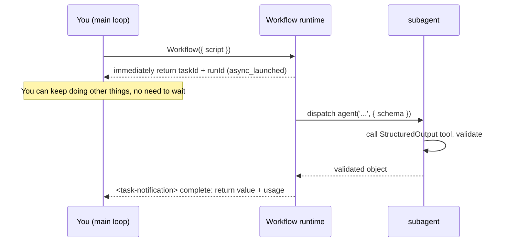

# Chapter 01 · What Workflow Is

> In one sentence: **Workflow is a built-in tool in Claude Code that lets you use a single pure-JavaScript script to deterministically orchestrate any number of subagents.**
>
> This chapter is in no rush to write complex scripts. First let's nail down three things: what this thing actually is, what happens at runtime, and why it's worth spending time on — that's the bedrock for every recipe that follows.

---

## 1.1 Starting from a Real Run

The fastest way to understand something is to watch it **actually run.** The script below is the first Workflow this book ran in a real Claude Code session:

```javascript
export const meta = {
  name: 'hello-workflow',
  description: 'Smoke test: one subagent returns schema-constrained structured output',
  phases: [{ title: 'Greet', detail: 'One subagent confirms the runtime' }],
}

phase('Greet')
const r = await agent(
  'You are a smoke test for the Claude Code Workflow runtime. Return a one-sentence ' +
  'confirmation message, the integer value of 2+2, and a boolean confirming you ran ' +
  'as a workflow subagent.',
  {
    label: 'smoke',
    schema: {
      type: 'object',
      properties: {
        message: { type: 'string' },
        sum: { type: 'number' },
        runtimeConfirmed: { type: 'boolean' },
      },
      required: ['message', 'sum', 'runtimeConfirmed'],
    },
  }
)
log(`smoke result: ${JSON.stringify(r)}`)
return r
```

Handed to the Workflow tool to execute, the **real** return value is:

```json
{
  "message": "The Claude Code Workflow runtime smoke test executed successfully as a workflow subagent.",
  "sum": 4,
  "runtimeConfirmed": true
}
```

The runtime also came with a real usage report:

```text
agent_count = 1   tool_uses = 1   total_tokens = 26338   duration_ms = 5506
```

> Source: the raw record of this run is in the repository's `assets/transcripts/primitives.md` (Run ID `wf_dacbd480-d5d`). Every "real run" in this book can be traced this way.

In just over twenty lines, it already hits almost every key point of Workflow. Let's take it apart one piece at a time.

---

## 1.2 Dissecting a Script: Warp and Weft

Back to the "Loom" metaphor. A Workflow script is made of two parts:

### The Warp: `meta` and `phase` — the taut structure

A script **must** begin with `export const meta = {…}`, and it **must be a pure literal** — no variables, function calls, spread operators, or template interpolation inside it. This is a hard rule; get it wrong and the runtime rejects the script outright.

```javascript
export const meta = {
  name: 'hello-workflow',                       // required: workflow identifier
  description: 'Smoke test: ...',               // required: one-line description, shown in the permission dialog
  phases: [{ title: 'Greet', detail: '...' }],  // optional: phase declarations, driving the progress display
}
```

Why must `meta` be a pure literal? Because the runtime has to read it **before it actually executes the script**, so it can tell you in the permission dialog "what this workflow is called, what it does, how many phases it has." That step is just static parsing — it doesn't run your code — so if `meta` had a `Date.now()` or some variable stuffed in, there'd be no way to compute the value at that point.

`meta`'s fields (per the official type definitions and tool description):

| Field | Required | Role |
|---|---|---|
| `name` | Yes | Workflow name |
| `description` | Yes | One-line description, shown in the permission confirmation dialog |
| `whenToUse` | No | Use-case description, shown in the workflow list |
| `phases` | No | Phase array, each item `{ title, detail?, model? }`, driving the progress-tree grouping |

`phase('Greet')`, then, **switches the current phase** in the script body — every `agent()` call after it groups under "Greet" in the progress display. The warp sets up the structure first, so the weft knows where to thread.

### The Weft: `agent()` and other hooks — the shuttling execution

The script body runs in an `async` context, so you can `await` directly. The runtime drops a set of **global functions** into the script — use them as-is, no import needed:

| Hook | Role |
|---|---|
| `agent(prompt, opts?)` | Dispatch a subagent, return its output |
| `parallel(thunks)` | Run a set of tasks concurrently, **barrier**: wait for all |
| `pipeline(items, ...stages)` | Have each item flow independently through stages, **no barrier** |
| `phase(title)` | Switch the current phase |
| `log(message)` | Output a line of progress info to the user |
| `workflow(name, args?)` | Inline-call another workflow (a sub-process) |
| `args` | The arguments object passed in by the caller |
| `budget` | The token budget object for this turn |

`hello-workflow` uses only the most basic `agent()`: dispatch a subagent, wait for it to return, get the result.

<div class="callout warn">

**Scripts can't use `Date.now()`, `Math.random()`, or arg-less `new Date()`** — use one and it throws. Why? §1.7 "Resume" spells it out: each of these returns something different every time, which breaks the premise that "the same script always produces the same execution," and that breaks resume. Need a timestamp? Pass it in via `args`. Need randomness? Vary the prompt using the agent's index.

</div>

---

## 1.3 `agent()`: The Birth of a Subagent

The core of `hello-workflow` is this line:

```javascript
const r = await agent(prompt, { label: 'smoke', schema: {...} })
```

It does just one thing: **dispatch a subagent to run `prompt`, then take its output as the return value.**

Two key designs are hiding in here, and they're exactly what sets this apart from "spinning up subtasks by hand":

**One: the subagent is explicitly told "your final output is the return value."** An ordinary subtask hands back a piece of writing for a human; a Workflow subagent knows its output is going to be fed to a **program**, so it returns **raw data** instead of small talk.

**Two: `schema` turns "raw data" into "structured data."** Pass in a `schema` (a JSON Schema) and the runtime forces this subagent to call an internal `StructuredOutput` tool, then checks **at the tool-call layer** whether the return value fits the schema. Doesn't fit? The model has to **retry** until it conforms. So when `agent()` carries a schema, what you get back is an **already-validated object** — you don't write a single line of parsing or error-handling.

Look back at the real output: the `sum` we asked for (2+2) came back as the number `4`, **not the string `"4"`** — because the schema said `sum: { type: 'number' }`, and the validation layer pinned the type down. That's exactly where structured output earns its keep, and Chapter 07 digs into it.

> **What if you don't carry a schema?** Per the tool definition, without a `schema`, `agent()` returns the subagent's final text (a string). Only with a schema does it return a validated object.

`agent()`'s common options (full list in Chapter 06 and Appendix A):

```javascript
await agent(prompt, {
  label: 'smoke',          // the label in the progress display, auto-numbered by default
  schema: {...},           // JSON Schema: force structured output
  phase: 'Greet',          // explicitly group into a phase (especially important inside pipeline/parallel)
  model: 'haiku',          // override this agent's model; omit to inherit the main loop's
  isolation: 'worktree',   // run in an independent git worktree (use when parallel file edits collide)
  agentType: 'Explore',    // use a custom subagent type instead of the default
})
```

---

## 1.4 What Happens at Runtime: Async, taskId, Background

This is the most easily misunderstood point: **the Workflow tool does not "return when it finishes" — it returns immediately.**

Per the official type definitions `sdk-tools.d.ts`, `WorkflowOutput`'s `status` has only two values: `"async_launched"` and `"remote_launched"`. Put plainly: **the moment you call the Workflow tool, it's already running in the background, and it hands you a handle right away:**

```text
Workflow launched in background. Task ID: wi7ye81mb
Run ID: wf_dacbd480-d5d
Script file: .../workflows/scripts/hello-workflow-wf_dacbd480-d5d.js
You will be notified when it completes. Use /workflows to watch live progress.
```

A few **real** pieces of info worth remembering:

- **`Task ID`**: the ID of this background task.
- **`Run ID`** (like `wf_...`): this run's identifier, needed for resume (see §1.7).
- **Script on-disk path**: every time you call, the runtime **saves your script as a file on disk.** Want to tweak and try again? Just `Write`/`Edit` that file and re-invoke with `{ scriptPath: ... }` — no need to resend the whole script.
- **`/workflows`**: a slash command for watching the progress tree live.

Once the workflow actually finishes, you get a **completion notification** (`<task-notification>`) carrying the final return value and usage statistics. `hello-workflow`'s completion notification is just the JSON from §1.1 plus `agent_count=1 … duration_ms=5506`.



<div class="callout tip">

**What's this "async + background" design good for?** You can fire off several workflows at once, let them run in parallel, get on with other work yourself, and have each one ping you when it's done. The rest of this book leans on this a lot. One thing not to forget, though: because it's async, **the Workflow tool's return value isn't the workflow's result** — it's just a "launched" receipt. The real result shows up in the completion notification.

</div>

---

## 1.5 How to Get Claude to Use Workflow

To get Claude to actually run a Workflow, you first have to keep **two things** apart — they're constantly conflated, and that's the single biggest source of beginner confusion:

1. **Available** — is the Workflow tool *in Claude's toolbox* at all?
2. **Will use** — once the tool is in the box, how do you get Claude to *actually reach for it* on this turn (or for this whole session)?

An analogy: **available** is "is the pot even in the kitchen," **will use** is "are you going to cook with it tonight." Two separate things, managed separately. Here they are, one layer at a time.

### Layer 1 · Available: `CLAUDE_CODE_WORKFLOWS`

Whether the tool is in your toolbox is decided jointly by the environment variable `CLAUDE_CODE_WORKFLOWS` and a server-side flag. In the session where this book was written, the variable **does exist, and its value is `1`** (confirmed by testing):

```text
CLAUDE_CODE_WORKFLOWS = 1
```

Reading the real logic of the 2.1.154 client (function `FX5`), availability comes in three cases:

- Explicitly set `CLAUDE_CODE_WORKFLOWS=1` → it reads the server-side flag `tengu_workflows_enabled`, **defaulting to "on" locally when no value comes back** — so it's available by default, and this is the most reliable user-side switch (unless the server explicitly turns it off);
- Explicitly set `=0` → **force off** (a hard veto);
- Leave it unset → it looks at that same server-side flag; when that's on (the default), the tool is **on by default for non-Pro accounts**.

<div class="callout info">

**Want it stable? Set `=1` yourself.** That server-side flag (`tengu_workflows_enabled`) is a growthbook gate Anthropic controls — you can't touch it; the saving grace is it only vetoes you when it's **explicitly turned off**, and otherwise (including when no value comes back) it counts as "on." So `=1` is the **most reliable** move on your end — not a 100% "my call" (that server-side gate still stands), but the strongest guarantee a user can make.

</div>

Two ways to set it:

```bash
# Set at launch (effective for the current session) — macOS / Linux syntax
CLAUDE_CODE_WORKFLOWS=1 claude
# Windows CMD: run set CLAUDE_CODE_WORKFLOWS=1 first, then claude on its own line
# Windows PowerShell: $env:CLAUDE_CODE_WORKFLOWS="1"; claude

# Or write into the env section of ~/.claude/settings.json (persistent, cross-platform)
{ "env": { "CLAUDE_CODE_WORKFLOWS": "1" } }
```

<div class="callout warn">

**Why have this switch at all?** A single Workflow can fan out dozens of subagents and burn a lot of tokens. Keeping a switch in front of it is a reminder to **know what you're doing.** It's the same discipline the tool definition keeps stressing: **Claude only calls Workflow when the user has explicitly chosen multi-agent orchestration** — it won't launch on its own just because "this task looks like it might go faster in parallel."

</div>

### Layer 2 · Will use: four ways to get Claude to orchestrate

Once the tool is in the box, any one of the following gets Claude to reach for it this time. This is the official list the 2.1.154 client injects into the model (each item confirmed against the client binary):

| Way | Scope | Notes |
|---|---|---|
| Include the `workflow` / `workflows` keyword in your message | **This turn** | Claude gets a system reminder telling it "you should use the Workflow tool." The lightest trigger. |
| `/effort ultracode` | **Standing, this session** | Makes Claude orchestrate a workflow by default on every substantive task, with reasoning bumped to xhigh at the same time. See §1.6. |
| Ask in your own words | This turn | e.g. "run a workflow," "fan out agents," "orchestrate this with subagents." |
| Skill / slash command | This turn | Some skills' or slash commands' instructions already say to use Workflow — invoking one triggers it. (Note: you or a script can also **call the Workflow tool directly** or run a **named workflow** `{ name: 'xxx' }` — that's a programmatic launch, not part of this "model opt-in" list.) |

<div class="callout warn">

**`ultrawork` is no longer a trigger.** Early community lore said "type `ultrawork` in the box and it triggers," but in the official 2.1.154 client `ultrawork` exists only as an **internal event name** (`ultrawork_request`) — **typing it triggers nothing.** The official trigger keywords are now `workflow` / `workflows`. (Separately: the third-party system oh-my-openagent does use `ultrawork` as an entry word, but that's its own implementation, unrelated to official Claude Code — Chapter 23 covers it.)

</div>

### Version prerequisite: Claude Code has to be new enough

Workflow was added to Claude Code fairly late; older versions simply don't have it. This book's testing spans **v2.1.150 through v2.1.154**: the foundational mechanics in Parts I–IV mostly ran on 2.1.150, while `/effort` and ultracode (§1.6) were tested on **v2.1.154**. Per community reports it started showing up around **2.1.148**, but **this book hasn't independently verified the exact starting version**, so treat that as a rough lower bound. Check your version:

```bash
claude --version
```

### Confirm "does it actually work" at a glance: a 0-token probe

The version number is only a hint — **the real test is whether the tool can actually be invoked.** Rather than fuss over version numbers, just run a minimal workflow to probe it: it dispatches no agents and burns no tokens, and if it returns cleanly your runtime is good to go:

```javascript
export const meta = {
  name: 'check-runtime',
  description: 'Verify the Workflow runtime is available (0 agents, 0 tokens)',
  phases: [{ title: 'Check' }],
}

phase('Check')
log('Workflow runtime is live — 0 agents, 0 tokens')

// 0 agents, 0 tokens: just read back the runtime state and return
return {
  ok: true,
  budgetTotal: budget.total,                    // = null when no +Nk budget directive is given
  budgetTotalIsNull: budget.total === null,     // confirms it's literally null, not just falsy
  remaining: String(budget.remaining()),        // correspondingly = "Infinity"
  argsIsUndefined: typeof args === 'undefined', // = true when no args were passed
}
```

This book's run (`wf_580909ca-b32`): returns `{ ok: true, budgetTotal: null, budgetTotalIsNull: true, remaining: "Infinity", argsIsUndefined: true }`, at **0 agents / 0 tokens / 4ms** (the comments in the block above are explanatory annotations; strip them and you have the exact script this book ran). If the tool isn't present in your environment at all (version too old, or `CLAUDE_CODE_WORKFLOWS` not set), you won't even be able to issue this step — in which case go back and check the two gates above.

---

## 1.6 `/effort` and ultracode: getting Claude to orchestrate by default

In that table above, `/effort ultracode` is the only "standing, this session" option. It's worth its own section — because it pulls in Claude Code's whole **effort** system.

### `/effort`: a knob for "how hard to try"

`/effort` is a slash command that sets, for the current session, how hard Claude **thinks.** In 2.1.154 it has seven settings (confirmed against the client; each setting's official description below):

| Setting | Official description (verbatim) | In a phrase |
|---|---|---|
| `low` | Quick, straightforward implementation | Simple stuff, in a hurry |
| `medium` | Balanced approach with standard testing | Everyday |
| `high` | Comprehensive implementation with extensive testing | **Opus 4.8 defaults here** |
| `xhigh` | Extended reasoning with thorough analysis | Official pick for "your hardest tasks" |
| `max` | Maximum capability with deepest reasoning | Deepest reasoning |
| `ultracode` | **xhigh + dynamic workflow orchestration (this session only)** | See below |
| `auto` | Use the default effort level for your model | Let the system decide |

You use it like `/effort xhigh`. Opus 4.8 starts at `high`; for the toughest tasks, the startup banner flat-out recommends `/effort xhigh`.

### What ultracode is — first, kill a misconception

A lot of people assume ultracode is "the strongest setting, even beefier than max." **It isn't.** Crack open the 2.1.154 client's real effort-parsing code: pick ultracode and the reasoning setting is actually pinned to `xhigh` (not max):

```javascript
// The 2.1.154 client's real logic for parsing /effort arguments (excerpt; variable
// names humanized — the original minified code is in
// assets/transcripts/effort-ultracode-r10.md)
if (effort === "ultracode" && workflowsAvailable())
    return { value: "xhigh" };   // ← ultracode's reasoning depth = xhigh
```

In other words:

<div class="callout info">

**On reasoning depth, `max` is deeper than `ultracode`.** ultracode uses xhigh's reasoning; what it buys you is something else — **getting Claude to proactively orchestrate a workflow on every substantive task by default** (officially, "standing dynamic-workflow orchestration"). With ultracode on, the standing instruction Claude receives is: "Use the Workflow tool on every substantive task; don't optimize for fastest or cheapest."

</div>

So the division of labor, in one line:

- **`max`** = you want it to **think the deepest** (one brain digging into one hard problem).
- **`ultracode`** = you want it to **orchestrate with more agents by default** (xhigh reasoning + proactive fan-out).

When a task is "solvable by one brain thinking hard," `max` is often the better fit than `ultracode`; only when a task is "cheaper to split, parallelize, and cross-check" does `ultracode` earn its place.

### Three constraints you must know

1. **This session only, no persistence.** ultracode is repeatedly tagged "this session only" in the client — close the window and it's gone; it isn't written to settings. The plain settings (low–max) do get saved and are still there next time.
2. **If you can pick ultracode in `/effort`, the workflow is already "available."** That `workflowsAvailable()` gate in the code above means: **the `ultracode` slot only appears in the picker when workflows are available.** So it doubles as a ready-made "is it available?" test — if you can see the slot, Layer 1 from §1.5 has already passed.
3. **An env var overrides your choice.** Setting `CLAUDE_CODE_EFFORT_LEVEL` (say `=max`) **force-overrides** the setting you picked in `/effort`, with the UI prompting "clear it and ultracode takes over." The session this book was written in happens to be locked at `CLAUDE_CODE_EFFORT_LEVEL=max`, so it's worth flagging — lest you get tripped up the same way.

<div class="callout info">

**Easter egg: `ultrathink`.** Same mechanism as the `workflow` keyword — drop `ultrathink` into your message and Claude will "reason more deeply on this turn" (official wording: "requesting deeper reasoning on this turn"). It only governs "think harder this turn," doesn't touch workflow orchestration — don't confuse it with ultracode.

</div>

<div class="callout warn">

**Watch out for silent downgrade.** Effort settings get quietly discounted by what your current model can do: pick a high setting your model can't sustain, and the client **silently drops to a setting it can run** (the official code mentions "after any silent downgrade"). So "I picked max" doesn't mean "it's actually running at max" — it still depends on whether the model can sustain it.

</div>

---

## 1.7 Three Runtime Features That Make It "Stand Out"

Beyond "deterministic + structured," Workflow has three more features that matter a lot in practice. They're exactly what makes it genuinely reusable, testable, and shareable.

### Concurrency limit: auto-throttled, nothing for you to manage

Within each workflow, concurrent `agent()` calls top out at **`min(16, CPU cores − 2)`** running at once; anything past that queues up and runs when a slot frees up. So go ahead and feed `parallel()` / `pipeline()` 100 items — they'll all finish eventually, it's just that only about 10 are running at any given moment. There's also a global safety net: across a single workflow's whole lifetime, the total agent count is capped at **1000**, so a runaway loop can't blow the machine up.

### Resume: the same script, second-level cache hits

Remember the "no `Date.now()`" rule from §1.2? Here's the reason. Workflow supports **resume**: re-invoke with `{ scriptPath, resumeFromRunId }`, and **the `agent()` calls you didn't touch hand back cached results directly** (in seconds); only the ones you edited, and everything after them, re-run for real.

> "The same script + the same args → 100% cache hit." That means the script's execution has to be **replayable.** `Date.now()` / `Math.random()` give a different answer every time, so the replay no longer lines up — which is why they're banned. Need a timestamp? Stamp it on from the outside after the workflow finishes, or pass it in via `args`.

This pays off hugely when you're **iterating on a long pipeline**: you changed step 8, and the slow, expensive results from the first 7 steps get reused as-is — no starting over from scratch. Chapter 22 covers it in detail.

### The script is a file: iterable, savable, shareable

Every call saves the script to a `.js` file under the session directory. Two payoffs here: one is that it's **easy to tweak** (edit the file + re-run with `scriptPath`); the other is that it **stacks up** — you can file a validated workflow script into `.claude/workflows/` and later reuse it like a named command with `{ name: 'my-workflow' }`. This is exactly what Part V, "Build Your Own Library," is built on.

---

## 1.8 What It Isn't: Drawing the Boundaries First

When you're new to this, it's easy to mix Workflow up with Claude Code's other extension mechanisms. Let's draw the lines quickly here; Chapter 03 does the full "positioning matrix" comparison.

| It **isn't** | The difference |
|---|---|
| MCP | MCP is a protocol connecting **external tools/data sources**; Workflow is an engine **orchestrating internal subagents.** |
| Skills | Skills are on-demand-injected **prompt knowledge packs** (changing how the agent "thinks"); Workflow is **deterministic control flow** (deciding the order in which the agent "acts"). |
| Subagents | A single `agent()` does dispatch a subagent; but Workflow's value is in using **code** to **orchestrate** many subagents — loop, concurrency, pipeline, verification. |
| Agent Teams | Agent Teams (`CLAUDE_CODE_EXPERIMENTAL_AGENT_TEAMS`) is a **stateful, mutually communicating**, long-term collaborating team; Workflow is a **stateless, deterministic, one-off** pipeline script. The two solve different problems. |

The boundary in one sentence: **if you can draw the task as a flowchart of "what first, what next, which steps run in parallel," use Workflow; if it's an open-ended conversation where you have to improvise, Workflow isn't the right fit.**

---

## 1.9 Chapter Summary

- Workflow is a built-in Claude Code tool that uses a **pure-JavaScript script** to deterministically orchestrate subagents. Use it in two layers: **available** is gated by `CLAUDE_CODE_WORKFLOWS=1` (the most reliable way to turn it on); **will use** is triggered by the `workflow`/`workflows` keyword, `/effort ultracode` (standing, this session), natural language, or a named workflow — `ultrawork` is no longer a trigger.
- `/effort` has seven settings (low/medium/high/xhigh/max/ultracode/auto); **ultracode = xhigh reasoning + proactive orchestration by default (this session only)** — shallower than max on reasoning depth, but it wins on "orchestrating with more agents by default."
- A script = **warp** (`meta` pure literal + `phase`) + **weft** (`agent` / `parallel` / `pipeline` / `log` / `workflow`).
- `agent(prompt, { schema })` dispatches a subagent and returns a **validated structured object**; a schema mismatch triggers an automatic retry.
- The Workflow tool is **async**: it returns `taskId` / `runId` immediately, the result is in the completion notification; watch live progress with `/workflows`.
- Three engineering features: **auto-throttled concurrency** (≤16/workflow, total ≤1000), **resume** (hence `Date.now`/`Math.random` are forbidden), **the script is a file** (iterable, settleable into a named workflow).

The next chapter takes a different angle: instead of the API, we talk about **why** — before Workflow existed, how did people orchestrate multiple agents by hand, and what potholes did they hit — so we can see what "deterministic orchestration" really solves.

> Continue reading: [Chapter 02 · Why Deterministic Orchestration](#/en/p1-02)
