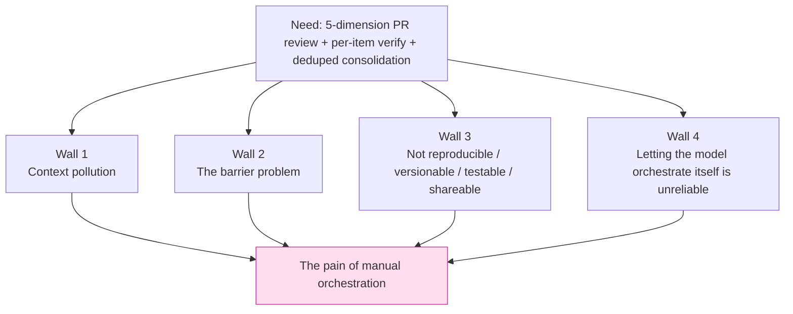
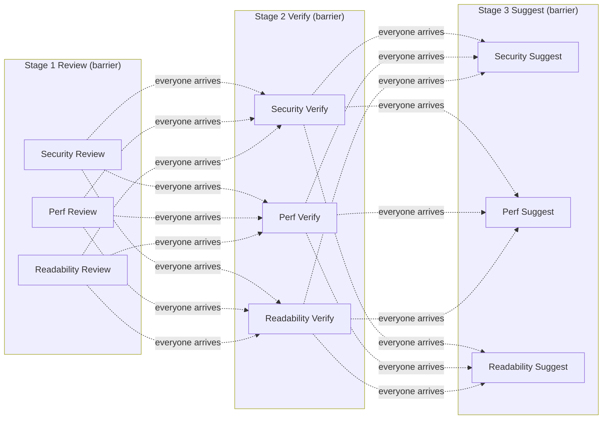
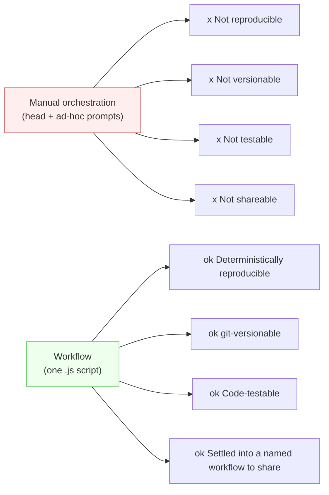
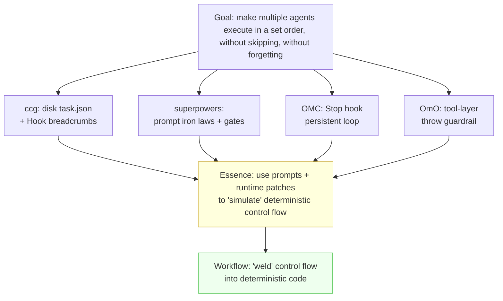

# Chapter 02 · Why Deterministic Orchestration

> In the last chapter we nailed down *what* Workflow is: a single pure-JavaScript script that orchestrates hundreds of subagents. This chapter steps back to ask a more fundamental question. **Before Workflow existed, how did people orchestrate multiple agents?**
>
> The answer: with prompts, with runtime patches, with state written to disk while hoping the model remembers. These approaches have their ingenuity, but they also bring a host of problems. Examining each problem in turn reveals why deterministic orchestration matters: it solves a class of **real engineering pain**, not a showcase for new tooling.

---

## 2.1 A Deceptively Simple Requirement, and Its Four Ways to Die

First, a concrete, commonly encountered need; the whole chapter revolves around it:

> **"Review this PR along five dimensions -- security, performance, readability, test coverage, architecture -- find the problems in each, then adversarially double-check each one, and finally consolidate it all into a deduplicated report."**

This requirement is not complex, and its structure is clear: fan out five parallel reviews, each produces a batch of findings, each finding gets a fresh agent to verify whether it is real, then gather and deduplicate. The flowchart takes seconds to draw.

But in the era before deterministic orchestration, getting one Claude main loop plus a batch of subtasks (Task / subagent) to execute this well meant encountering four problems in succession.



---

## 2.2 Wall 1: Context Pollution -- Your Reasoning Budget Is Being Blown Out by Raw Data

### The lesion: every subtask's raw result ends up piled back into the main loop

The classic way to manually orchestrate multiple agents goes like this: the main loop (the Claude you are talking to) spins up five subtasks (via the Task tool, or just asks five times in sequence), each reviews one dimension and **returns its review results to the main loop**, which then reads all five reports, consolidates, and deduplicates.

This sounds natural enough. The problem lies precisely in that step: "**return the results to the main loop**."

A subtask returns a big block of raw material, not a sentence. Each dimension may list a dozen findings, each with code snippets, line numbers, reproduction paths, and fix suggestions. Five dimensions together easily run to thousands or tens of thousands of tokens. These tokens **all enter the main loop's context window**, and once they are in, they keep eating the reasoning budget for the **entire remaining duration of the session**.

<div class="callout warn">

**Every byte that enters the context keeps "paying" for all the remaining reasoning of this turn.** It is not read once and tossed; it hangs there as "history," re-scanned by attention for every new token generated. Making the main loop read back five verbose review texts force-feeds it thousands of tokens of noise during the part that actually takes thought, "consolidate and deduplicate," crowding out the capacity it should be using to reason.

</div>

This is **context pollution**: intermediate products that could have stayed "on the subtask's side" get dumped wholesale back into the "main brain." The main loop's job is high-level decisions (which findings are duplicates? which are most severe? how should the report be organized?), yet it is forced to first digest a heap of details it does not need to remember word-for-word.

### The community's response: "externalize" the raw data, give the main loop only a handle

How real is this problem? Real enough that four mainstream community systems independently invented the same class of patch: **control plane / data plane separation.**

> One of **oh-my-claudecode (OMC)**'s gems is exactly "control plane / data plane separation plus Artifact handles": a subtask's bulk output does not flow straight back into the main loop; it lands in a "data plane" (a disk artifact), and the main loop gets only a **handle** (a reference, a path), fetching it on demand when needed.
>
> -- Per this book's genuine reading of OMC's source code (see `_grounding.md` section D)

The community recognized long ago that raw data should not be fed back into the main loop, and built a "handle plus externalized storage" mechanism for it. The key observation: **this uses runtime conventions and disk to manually simulate behavior that should be built-in.** A subtask's output should stay on the subtask's side, and the orchestration logic should decide which parts, when, and at what granularity to report upward.

### How Workflow cures it: outputs do not enter the main loop by default

Workflow makes this the **default behavior**. Look back at `agent()` from Chapter 01:

```javascript
const findings = await agent(reviewPrompt, { schema: FINDINGS })
```

The subagent this `agent()` dispatches keeps its output (that big batch of structured findings) **inside the Workflow runtime, as the JavaScript variable `findings`.** It does **not** automatically flood back into your (the main loop's) conversation context. Whether to show it to you, and which part, is decided by **the code in the script**:

```javascript
// Five-dimension parallel review: five sets of raw findings stay in runtime variables
const reviews = await parallel(
  DIMENSIONS.map(d => () => agent(d.prompt, { schema: FINDINGS }))
)

// Per-item adversarial verification: also flows within the runtime, never through the main loop
const verified = await pipeline(
  reviews.flatMap(r => r.findings),
  f => agent(`Adversarially verify this finding: ${f.title}`, { schema: VERDICT })
)

// Only this final "deduplicated consolidation" -- the distilled result -- is handed back to you as the return value
return dedupe(verified.filter(v => v.real))
```

The thousands of tokens of raw material flowing through the whole pipeline **never once crowd the main loop's reasoning budget**. The main loop ends up with just one clean summary. This is exactly the effect OMC and friends fight for with "Artifact handles," and in Workflow it is a **natural consequence at the language level**: intermediate variables were never in the conversation context to begin with.

<div class="callout tip">

**Wall 1 in one line:** manual orchestration pours the "data plane" into the "control plane"; deterministic orchestration keeps data in code variables and hands back only the conclusion. Chapter 10, "Sharded Code Review," quantifies this contrast right down to the token.

</div>

---

## 2.3 Wall 2: The Barrier Problem -- You Are Standing and Waiting for Everyone Because of "the Slowest One"

### The lesion: manual parallelism is essentially "everyone must arrive before the next step"

Suppose you want to parallelize: review five dimensions at once. How do you do it manually?

The most common way is to launch several Task subtasks in a single message, then **wait.** You wait for all five to come back before you can move on to "consolidate." Logically this is a **barrier**: all parallel branches must rendezvous at the barrier before continuing.

The barrier itself is not wrong; "consolidate" really does need all five results present. The real problem: **when your process has more than one barrier, manual orchestration forces "everyone waits" at every barrier, even when it is unnecessary.**

Upgrade the requirement to see this wall clearly:

> Five dimensions, and **every dimension** must go through three steps: "review, verify, fix suggestions."

The person orchestrating by hand usually lays it out in their head like this:

1. Five dimensions review **together** then barrier: wait for all five reviews.
2. Five dimensions verify **together** then barrier: wait for all five verifications.
3. Five dimensions give fix suggestions **together** then barrier: wait for all five suggestions.



Here is the catch: **the "readability" dimension's review might finish in 3 seconds, but it must stand at the barrier, waiting out the slowest "security" dimension's 15-second review before it can move to verification.** "Readability" could go straight to its own verification, yet an unnecessary barrier holds it back. At every barrier you pay for the slowest branch of that stage, and the total time is **the sum of each stage's slowest value.**

### Data: the barrier is a real, measurable wall-clock cost

This is not theoretical. The `parallel-demo` this book tested is a pure barrier:

| Workflow | agent_count | total_tokens | duration_ms | Meaning |
|---|---|---|---|---|
| hello (single agent) | 1 | 26,338 | **5,506** | One agent round-trip is about 5.5s |
| parallel (3 concurrent, barrier) | 3 | 78,844 | **8,395** | 3 concurrent, wall clock 8.4s |

> Data source: `assets/transcripts/primitives.md`, Run ID `wf_dacbd480-d5d` (hello) and `wf_52957913-6d2` (parallel). Tested in the same session.

These two rows yield two facts:

1. **Concurrency is effective.** Three agents run serially would take about 3x5.5 = 16.5s; the measured time is only **8.4s**. Concurrency compressed the three agents down to roughly "the slowest one." This is the value of `parallel()`.
2. **But the barrier is equally real.** The 8.4s total wall clock equals the slowest agent's duration: agents that finished earlier must wait at the barrier. (Note: per-agent breakdown was not separately recorded for this run; this serves as a mechanism illustration, while the 8.4s total wall clock is measured.) If second and third barriers follow, this "wait for the slowest" cost **accumulates stage by stage.**

### How Workflow cures it: `pipeline` lets each item "move forward on its own"

Workflow gives you two weapons, and the difference is exactly "barrier or not":

- **`parallel(thunks)`**: concurrency plus a **barrier**. Returns only when all complete. **Use it only when you genuinely need all results together** (e.g., the final consolidation).
- **`pipeline(items, stage1, stage2, ...)`**: each item flows **independently** through all stages, with **no barrier between stages.** "Readability" finishes its review in 3s and moves straight into its own verification, no need to wait for "security."

> Per the official type definitions (`_grounding.md` section B): for `pipeline`, wall clock is roughly equal to the slowest **single chain**, not the sum of each stage's slowest value. This is precisely what eliminates "stage-by-stage barrier accumulation."

Rewrite that "five dimensions x three steps" requirement as a pipeline, and the wall clock drops from "the sum of each stage's slowest" to "the slowest single complete chain":

```javascript
// Each dimension flows independently through Review, Verify, Suggest, without waiting on the others
const results = await pipeline(
  DIMENSIONS,
  d        => agent(d.reviewPrompt,                 { schema: FINDINGS, phase: 'Review' }),
  (rev, d) => agent(`Verify: ${d.name}`,            { schema: VERDICT,  phase: 'Verify' }),
  (ver, d) => agent(`Give fix suggestions: ${d.name}`, { schema: FIXES, phase: 'Suggest' })
)
```

`pipeline`'s real run is equally documented:

| Workflow | agent_count | duration_ms | Confirmation |
|---|---|---|---|
| pipeline (3 items x 2 stages) | **6** | 26,743 | 3x2=6 agents; `agent_count=6` is a perfect match |

> Data source: `assets/transcripts/primitives.md`, Run ID `wf_bf086b98-6ec`.

<div class="callout info">

**Why did this pipeline run take 26.7s instead?** It used 6 agents (3 items x 2 stages), and the second stage must wait for the same item's first-stage result (there is a real in-chain dependency). The absolute duration is not the point. The point is the **structure**: pipeline eliminates the **cross-item, unnecessary barrier**, so item A's second stage need not wait for item B's first stage. How you choose between `parallel` and `pipeline` is the subject of Chapter 08, where we settle this account in full.

</div>

---

## 2.4 Wall 3: Not Reproducible, Not Versionable, Not Testable, Not Shareable

The first two problems concern "how well it runs"; this third one concerns **whether it constitutes an engineering artifact at all.**

Where does the "orchestration logic" of manual orchestration actually live? In **the operator's head**, and in **a string of ad-hoc natural-language instructions sent to the model.** This brings four fundamental deficiencies.

### Not Reproducible

Today a set of prompts orchestrated the five-dimension review smoothly. Tomorrow the same words are repeated, and the model might change the order, skip the "deduplicate" step, or merge verification with review. **Natural-language instructions do not constitute deterministic execution**; the same input does not guarantee the same process. Good results cannot be traced to their cause; bad results cannot be reproduced for debugging.

> Contrast with Workflow: a script is code, and its execution path is deterministic. `_grounding.md` states plainly that "the same script + the same args = 100% cache hit." This replayability is the prerequisite for resume, and the reason `Date.now()` / `Math.random()` are forbidden in scripts.

### Not Versionable

"Orchestration in your head" cannot be `git commit`ted. After optimizing the process (say, discovering that adding "first assume this finding is a false positive" to the verification step works better), the improvement **has nowhere to settle.** Next session, everything resets to zero, and the instructions must be retyped from memory, not necessarily in full. On a team the situation is worse: a good process **cannot be passed to colleagues** except by word of mouth or screenshots.

> Contrast with Workflow: the script is a `.js` file. Every call lands on disk (Chapter 01, section 1.4); the validated ones can be filed into `.claude/workflows/`, committed to git, and reviewed, diffed, and rolled back like any code.

### Not Testable

"Is this orchestration prompt reliable?" Manual orchestration cannot answer. Unit tests cannot be written against a paragraph of natural-language instructions; CI cannot assert that "it will definitely execute the dedup step." Confidence rests entirely on the empirical judgment that "it worked last time."

> Contrast with Workflow: the orchestration logic is code; `parallel` / `pipeline` / `agent` are all real functions. The **shape** of the process (parallel-then-consolidate, how many stages, the loop exit condition) is governed by deterministic JS, and you can reason about it, review it, and verify it in a targeted way.

### Not Shareable

Put the first three together: a "manual orchestration that runs great" is essentially a kind of **tacit knowledge that cannot be made into an asset.** It cannot be packaged, cannot be published, cannot be picked up by others `npm install`-style. The excellent workflow systems in the community are precisely **fighting** this: they write the methodology into Markdown, Skills, and Hooks so that "good orchestration" can be distributed and reused.



<div class="callout tip">

**These four "nots" are the deepest divide between Workflow and "manually spinning up subtasks."** The first two walls (pollution, barrier) are about efficiency; this third wall is about engineering nature: **orchestration logic goes from flighty prompts to a code artifact you can treat as engineering.** This is also the entire footing of Part V, "Build Your Own Library."

</div>

---

## 2.5 Wall 4: Why Letting the Model "Orchestrate Itself" Is Unreliable

At this point, someone might propose: "Then skip the manual approach. Explain the whole process to the model in one go and let it spin up subtasks and orchestrate **itself**."

This is the most attractive direction, and the most dangerous. The problem is not that the model lacks intelligence, but an essential contradiction: **orchestration needs determinism, and a language model is probabilistic.**

### The model skips steps, forgets, and goes off the rails

Making the model the "orchestrator" means handing control flow to a system that is **sampling at every step.** The consequences are real and recurring:

- **Skipping steps**: The instruction is "review, then verify, then deduplicate." After reviewing, the model judges "not many findings, verification can be skipped" and jumps to consolidation. This is not disobedience; the model **judges** this to be more efficient. But the requirement is "execute verification regardless."
- **Forgetting**: When the process grows longer and intermediate products multiply, one context compaction (see Wall 1) and the model **loses track of its progress**, forgetting that two dimensions remain unreviewed.
- **Drifting**: Five fixed dimensions are requested; during the review the model adds two of its own and merges two, and the final report's dimensions no longer match the requirement.

### This wall forced out the community's four most hardcore classes of patches

The reality of Wall 4 can be measured by the four major community systems' countermeasures. They **all** were born before native Workflow, and each one patches "probabilistic orchestration":

| System | Approach against "the model orchestrating wildly" | Essence |
|---|---|---|
| **ccg-workflow** | **Disk state `task.json` + per-turn Hook breadcrumb injection**, fighting forgetting caused by context compaction; deadlock detection | Use an external state file + runtime Hook to "remember" progress for the model |
| **superpowers** | **Prompt iron laws**: Brainstorming-first hard gate, TDD Iron Law, Verification-before-completion; structured status returns (DONE/BLOCKED) | Use a repeatedly emphasized natural-language "constitution" to keep the model from skipping steps |
| **oh-my-claudecode (OMC)** | **`Stop` hook persistent loop** ("boulder never stops"), making "whether stopping is allowed" programmable; echo-guard | Use a lifecycle Hook to wrest "should we stop" out of the model's hands back into code |
| **oh-my-openagent (OmO)** | **Tool-layer guardrail throws** (the planner physically cannot write code) + system-reminder injection for correction | Use hard constraints at the tool layer so the model "cannot skip steps even if it wants to" |

> Source: `_grounding.md` section D, based on a genuine reading of the four repositories' source code.

Read this table vertically and a clear signal emerges: **to make the model "execute in a set order, without skipping, without forgetting," the community invented disk state, lifecycle Hooks, prompt iron laws, and tool-layer throws. Four different mechanisms, one and the same goal.**

At bottom all four are doing the same thing: **using prompts plus runtime patches to simulate a deterministic control flow.**



<div class="callout warn">

**Do not misread this diagram.** These four systems are excellent; their patches were the **correct and necessary** engineering choices of their era. Without native deterministic orchestration, they pushed the reliability of probabilistic orchestration to its limit. Part V of this book will draw on their best ideas. The fact to note here: **the "determinism" they worked so hard to simulate is exactly what Workflow provides natively at the code level.** The model handles judgment within a single step. Code handles the joints between steps. Each in its proper place.

</div>

---

## 2.6 "Code as Control Flow": One Key for All Four Walls

Four problems, seemingly different, share one root: **the orchestration logic was placed in the wrong location.** It was put inside the language model's reasoning process and into unstable prompts, when it should belong to **deterministic code.**

Workflow's entire thesis, boiled down to one phrase, is **"code as control flow":** taking the **orchestration logic** (what to do first, what next, what runs in parallel, what serially, what condition the loop exits on, how to verify the results) out of prompts and into JavaScript. Once it moves over, all four walls collapse at once:

| Wall | The disease of manual orchestration | The cure of "code as control flow" |
|---|---|---|
| 1 Context pollution | Subtasks' raw results flood the main loop, crowding the reasoning budget | Intermediate products are runtime variables, never enter the conversation context; only the conclusion is returned |
| 2 The barrier problem | Stage-by-stage "everyone waits for the slowest," wall clock accumulates | `pipeline` lets each item advance independently, wall clock is roughly equal to the slowest single chain; `parallel` sets a barrier only when consolidation is truly needed |
| 3 The four "nots" | Orchestration logic cannot be reproduced/versioned/tested/shared | The script is a `.js` file: deterministic execution, git-able, testable, settleable into a named workflow |
| 4 The model orchestrating wildly | A probabilistic model skips/forgets/drifts | Control flow is executed by deterministic JS; the model only thinks "within a single step" |

The key to this approach lies in the **division of labor**:

> **What the model excels at is making judgments within a clearly bounded step:** read this diff, find the security problem, judge whether this finding is a false positive. This is its strength. It should stay there.
>
> **What the model is weakest at is remembering the process and scheduling itself in strict order.** That is deterministic code's strength. It belongs to `pipeline` / `parallel` / `phase`.

Workflow puts the two in their proper places: **the warp (code) tensions the structure, the weft (agents) fills in the intelligence.** That is the book-wide "Loom" metaphor (introduced in the [Preface](#/en/00-preface)) landing on this chapter.

---

## 2.7 A Side-by-Side: One Requirement, Two Worlds

The opening "five-dimension PR review" requirement is run through both approaches below, providing a closing comparison for the chapter.

### The world of manual orchestration (illustrative, not actually run)

```text
You: Please review five dimensions... (a big block of natural-language instructions, incl. "remember to verify" and "remember to deduplicate")
Model: OK, I'll spin up five subtasks...
  -> Subtasks 1-5 each return a big block of raw findings   <- Wall 1: all flooded back into the main loop
Model: (after reading five verbose texts, context is already mostly consumed)
  -> "Not many findings, I'll just judge verification myself" <- Wall 4: skipping steps unilaterally
  -> Missed the "architecture" dimension (forgot after context compaction)  <- Wall 4: forgetting
You: (next time wanting to reproduce this process)... how did that patter go last time? <- Wall 3: not reproducible
```

### The world of Workflow (structural illustration, corresponding to the real recipes in Chapters 10/11)

```javascript
export const meta = {
  name: 'pr-multidim-review',
  description: 'Five-dimension PR review: fan out review -> per-item adversarial verify -> deduped consolidation',
  phases: [{ title: 'Review' }, { title: 'Verify' }, { title: 'Report' }],
}

// 1 Five-dimension parallel review -- raw findings stay in runtime variables, don't pollute the main loop
phase('Review')
const reviews = await parallel(
  DIMENSIONS.map(d => () => agent(d.prompt, { schema: FINDINGS, phase: 'Review' }))
)

// 2 Per-item adversarial verification -- pipeline has no barrier, each finding advances independently (Wall 2)
phase('Verify')
const verified = await pipeline(
  reviews.flatMap(r => r.findings),
  f => agent(`Adversarially verify: ${f.title}`, { schema: VERDICT })
)

// 3 Return only the deduplicated conclusion to you (Wall 1); the whole script is git-able, testable, reusable (Wall 3)
phase('Report')
return dedupe(verified.filter(v => v.real))
```

> Note: the block above is a **structural illustration (not actually run)**, used to contrast this chapter's four walls; its runnable version and real-run data appear respectively in Chapter 10, "Sharded Code Review," and Chapter 11, "Multi-Dimension PR Review." The three datasets cited in this chapter, `hello` / `parallel` / `pipeline`, are all real runs from `assets/transcripts/primitives.md`.

The gap between the two approaches is not "one written well, one written poorly." It is **whether the orchestration logic is in the right place:** place it in the model's reasoning process, and the outcome is unpredictable; place it in code, and the outcome is controllable engineering.

---

## 2.8 Chapter Summary

- Manually orchestrating multiple agents has four walls: **1 context pollution** (raw results flood the main loop, crowding the reasoning budget), **2 the barrier problem** (stage-by-stage "wait for the slowest," wall clock accumulates), **3 the four "nots"** (not reproducible/versionable/testable/shareable), **4 letting the model orchestrate itself is unreliable** (it skips, forgets, drifts).
- The four major community systems (ccg / superpowers / OMC / OmO) **all** were born before native Workflow, leaning on **disk state, Hook breadcrumbs, prompt iron laws, tool-layer throws** and the like, at bottom "using prompts plus runtime patches to simulate deterministic control flow."
- Real data confirms: `parallel` 3-concurrent wall clock 8.4s is far less than 3x5.5s (concurrency is real); `pipeline` 3 items x 2 stages `agent_count=6` (structure is real); token count is roughly agent count times single-agent context.
- One solution for all four problems: **"code as control flow"** -- orchestration logic moves from prompts into JS, becoming deterministic, testable, reusable, and shareable. **The model judges within a step; code manages the joints between steps.**

The next chapter widens the lens further: Workflow does not exist in isolation. What exactly is its relationship to Subagents, Agent Teams, Skills, and MCP? When should each be used, and how do they combine? The next chapter provides a systematic breakdown through a "positioning matrix."

> Continue reading: [Chapter 03 · The Positioning Matrix: Five Extension Mechanisms](#/en/p1-03)
