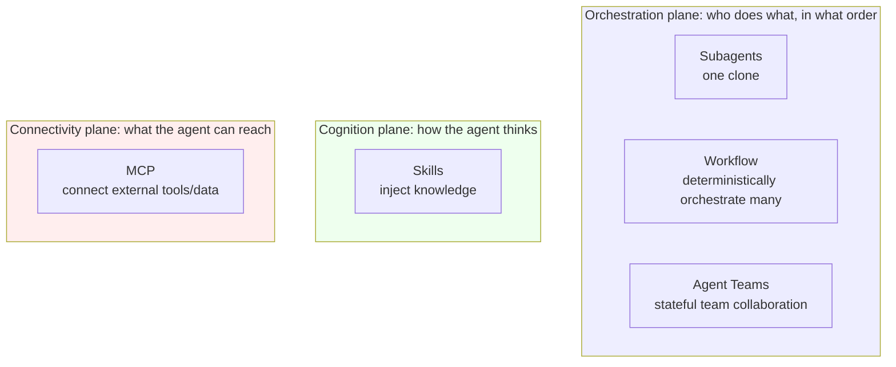
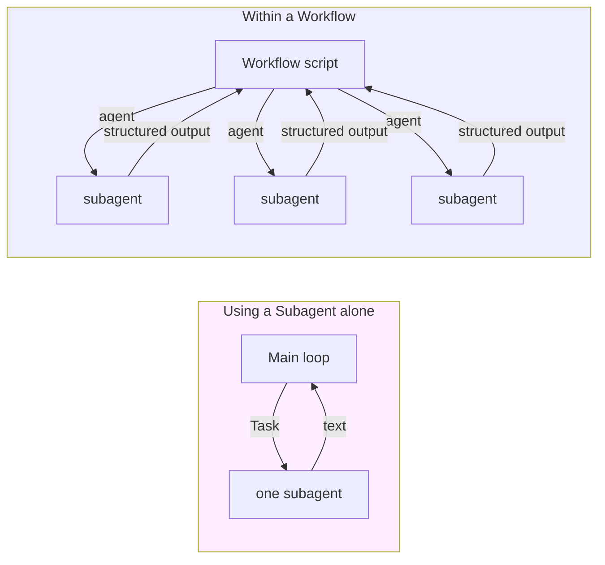
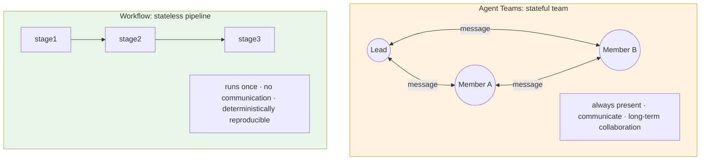
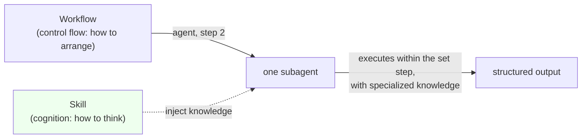
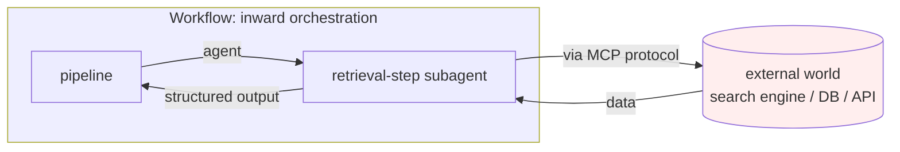
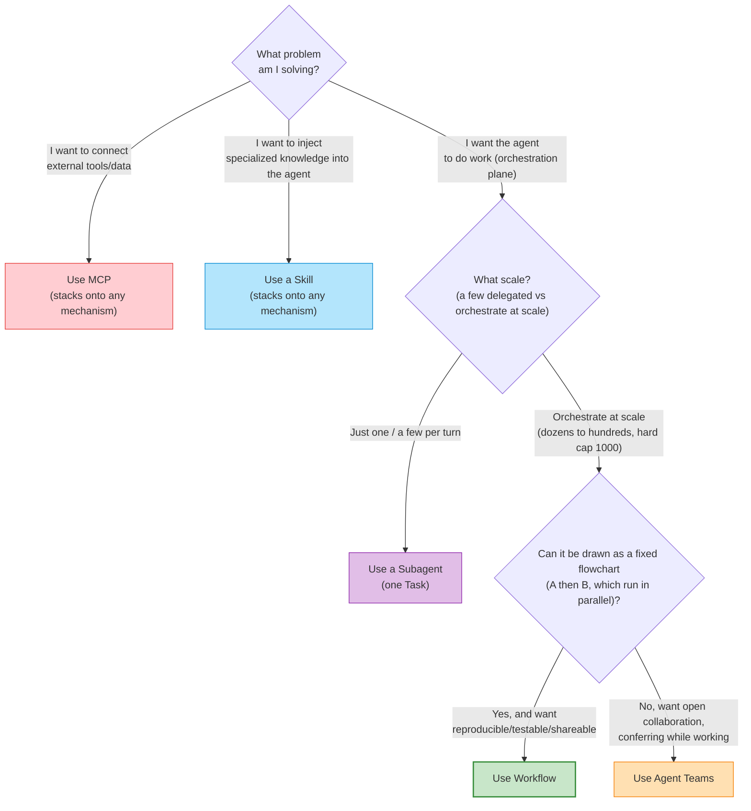
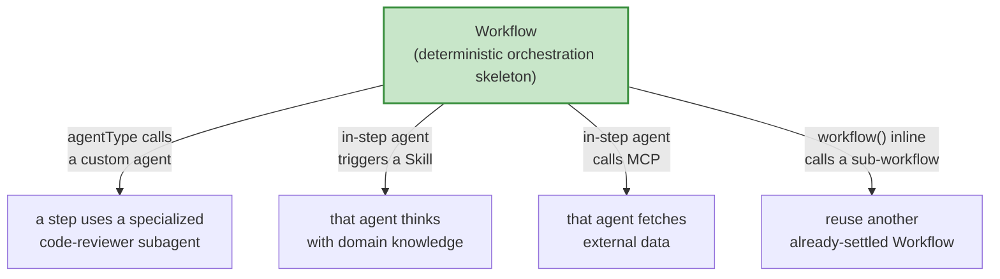

# Chapter 03 · The Positioning Matrix: Five Extension Mechanisms

> The last chapter made the case for "why you need deterministic orchestration." But Workflow is no island; it lands in an already-bustling ecosystem: Subagents, Agent Teams, Skills, MCP, each with its own job.
>
> What trips up beginners most is not "how do I use Workflow," but "**with so many mechanisms, when do I use which? Do they conflict?**" This chapter defines the boundaries with a positioning matrix, then presents a more important fact: **they are orthogonal and composable.** Understanding the boundaries is the prerequisite for stacking them effectively.

---

## 3.1 Five Names, Five Different Problems

The five mechanisms are introduced in turn, each with one sentence identifying **the core problem it solves.** These five questions form the skeleton of the whole chapter:

| Mechanism | The question it answers | One-line positioning |
|---|---|---|
| **Subagents** | "Can I **send a clone** to do this one thing and bring back the result?" | Fork a child agent once, returns text |
| **Workflow** | "**Dozens to hundreds** of clones — in what order / parallelism / verification do they work?" | Use code to **deterministically orchestrate subagents at scale** (dozens to hundreds per run, hard cap 1000) |
| **Agent Teams** | "Can a group of clones **collaborate long-term like a team and talk to each other**?" | Stateful, communicating, long-term collaborating multi-agent |
| **Skills** | "The **specialized knowledge** this thing needs — how do I feed it to the agent on demand?" | On-demand-injected prompt knowledge pack |
| **MCP** | "How does the agent **connect to external tools and data**?" | A protocol connecting external tools / data sources |

These five questions live on three completely different planes. Build the macro intuition first; details follow:

**Why split into three planes first?** The mechanisms genuinely easy to confuse, the ones requiring a choice, all live *within* the "orchestration plane" (Subagents / Workflow / Agent Teams). Skills (cognition plane) and MCP (connectivity plane) are **not on the same dimension**; there is no either-or relationship, and they stack on top. Once the planes are clear, later trade-offs will not tangle.

---

## 3.2 Subagents: The One-Off Clone

### What it is

A subagent is the smallest unit: **the main loop forks a child agent, assigns it a task, it runs to completion independently, and returns a text result.** The "subtask" dispatched via the Task tool in Claude Code is, at its core, a subagent.

Its traits are clear:

- **One-off**: dispatched, run, returned, done. It does not know what the previous subagent did, and the next one has no knowledge of its existence.
- **Isolated context**: it owns an independent context window, which is its core value. Heavy processing happens on its side; raw material does not need to be fed back into the main loop (corresponding to Wall 1 of Chapter 02).
- **Returns text**: what it delivers is a piece of text.

### Its relationship to Workflow: atom vs molecule

This is the pair that most needs sorting out. **What Workflow's `agent()` dispatches is exactly a subagent.**

Think of it this way:

> **A subagent is the "atom," Workflow is the "molecule."** A single subagent solves "send one clone to do one thing"; Workflow uses **code** to assemble many subagents into structure: parallel, pipeline, loop, verification, consolidation.

Chapter 01's `hello-workflow` dispatched just **one** agent, so Workflow collapsed into "just a subagent," with no orchestration value on show. Its real stage is **scale**: dozens to hundreds of subagents per run (hard cap 1000). That is exactly the axis the official "when to use" table draws on: Workflow runs "dozens to hundreds of agents per run," while subagents are "a few delegated tasks per turn." But **you don't need hundreds to benefit.** Many examples later in this book run just 3 or 6 agents (recall Chapter 02's real data: parallel 3, pipeline 6 agents) and still pay off the orchestration. They demonstrate that small scale works too, not Workflow's ceiling.

**When to use just a Subagent and skip Workflow?** When the need is to **send one clone (or a few per turn) to do a fairly self-contained task** -- "explore this directory and summarize" or "read this long document and extract key points." A single Task subtask suffices; wrapping it in a Workflow is unnecessary. **The signal to upgrade to Workflow: the clones to be structurally orchestrated reach scale (dozens to hundreds per run, hard cap 1000), with "order / parallelism / dependency / verification" relationships among them.** Even 3 or 6 clones are worth it once that structural relationship holds. Scale is the axis that separates Workflow from a plain subagent.

---

## 3.3 Agent Teams: The Stateful Collaborating Team

### What it is

Agent Teams is gated by the experimental flag `CLAUDE_CODE_EXPERIMENTAL_AGENT_TEAMS`; in this book's writing session, **that flag is enabled** (see `_grounding.md` section A, tested). It takes a **fundamentally different approach**:

> A group of agents form a **team**: **stateful**, **able to communicate with each other**, engaged in **long-term collaboration.** They are not "dispatched and done"; they remain present like a real team, coordinating via message-passing, splitting work, and collaborating over time.

**The writing of this book itself runs on Agent Teams.** This chapter was written by a guest-author agent on the "Loom" writing team, which coordinated tasks and reported progress to team-lead via the messaging mechanism. This mode of "stateful + communicating + long-term presence" is exactly what distinguishes Agent Teams from a one-off subagent.

### Its relationship to Workflow: stateful team vs stateless pipeline

Another **easily confused** pair, because both involve multiple agents. But at their core they are polar opposites:

| Dimension | **Agent Teams** | **Workflow** |
|---|---|---|
| State | **Stateful** — members stay present, remember context | **Stateless** — the script ends when it finishes, leaving no team |
| Communication | Members **can communicate**, call out, negotiate | Subagents **don't communicate**, only pass values via script variables |
| Temporality | **Long-term collaboration**, can span many turns | **One-off** pipeline, runs to the end in one go |
| Control style | Emergent — members decide on their own, coordinate dynamically | **Deterministic** — code precisely prescribes order and parallelism |
| Reproducibility | The collaboration process depends on runtime dynamics, no reproduction guarantee | Same script + same args → reproducible (even cache hit) |

One sentence distinguishes them:

> **Agent Teams is like a "permanently staffed, always-talking" project group**; **Workflow is like an "automated assembly line that runs through once per blueprint and leaves no one behind."**

### How to choose

- **Choose Workflow**: the task can be drawn as a **fixed flowchart** of "what first → what next → what runs in parallel," and you want it **reproducible, testable, shareable.** E.g., "sharded review → adversarial verify → consolidate."
- **Choose Agent Teams**: the task is **open, needs improvisation, and members must confer as they work**, with no flowchart fixed in advance. E.g., "several roles keep discussing a fuzzy requirement and push it forward with dynamic division of labor" (just like the writing of this book).

**Do not force Agent Teams' open collaboration model into a Workflow.** When a task is full of "it depends" and "members need to align as they go," using a deterministic script to orchestrate it is unnatural; this is Agent Teams' domain. Conversely, a fixed-structure pipeline seeking reproducibility, run via Agent Teams, wastes the "stateful team" capability and sacrifices determinism. **The boundary: flowchart can be fixed → Workflow; needs improvisation → Agent Teams.**

---

## 3.4 Skills: Injected Knowledge, Changing How the Agent "Thinks"

### What it is

Skills are **on-demand-injected prompt knowledge packs.** The moment a certain kind of task shows up, the matching Skill **injects a body of specialized knowledge** (domain conventions, methodology, recommended practices, operating steps) **into the agent's context**, changing how it "**thinks.**"

The distinction matters: a Skill changes the agent's **cognition**, not its **control flow.** It makes the agent more knowledgeable and more professional in its reasoning, but does **not** determine what to do first or next.

### Its relationship to Workflow: how to think vs how to arrange

A textbook example of **orthogonality**. Chapter 01 introduced this point; here it is expanded:

> **Skills decide how the agent "thinks" (cognition); Workflow decides "in what order it acts" (control flow).** One governs the knowledge in the head, one governs how the steps join up; they sit on two different axes and simply don't conflict.

Precisely because they are orthogonal, they **can stack.** `agent()` has an `agentType` option (`_grounding.md` section B) that lets a subagent run as a custom type (e.g., `'Explore'`, `'code-reviewer'`). An agent carrying a particular skill, when dispatched in a Workflow step, **is simultaneously orchestrated by Workflow's control flow and reasons with the knowledge the skill injected.**

Workflow is the **script** (laying out which act, who enters first, how many lines run in parallel); a Skill is the **actor's professional training** (so when the actor plays a doctor, they genuinely know the medical terminology). The script won't reshuffle the acts just because the actor is more skilled, and the actor won't forget their expertise just because the script is fixed. Each minds its own department, and together they make a good play.

---

## 3.5 MCP: The Protocol Connecting the External World

### What it is

MCP (Model Context Protocol) is **a protocol for connecting external tools and data sources.** It lets an agent reach things outside itself: databases, search engines, browsers, company-internal APIs. Chapter 01 spelled it out: **MCP is a protocol connecting external tools / data sources; Workflow is an engine orchestrating internal subagents.**

### Its relationship to Workflow: outward connection vs inward orchestration

This pair is unlikely to be confused, but still worth clarifying in one sentence:

> **MCP points "outward," connecting the agent to the external world; Workflow points "inward," orchestrating the internal subagents.** One solves "what can it reach," one solves "how to organize your own people."

They are equally **composable**: a subagent within a Workflow can call an MCP tool to fetch external data while running its step, then return the result to the pipeline as structured output. A "deep research" pipeline (Chapter 13), for instance, has the "retrieval" step subagent call a search engine via MCP.

---

## 3.6 The Decision Matrix: Clearing Up Five Mechanisms in One Table

Five mechanisms laid out side by side across key dimensions. The chapter's quick-reference table:

| Dimension | Subagents | **Workflow** | Agent Teams | Skills | MCP |
|---|---|---|---|---|---|
| **Solves what** | Send one clone to work | **Deterministically orchestrate multiple subagents** | Stateful team long-term collaboration | Inject domain knowledge | Connect external tools/data |
| **Which plane** | Orchestration | **Orchestration** | Orchestration | Cognition | Connectivity |
| **Agent count / scale** | A few delegated per turn | **Dozens to hundreds per run (hard cap 1000)** | A small team (a few long-lived members) | N/A | N/A |
| **State** | One-off | **Stateless** | Stateful | Effective once injected | Connected state |
| **Inter-member comms** | None | **None (values via script variables)** | Yes | N/A | N/A |
| **Control style** | Main loop dispatches directly | **Deterministic code** | Emergent coordination | Prompt injection | Protocol call |
| **Reproducible** | Single-shot | **Yes (same script+args cacheable)** | No | Yes (knowledge fixed) | Depends on external |
| **Gating flag** | Built-in | `/config` "Dynamic workflows" row (available on all paid plans + API/Bedrock/Vertex/Foundry, Pro must enable it here; `CLAUDE_CODE_WORKFLOWS` is a power-user env only, not the main switch. Full enable/disable in [p2-ops](#/en/p2-ops)) | `..._AGENT_TEAMS` | Built-in / skill system | MCP config |
| **Typical scenario** | Explore/summarize one thing | **Sharded review, adversarial verification, pipeline** | Open-ended multi-role collaboration | Inject specialized conventions into a step | Fetch external data |

> Workflow's official enablement is the "Dynamic workflows" row in `/config` (available on all paid plans plus API/Bedrock/Vertex/Foundry, with Pro required to enable it from that row; the official docs don't state whether Max/Team/Enterprise default on or off, so check the toggle in your own `/config`), not an environment variable. `CLAUDE_CODE_EXPERIMENTAL_AGENT_TEAMS` is the experimental flag that gates Agent Teams; in this book's writing session both it and `CLAUDE_CODE_WORKFLOWS=1` were tested as set (`_grounding.md` section A), but the latter is just a power-user environment variable, not the official enable switch. The two-layer enablement model and the zero-cost probe are in Chapter 01 §1.5; the full enable/disable surface (including `disableWorkflows` / `CLAUDE_CODE_DISABLE_WORKFLOWS` and org-wide managed settings) lives in [p2-ops](#/en/p2-ops).

---

## 3.7 The Decision Flowchart: Which One Should You Actually Use

The trade-offs above fold into a decision tree. Walk down from the top when you face a task, and use whichever mechanism you land on:

The key fork is that last judgment: **"can it be drawn as a fixed flowchart?"**

- **Can be fixed** → Workflow. E.g., "five-dimension review → per-item verify → deduped consolidation," every step clear, order and parallelism nailed down.
- **Can't be fixed** → Agent Teams. E.g., "several roles keep discussing a fuzzy goal and split the work dynamically as progress dictates."

**The two most common misjudgments:**

1. **Seeing "multiple agents" and jumping to Agent Teams.** Incorrect. Multiple agents with a **fixed process** should use Workflow. Agent Teams' prerequisite is "needs stateful communication and improvisation."
2. **Treating "Workflow / Skill / MCP" as pick-one.** Also incorrect. They are not on the same dimension; they are **not mutually exclusive**. A subagent within a Workflow step can simultaneously carry a Skill's knowledge and call an MCP tool. The next section covers this.

---

## 3.8 To Be Honest: They Are Orthogonal and Composable

Up to now, to keep the boundaries clear, the five mechanisms were discussed separately. In practice, the most effective usage is precisely **stacking them together.** This section adds an important point: **these mechanisms are not competitors but orthogonal and composable.** Understanding the boundaries serves better composition, not choosing one over the others.

Workflow sits at the center of the orchestration plane, naturally the **carrier** for the other mechanisms:

Every composition point has API backing (`_grounding.md` section B):

- **Workflow + custom Agent**: `agent()`'s `agentType` option can specify a subagent type (e.g., `'Explore'`, `'code-reviewer'`), and it **can combine with schema**, using a specialized agent while forcing structured output.
- **Workflow + Skill**: a subagent dispatched by Workflow can, while running its step, trigger / carry a skill's knowledge. Workflow governs "when this step happens," the skill governs "how to think professionally in this step."
- **Workflow + MCP**: some subagent in the pipeline reaches external data via MCP as it runs (e.g., the retrieval step of "deep research").
- **Workflow + Workflow**: `workflow(name, args?)` can inline-call another already-settled named workflow (**nesting is one level only**; calling again inside a sub-workflow throws), turning a validated pipeline into a reusable building block. This is the basis of Part V "Build Your Own Library" and Chapter 20 "Nested Workflows."

In summary:

> **Workflow is the skeleton of the orchestration plane; a Skill injects professional judgment into each node, MCP lets a node access the external world, and a custom agentType makes a node the right specialist.** These mechanisms work in concert, not in competition.

**This is exactly the "Loom" metaphor echoing at the ecosystem level.** Workflow is the warp (the deterministic structural skeleton), while Skill / MCP / custom agents are the weft shuttling through it (the intelligence and connectivity of each step). The five mechanisms aren't a pick-one-of-five question, but a toolbox whose warp and weft can interlace (the metaphor comes from the [Preface](#/en/00-preface)).

---

## 3.9 Chapter Summary

- The five extension mechanisms belong to three planes: the **orchestration plane** (Subagents / Workflow / Agent Teams), the **cognition plane** (Skills), the **connectivity plane** (MCP). What's easy to mix up and forces a trade-off lies only within the orchestration plane.
- **Subagents vs Workflow**: atom vs molecule, separated by **scale**. A few clones per turn → Subagent; clones to be organized at scale in order/parallelism/verification (dozens to hundreds per run, hard cap 1000) → Workflow. Even orchestrating just 3 or 6 pays off; scale is the ceiling, not the threshold.
- **Workflow vs Agent Teams**: stateless deterministic pipeline vs stateful communicating team. **Flowchart can be fixed → Workflow; needs open collaboration and improvisation → Agent Teams.** Workflow's official enablement is the "Dynamic workflows" row in `/config` (full details in the gating footnote above and [p2-ops](#/en/p2-ops)); Agent Teams is gated by the experimental flag `..._AGENT_TEAMS`, enabled on the local machine.
- **Skills** (how to think) and **MCP** (what to reach) are **orthogonal** to Workflow (in what order to act); there's no either-or, they stack on top.
- The strongest usage is **composition**: Workflow as the skeleton, using `agentType` to call specialist agents, in-step agents triggering skills / calling MCP, `workflow()` inline-reusing sub-pipelines (nesting one level only).
- The boundary in one sentence: **if it can be drawn as a flowchart of "what first → what next → what in parallel," use Workflow; for open-ended dialogue and improvisation, it's not its home turf.**

The three Understanding chapters are now complete: what Workflow **is** (Chapter 01), **why it is needed** (Chapter 02), and where it **sits** in the ecosystem (this chapter). Part II, "Foundations," begins with running the first Workflow from scratch.

> Continue reading: [Chapter 04 · Your First Workflow](#/en/p2-04)
