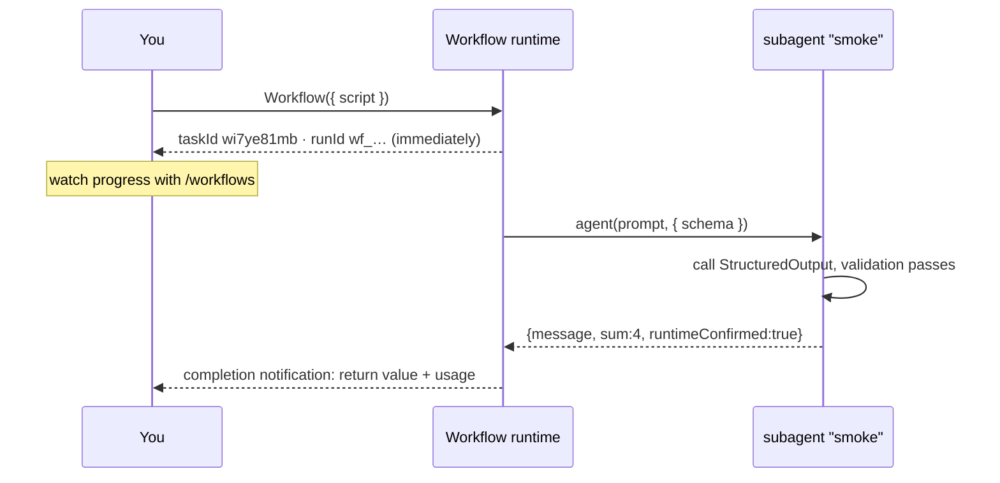
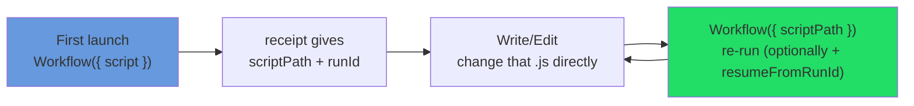

# Chapter 04 · Your First Workflow

> This chapter goes from "confirm the environment" to "get your first Workflow running and understood," walking the full cycle of launch, async, progress, and iteration. Every step is checked against **real-run** output.

---

## 4.1 Prerequisite: Confirm It's Available

Chapter 01 §1.5 split this into two layers: **available** vs. **will use.** Before starting, confirm the **available** layer.

**Turning it on and off.** Dynamic workflows are in research preview and need Claude Code v2.1.154 or later. This book's core testing was on v2.1.156 (the trigger-keyword rename was re-checked on v2.1.160). Run `claude --version` to confirm the version and upgrade if below the requirement. The book's runs span v2.1.150 to v2.1.160, with the core mechanics re-verified on v2.1.156. They work on every paid plan, plus the Anthropic API and Amazon Bedrock, Google Cloud Vertex AI, and Microsoft Foundry.

- **To turn on**: they're available on **all paid plans** (Pro, Max, Team, Enterprise). On **Pro**, you switch them on from the **Dynamic workflows** row in `/config`. The official docs **don't state a default for the other plans** (Max/Team/Enterprise), so check that same toggle in your own `/config` rather than assuming they're already on.
- **To turn off** (any one of these, and they all persist): toggle it off in `/config`; or add `"disableWorkflows": true` to `~/.claude/settings.json`; or set `CLAUDE_CODE_DISABLE_WORKFLOWS=1` (read at startup).
- **Org-wide**: set `"disableWorkflows": true` in managed settings, or use the toggle on the Claude Code admin settings page.
- Once off: bundled commands (like `/deep-research`) are gone, the `ultracode` trigger keyword stops firing, and the `ultracode` tier disappears from the `/effort` menu.

<div class="callout info">

**About `CLAUDE_CODE_WORKFLOWS=1`.** This is a real environment variable, and the test environment had it set, but it is **not** the way the official docs prescribe for turning workflows on. The docs only point to `/config`, and the only documented environment variable is the one that turns workflows **off**. `CLAUDE_CODE_WORKFLOWS=1` is not a prerequisite for enabling workflows; it is a low-level observation switch. In this book's R11 re-verification session, `printenv` confirmed it does exist and equals `1`, with the Workflow tool available:

```text
CLAUDE_CODE_WORKFLOWS = 1
```

</div>

<div class="callout tip">

**Two zero-cost confirmation methods.** First: type in the conversation, "ultracode: run a minimal workflow to confirm the runtime." The message contains the word `ultracode`, so Claude invokes the Workflow tool. If enabled, it runs; if not, it reports that the tool is unavailable. Second: type `/effort` and check whether the picker includes an `ultracode` slot. If present, workflows are already **available** (the reasoning is in §1.6).

</div>

As for **will use**: if you want Claude to **orchestrate proactively by default**, set `/effort ultracode` once and it stays on for the whole session (details in Chapter 01 §1.6). The scripts in this chapter all call the Workflow tool directly, and don't depend on that standing setting.

<div class="callout tip">

**"Script" does not mean manual coding: Claude generates the script.** Describe the requirement in natural language, e.g. "run a workflow to sweep this repo's TODOs and group them," and Claude generates the orchestration script; to name it explicitly, include the `ultracode` keyword in your message. Before it runs, an approval prompt appears; when unsure, select `View raw script` to read the source. After a successful run, one keypress **saves it as a `/` command** for instant reuse. The scripts below are for **reading and understanding**; in practice, Claude generates, you review, you save. The terminal mechanics (the 4 approval options, pressing `s` to save) are walked through in [The Official Control Panel](#/en/p2-ops); this chapter focuses on "the script's structure, how to read it, and how to iterate it."

</div>

---

## 4.2 Hello, Workflow

Below is this book's first real-run script. It does one thing: dispatch a subagent and have it return a structured "run confirmation."

```javascript
export const meta = {
  name: 'hello-workflow',
  description: 'Smoke test: one subagent returns schema-constrained structured output',
  phases: [{ title: 'Greet', detail: 'One subagent confirms the runtime' }],
}

phase('Greet')
const r = await agent(
  'You are a smoke test for the Claude Code Workflow runtime. Return a one-sentence ' +
  'confirmation message, the integer value of 2+2, and a boolean confirming you ran ' +
  'as a workflow subagent.',
  {
    label: 'smoke',
    schema: {
      type: 'object',
      properties: {
        message: { type: 'string' },
        sum: { type: 'number' },
        runtimeConfirmed: { type: 'boolean' },
      },
      required: ['message', 'sum', 'runtimeConfirmed'],
    },
  }
)
log(`smoke result: ${JSON.stringify(r)}`)
return r
```

Line by line (echoing Chapter 01's "warp and weft"):

| Line | Role |
|---|---|
| `export const meta = {…}` | **Warp**: a static literal that declares name, description, phases. The runtime reads it statically before anything runs. |
| `phase('Greet')` | Switch to the "Greet" phase; agents dispatched after this all group under it in the progress tree. |
| `agent(prompt, { schema })` | **Weft**: send out a subagent; `schema` forces it to return a validated structured object. |
| `log(...)` | Print a line of progress to you. |
| `return r` | The workflow's final return value, the one that shows up in the completion notification. |

<div class="callout warn">

**This is a Workflow script, not a Node script -- a common first mistake for beginners.** `meta`/`phase`/`agent`/`log`/`budget`/`args` are all globals **injected by the Workflow runtime** (`_grounding.md` section B: "injected at runtime, no import needed"). Saving this as `hello.js` and running `node hello.js` produces an immediate `ReferenceError: phase is not defined` because Node has none of these globals. **This behavior is identical on Windows, macOS, and Linux**: it has nothing to do with the OS. Node simply has no Workflow runtime layer. The script only runs inside a Claude Code session where workflows are available, executed by Claude through the built-in Workflow tool. How to confirm availability and the official enable path are in §4.1 and [Chapter 01 §1.5](#/en/p1-01). Triggering: include the word `ultracode` in the message (see §4.1). This book's testing used exactly this approach: runtime confirmed, schema forced `sum=4` as a **number**, ~26k tokens / ~5.5 seconds (real receipt and usage in §4.3 and §4.4).

</div>

---

## 4.3 Launch: You Immediately Get a Receipt

When the script is submitted to the Workflow tool, it **does not wait for completion**. It returns a receipt immediately. The following is the real output:

```text
Workflow launched in background. Task ID: wi7ye81mb
Summary: Smoke test: one subagent returns schema-constrained structured output
Transcript dir: ...\subagents\workflows\wf_dacbd480-d5d
Script file: ...\workflows\scripts\hello-workflow-wf_dacbd480-d5d.js
Run ID: wf_dacbd480-d5d
You will be notified when it completes. Use /workflows to watch live progress.
```

This receipt maps exactly onto the real fields of `WorkflowOutput` in `_grounding.md` section B. Lined up in a table:

| What you see in the receipt | `WorkflowOutput` field | Meaning / use |
|---|---|---|
| `Task ID: wi7ye81mb` | `taskId: string` | The background task handle (pair it with TaskStop to stop it). |
| `Run ID: wf_dacbd480-d5d` | `runId?: string` | This run's identifier, **the thing resume needs** (same-session only; exit and it runs fresh, see Chapter 22); absent when `remote_launched`. |
| `Script file: ...js` | `scriptPath?` | Your script was **written to disk**, the key to iteration (see 4.5). |
| `Transcript dir: ...` | `transcriptDir?` | The directory holding the subagent's full execution record. |
| `Summary: Smoke test...` | `summary?` | The echoed one-line summary (i.e. `meta.description`). |

<div class="callout info">

**The receipt's `status` has only two possible values.** Per `_grounding.md` section B, `WorkflowOutput.status` is `"async_launched" | "remote_launched"`. There is no third value, and in particular **no** synchronous "completed" status. Running locally gives you `async_launched` (your case here); running on the CCR remote gives you `remote_launched` (no `runId` then, and the resume handle becomes the returned session URL). When the syntax check fails, the return carries an `error` field instead (see 4.7). Understanding this eliminates the expectation of "calling Workflow and getting the result directly."

</div>

<div class="callout info">

**Why async?** A workflow may fan out dozens of subagents and run for minutes or longer. The async design allows other work to continue after launch, with a notification on completion. The key point: **the Workflow tool's return value is a "launched" receipt, not the result.** The actual result arrives in the completion notification.

</div>

---

## 4.4 Progress and Completion

After launch, the slash command **`/workflows`** displays a **live progress tree**: the current phase (from `meta.phases` and `phase()`), which agents are running, and which are done (leaf-node names come from each `agent()`'s `label`). This is the observation window for the period between launch and completion notification -- a continuously refreshing progress panel. How `phase`/`log`/`/workflows` work together is the subject of Chapter 09.

When the workflow actually finishes, you get a **completion notification.** The heart of `hello-workflow`'s real completion notification is this return value:

```json
{
  "message": "The Claude Code Workflow runtime smoke test executed successfully as a workflow subagent.",
  "sum": 4,
  "runtimeConfirmed": true
}
```

plus a real usage report:

```text
agent_count = 1   tool_uses = 1   total_tokens = 26338   duration_ms = 5506
```

How to read it:

- `sum` is the number `4`, **not** the string `"4"`. The schema declared `type: 'number'`, so the validation layer locked the type in (this is the power of structured output; see Chapter 07).
- The simplest agent round-trip takes about **5.5 seconds / 26k tokens.** Use that as your baseline unit to estimate what a bigger workflow will cost.



---

## 4.5 The Iteration Cycle: The Script Is a File

The script is already written to disk (the receipt's `Script file` / `WorkflowOutput.scriptPath`), so iterating a workflow does not require resending the entire code each time. This produces an **"edit the on-disk file, re-run with `scriptPath`" iteration cycle**:



With the `Script file` path from the receipt, each iteration consists of two steps:

1. Use `Write`/`Edit` to change that `.js` file directly;
2. Call Workflow again with `{ scriptPath: "<that path>" }` (`scriptPath` has priority over `script`/`name`).

To also reuse **intermediate results** from the previous run (avoiding re-spending tokens), add `resumeFromRunId`:

```javascript
// After editing the script, re-run with resume: unchanged agent() calls return cached results in seconds
Workflow({ scriptPath: ".../hello-workflow-wf_dacbd480-d5d.js", resumeFromRunId: "wf_dacbd480-d5d" })
```

"The same script + the same args = 100% cache hit." That's exactly why `Date.now()` / `Math.random()` are forbidden in scripts: they break replayability.

Note: `resumeFromRunId` only works **within the same session**. Exiting Claude Code invalidates the cache along with the session; the next launch runs this workflow **from scratch** without picking up previous progress. Resume is an in-session capability and does not survive a restart. Resume details are in Chapter 22.

---

## 4.6 Make It a Little Bigger: Two Agents

Grow hello into "two concurrent agents + a one-line summary" to get a feel for `parallel()`:

```javascript
export const meta = {
  name: 'hello-parallel',
  description: 'Two concurrent agents, then a one-line summary',
  phases: [{ title: 'Ask', detail: 'Two agents in parallel' }],
}

phase('Ask')
const [a, b] = await parallel([
  () => agent('In one sentence: what is a barrier in concurrency?', {
    label: 'q-barrier',
    schema: { type: 'object', properties: { answer: { type: 'string' } }, required: ['answer'] },
  }),
  () => agent('In one sentence: what is a pipeline in concurrency?', {
    label: 'q-pipeline',
    schema: { type: 'object', properties: { answer: { type: 'string' } }, required: ['answer'] },
  }),
])
log('both answers in')
return { barrier: a?.answer, pipeline: b?.answer }
```

`parallel()` takes an **array of thunks** (`() => …`), not an array of Promises. This is a common beginner mistake; Chapter 08 covers it in detail.

> The `hello-parallel` block above is **illustrative** (not run on its own); the real behavior of the `parallel()` it leans on has been verified by Chapter 08's `parallel-demo` (Run `wf_52957913-6d2`).

---

## 4.7 The Four Most Common Beginner Mistakes

These are the highest-frequency mistakes when writing a first Workflow. Each is shown with the incorrect and correct forms.

**① `meta` is not a static literal (including "computing a value inside `meta`").** `meta` must be a static literal. The runtime reads it during the **static-parsing phase**, so any variable reference, function call, spread, or template interpolation makes it refuse to launch. A common beginner pattern is computing values inside `meta` (e.g., stitching a name together or generating a description from the date), which is the most frequent source of errors:

```javascript
// ✗ Wrong: variable reference + template interpolation + function call — all "computation"
const NAME = 'x'
export const meta = { name: NAME, description: `run ${NAME} at ${Date.now()}` }
// ✓ Right: a static literal, written out character by character
export const meta = { name: 'x', description: 'run x' }
```

**② The schema omits the `required` fields.** When passing a `schema`, in addition to `properties`, also list the fields that **must appear** in `required`. Otherwise the model may legitimately omit a field, and the downstream `r.sum + 1` returns `undefined`:

```javascript
// ✗ Wrong: declares sum but doesn't list it in required — the model may not return it
schema: { type: 'object', properties: { sum: { type: 'number' } } }
// ✓ Right: required nails down "this field must be present"
schema: { type: 'object', properties: { sum: { type: 'number' } }, required: ['sum'] }
```

**③ Treating it as a synchronous call, expecting "the result the moment it's done."** This is the most common mental-model error. Workflow is **always async**: the call hands back a receipt immediately (`status` is only ever `async_launched`/`remote_launched`, see 4.3), and the result is in the **completion notification**. Any `const result = Workflow(...)` that then reaches straight for `result.sum` is wrong, because at that moment `result` is just the receipt, not the product.

**④ Syntax error.** If the script's syntax check fails, `WorkflowOutput` carries an `error` field indicating the error location, and the workflow **does not launch.** Ensure the script's syntax is correct locally before submitting.

<div class="callout warn">

**Do not use `Date.now()` / `Math.random()` / arg-less `new Date()` in scripts.** They break replayability and invalidate the resume cache (see 4.5). This ban is enforced at **two layers** (commit-time source scan + runtime trap); it catches the literals even inside a comment or a string, and `try/catch` cannot intercept them. The full mechanism of both layers, the verbatim error text, and the misconceptions about bypassing/catching them are gathered in [App B, B.5 / B.19](#/en/app-b), with the causal chain in [Chapter 22](#/en/p4-22). The alternatives: for a timestamp, pass it in via `args`; for randomness, vary the prompt using the agent's index.

</div>

---

## 4.8 Chapter Summary

- First confirm workflows are available in the current session: they are supported on **all paid plans**, and on Pro the "Dynamic workflows" row in `/config` must be toggled on. The official docs do not state a default for the other plans, so check that toggle in `/config` (three ways to turn them off are in §4.1). `CLAUDE_CODE_WORKFLOWS=1` is a low-level observation switch, not the official enable path (both layers in [§1.5](#/en/p1-01)). When unsure, have Claude run a minimal workflow to confirm.
- It is a **Workflow script, not a Node script**: `meta`/`phase`/`agent`/`log` are runtime-injected globals; `node hello.js` throws `phase is not defined` identically across platforms; it only runs via Claude in a session where workflows are available.
- Launching a Workflow **hands back a receipt immediately** (`WorkflowOutput`: `taskId`/`runId`/`scriptPath`/`transcriptDir`; `status` is only `async_launched`/`remote_launched`); the result is in the **completion notification**; watch live progress with `/workflows`.
- Real baseline: a single agent takes about 5.5s / 26k tokens; `schema` guarantees the return type (`sum` is the number 4, not a string).
- Iterate via the "script is a file" cycle: edit the on-disk `.js` + re-run with `scriptPath`; add `resumeFromRunId` to reuse the cache.
- The official cycle's **closer**: once a run you're happy with finishes, press `s` in the `/workflows` view to **save it as a `/` command** for instant reuse. For a beginner, this is the most natural on-ramp to "building your own workflow" (growing it into a library is [Chapter 25](#/en/p5-25)).
- Four beginner pitfalls: ① computing values inside `meta` (must be a static literal); ② omitting `required` in a schema; ③ treating it as synchronous and expecting the result right away; ④ syntax errors land in the `error` field and don't launch.

<div class="callout tip">

**Build your own workflow · 6 steps.** This through-line is scattered across the book. Here is a single visible table of contents you can follow:

| Step | What you do | Where to learn it |
|---|---|---|
| ① | Get your first one running | This chapter |
| ② | Learn the approval and save keys | [The Control Panel §6](#/en/p2-ops) |
| ③ | Author one from scratch | [Chapter 27](#/en/p6-27) |
| ④ | Debug it | [Chapter 28](#/en/p6-28) |
| ⑤ | Grow it into a library | [Chapter 25](#/en/p5-25) |
| ⑥ | Reuse it via `{ name }` | This chapter |

</div>

At this point in the Foundations section, the complete flow for running, reading, and iterating a Workflow has been covered. The next three chapters (05/06/07) explore the warp (`meta`/`phase`), the weft's core (`agent()`), and structured output (`schema`) in depth. Chapter 08 establishes the concurrency model.

> After launching, how to watch progress, stop it, or press `s` to save a satisfactory run as a `/` command? The full terminal operating surface is in [The Official Control Panel](#/en/p2-ops).

> Continue reading: [Chapter 05 · meta & phase: The Warp](#/en/p2-05)
