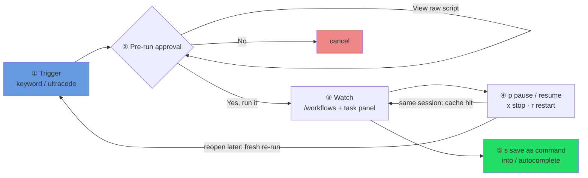

# The Official Control Panel: Driving a Run from the Terminal

> The previous chapters were about *writing* a workflow script. This one flips the perspective: the script is already running, **you're sitting at the terminal, and the question is which keys to press and what you can do.** We'll go in the order you actually hit: first triggering, then approving, then watching, then pausing, resuming, and stopping, and finally saving a run you like as a command, plus the one workflow that ships with Claude Code. It's all the operator's surface, hands-on, follow-along.
>
> This chapter covers the command-line operating surface of the official Dynamic workflows (source: `code.claude.com/docs/en/workflows`). It's currently a **research preview**. The UX, prompt wording, and key bindings below may evolve across versions, so when you read this, trust what your build of Claude Code actually does.

---

## 1 Triggering: How to Get a Workflow Running

You don't need to memorize any command. **Just say what you want in the conversation.** The official surface gives you a few entry points:

**① Keyword trigger.** The moment your message contains the word `workflow` or `workflows`, Claude Code **highlights that word**, signaling that it's about to go write a workflow script. From there Claude switches to orchestrating with a script instead of plodding through it turn by turn.

For example, you type:

```text
Run a workflow that sweeps every TODO in this repo and groups them by theme
```

"workflow" gets highlighted, and Claude proceeds to write the script for you and hand it to the runtime.

<div class="callout tip">

**Triggered it by accident? Press `alt+w`.** Sometimes you just mention "the design of this workflow" in passing, not actually wanting to run one right now. The keyword gets highlighted and Claude gets ready to write a script; press **`alt+w`** and you **dismiss the trigger for this turn**, letting Claude treat it as an ordinary message. It's the "don't take this one literally" shortcut.

</div>

**② `/effort ultracode`: let Claude orchestrate proactively by default.** If you want Claude to **decide on its own** when to use a workflow, without you prompting it each time, type `/effort ultracode` once. It's a one-time setting that stays on for the whole session, after which Claude can launch several workflows within a single request (understand, then change, then verify). It burns more tokens; drop back to normal with `/effort high`. The full story of triggering and enablement is covered in the most detail in Chapter 01 §1.5 / §1.6 (see [p1-01](#/en/p1-01)).

Put the three entry points side by side and you'll know which to reach for:

| Entry point | What you do | Good for |
|---|---|---|
| Keyword `workflow`/`workflows` | Naturally include the word in your message | Explicitly running a workflow this once |
| `alt+w` | Press it when triggered by accident | You only mentioned it, don't want to run now |
| `/effort ultracode` | Type it once, stays on all session | Wanting Claude to orchestrate proactively by default |

> The full flow of getting your first workflow running (from confirming the environment to reading the receipt) is walked through step by step in [p2-04](#/en/p2-04). This chapter assumes you can already get one running and focuses on driving it once it's live.

---

## 2 Pre-Run Approval: The Script Comes In, You Get Asked First

Right **before** Claude's finished script actually starts, Claude Code pops a **pre-run approval** prompt and puts the decision in your hands. The prompt typically offers these 4 options (the exact wording shifts with your permission mode):

| Option | Meaning |
|---|---|
| **Yes, run it** | Run it just this once. |
| **Yes, and don't ask again for `<name>` in `<path>`** | Run it, and trust it: **stop asking about this workflow in this project (`<path>`) going forward**. |
| **View raw script** | Don't run yet. **Pull up the raw script and read it first**, then decide. |
| **No** | Cancel; don't run. |

Two key bindings live on this prompt. **`Tab` cycles through the options**, so you can pick without arrow keys. **`Ctrl+G` opens the raw script in your editor**: the same thing `View raw script` shows, but in your `$EDITOR`, where you can scroll and search comfortably instead of reading it inline.

<div class="callout tip">

**Build the habit: when in doubt, `View raw script` first.** A workflow script fans out dozens or hundreds of subagents on your behalf, and it spells out who it dispatches, what they do, and which files they touch. The first time you run a given script, or whenever it's about to touch something you care about, pick **View raw script** and read it through, confirm its orchestration logic matches what you had in mind, then go back and choose Yes. The step is nearly free and catches the "I didn't expect it to do *that*" surprises.

</div>

<div class="callout info">

**"Don't ask again" remembers "this workflow, in this project."** After you pick the second option, the no-approval scope is the `<name>` + `<path>` pair, that is, **this named workflow, in the current project**. Switch projects or switch workflows and it'll ask again. So it means "I trust this flow in this project," and it won't widen into "never ask me about any workflow again."

</div>

---

## 3 Permission Modes: When the Prompt Appears, and What Subagents Are Allowed to Do

Whether you even *see* the approval prompt from Section 2, and how often, is governed by your session's **permission mode**. There are two separate questions here, and conflating them is a common mistake: (1) does the *workflow run itself* need your approval, and (2) what are the *subagents the workflow spawns* allowed to do once it's running. They follow different rules.

**The run-level prompt, by permission mode.** Here's when the pre-run approval appears:

| Permission mode | Pre-run approval behavior |
|---|---|
| **Default** / **acceptEdits** | Prompted **every run**. The exception: you previously picked "don't ask again for `<name>` in `<path>`", and then that specific workflow runs without asking in that project. |
| **Auto** | Prompted only on the **first launch**; any **Yes** records your consent in user settings, so subsequent runs go straight through. Under **`/effort ultracode`**, the prompt is **skipped entirely** (ultracode is the proactive-orchestration mode, so it doesn't stop to ask). |
| **Bypass** / `claude -p` (print mode) / **Agent SDK** | **Never prompted.** These are non-interactive or trust-the-caller contexts, so the run starts without an approval gate. |

<div class="callout warn">

**Subagents always run in `acceptEdits`, regardless of your session mode.** This is the part that surprises people. No matter which mode *you're* in, **the subagents a workflow spawns always run in `acceptEdits` mode and inherit your tool allowlist.** Concretely: their **file edits are auto-approved** (a subagent writing/reading/deleting a file does not stop to ask you), but **non-allowlisted shell commands, web access, or MCP calls can still prompt you mid-run**. Those are the operations that surface as the "do you want to allow it to do X" confirmation while the run is live.

This book confirmed the file-edit half first-hand: in Run `wf_b1d45b4c-445`, a subagent created a file with Write, read it back with Read, then deleted it with Bash `rm`. The file write went through with **no approval prompt**, exactly matching the official "subagents run acceptEdits, file edits auto-approved" contract.

So the two prompts cover two different things: the run-level prompt (Section 2) is about *launching the workflow*, and this allowlist-plus-acceptEdits behavior is about *what the dispatched agents may do without further asking.* If you want a subagent's shell/web/MCP actions to not interrupt you, put those tools on your allowlist before you launch.

</div>

**In the Desktop app, the prompt is a card, not a key menu.** If you run a workflow from the Claude Desktop app rather than the terminal, the pre-run approval shows up as an **approval card** that lists the **workflow name** and its **phase list**, with a **caution about token usage** (a reminder that a workflow can fan out to many agents). The card's buttons are **Once / Always / Deny** (the Desktop equivalents of "run this once / don't ask again / cancel"). Once it's running, you watch progress in the **Background tasks** side pane, the Desktop counterpart to the terminal's `/workflows` view.

---

## 4 Watching a Run: `/workflows` and the Task Panel

Once a run is live, you have two windows onto it.

**Entry one: the slash command `/workflows`.** Type `/workflows`, use the arrow keys to select the run you want, and press `Enter` to enter the **progress view**. This view is organized by **phase**, and each phase shows you: how many agents were dispatched, total tokens spent, and elapsed time. You can keep **drilling in**, into a phase and then into a specific agent, to see its prompt, the tools it called recently, and the result it returned (i.e. "what did this agent actually find").

**Entry two: the task panel below the input box.** No command needed: right under your input box there's a task panel showing current progress on a **single line**. To see more, press `↓` to move focus there, then `Enter` to expand it. It's the progress bar you can glance at out of the corner of your eye, anytime.

The full key bindings inside the `/workflows` view, as a table (per the official docs):

| Key | What it does |
|---|---|
| `↑` / `↓` | Move up/down through the phase list, or the agent list within a phase. |
| `Enter` or `→` | Drill in for more detail: into a phase, then into an agent, to see its prompt, recent tool calls, and result. |
| `Esc` | Go back up one level. |
| `j` / `k` | When an agent's detail is too long to fit on one screen, scroll with these two. |
| `p` | **Pause / resume** the run (see Section 5). |
| `x` | **Stop** the selected agent; if focus is on the run as a whole, stop the **entire workflow**. |
| `r` | **Restart** the selected **running** agent. |
| `s` | **Save** this run's script as a command (see Section 6). |

<div class="callout info">

**What `x` stops depends on where your focus is.** This is an easy one to fumble: press `x` with focus on **an agent** and you stop that one agent; press `x` with focus on **the whole run** (the top level) and you stop the **entire workflow**. Check which level is highlighted before you press it.

</div>

The progress/logging machinery (the script side writing narration lines to the progress tree via `log()`, how phases organize progress) is explained in full from the script's perspective in [p2-09](#/en/p2-09). This chapter only covers the **watching** and **operating** side you do from the terminal.

---

## 5 Pause · Resume · Stop · Restart

Halfway through a run you want to pause and look, tweak something, or just call it off. All of these are single-key actions inside the `/workflows` view.

- **Pause / resume: `p`.** Select a run and press `p` to pause; press it again (or have Claude restart with the same script) to resume. The key payoff of resuming: **agents that already finished return their cached results** (no re-spending tokens), and only the rest actually run.
- **Stop an agent / the whole workflow: `x`.** See the previous section: focus on an agent stops that one, focus on the run stops the whole thing.
- **Restart an agent: `r`.** Select a **running** agent and press `r` to restart it.

<div class="callout warn">

**Resume only works within "the same session," and this is the most important boundary.** Stop a run and resume it a bit later in the **same Claude Code session**, and the cache is still there: finished agents come back instantly. But **once you exit Claude Code, the next time you open it you're in a new session, and that new session runs this workflow over again from scratch** (official wording: "the next session starts the workflow fresh"). In other words, the resume cache **does not persist across sessions.** So if a run is half-done and you want to pick it up tomorrow, don't count on closing and reopening to continue; it'll start from the beginning.

</div>

<div class="callout info">

**The terminal's `p` resume and the script side's `resumeFromRunId` are two faces of the same thing.** Pressing `p` to resume in `/workflows` is the **interactive** entry; the script side has a programmatic one: pass `resumeFromRunId: "wf_..."` when calling the Workflow tool, and unchanged `agent()` calls come back from cache just the same. This book verified that resuming with the same script + same args is a **100% cache hit, 0 new tokens** (Run `wf_9c94951d-58c`). Both paths lead to the same caching mechanism; for the deep details see [p4-22](#/en/p4-22).

</div>



---

## 6 Save a Run You Like as a Command

A run finishes, you're happy with the result, and you want to **reuse this flow with one keystroke later.** Inside the `/workflows` view press **`s`**, and you **save the script behind this run as a command**.

Once saved, three things happen:

1. This workflow becomes a **named command**;
2. It shows up in the **autocomplete** list when you type `/`;
3. It sits **alongside** the commands that ship with Claude Code, with no difference in use; next time, just `/<the-name-you-gave-it>` to run it again.

<div class="callout tip">

**This is the lightest way to "build up your own workflow library."** You don't have to write files or set up directories first: get a run you're happy with, press `s` to save it, and it's in your command list. Once you've collected a few and want to manage them properly (versions, parameters, sharing with a team), see [p5-25](#/en/p5-25) for building your own workflow library systematically; the full authoring flow from an author's perspective is in [p6-27](#/en/p6-27).

</div>

---

## 7 The Only Bundled Workflow: `/deep-research`

Claude Code ships with exactly one named workflow: **`/deep-research <your question>`**. This book verified on v2.1.156 that it's the only one left in the bundled named-workflow registry; the few built-ins from earlier versions are gone, and not to be relied on.

What it does is a fairly standard research pipeline:

1. **Fan out the search from multiple angles**: query from different angles at once;
2. **Fetch and cross-check**: pull the sources back and cross-reference them against each other;
3. **Vote on each claim**: multiple agents vote on each conclusion;
4. **Produce a cited report**: the report lands back in your session, with source citations, and **claims that didn't survive cross-checking have been filtered out.**

Usage is direct:

```text
/deep-research What's the real concurrency cap for Dynamic workflows — what do the official docs vs. real runs say?
```

<div class="callout warn">

**`/deep-research` needs the WebSearch tool available.** Its whole pipeline rests on actually going out and searching the web, so your environment must have the WebSearch tool. Without it, this flow can't run.

</div>

How `/deep-research` is written up as a recipe, and what a real run looks like (including the real run `wf_6090decc-8a5`), is fully broken down in [p3-13](#/en/p3-13).

---

## 8 Boundaries and Cross-Platform Corner Cases

This last section is a handful of boundaries you'll eventually run into. Knowing them up front saves a lot of "huh, why isn't this working" time.

**Research preview.** All of Dynamic workflows is still a research preview, so the UX, prompt wording, fields, and key bindings above **may evolve across versions**. Treat this chapter as "the operating map for the v2.1.154+ generation," and where it differs, trust what your build actually does.

**Where it's available.** Dynamic workflows is **available on all paid plans** (Pro, Max, Team, Enterprise), plus the **Anthropic API**, **Amazon Bedrock**, **Google Cloud Vertex AI**, and **Microsoft Foundry**, so the operations in this chapter apply across all of those, not just the first-party CLI. On **Pro** you turn them on from the **Dynamic workflows** row in `/config`; the official docs don't state a default for the other plans, so if a workflow won't trigger, check that same toggle in your own `/config`. (The full enablement story, including the two-layer model and the zero-cost probe, is in Chapter 01 §1.5; see [p1-01](#/en/p1-01).)

**You can't inject input mid-run.** Once a run is live, you **can't** drop in a sentence partway, the way you would in normal conversation, to change its course; the only thing that **automatically** interrupts it is a **permission prompt the agent raises** (the "do you want to allow it to do X" confirmation). You can still **actively** control it, though: press `p` in `/workflows` to pause/resume, or `x` to stop an agent or the whole run (the key table in Section 4). So if you need a human checkpoint like "run one stage, let me sign off, then run the next," the right approach is to **split each stage into its own workflow**, look at the output after each one finishes, and manually kick off the next when you're satisfied.

**The script itself has no file system / shell.** A workflow script only **orchestrates**; it can't read files or run commands on its own, and all the actual IO (reading/writing files, running a shell) is done by the **agents** it dispatches. That's why you won't find `fs`, `require`, or `process` in the script (for the details, see [p2-04](#/en/p2-04)'s breakdown of "this is a Workflow script, not a Node script").

**Concurrency and total caps.** A single workflow runs at most **16 concurrent agents** (fewer if your machine has few CPU cores); anything beyond that **queues** rather than erroring. And **a single run dispatches at most 1000 agents**, a "runaway-loop backstop."

<div class="callout info">

**Turning the whole feature off, and what disappears when you do.** If you don't want Dynamic workflows on at all, there are four switches (any one of them works):

- **Per-machine**: toggle it off on the **Dynamic workflows** row in `/config`; or add `"disableWorkflows": true` to your `settings.json`; or set the environment variable `CLAUDE_CODE_DISABLE_WORKFLOWS=1` (read at startup; the per-OS form matches the enable side: macOS/Linux run `CLAUDE_CODE_DISABLE_WORKFLOWS=1 claude`, Windows CMD `set CLAUDE_CODE_DISABLE_WORKFLOWS=1` then run `claude`, PowerShell `$env:CLAUDE_CODE_DISABLE_WORKFLOWS="1"; claude`; for a persistent cross-platform setting put it in the `env` block of `settings.json`).
- **Org-wide**: set `"disableWorkflows": true` in your organization's **managed settings**, or use the toggle on the Claude Code **admin settings page**.

Once disabled, three things change that you'll notice immediately: the **bundled commands are gone** (e.g. `/deep-research` no longer exists), the **`workflow` keyword goes inert** (typing it no longer highlights or switches Claude into orchestration), and **`ultracode` is removed from the `/effort` menu**. So if `/deep-research` vanished or the keyword stopped triggering, a disable switch is the first thing to check.

</div>

**TUI key bindings are consistent across platforms.** The `↑↓`, `Enter`, `Esc`, `j`/`k`, and `p`/`x`/`r`/`s` in the table above are standard terminal keys, **behaving the same** on macOS, Linux, and Windows, so there's no need to learn two sets for different systems.

<div class="callout warn">

**The one to watch on macOS is `alt+w` and other Alt-bearing keys.** On macOS, **Alt is the Option key.** The catch: **some terminals (such as macOS's built-in Terminal.app) don't treat Option as the Meta key by default**, so `alt+w` may do nothing when pressed. The fix is to turn on "**Use Option as Meta key**" in your terminal settings (Terminal.app: Settings → Profiles → Keyboard; iTerm2: Profiles → Keys).

This is **general terminal knowledge**, not an official guarantee specific to Dynamic workflows, but it genuinely affects whether `alt+w` works for you, so it's worth flagging honestly here.

</div>

---

## Chapter Summary

- **Trigger**: include `workflow`/`workflows` in your message (it gets highlighted); dismiss an accidental trigger with `alt+w`; to have Claude orchestrate proactively by default, use `/effort ultracode`.
- **Approval**: before launch, 4 options: `Yes, run it` / `Yes, and don't ask again for <name> in <path>` (no more asking within this project) / `View raw script` (read first, recommended) / `No`; on the prompt, `Tab` cycles options and `Ctrl+G` opens the script in your editor.
- **Permission modes**: Default/acceptEdits prompt every run (unless don't-ask-again); Auto prompts only first launch (skipped entirely under `ultracode`); Bypass / `claude -p` / Agent SDK never prompt. **Subagents always run `acceptEdits` and inherit your allowlist** regardless of session mode: file edits auto-approved (first-hand confirmed, Run `wf_b1d45b4c-445`), but non-allowlisted shell/web/MCP can still prompt mid-run. In the Desktop app it's an approval card (name + phases + token caution; Once/Always/Deny) with progress in the Background tasks pane.
- **Watch**: `/workflows` opens the progress view (per phase: agent count / tokens / elapsed, drill-in supported), and the task panel below the input box shows a one-line progress; the keys `↑↓ Enter/→ Esc j/k p x r s` are all in the Section 4 table.
- **Pause/resume/stop**: `p` pauses/resumes (finished agents come from cache), `x` stops an agent or the whole run, `r` restarts an agent; **resume is same-session only**, so exiting Claude Code and reopening makes it **run fresh**; the terminal's `p` and the script side's `resumeFromRunId` are two faces of the same cache.
- **Save as command**: happy with it, press `s`, and the workflow joins `/` autocomplete alongside the bundled commands.
- **Bundled workflow**: only `/deep-research <question>` (multi-angle search → cross-check → vote → cited, filtered report), needs WebSearch available.
- **Availability**: all paid plans (Pro/Max/Team/Enterprise) + Anthropic API + Bedrock + Vertex AI + Microsoft Foundry; Pro enables via the `/config` row, no documented default for the others.
- **Disable**: `/config` toggle / `"disableWorkflows": true` in settings.json / `CLAUDE_CODE_DISABLE_WORKFLOWS=1` / managed settings or admin page (org-wide). When off: bundled commands gone, `workflow` keyword inert, `ultracode` removed from `/effort`.
- **Boundaries**: research preview (UX may change); no input injection mid-run; the script has no fs/shell; at most 16 concurrent / 1000 agents per run; TUI keys are cross-platform consistent, except `alt+w` may need Option set as Meta in some macOS terminals.

> Continue reading: [Chapter 09 · Progress, Logs, Resume, Budget](#/en/p2-09)
