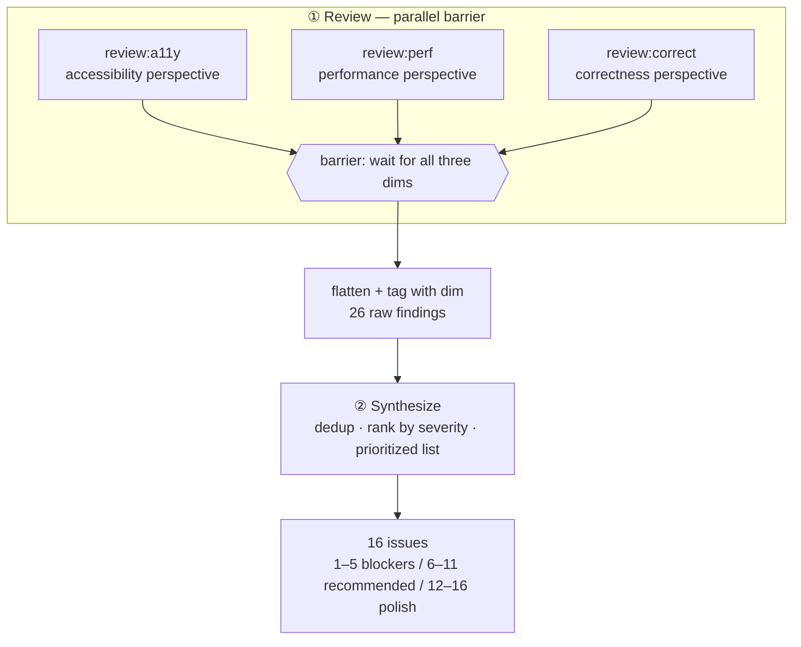
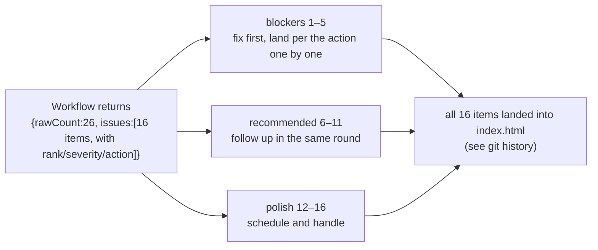

# Chapter 11 · Multi-perspective PR Review

> An effective Code Review covers multiple angles. A security engineer watches for injection and XSS, a performance engineer watches for blocking and reflow, an accessibility expert watches for focus and contrast. They **each look at their own area without interfering**, and at the end one person **aggregates, dedups, and ranks the fix order** of all the opinions. This chapter ports that human collaboration into Workflow: **parallel concurrent review (a11y / perf / correctness) followed by one synthesize agent that consolidates into a prioritized list**. The running case is a real piece of dogfooding: this recipe was used to review this book's own frontend `index.html`, uncovering XSS, no focus indicator, duplicate heading IDs and other issues, and on that basis **16 items were fixed.**

---

## 11.1 Recipe Motivation

Chapter 10's "Sharded Code Review" solves a **single-perspective, too-large-scale** problem: a diff is thousands of lines, so you slice it into shards and let multiple agents each look at a part. This chapter solves a different, **orthogonal problem**: **the same code, three independent perspectives (a11y, perf, correctness).**

Why can't one agent "look at all angles together"? Three practical reasons:

- **Attention gets diluted.** Having the same agent watch security, performance, and accessibility simultaneously results in each angle being covered shallowly, producing a list that appears comprehensive but lacks depth on any one item. Splitting the angles **across independent agents** lets each one investigate deeply with a single perspective, and the finding density increases noticeably.
- **Naturally concurrent.** The a11y review does not depend on the perf review's conclusions; the three perspectives are unrelated, which is exactly the **textbook scenario** for the `parallel()` barrier: run them concurrently, collect them together.
- **Aggregation is a separate job.** The findings each perspective produces **overlap** (e.g., "CDN script blocks rendering" is both a perf issue and may get mentioned in passing by the a11y review), and they also need **cross-perspective prioritization** (a CRITICAL XSS must rank ahead of a LOW copy issue). This "dedup and rank" work requires **an agent that can see all the findings**, so it must come **after** the concurrency barrier.

So the recipe comes out as a clean two-stage structure:



<div class="callout info">

**Why use a barrier (`parallel`) here rather than `pipeline`?** Recall Chapter 08's criterion: multi-stage defaults to pipeline, and you only use a barrier when the next stage needs the results of "all" items from the previous stage. The synthesize step does **global dedup and cross-perspective ranking**, so it must wait for **all** three perspectives to hand in before it can act. This is exactly the "real form of correct barrier use: dedup" listed in Chapter 08.

</div>

---

## 11.2 The Full Script

**(An illustrative script fleshed out from the transcript skeleton, not run verbatim; the actual run's Run ID and usage are in 11.3.)** Below is the script skeleton of this real run, and its structure matches `assets/transcripts/frontend-review.md`. The three perspectives' `prompt`s and synthesize's schema are elided with `...`/`{...}` in the transcript; here they are **filled out into a directly runnable form** and annotated inline as "(illustrative completion)"; the parts that genuinely exist in the transcript (`meta`, `FINDINGS`, the `parallel` review and flatten, the synthesize call, the `return`) stay as-is.

```javascript
export const meta = {
  name: 'frontend-review',
  description: 'Multi-dimension review of index.html: a11y, performance, correctness',
  phases: [{ title: 'Review' }, { title: 'Synthesize' }],
}

const FILE = '/abs/path/to/index.html'  // the real file under review

// All dimensions share the same finding schema: severity + title + detail + fix
const FINDINGS = {
  type: 'object',
  properties: {
    findings: {
      type: 'array',
      items: {
        type: 'object',
        properties: {
          severity: { type: 'string', enum: ['critical', 'high', 'medium', 'low'] },
          title: { type: 'string' },
          detail: { type: 'string' },
          fix: { type: 'string' },
        },
        required: ['severity', 'title', 'detail', 'fix'],
      },
    },
  },
  required: ['findings'],
}

// Three orthogonal dimensions, each with its own perspective-driven prompt (illustrative completion: elided with ... in the transcript)
const dims = [
  {
    key: 'a11y',
    prompt:
      `You are an accessibility (a11y) reviewer. Read ${FILE} and find WCAG / keyboard / ` +
      `screen-reader / focus / contrast / landmark issues. Be specific with selectors and WCAG refs.`,
  },
  {
    key: 'perf',
    prompt:
      `You are a web performance reviewer. Read ${FILE} and find render-blocking resources, ` +
      `layout thrash, unthrottled handlers, oversized/eager assets, main-thread work. Be specific.`,
  },
  {
    key: 'correct',
    prompt:
      `You are a correctness/security reviewer. Read ${FILE} and find XSS sinks, race conditions, ` +
      `state desync, missing error handling, logic bugs. Be specific and show the offending code.`,
  },
]

phase('Review')
// Three-dimension concurrent review: each thunk runs one agent, schema forces structured findings, then tag with dim
const reviews = await parallel(
  dims.map((d) => () =>
    agent(d.prompt, { label: `review:${d.key}`, phase: 'Review', schema: FINDINGS })
      .then((r) => ({ dim: d.key, findings: (r && r.findings) || [] }))
  )
)
// After the barrier releases: filter out dead dimensions, flatten into one flat finding stream, each carrying its dim source
const all = reviews.filter(Boolean).flatMap((r) => r.findings.map((f) => ({ ...f, dim: r.dim })))

phase('Synthesize')
// The synthesize agent sees all findings: dedup, rank by severity, produce an actionable prioritized list
const SUMMARY = {  // illustrative completion: elided with {...} in the transcript
  type: 'object',
  properties: {
    issues: {
      type: 'array',
      items: {
        type: 'object',
        properties: {
          rank: { type: 'number' },
          severity: { type: 'string', enum: ['critical', 'high', 'medium', 'low'] },
          title: { type: 'string' },
          action: { type: 'string' },
          dims: { type: 'array', items: { type: 'string' } },  // which dimensions hit this issue
        },
        required: ['rank', 'severity', 'title', 'action'],
      },
    },
    blockers: { type: 'array', items: { type: 'number' } },  // ranks of release blockers
  },
  required: ['issues'],
}
const summary = await agent(
  `These are ${all.length} findings (JSON): ${JSON.stringify(all)}. ` +
    `Dedup across dimensions, rank by severity, and produce a prioritized action list. ` +
    `Mark which ranks are release blockers.`,
  { label: 'synthesize', phase: 'Synthesize', schema: SUMMARY }
)

const byDimension = dims.reduce(
  (acc, d) => ({ ...acc, [d.key]: all.filter((f) => f.dim === d.key).length }),
  {}
)
return { rawCount: all.length, byDimension, ...summary }
```

Three idioms worth noting:

- **Reusing `schema`.** The three perspectives share the same `FINDINGS` schema, keeping the outputs of different perspectives **structurally uniform**, so the synthesize stage can treat them as one homogeneous data stream. See Chapter 07 for the details of schema's hard constraints.
- **Tagging with `.then()`.** Each review agent, upon returning, does `.then((r) => ({ dim, findings }))` to **attach** "which perspective this finding came from" to the result. This is the `.then()` context-merging idiom introduced in Chapter 08.
- **Grouping explicitly with `opts.phase`.** Inside `parallel`, every `agent()` explicitly carries `phase: 'Review'`, preventing concurrent agents from racing on the global `phase()` (the progress-grouping pitfall of Chapters 08/05).

---

## 11.3 Real Run Results

> **Real run**: Run ID `wf_4c5caabb-b73`, Task ID `wss21eu0x`. See `assets/transcripts/frontend-review.md` for the raw record.
> Real usage: `agent_count=4` (3 reviews + 1 synthesis) | `tool_uses=13` | `total_tokens=221648` | `duration_ms=272643` (about 4.5 minutes).

### From 26 Raw Findings to 16 Issues

The three perspectives handed in concurrently, producing **rawCount = 26** raw findings in all:

| Perspective | Raw finding count |
|---|---|
| a11y (accessibility) | 10 |
| perf (performance) | 6 |
| correct (correctness/security) | 10 |
| **Total** | **26** |

The synthesize agent read all 26, **deduped across perspectives and ranked by severity**, narrowing them to **16 clear issues**, and gave three tiers of fix order: **1--5 release blockers, 6--11 strongly recommended, 12--16 polish.**

<div class="callout tip">

**This 26-to-16 step is the entire value of synthesize.** Among the 10 a11y findings, "no focus indicator" and "focus not visible" are really the same thing; perf's "CDN blocking" and correct's passing mention of "script loading approach" overlap too. Only an agent that can see **all** 26 can merge them and decide "XSS ranks 1st, the copy issue ranks 13th." A single-perspective review agent **cannot** do that, because it only sees the findings it is responsible for.

</div>

### Release Blockers (the top 5 the synthesize agent decided)

The following are the 5 items the synthesize agent ranked as must-fix-first. All are real outputs; their decisions and fix suggestions are excerpted here:

| # | Severity | Issue | Real decision and fix |
|---|---|---|---|
| 1 | CRITICAL | **DOM XSS** | `marked.parse()`'s result goes straight into `innerHTML`; marked v12 has no built-in sanitizer (removed since v5), and `gfm:true` lets raw inline HTML through, so an `` in a same-origin `.md` executes script. **Fix**: wrap with DOMPurify; the mermaid error fallback must also escape `&`/`"`, not just `<`. |
| 2 | CRITICAL | **No focus indicator** | The global `button{border:none}` wipes the outline, and not a single `:focus-visible` exists in the whole sheet, so the page is Tab-able but focus stays invisible (WCAG 2.4.7). **Fix**: add `:focus-visible{outline:2px solid var(--accent);outline-offset:2px}`. |
| 3 | HIGH | **Duplicate heading IDs** | `enhance()` generates ids purely from text and doesn't dedup, so duplicate headings collide and TOC/anchors always jump to the first; empty or punctuation-only headings produce `id=''`. **Fix**: use a slugger to dedup on each render + an empty-value fallback `section-<i>`. |
| 4 | HIGH | **Async render race** | `renderChapter()`'s `fetch` has no cancellation, so rapid A-to-B navigation lets A's response arrive late and overwrite B. **Fix**: a monotonically increasing `routeSeq` token, validated after the await. |
| 5 | HIGH | **Accent orange contrast too low** | Links, inline code, active nav and other elements fall below 4.5:1 in many places (WCAG 1.4.3). **Fix**: darken the text color (at least `#B8430F`), keep bright orange for large text and the progress bar. |

<div class="callout warn">

**The background of item 3 is notable.** This "duplicate heading IDs plus empty-value fallback" issue shares **the same root cause** as the lesson Chapter 12's GCF recipe uncovered on `slugify`: both are "generate ids from text without dedup, without handling empty/astral characters." Two independent Workflow runs (one a GCF deduction of slugify, one this chapter's multi-perspective review of the real file) point to the same bug class, and both fixes ended up landing together in `index.html`'s heading-ID generation logic. **This illustrates the cumulative benefit of dogfooding**: the more recipes run, the more they cross-confirm the same class of defect.

</div>

### Strongly Recommended and Polish (6--16, excerpts)

- **6** (perf): three CDN scripts block rendering + mermaid (~500KB) loads even on the figure-less home page + `highlightAuto` runs on the main thread. Fix: `defer` them, lazy-load on demand, add `preconnect`.
- **7** (perf): an unthrottled scroll handler does 2x `querySelectorAll` per frame + a `getBoundingClientRect` per heading. Fix: rAF throttle + cached NodeList + `IntersectionObserver`.
- **9** (a11y): the mobile drawer has no `aria-expanded`/Esc/focus management; sidebar links remain Tab-able when the drawer is closed.
- **11** (correct): the Copy button assumes `navigator.clipboard` exists and has no `.catch`, so it throws or silently fails under `file://` and insecure http.
- **12--16**: language-preference desync, dynamic content not exposed to AT, missing `prefers-reduced-motion`, anchors with meaningless a11y names, a manifest with no error handling, and other polish items.

### How the Review Output Directly Drives the Fix

This run **is not a demo**; it produces an **actionable fix ticket**:



The schema makes "directly driving" possible: every issue carries `rank` (fix order), `severity` (urgency), and `action` (exactly how to change it). The output is a **structured list that can be checked off item by item**, rather than prose that appears comprehensive but provides no actionable steps. A human or a downstream agent can follow it directly. All 16 items **have been landed** into this book's frontend `index.html`.

---

## 11.4 Perspectives Are Swappable: Pick the Angles You Need

Perspectives are interchangeable. This example used three (a11y, perf, correctness), but the selection is **entirely configurable.** Swapping the `dims` array for any of the groups below requires no changes to the script body:

| Review scenario | Suggested perspectives |
|---|---|
| Backend PR | Security (injection/auth) · Concurrency (race/deadlock) · Error handling · API contract |
| Frontend PR (this chapter) | Accessibility · Performance · Correctness/security |
| Data pipeline | Correctness · Idempotency · Observability · Cost |
| Documentation PR | Accuracy · Completeness · Consistency · Readability |

The more **orthogonal** the perspectives (the less they overlap), the higher the concurrency payoff and finding density. The remaining key points (a unified schema, the synthesize agent seeing all findings, source-tagging findings) are gathered in the chapter summary below.

<div class="callout tip">

**Cost intuition**: `agent_count=4`, `total_tokens~221K`, in line with the rule of thumb that tokens = agent count x per-agent context (derived in Chapter 09). This run's per-agent context runs high (~55K/agent), because each review agent **really read the entire `index.html`**, so those file-read tokens all went into context. More perspectives and a larger reviewed file mean higher cost, but the **wall clock does not grow linearly with the number of perspectives**: under the barrier, 3 perspectives only cost "the slowest one's" time.

</div>

---

## 11.5 Variants

<div class="callout info">

**Variant A: Review, then Verify, then Synthesize (three stages)**: slot an "adversarial verify" stage between Review and Synthesize, letting an independent agent confirm item by item that each finding **really holds** (culling false positives), then synthesize. The first two stages can switch to `pipeline` (each finding flows independently through "propose then verify"), with a final barrier for synthesis. See Chapter 17 on adversarial verification.

**Variant B: Multi-file PR**: a real PR often changes several files. Use `pipeline(files, reviewAllDims, synthesizePerFile)` to let each file flow independently through "multi-perspective review then single-file synthesis," then add a cross-file synthesis at the end. Each file's multi-perspective review is still `parallel` internally, which is the common combination of `pipeline` wrapping `parallel`.

**Variant C: Weighted perspective scoring**: beyond ranking, give each perspective a weight (e.g., security x3, copy x1) and let synthesize produce a quantified "PR health score" for CI gating, where falling below the threshold blocks the merge. This upgrades this chapter's "prioritized list" into an "automatable quality gate."

**Variant D: Review + auto-fix**: chain this chapter (produce a ticket) with Chapter 12's GCF (fix per the ticket) into a nested Workflow (Chapter 20): the upper layer's review produces issues, the lower layer runs "fix then verify" for each issue. That is the fully automated version of "review output directly drives the fix."

</div>

---

## 11.6 Chapter Summary

- Multi-perspective PR Review = **parallel concurrent review** (one agent per perspective, each with a single angle) plus **one synthesize agent to consolidate, dedup, and prioritize.**
- Use a barrier (`parallel`) rather than `pipeline`, because the synthesis stage needs the findings of **all** perspectives to do global dedup and ranking. This is the real form of Chapter 08's "correct barrier use."
- Real run (dogfooding this book's frontend `index.html`): `agent_count=4`, `total_tokens=221648`, `duration_ms=272643`; **26 raw findings narrowed to 16 issues**, the top 5 including DOM XSS, no focus indicator, duplicate heading IDs, and so on. **All 16 items have been landed and fixed.**
- Four key points: keep perspectives **orthogonal and replaceable** (SS11.4 gives a swap-in reference table), constrain every perspective with a **unified schema**, let the synthesize agent see **all findings**, and give each finding a **source tag** to make the result explainable.
- The review output is a **structured ticket** (with rank/severity/action), so it can **directly drive the fix**, rather than prose that cannot be acted upon.

The next chapter switches to a different form of collaboration: from "multiple perspectives looking at the same code" to a **generate-critique-fix loop** where "one writes, one nitpicks, one rewrites based on the nitpicks."

> Continue reading: [Chapter 12 · The Generate-Critique-Fix Loop](#/en/p3-12)
