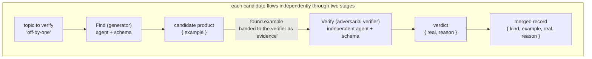
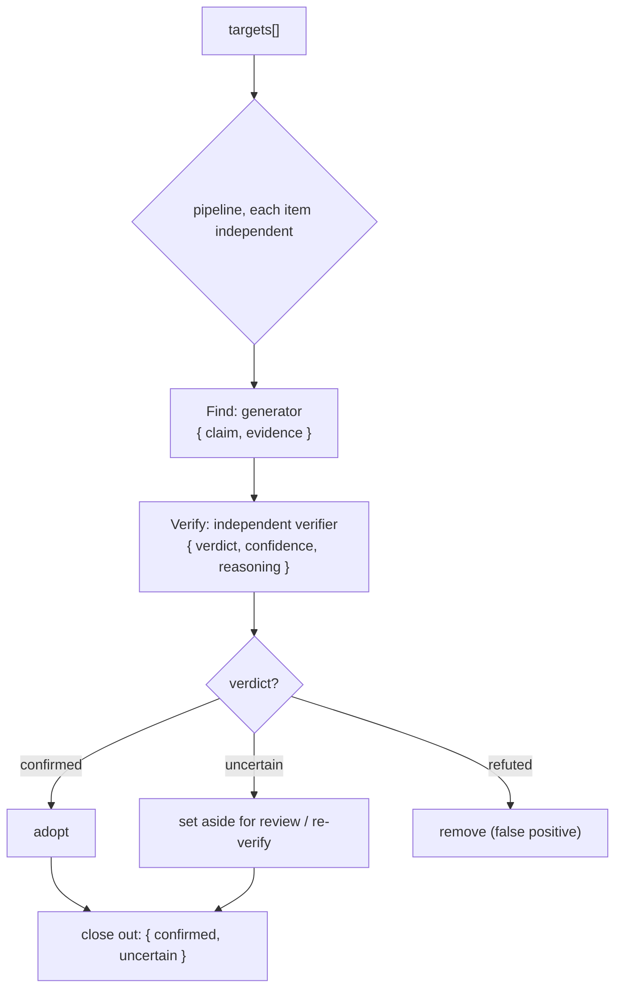

# Chapter 17 · Adversarial Verification

> In one sentence: **have an independent subagent "pick holes" in the previous subagent's product. Its task is to try its hardest to falsify, not to agree. Converge that falsification result into a trustworthy verdict with a schema, and you get a self-correcting pipeline.**
>
> This is the first chapter of Advanced Patterns, and the foundation of every "quality gate" pattern that follows. Foundations already taught you `agent` / `pipeline` / `schema`; this chapter wires them into a high-value engineering structure: **separating generation from verification.**

---

## 17.1 Why Adversarial Verification: The Fundamental Flaw of Self-Assessment

This is a common scenario.

A subagent is asked to "find the bugs in this code," and it returns three. A follow-up question -- "are you sure these are all real bugs?" -- almost always gets the answer "Yes, I confirm these are all genuine issues."

**The problem: asking the same model to grade its own work produces strong confirmation bias.** It just generated these bugs, its context is packed with "this is a bug" arguments, and by the time it is asked to self-examine, its stance is already locked in. It defends rather than questions. This is not about the model's capability. The flaw is in **self-assessment as a task structure**: assessor and assessed share the same context and the same stance, creating a structural defect.

The core insight of adversarial verification: **swap the verifier for a brand-new, independent subagent, and explicitly state that "your job is to falsify."**

- It has an **independent context**: no "I just generated this" baggage. It sees only a claim to be checked.
- It has an **adversarial stance**: the prompt directs it to be a skeptic, hunt for counterexamples, and identify weaknesses. Not to agree.
- Its verdict is **structured**: a schema pins "real/false/uncertain" into an enum, not a vague paragraph.

These three together replace "the model feeling good about itself" with "two independent perspectives in a contest." Pitting two perspectives against each other is the oldest, most reliable way to close in on the truth.

<div class="callout info">

**Workflow re-implements practices the community validated long ago as native structure.** Per `_grounding.md` section D, one of the superpowers system's core elements is the "two-stage review loop" (spec compliance → code quality, each looping until it passes), oh-my-claudecode relies on "independent reviewer sign-off," and oh-my-openagent uses "VERIFICATION_REMINDER injection for correction." These systems all use prompts and Hooks to **simulate** "separating generation from verification." Native Workflow enables writing it as a **deterministic, reusable** structure with `pipeline` + `schema`. That is what this chapter covers.

</div>

---

## 17.2 The Minimal Adversarial-Verification Skeleton from a Real Run

Starting from a real run is the most direct way to understand adversarial verification. The `pipeline-demo` from Foundations (Run ID `wf_bf086b98-6ec`, `agent_count=6`) serves as a minimal adversarial verification example. Its Find stage produces a candidate bug, and its Verify stage adversarially checks whether it is a real bug.

```javascript
const items = ['off-by-one', 'null-dereference', 'race-condition']
const out = await pipeline(
  items,
  // Stage 1 Find: generate a candidate
  (kind) =>
    agent(`Give a one-line code example of a ${kind} bug.`, {
      label: `find:${kind}`, phase: 'Find',
      schema: { type: 'object', properties: { example: { type: 'string' } }, required: ['example'] },
    }),
  // Stage 2 Verify: adversarial check
  (found, kind) =>
    agent(
      `Is this genuinely a ${kind} bug? Example: "${found.example}". Reply boolean + short reason.`,
      {
        label: `verify:${kind}`, phase: 'Verify',
        schema: {
          type: 'object',
          properties: { real: { type: 'boolean' }, reason: { type: 'string' } },
          required: ['real', 'reason'],
        },
      }
    ).then((v) => ({ kind, ...found, ...v }))
)
return out.filter(Boolean)
```

Here is what it **actually returned** (source: `assets/transcripts/primitives.md`, excerpt):

```json
[
  {
    "kind": "off-by-one",
    "example": "for i in range(len(arr)): print(arr[i+1])  # off-by-one: ...out of bounds",
    "real": true,
    "reason": "Genuine off-by-one bug... at i=2 it accesses arr[3]=arr[len(arr)], raising IndexError..."
  },
  {
    "kind": "null-dereference",
    "example": "int *p = NULL; *p = 5;",
    "real": true,
    "reason": "...Dereferencing a NULL pointer is undefined behavior and crashes (segfault)..."
  }
]
```

This skeleton already contains every element of adversarial verification, examined in turn:

**First, the verifier is a brand-new agent.** The Verify stage's `agent()` call and the Find stage are two entirely independent subagents, each with its own context (tokens draw from the shared run budget, not a separate per-agent one). Real data confirms this: 3 items × 2 stages = `agent_count=6`. Verify does not see "the bug I generated"; it sees a claim to be checked, `found.example`.

**Second, the verifier judges, not restates.** The prompt asks "Is this genuinely a ... bug?", a yes/no question that requires it to take a stance.

**Third, a schema converges the verdict.** `real: boolean` is a **gate field**: it pins "is this a real bug" from a possibly vague sentence down to `true`/`false`. The orchestration script can then `filter` on it. This is the key to making "separating generation from verification" work as a deterministic process.



<div class="callout tip">

**The fit of `pipeline` here is worth noting**: pipeline has no barrier between stages, so while one candidate is still at Verify, another may still be at Find (these parallel semantics are covered in [Chapter 08 · parallel (Barrier) vs pipeline](#/en/p2-08)). Adversarial verification is a natural fit for pipeline, because "generate → verify" is a two-stage chain, and this chain is often run in parallel over multiple candidates. Wall clock ≈ the slowest single Find→Verify chain, not the sum of all Finds plus the sum of all Verifies.

</div>

---

## 17.3 Upgrading the Verdict: From boolean to a Three-State Enum

`real: boolean` handles the simplest scenarios, but production-grade adversarial verification typically needs **three states**, because beyond "yes" and "no" sits a large zone of "not enough evidence to decide." Forcing the verifier to pick one of two on incomplete information means forcing it to guess, which runs counter to the goal of rigor.

Upgrade the verdict to three states with `enum`:

```javascript
// (illustrative, not run) — three-state verdict schema: the standard form of adversarial verification
const verdictSchema = {
  type: 'object',
  properties: {
    verdict: {
      type: 'string',
      enum: ['confirmed', 'refuted', 'uncertain'],
      description:
        'confirmed=sufficient evidence, truly an issue; refuted=confirmed false positive, give a counterexample or reason; ' +
        'uncertain=current evidence insufficient to decide, needs more information',
    },
    confidence: {
      type: 'number',
      description: 'a decimal from 0 to 1, your degree of certainty in this verdict',
    },
    reasoning: {
      type: 'string',
      description: 'one sentence giving the key rationale or counterexample; if refuted, must point out why it doesn\'t hold',
    },
  },
  required: ['verdict', 'confidence', 'reasoning'],
}
```

Each of the three fields has a distinct role:

| Field | Type | Role |
|---|---|---|
| `verdict` | three-state enum | The core verdict, pinned values, what downstream routes its state machine on |
| `confidence` | number | Degree of certainty, handy for "re-verifying low-confidence ones" or weighting |
| `reasoning` | string | Makes the verdict auditable; `refuted` must give a counterexample, forcing the verifier to think |

`enum` is the core safeguard here. Recall `_grounding.md`: schema gets validated at the tool-call layer, and an `enum`-limited field triggers a retry the moment it falls outside the value set. Downstream code can therefore be written with full confidence:

```javascript
// (illustrative, not run) — route on the three-state verdict
const confirmed = results.filter((r) => r.verdict === 'confirmed')
const needsReview = results.filter((r) => r.verdict === 'uncertain')
// refuted ones are discarded directly, no longer polluting downstream
```

There is no need to handle cases where the model returns `'Confirmed'`, a localized word, or `'I think it is confirmed'`; the runtime guarantees it will only be one of those three values. **Enum turns adversarial verification's output into a reliable state-machine transition.**

---

## 17.4 Writing the Adversary's Prompt: Eliciting Genuine Skepticism

Whether adversarial verification works depends equally on **the verifier's prompt.** The schema guarantees the verdict's structure, but "whether the verifier is actually being adversarial" is determined by how its role is defined.

A common failure mode is a too-gentle prompt: "Please check whether this finding is correct." The model agrees politely. To produce a genuine contest, the prompt needs to do three things:

**One, assign it an adversarial role.** State explicitly: "you are a skeptic / red team / hole-picker." Its success criterion is finding where this claim does not hold up.

**Two, demand evidence, not a stance.** Do not just ask "is it right"; require "if you think it's a false positive, you must give a counterexample or specific reason." The burden of proof forces the model to deliberate instead of voting on a hunch.

**Three, provide raw evidence, not the original author's reasoning.** Pass only "the conclusion to be verified + the necessary raw material," and do **not** include the generator's "why I think this is a bug" reasoning. Otherwise the verifier gets pulled along by the original author's train of thought, and the adversarial edge is lost.

```javascript
// (illustrative, not run) — an adversarial verifier prompt
const verify = (claim, evidence) =>
  agent(
    'You are a strict code-review red-team member. Your duty is not to agree but to try your hardest to **falsify** the claim below.\n' +
    'Only when you cannot find any counterexample and the evidence is conclusive should you rule confirmed.\n' +
    'If you can construct a counterexample, or the claim depends on an unproven assumption, rule refuted and explain.\n' +
    'If the current evidence is insufficient to decide, rule uncertain — do not guess.\n\n' +
    `Claim to verify: ${claim}\n` +
    `Relevant code evidence:\n${evidence}`,
    { schema: verdictSchema, label: 'adversary' }
  )
```

Note that the generator's reasoning is **not** passed in here. `claim` is the conclusion, `evidence` is the raw code, and the verifier must judge fresh on its own.

<div class="callout warn">

**Adversarial is not the same as contrarian.** A common over-correction tunes the verifier so suspicious that it rules even real bugs as refuted (false negatives). The balance comes from `confidence` and `reasoning`: require that when it rules refuted, it **must give a concrete counterexample.** If it cannot produce one and merely "feels off," then it should rule `uncertain`. The burden of proof constrains the adversarial intensity, preventing a slide from "confirmation bias" into "denial bias."

</div>

---

## 17.5 The Complete Skeleton: Generate → Adversarial Verify → Close Out

Put the preceding sections together and you get a production-ready adversarial-verification pipeline. It takes a set of items to review, and each one runs independently through "generate a candidate finding → an independent verifier falsifies → close out on the verdict."

```javascript
// (illustrative, not run) — complete adversarial-verification pipeline
export const meta = {
  name: 'adversarial-review',
  description: 'Generate a finding for each target, then an independent verifier adversarially checks, keeping only confirmed items',
  phases: [
    { title: 'Find', detail: 'Generate candidate findings' },
    { title: 'Verify', detail: 'An independent verifier falsifies' },
  ],
}

const verdictSchema = {
  type: 'object',
  properties: {
    verdict: { type: 'string', enum: ['confirmed', 'refuted', 'uncertain'] },
    confidence: { type: 'number' },
    reasoning: { type: 'string' },
  },
  required: ['verdict', 'confidence', 'reasoning'],
}

const targets = args.targets // the list of review targets passed in by the caller

const reviewed = await pipeline(
  targets,
  // Stage 1: generator
  (target) =>
    agent(
      `Review the target "${target}", find the single most suspicious issue, give claim (conclusion) and evidence (supporting evidence).`,
      {
        label: `find:${target}`, phase: 'Find',
        schema: {
          type: 'object',
          properties: { claim: { type: 'string' }, evidence: { type: 'string' } },
          required: ['claim', 'evidence'],
        },
      }
    ),
  // Stage 2: independent adversarial verifier
  (found, target) =>
    agent(
      'You are a strict red-team reviewer; your duty is to falsify the following claim. If you can give a counterexample, rule refuted; ' +
      'only when the evidence is conclusive and irrefutable rule confirmed; if evidence is insufficient rule uncertain.\n' +
      `Claim: ${found.claim}\nEvidence: ${found.evidence}`,
      { label: `verify:${target}`, phase: 'Verify', schema: verdictSchema }
    ).then((v) => ({ target, ...found, ...v }))
)

// Close out: filter out skipped nulls, classify by verdict
const valid = reviewed.filter(Boolean)
const confirmed = valid.filter((r) => r.verdict === 'confirmed')
const uncertain = valid.filter((r) => r.verdict === 'uncertain')
log(`Confirmed ${confirmed.length}, uncertain ${uncertain.length}, removed ${valid.length - confirmed.length - uncertain.length} false positives`)
return { confirmed, uncertain }
```

Several engineering details merit attention:

- **`.filter(Boolean)` cannot be omitted.** The user skipping an agent midway makes that call return `null`; a pipeline stage throwing also turns that item into `null` (this null idiom is covered in [Chapter 06 · The agent() Reference](#/en/p2-06)). These must be filtered out before consumption.
- **Mark `phase` explicitly.** Inside the pipeline, pass `phase: 'Find'` / `'Verify'` to each `agent()` so they do not race the global `phase()`, keeping the progress tree cleanly grouped. This is the approach `_grounding.md` explicitly recommends.
- **Three-state close-out.** `confirmed` is adopted directly, `refuted` discarded, `uncertain` set aside for human review or re-verification (see next section).



---

## 17.6 Advanced: Multi-Verifier Voting and Confidence Weighting

A single verifier already far exceeds self-assessment, but it is still **one** perspective. When a verdict's cost is high (say, deciding whether to block a release), **multiple independent verifiers** can each cast a vote, then aggregate with code. This upgrades "adversarial contest" to a "jury."

The mechanism is straightforward: for the same claim, fan out N verifiers with `parallel`, each judging independently, then take a majority vote.

```javascript
// (illustrative, not run) — multi-verifier voting
const jurors = await parallel(
  [0, 1, 2].map((i) => () =>
    agent(
      // Use the index i to nudge perspectives, avoiding homogeneity (echoing "forbid Math.random, use index to create variation")
      `You are independent reviewer #${i + 1}; falsify the following claim from the angle of ${['exploitability', 'blast radius', 'reproduction difficulty'][i]}.\n` +
      `Claim: ${claim}\nEvidence: ${evidence}`,
      { label: `juror:${i}`, schema: verdictSchema }
    )
  )
)

const votes = jurors.filter(Boolean)
const confirmedVotes = votes.filter((v) => v.verdict === 'confirmed').length
// A majority confirming counts as confirmed; confidence can be averaged
const finalVerdict = confirmedVotes > votes.length / 2 ? 'confirmed' : 'refuted'
const avgConfidence = votes.reduce((s, v) => s + v.confidence, 0) / votes.length
```

<div class="callout tip">

**A reusable default rule: default to `refuted` unless a majority of the independent jurors (e.g., at least 2 of 3) vote `confirmed`.** A finding **survives only when a majority of jurors affirmatively confirm it**; ties or "insufficient evidence" default to refuted. The `confirmedVotes > votes.length / 2` line above is this rule in code: 3 votes need ≥2, 5 votes need ≥3 to count as `confirmed`, otherwise it closes out as `refuted`. This is the default close-out strategy for adversarial verification: **the burden of proof falls on the "confirm" side; silence and disagreement both tip toward refuted.** This aligns with §17.3's position that "`uncertain` is not adopted as `confirmed`" -- uncertain does not mean pass.

</div>

Two details here echo the book-wide hard constraints:

**Use `index` to create perspective variation, not randomness.** Scripts forbid `Math.random()` because it breaks replayability and makes resume fail (the full explanation of this determinism ban is in [Chapter 01 · What Workflow Is](#/en/p1-01) §1.2). To produce variation among multiple verifiers, **vary the prompt using the index `i`**: have juror 0 examine exploitability and juror 1 examine blast radius. This provides diversity while preserving determinism.

**`parallel` is a barrier; it aggregates only after all votes are in.** This is exactly what the voting scenario requires: all ballots must be collected before tallying. The cost is that tokens grow linearly with jury size: for reference, 3 concurrent agents consume about `78844` tokens (`wf_52957913-6d2`), roughly 3x a single agent (the derivation of this "tokens ≈ agent count × per-agent context" rule is in [Chapter 09 · Progress, Logs, Resume, Budget](#/en/p2-09)). More verifiers increase reliability but also cost. The verdict's cost should determine the jury's size.

<div class="callout tip">

**This is where Chapter 14 "Judge Panel" connects to this chapter.** The judge panel applies the "multiple independent assessors + vote aggregation" pattern to A/B option evaluation; this chapter applies it to truth-or-falsehood calls. Both rest on the same structure: **independent perspectives + structured verdict + code aggregation.** With adversarial verification understood, the judge panel is simply a change of assessment object.

</div>

---

## 17.7 Anti-Patterns: Misusing Adversarial Verification

The following common mistakes result in adversarial verification that has the form but not the function:

| Anti-pattern | Problem | Correct approach |
|---|---|---|
| Verifier and generator share context | Degenerates into self-assessment, confirmation bias | The verifier must be an independent `agent()` call, given only the conclusion + raw evidence |
| Feeding the generator's reasoning to the verifier | The verifier gets pulled along, loses its independence | Pass only claim + evidence, let the verifier judge fresh |
| Too-gentle verifier prompt | The model nods politely, no real contest | Hand it a red-team role + burden of proof (refuted must give a counterexample) |
| Verdict in free text | Can't route reliably, back to manual parsing | Use `enum` three states + `required` to pin the verdict |
| Running a jury for every tiny product | Token explosion, not worth it | Single verifier as the default; only high-cost verdicts get multi-voting |
| Forgetting `.filter(Boolean)` | Skipped/errored `null`s crash the close-out | Always filter nulls before consuming the verdict |

<div class="callout warn">

**Adversarial verification has a cost; it at least doubles the agent count.** A "generate + verify" pipeline uses 2x the agent count of pure generation (real confirmation: pipeline-demo 3 items, two stages = 6 agents, `158982` tokens). Adding a jury multiplies further. Adversarial verification should be applied where **the cost of judging wrong is high**: deciding whether to merge, whether to release, whether to report a security vulnerability. For low-risk products that are "for reference only," a single generation may suffice. Verification strength should match the cost of getting it wrong.

</div>

---

## 17.8 Chapter Summary

- **Adversarial verification = separating generation from verification.** Send an **independent** subagent to falsify the previous stage's product, sidestepping the confirmation bias of "the same model grading itself."
- The minimal skeleton is the real `pipeline-demo` (Run `wf_bf086b98-6ec`): the Find stage generates a candidate, the Verify stage uses an independent agent to adversarially check, and `real: boolean` gates the close-out.
- A production-grade verdict uses an **`enum` three states** (`confirmed` / `refuted` / `uncertain`) plus `confidence` plus `reasoning`, turning the verdict into a reliable state-machine transition; `refuted` must give a counterexample.
- Three essentials of the adversary's prompt: **give it a red-team role, demand evidence, give only the conclusion plus raw evidence** (not the original author's reasoning).
- High-cost verdicts can be upgraded to **multi-verifier voting** (`parallel` barrier aggregation), using the **index** rather than `Math.random` to create perspective variation while keeping replayability.
- Cost awareness is essential: adversarial verification at least doubles the agent count, and tokens double with it. Verification strength should match the cost of getting it wrong.

In the next chapter, we push "verification" from "judging true or false" to "judging complete": how to use a loop to make the pipeline **generate-critique over and over** until a completeness agent rules "nothing new can be squeezed out."

> Continue reading: [Chapter 18 · Loop-Until-Dry & Completeness](#/en/p4-18)
