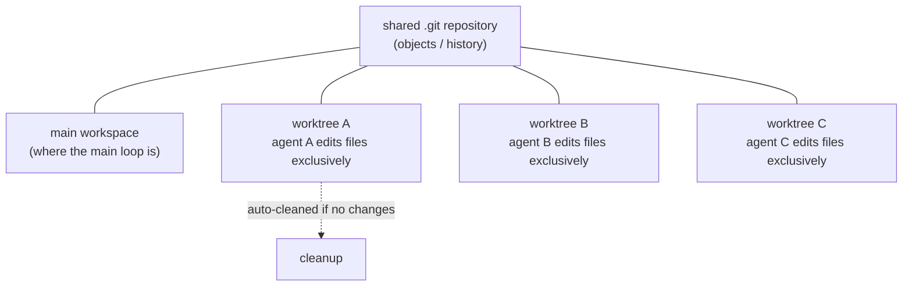
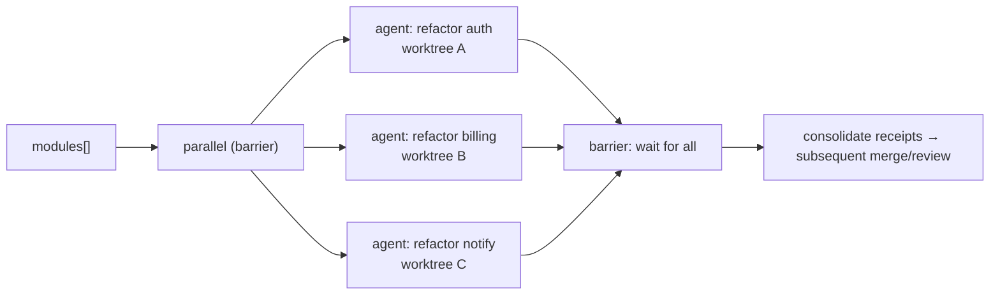

# Chapter 19 · Worktree Isolation

> **When multiple agents must modify the same code at once, use `opts.isolation: 'worktree'` to give each its own independent git worktree, so they work in physically isolated workspaces and never trample each other.**
>
> This is one of the few chapters in Advanced Patterns that touches "side effects" head-on. The earlier agents mostly "read and think" (review, research, judge); the moment agents start **writing files in parallel**, races show up. Worktree isolation is Workflow's answer.

---

## 19.1 The Problem: The Race of Writing Files in Parallel

First, recall a fact: per `_grounding.md`, `parallel()` and `pipeline()` can make multiple agents genuinely run at once (real confirmation: 3 agents concurrent in about 8.4 seconds, `wf_52957913-6d2`). As long as these agents just "read code and produce structured findings," concurrency is no problem at all. They don't get in each other's way; each just returns data.

But picture a different task: **have 5 agents each refactor a module in parallel.** Each agent has to edit files with Write/Edit. Now the problem shows up:

- Agent A is editing line 10 of `utils.js` while agent B edits line 50 of `utils.js` at the same time. They see the same version of the same file, each edits its own copy, and **the later write overwrites the earlier**, or you end up with a mixed state nobody expected.
- Even if they edit different files, git's staging area and index are **shared**, so concurrent git operations conflict with each other.
- A half-finished result left by an agent that failed midway pollutes the workspace the other agents see.

This is the **race** of parallel writing: multiple execution bodies share the same mutable state (workspace files plus git index), and without isolation they corrupt each other.

Before Workflow, community systems had their own approaches to this problem. Per `_grounding.md` section D, ccg-workflow uses "file ownership + Layer-based parallelism," meaning **by convention** each agent modifies only the files of its own layer, avoiding conflicts through discipline. This approach works, but is fragile: once the convention is broken, the race reappears.

Worktree isolation takes a different route: it isolates **physically**, not by **convention**.

---

## 19.2 What git worktree Is: One Tree, Multiple Workspaces

To understand `isolation: 'worktree'`, first understand the mechanism underneath it: git worktree.

When you use git normally, one repository maps to one working directory (working tree): whichever branch you check out, the working directory holds that branch's content. `git worktree` lets **the same repository** have **multiple** working directories at once, each mounted at a different path and able to check out a different branch or commit:

```bash
# The native usage of git worktree (for background only)
git worktree add ../feature-x feature-x   # mount an independent workspace at ../feature-x
```

The key: these workspaces **share the same `.git` repository underneath** (objects, commit history), but **each has its own independent working-directory files and index.** Any edits and commits made in `../feature-x` do not affect the main working directory.

Apply this mechanism to Workflow: when an `agent()` carries `isolation: 'worktree'`, the runtime **opens a separate git worktree** for it, and all of that agent's file changes land in that isolated workspace. Multiple such agents running in parallel means multiple isolated workspaces in parallel, **physically impossible to overwrite each other.**



<div class="callout info">

**Official semantics (per `_grounding.md` section B, agent opts)**: `opts.isolation: 'worktree'` makes the agent "run in an independent git worktree." The tool contract spells out two properties. One, it's **expensive** (~200-500ms startup + disk overhead per agent; use only when parallel file edits would collide). Two, it's **auto-removed if unchanged** (if the agent ends up making no file changes, the corresponding worktree is automatically reclaimed). **The worktree path is verified**: the working directory lands at `<repo>/.claude/worktrees/wf_<runId>-<n>/`, and it's a **real git worktree**, with `git rev-parse --show-toplevel` pointing to that isolated directory and `git rev-parse --git-dir` returning `<repo>/.git/worktrees/wf_<runId>-<n>` (measured `wf_d9a10c19-b65-2`). The finer runtime mechanics ("how to merge worktree changes," "the exact cleanup timing," "the branch name") are confirmed by neither the official docs nor testing here, so they remain "(to be verified)."

</div>

<div class="callout warn">

**The value check on `isolation` only special-cases two values in testing; do not assume "only `'worktree'` is accepted, everything else errors."** This book ran a dedicated probe to verify how `isolation` treats different values (Run `wf_dace2fc6-966`, 3 agents / 52,014 tokens / 5,253 ms):

- `isolation: 'remote'` -> **throws**, verbatim `agent({isolation:'remote'}) is not available in this build`, confirming the value `'remote'` exists but is disabled in the current build.
- `isolation: 'totally-bogus'` (a value that doesn't exist at all) -> **does not throw**; the agent runs to completion and returns `"OK"`.

So the runtime special-cases only two values: `'worktree'` (do isolation) and `'remote'` (reject); **any other unknown value is silently ignored** (treated as "no isolation"), not errored. Some third-party material claims "`isolation` only accepts `'worktree'`, everything else errors"; this book's testing finds that **untrue**, corrected here. Practical implication: a misspelled `isolation` (e.g., `'worktre'`) produces **no** warning whatsoever, and the agent runs in the shared workspace. Ensure this field is spelled correctly; the runtime does not validate it.

</div>

---

## 19.3 When to Use It, When Not To

`isolation: 'worktree'` is officially marked **expensive**, so it isn't a default option but **a specific tool for a specific problem.** There's one test:

> **Will multiple agents concurrently modify the same working tree?** Yes -> use worktree isolation; No -> don't.

Spread it out into a decision table:

| Scenario | Agent behavior | Need worktree? | Reason |
|---|---|---|---|
| Parallel code review | Read-only, produce structured findings | **No** | No writes, no race |
| Parallel research / multi-angle analysis | Read-only, return data | **No** | No writes, no race |
| Adversarial verification / judge panel | Read-only + judgment | **No** | No writes, no race |
| Multiple agents refactoring different modules in parallel | Each Write/Edit | **Yes** | Concurrent writes, must isolate |
| Multiple agents each trying a different solution to the same problem | Each edits the same set of files | **Yes** | Edit the same tree, must collide |
| A serial single agent editing files | One write at a time | **No** | No concurrency, no race |

<div class="callout warn">

**The vast majority of Workflows do not need worktree isolation.** All the earlier real runs in this book (hello / parallel / pipeline) have agents that "read + produce structured data," and **not one** requires isolation. Workflow's most common, most cost-effective usage is "fan out a group of agents to read and analyze in parallel, then consolidate the structured results." These tasks have no side effects by nature. Only when multiple agents genuinely need to **edit files concurrently** is it worth paying the worktree cost. It is a tool for a specific scenario, not a default option when going parallel.

</div>

---

## 19.4 The Typical Pattern: Parallel Refactor + Isolation

Here is worktree isolation's most typical use: a group of agents each refactors a module in an isolated workspace, without stepping on each other.

```javascript
// (illustrative, not run) — parallel refactor, one isolated worktree per agent
export const meta = {
  name: 'parallel-refactor',
  description: 'Multiple modules refactored in parallel, each agent editing files in an independent git worktree without conflict',
  phases: [{ title: 'Refactor', detail: 'parallel refactor within isolated workspaces' }],
}

phase('Refactor')
const modules = args.modules   // e.g. ['src/auth', 'src/billing', 'src/notify']

const results = await parallel(
  modules.map((mod) => () =>
    agent(
      `Refactor module ${mod}: eliminate duplication, improve naming, complete error handling. Modify files directly with the Edit tool.\n` +
      `When done, return the list of files you changed and a one-sentence summary.`,
      {
        label: `refactor:${mod}`,
        isolation: 'worktree',   // ← key: an independent workspace per agent
        schema: {
          type: 'object',
          properties: {
            changedFiles: { type: 'array', items: { type: 'string' } },
            summary: { type: 'string' },
          },
          required: ['changedFiles', 'summary'],
        },
      }
    )
  )
)

return results.filter(Boolean)
```

A few things worth noting:

**`isolation: 'worktree'` goes on each agent that writes files.** It's an option of `agent()`, sitting alongside `schema`, `label`, `phase`, and so on (per `_grounding.md`, "combinable with schema"). You get to both isolate and collect a structured "which files were changed" receipt.

**What comes back is a lightweight receipt like a "change summary," not the file content itself.** This echoes control plane / data plane separation (Chapters 07, 17): the orchestration script needs to know "who changed what" so it can merge/review afterward, while the file bodies stay put in their respective worktrees. Exactly how worktree changes flow back to the main branch isn't specified by the sources; it's "(to be verified)." In practice, confirm by watching the runtime behavior via `/workflows`.

**You want `parallel`, not `pipeline`.** The goal here is "all refactors done, all receipts in hand before the next step (e.g., unified review/merge)." That is exactly where `parallel`'s barrier semantics shine.



---

## 19.5 The Cost and Trade-off of Isolation

The official docs repeatedly stress that worktree is "expensive." Identifying the specific sources of that expense enables the right trade-off.

Worktree's overhead comes mainly from **creating an independent workspace for each isolated agent**: this involves file-system-level operations (checking out the working-tree files, etc.), much heavier than "sharing one working directory." The more agents and the larger the repository, the more significant the overhead. This cost exists in a **different dimension** from token cost: tokens measure model reasoning, worktree measures file-system isolation.

The core of the trade-off:

| Dimension | No isolation (shared workspace) | Worktree isolation |
|---|---|---|
| Concurrent file writes | Race, overwrite each other | Safe, physically isolated |
| Overhead | Low | **High** (one workspace per agent) |
| Suits | Read-only / serial writes | **Concurrent writes to the same tree** |
| When no changes | -- | Auto-cleaned, leaves no garbage |

<div class="callout tip">

**"Auto-cleaned if no changes" is a practical safety valve.** Per `_grounding.md`, if an agent with `isolation: 'worktree'` ends up making no file changes, its worktree is automatically reclaimed. There is no need to worry that "isolation was enabled but the agent made no changes" leaves empty workspaces behind; the runtime handles cleanup automatically. But that does not change one fact: the cost of "creating the workspace" has already been incurred. **Do not add `isolation` to read-only agents.** They produce no conflicts, and adding it only pays the isolation cost for nothing (even if the worktree is cleaned up in the end).

</div>

<div class="callout warn">

**Worktree isolation requires the project to be a git repository.** Worktree is a git mechanism, so this option carries the hidden premise that the current working directory is a git repository. This book's writing environment is itself a git repository (see the repo field in `manifest.json`). What `isolation: 'worktree'` does in a non-git project isn't covered by the sources; it's "(to be verified)."

</div>

---

## 19.6 Its Relationship to Other Parallel Strategies

Worktree isolation is not an isolated mechanism. Together with the concurrency primitives covered earlier and the community's "file ownership" approach, it forms a spectrum. Comparing them side by side helps in selecting the right tool:

| Strategy | Isolation method | Strength | Source |
|---|---|---|---|
| File-ownership convention (one writer/file) | Disciplined convention | Weak (depends on manual compliance) | ccg-workflow (`_grounding.md` section D) |
| Layer-based parallelism | Divide files by layer, serial between layers | Medium | ccg-workflow |
| `isolation: 'worktree'` | git worktree physical isolation | **Strong (physical)** | Native Workflow |

The three aren't mutually exclusive; they **step up in strength**:

- If you can guarantee each parallel agent edits a **completely disjoint** set of files, the "file-ownership convention" is enough, with zero extra overhead.
- If files overlap, or you can't draw the boundaries in advance, reach for `isolation: 'worktree'` and let git guarantee it physically.

<div class="callout info">

**An often-overlooked consideration**: many tasks that appear to "need parallel file edits" can actually be **reshaped into "parallel read + serial write."** Have multiple agents **produce patches / change suggestions** in parallel (read-only, returning structured diff descriptions), then let the main loop or a serial closing agent **apply** those changes one by one. This captures the parallel speed while completely avoiding the concurrent-write race, without needing a worktree. Before reaching for a worktree, consider: **can this task be split into "analyze in parallel, write serially"?** If so, that is often simpler and more economical than a worktree.

</div>

---

## 19.7 Chapter Summary

- Writing files in parallel creates a race: multiple agents share the same working tree and git index and overwrite each other. `isolation: 'worktree'` gives each agent an independent git worktree, providing **physical isolation.**
- git worktree = the same repository, multiple independent working directories, sharing the `.git` underneath but each with its own workspace files. This is the mechanism isolation builds on.
- **When to use**: only when multiple agents will **modify the same working tree concurrently.** Read-only tasks (review, research, verification, judging) **do not need it**, and they represent Workflow's most common and most cost-effective usage.
- The official docs make it clear: worktree is **expensive** (the file-system overhead of one workspace per agent, orthogonal to token cost) and **auto-cleaned if no changes.** Do not add `isolation` to read-only agents.
- The isolation-strength spectrum: file-ownership convention (weak) < Layer-based (medium) < worktree (strong/physical). Tasks that can be split into "analyze in parallel, write serially" are often simpler than a worktree.
- Details the sources don't cover (how worktree changes flow back to the main branch, behavior in non-git projects) are marked "(to be verified)"; in practice, confirm by watching the runtime behavior via `/workflows`.

In the next chapter we switch to another composition dimension: when a workflow itself wants to reuse another workflow, with `workflow()` inline calls and the "nesting one level only" constraint.

> Continue reading: [Chapter 20 · Nested Workflows](#/en/p4-20)
