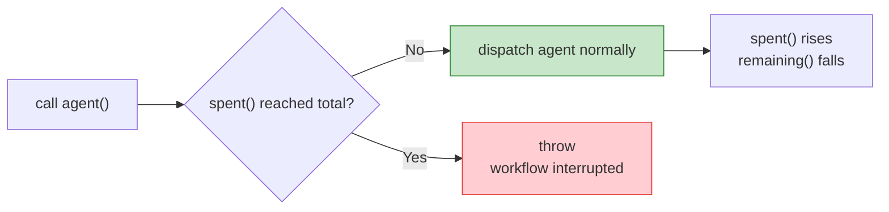
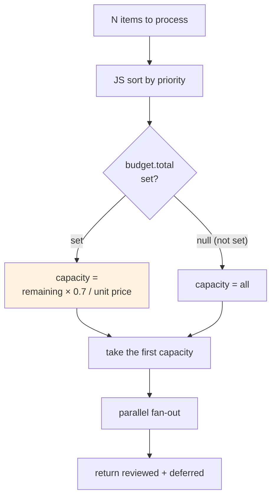
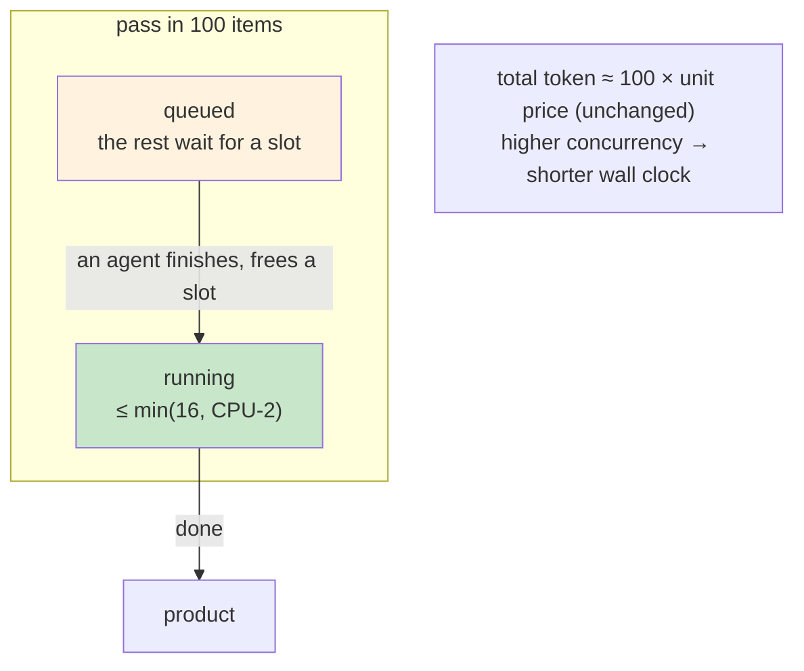

# Chapter 21 · Dynamic Budget & Scaling

> **`budget` lets the workflow query remaining budget at runtime and dynamically decide how many agents to fan out and whether to downgrade to a cheaper model. It turns "how many tokens to spend" from an uncontrolled quantity into a computable, adjustable engineering parameter.**
>
> Most of the earlier recipes hard-code the scale: five dimensions means five parallel paths, three items means a three-stage pipeline. But in production, scale is often a **variable**. "Review this PR" might have touched 3 files or 80. A fixed "one agent per file" approach wastes resources at 3 files and may exhaust the budget halfway through at 80, making `agent()` throw outright. This chapter shows how to use `budget` to **tie scale to the budget**, so the workflow adaptively lives within its means.

---

## 21.1 `budget`: The "Wallet" Injected at Runtime

Chapter 01 listed the global functions, and Chapter 18 used `budget` to set an exit condition for a loop. This chapter **explains `budget` in full**, because every decision in "dynamic scaling" rests on a precise understanding of `budget`'s three members.

`budget` is a global object the runtime injects into the script (no import needed), reflecting **this turn's** token target and consumption (per `_grounding.md` section B):

```javascript
budget.total        // number | null: this turn's token target
budget.spent()      // number: output tokens spent this turn
budget.remaining()  // number: how much is left; = max(0, total - spent())
```

The precise semantics of each member are as follows:

### `budget.total`: where the target comes from, possibly `null`

`total` is **this turn's token target**, and it comes from the user's instruction. Say the user types "`+500k`," then `total` is the corresponding target value.

<div class="callout warn">

**The number-one pitfall: when the user sets no target, `total` is `null` and `remaining()` is `Infinity`.** It isn't "0," nor "no limit means very small"; it's genuine **infinity.** Any "is there enough left" check must first use `budget.total` to tell apart the two worlds of "did the user actually set a target." Otherwise your adaptive logic fails entirely when "no budget is set" (comparing against `Infinity`, every threshold check comes out true). Section 21.3 leans on this guard repeatedly.

**`total === null` is not a guess, it's tested.** This book's sandbox-introspection probe (Run `wf_59bf3654-183`, 0 agents / 0 tokens / 4 ms) read directly, in a session with no budget target set, that `budget` is injected (`typeof budget === 'object'`) and `budget.total === null`. "No target set -> `total` is `null`" is behavior confirmed on this machine by testing, not extrapolated from the type signature.

</div>

### `budget.spent()`: it's a function, and a **shared pool**

Note that `spent()` and `remaining()` are **functions** (call them with parentheses), because their values change in real time as the workflow advances: every agent dispatched, every token it produces, `spent()` rises.

There is a more important point: **this pool is shared by "the main loop + all workflows"** (`_grounding.md` section B). `spent()` counts not only what the current workflow spent, but also what the main loop itself and other workflows launched in the same turn spent. The entire turn shares a single budget pool, which makes proactive budget management all the more necessary.

### `budget.remaining()`: a hard cap, exceeding it **throws**

`remaining()` returns `max(0, total - spent())`. Its most important property: **`budget` is a hard cap.** Once `spent()` reaches `total`, calling `agent()` again **throws directly** (`_grounding.md` section B).

This is the fundamental reason "dynamic scaling" must exist:

> **If consumption is not actively managed, `agent()` throws the moment the budget runs out. The workflow interrupts mid-execution, and the resources already spent on dispatched agents are wasted.** The correct approach is to check remaining budget first, then decide how many to dispatch.



<div class="callout info">

**"It throws" is officially specified behavior; the class name of that error (`WorkflowBudgetExceededError`) has also been confirmed by this book's R10 binary inspection.** "Calling `agent()` after `spent()` reaches `total` throws" comes from the official tool definition and can be trusted. The **exact class name** of this exception, `WorkflowBudgetExceededError`, this book confirmed really exists via R10 binary inspection (no longer a "third-party claim"). What remains **not tested by this book** is only the **fine handling semantics** of "when the budget runs out, do already-in-flight agents finish, are their results kept, or does it merely stop launching new agents." That tier has not been independently reproduced so far. This chapter does not depend on these details: every pattern rests on "**proactively managing consumption and avoiding this cap entirely**," not on `catch`ing some specific exception class. When writing code, even with a reliable class name, **do not** build control flow on catching this named exception, and do not assume in-flight results are necessarily preserved after hitting the cap. Placing budget guards up front is far more reliable than catching exceptions after the fact.

</div>

<div class="callout tip">

**`budget`'s design philosophy is to "make cost a first-class citizen."** In manual orchestration, "how many tokens will this cost" is a black box you only learn after the fact. `budget` turns it into a variable you can **read at script runtime and act on for decisions**. Chapter 02 said "code as control flow"; `budget` makes it "code as **cost-control** flow."

</div>

---

## 21.2 The Predictability of Cost: Establish a "Per-Agent Unit Price" with Real Data

To "live within your means," you first need to know "how much an agent roughly costs." This book's three same-session runs (hello / parallel / pipeline, `assets/transcripts/primitives.md`) land highly consistently at **~26k tokens / agent**, and from this `_grounding.md` section C gives the rule of thumb: **token is roughly agent count x per-agent context (about 25k-30k / agent).** For the full derivation of those three numbers, see [Chapter 09 · Progress, Logs, Resume, Budget](#/en/p2-09); here we just take its conclusion to set the pricing.

This rule is the **pricing basis** of dynamic scaling. With it, you can convert between scale and cost:

- **Forward (scale -> cost)**: want to dispatch N agents? Estimated cost is roughly N x 26k.
- **Reverse (budget -> scale)**: have `remaining()` tokens left? You can dispatch at most roughly `remaining() / 26k` more agents.

<div class="callout warn">

**This "unit price" is an order-of-magnitude estimate, not a precise calculation.** A real single agent's token consumption varies significantly with three factors. First, **prompt length**: the larger the input context, the more expensive. Second, **product size**: the more complex the schema and the more output requested, the more expensive. Third, **task difficulty**: an agent that needs multiple rounds of tool calls is far more expensive than a single Q&A. When making budget decisions, **estimate the unit price high and leave a safety margin on scale** (below uses a coefficient like `SAFETY = 0.7`). Treat 26k as the "lightweight-agent floor," and estimate compute-intensive work at 40k-60k for safety.

</div>

---

## 21.3 Pattern 1: Dynamic Fan-Out -- Decide How Many to Dispatch by Remaining

The first and most common dynamic-scaling pattern: **you've got a batch of items to process (files, modules, problems), but you don't necessarily dispatch an agent for every one. Instead, see how many the budget can afford and process that many of the most important ones.**

### The danger of the naive version

First the cautionary tale: fan out everything regardless of budget.

```javascript
// ⚠️ Dangerous: ignores budget, hits the wall and throws halfway when there are many files (illustrative, not run)
const results = await parallel(
  files.map(f => () => agent(`Review ${f}`, { schema: REVIEW }))
)
```

When `files` has 80, this queues 80 agents at once (throttled by the `min(16, CPU-2)` concurrency limit, but the **total** is still 80). Estimated cost 80 x 26k is roughly **2.08M tokens.** If the user only gave `+500k`, around the 19th agent `spent()` hits the cap, the 20th `agent()` call **throws**, and the whole workflow is interrupted. By that point, the cost of the first 19 agents has already been incurred, without producing a complete result.

### The adaptive version: first compute "how many can be dispatched," then dispatch

The right approach is to **first reverse-compute the scale cap, then slice accordingly**:

```javascript
// Adaptive fan-out: decide how many items to process by remaining budget (illustrative, not run)
export const meta = {
  name: 'adaptive-fanout',
  description: 'Dynamically decide fan-out scale by remaining budget, slicing by priority',
  phases: [{ title: 'Review' }],
}

const PER_AGENT = 50000   // upper bound of single-agent cost (review-type is heavier, estimate at 50k)
const SAFETY = 0.7        // safety coefficient: use only 70% of remaining, leaving room for main loop and close-out

// 1) Sort by importance first (deterministic operation, done in JS)
const ranked = args.files.slice().sort((a, b) => b.churn - a.churn)  // larger churn first

// 2) Reverse-compute: how many agents can be dispatched this turn at most
let capacity
if (budget.total) {
  capacity = Math.floor((budget.remaining() * SAFETY) / PER_AGENT)
} else {
  capacity = ranked.length   // user set no budget (total=null) → no extra limit
}
const toProcess = ranked.slice(0, Math.max(1, capacity))   // process at least 1

log(`Budget remaining ${budget.total ? budget.remaining() : '∞'}, ` +
    `processing ${toProcess.length}/${ranked.length} files this turn`)

// 3) Fan out within capacity
phase('Review')
const results = (await parallel(
  toProcess.map(f => () => agent(`Review ${f.path}`, { label: f.path, schema: REVIEW }))
)).filter(Boolean)

// 4) Be honest: which were not processed due to budget
return {
  reviewed: results,
  processed: toProcess.length,
  deferred: ranked.slice(toProcess.length).map(f => f.path),  // not reached, listed honestly
}
```

This pattern has three key points:

1. **Sort with JS, not an agent.** "Sort by churn" is a deterministic operation; hand it to `Array.sort`. Zero cost, and replayable (echoing Chapter 18's discipline of "deterministic operations go to code").
2. **The `budget.total` guard runs from start to finish.** When no budget is set (`null`), impose no extra limit, because `remaining()` is `Infinity` then, and reverse-computing yields a meaningless huge value.
3. **Report `deferred` honestly.** Items not processed due to budget get returned truthfully, instead of pretending everything was done. The caller can then "add budget and run the rest later" (even with [Chapter 22](#/en/p4-22)'s resume).



---

## 21.4 Pattern 2: Dynamic Downgrade -- Use a Cheap Model When the Budget Is Tight

The second pattern uses `agent()`'s `model` option (`_grounding.md` section B): **when the budget is ample, use a strong model (inheriting the main loop model; this book's earlier example session was Opus 4.7, the R11 re-verification session was Opus 4.8); when the budget is tight, downgrade some agents to `'haiku'`**, trading quality for coverage.

`agent()`'s `model` option: omit it and it inherits the main loop model (the recommended default); you can also override it explicitly. Simple tasks on `'haiku'` can cut cost substantially.

```javascript
// Dynamically choose the model by remaining budget (illustrative, not run)
function pickModel() {
  if (!budget.total) return undefined            // no budget set: use default (inherit main loop)
  const ratio = budget.remaining() / budget.total
  if (ratio > 0.5) return undefined              // over half left: keep the strong model
  if (ratio > 0.2) return 'haiku'                // tight: downgrade for speed and cost
  return 'haiku'                                 // critical: finishing matters more than finishing well
}

phase('Triage')
const results = (await parallel(
  items.map(it => () => agent(`Classify: ${it.title}`, {
    label: it.title,
    model: pickModel(),       // decided at runtime by remaining
    schema: TRIAGE,
  }))
)).filter(Boolean)
```

<div class="callout tip">

**Downgrading is a form of "graceful degradation."** Rather than maintaining a strong model when the budget is critical and risking mid-run interruption, downgrading to haiku to cover **all** items is typically preferable. A "fully covered but slightly lower precision" result is often more useful than "half covered but each one precise." The right trade-off depends on the task: classification and initial screening suit downgrading for coverage; "better to omit than misreport" tasks like security audits do not. **This judgment should be written into the code, not left for the model to decide at runtime.**

</div>

<div class="callout warn">

**Decide the downgrade once "before fan-out"; do not switch back and forth inside the loop.** If `pickModel()` is called for every item in a long `pipeline`, the result may be "first half strong-model, second half haiku," producing inconsistent quality that is hard to consolidate. The more reliable approach: **assess remaining once before entering fan-out, and set a single model strategy for the batch**; only re-assess between batches or rounds (like Chapter 18's loop).</div>

---

## 21.5 The Hard Boundaries of Scaling: The Concurrency Limit and the 1000 Fallback

No matter how clever dynamic fan-out gets, it runs within two **runtime hard boundaries.** Scaling must keep them in mind (`_grounding.md` section B / A2 "official hard constraints"):

| Boundary | Value | Meaning |
|---|---|---|
| **Per-workflow concurrency limit** | `min(16, CPU cores - 2)` | The number of agents **running** at once; the excess **queues**, runs when a slot opens |
| **Per-workflow agent total cap** | **1000** | A fallback on the total agents dispatched over the whole workflow lifecycle, to prevent runaway loops |

The key difference between these two boundaries: **the concurrency limit governs "how many at once," the total cap governs "how many in all":**

### The concurrency limit: it doesn't limit the total, only "at once"

You **can** pass `parallel()` / `pipeline()` 100 items, and they **all complete**. At any instant only about `min(16, CPU-2)` are actually running, and the rest queue (`_grounding.md` section A). The concurrency limit is **not** "at most 16 can be processed"; it's "at most 16 run at once."

What does this mean for cost? **The concurrency limit affects wall clock, not total tokens.** 100 agents, whether 8 or 16 run concurrently, total about 100 x unit price. The only difference is that higher concurrency means shorter wall clock (more agents running at once).



### The 1000 total fallback: the last safety net for runaway loops

Within a single workflow's lifecycle, the agent total cap is **1000.** This is the last safety net that keeps a runaway loop (like that mis-written unbounded `while` from Chapter 18) from burning through everything.

<div class="callout warn">

**Never treat the 1000 fallback as a business-exit mechanism** ([Chapter 18](#/en/p4-18) covers this in full). One additional note from the scaling-cost angle: by the time 1000 is reached, approximately 1000 x 26k, roughly **26M tokens**, have already been consumed. Real scale control relies on explicit `budget` guards and round caps to rein it in far before 1000.

</div>

---

## 21.6 The Combined Skeleton: Budget-Aware Batch Processing

Combine dynamic fan-out, dynamic downgrade, and boundary awareness into one production skeleton: process a batch of items whose count is unknown up front, let the budget decide **how many to process** and **what model to use**, and report the result accurately.

```javascript
// Budget-aware batch processing (illustrative, not run)
export const meta = {
  name: 'budget-aware-batch',
  description: 'Dynamically decide fan-out scale and model by remaining budget, processing a batch of items within means',
  phases: [{ title: 'Plan' }, { title: 'Process' }],
}

// —— Pricing parameters (tune per task, estimate heavy work high) ——
const PER_AGENT = 50000     // upper bound of single-agent cost
const SAFETY    = 0.7       // safety coefficient

phase('Plan')
// 1) Deterministic preprocessing: sort (most important first)
const ranked = args.items.slice().sort((a, b) => b.priority - a.priority)

// 2) Reverse-compute capacity + choose model (unified strategy, decided once)
const hasBudget = !!budget.total
const capacity  = hasBudget
  ? Math.max(1, Math.floor((budget.remaining() * SAFETY) / PER_AGENT))
  : ranked.length
const model = (() => {
  if (!hasBudget) return undefined
  const ratio = budget.remaining() / budget.total
  return ratio > 0.5 ? undefined : 'haiku'   // over half left keep the strong model, else downgrade for coverage
})()

const batch    = ranked.slice(0, capacity)
const deferred = ranked.slice(capacity)

log(`Budget ${hasBudget ? budget.remaining() : '∞'}; ` +
    `processing ${batch.length}/${ranked.length}; model ${model || 'default(inherits main loop)'}; ` +
    `estimated cost ~${(batch.length * PER_AGENT / 1000).toFixed(0)}k tokens`)

// 3) Fan out within capacity
phase('Process')
const done = (await parallel(
  batch.map(it => () => agent(`Process: ${it.title}`, {
    label: it.title, model, schema: RESULT,
  }))
)).filter(Boolean)

// 4) Return honestly (incl. unprocessed items and the stop reason, to ease adding budget and resuming)
return {
  processed: done,
  count: done.length,
  deferred: deferred.map(it => it.title),
  modelUsed: model || 'inherited',
  budgetAtStart: hasBudget ? budget.total : null,
  spentApprox: budget.spent(),
}
```

This skeleton captures the core flow of a "budget-aware workflow": **plan first (check remaining budget, set the scale, choose the model), then execute (fan out within capacity), and finally report accurately (what was processed, what remains, how much was spent).**

<div class="callout info">

**Why list `Plan` as a separate phase?** The **pure-JS** decisions of "check budget, sort, compute capacity, choose model" cost almost no tokens, yet they decide the entire cost scale of the `Process` phase. Making it an explicit phase (even with no agents) both keeps the `/workflows` progress readable and reminds whoever reads the code: **the scale decision is a separate action happening before fan-out**, not something improvised inside the loop.

</div>

---

## 21.7 The Division of Labor with Chapters 18 and 22

`budget` has a different emphasis in each of three chapters in this book; the distinction is important:

| Chapter | budget's role | Key action |
|---|---|---|
| **Chapter 18, Loop-Until-Dry** | One of the loop's **brakes** | `budget.total && remaining() < PER_ROUND` -> close out early |
| **This chapter (21)** | The scale's **regulating valve** | Reverse-compute fan-out scale by `remaining()`, dynamically choose the model |
| **Chapter 22, Resume** | A cross-run **money-saver** | Resume after editing a step; unchanged agents hit the cache, no re-spending tokens |

The three are orthogonal and stackable: one workflow can perfectly well **decide fan-out scale by budget (this chapter) -> brake with budget inside a loop (Chapter 18) -> resume after editing the script to save money (Chapter 22).**

<div class="callout tip">

**Remember this chapter's pattern:** do not write a workflow that "ignores budget and fans out everything." That amounts to betting the budget is sufficient, and losing means throwing and crashing halfway. Write a workflow that "checks remaining budget first, reverse-computes how many it can handle, stays within its means, and accurately reports what remains." **Program cost as a runtime variable, not a black box discovered only after the fact.**

</div>

---

## 21.8 Chapter Summary

- **`budget` is the "wallet" injected at runtime**: `total` (this turn's target, **`null` when the user sets none**), `spent()` (spent, a function, **a pool shared by main loop + all workflows**), `remaining()` (remaining, **`Infinity` when not set**). It's a **hard cap**: calling `agent()` after `spent()` reaches `total` **throws.**
- **The number-one guard**: prefix any remaining check with `budget.total &&`, telling apart the two worlds of "budget set" and "`null`/`Infinity`." Otherwise the adaptive logic fails when no budget is set.
- **Pricing basis**: real data consistently shows **~26k tokens / agent**; from this you can forward-compute (N agents is roughly N x 26k) and reverse-compute (remaining / unit price is roughly how many more). Estimate the unit price high and leave a safety coefficient.
- **Pattern 1, dynamic fan-out**: JS sort to set priority -> reverse-compute capacity by `remaining() x SAFETY / unit price` -> slice and process -> return `deferred` honestly.
- **Pattern 2, dynamic downgrade**: pick `model` by the `remaining()/total` ratio, downgrade to `'haiku'` when the budget is tight to trade for coverage; **decide once before fan-out, do not switch back and forth in the loop.**
- **Hard boundaries**: the concurrency limit `min(16, CPU-2)` (governs "how many at once," affects wall clock not total tokens, the excess queues but all complete); the agent total cap **1000** (a runaway fallback, never a business-exit mechanism).
- This chapter's scripts are all **structural illustrations (not run)**; the token magnitudes (hello/parallel/pipeline) are real data from `assets/transcripts/primitives.md`.

The next chapter closes out Advanced Patterns: when a long pipeline is halfway through and you need to change one step, how to **avoid re-running from scratch**. `resumeFromRunId` resume and caching exploit the rule that "the same script necessarily produces the same execution," letting unchanged steps reuse their cached results without re-spending tokens.

> Continue reading: [Chapter 22 · Resume & Caching](#/en/p4-22)
