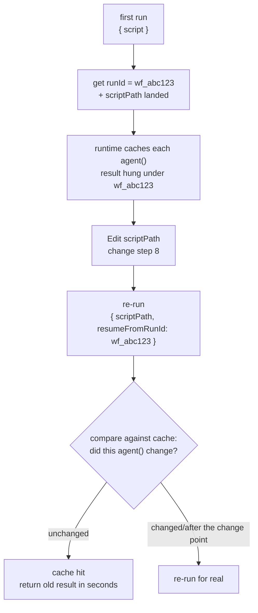
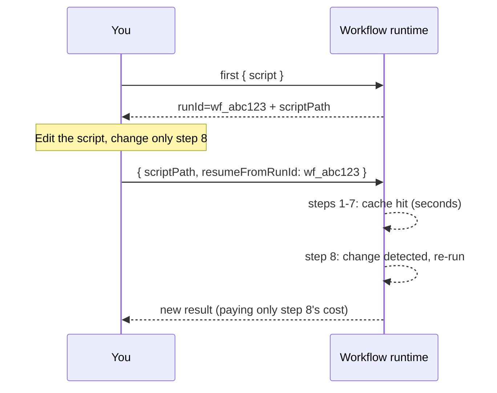

# Chapter 22 · Resume & Caching

> **Change step 8 of a long pipeline, and the expensive results of the first 7 steps are reused directly in seconds. This is resume. Re-run with `{ scriptPath, resumeFromRunId }`, and unchanged `agent()` calls hit the cache; only the edited ones and those after them re-run for real.**
>
> This is the closing chapter of Advanced Patterns, and the key to making all those earlier "expensive multi-agent pipelines" truly **iterable.** It also fully explains a prohibition that runs through the whole book: why `Date.now()` and `Math.random()` are forbidden in scripts.

---

## 22.1 The Pain Point: Change One Step, but Re-Run from Scratch

Say you wrote an 8-stage deep-research pipeline, each stage fanning out several agents, the whole run 500k tokens and several minutes. It finishes, you look at step 8 (the final report's wording), don't like it, and change that step's prompt.

Without resume, your only option is to **re-run the whole pipeline from scratch.** The 400k+ tokens of work in the first 7 steps, whose results haven't changed one bit, have to be burned again and waited out for several minutes. This is costly when iterating a long pipeline: every time the wording at the end is adjusted, the entire run's cost is incurred again.

Resume exists to eliminate this waste. Its promise:

> **The same script + the same args -> 100% cache hit.** Only the `agent()` calls you **changed** (and the calls after them) re-run for real; the unchanged ones hand you last time's result in seconds.

Iterating a long pipeline turns into: change step 8 -> re-run -> the first 7 steps hit the cache instantly -> only step 8 runs for real. Seconds, not minutes.

<div class="callout info">

**Official semantics (per `_grounding.md` sections A/B)**: `WorkflowInput.resumeFromRunId?: string` is resume: **unchanged `agent()` calls return cached results; same session only.** Use it together with `scriptPath` (the on-disk script path, landed on every call). That `runId` in `WorkflowOutput` (like `wf_...`) is exactly the value you pass to `resumeFromRunId` when resuming.

</div>

---

## 22.2 The Mechanism: The Script Is a File + the runId Anchor

To understand how resume works, recall the two facts from Chapter 01. They combine here.

**Fact one: the script is a file.** Per `_grounding.md`, every time Workflow is called, the runtime **lands the script on disk** as a `.js` file under the session directory, and hands back the `scriptPath`. Your workflow isn't a fleeting string but an **editable file sitting on disk.**

**Fact two: every run has a runId.** Per `_grounding.md`, `WorkflowOutput` returns `runId` (like `wf_...`). It's the unique ID of this run, and the **anchor** that all of this run's agent-result cache hangs off of.

Resume combines the two:

1. First run: you get the `runId` (e.g., `wf_abc123`) and the landed `scriptPath`. The runtime caches each `agent()` call's result by its "identity" in the script, all hung under this `runId`.
2. You `Edit` that `scriptPath` file, touching one of the `agent()` calls.
3. Re-run: pass `{ scriptPath, resumeFromRunId: 'wf_abc123' }`. The runtime checks against the cache. **Unchanged `agent()` calls take the cached result straight up**, while the changed ones (and those after them) re-execute.



This iteration loop (edit the file + re-run with `scriptPath`) is the full version of Chapter 01's "Want to iterate? Just Write/Edit that file and re-invoke with `{ scriptPath }`, no need to resend the whole script." Resume adds the key ability to "reuse the cache with `resumeFromRunId`."

<div class="callout warn">

**"Same session only" is a hard limit.** Per `_grounding.md`, resume is valid only within the **same session.** The official specification is explicit: **if you exit Claude Code while a workflow is running, the next session starts the workflow fresh** (verbatim: *"the next session starts the workflow fresh"*). Cross-session resume does not exist. The cache lifecycle is tied to the current session; closing Claude Code and resuming with a previous `runId` is not possible. Resume is a tool for "iterating on a pipeline repeatedly **within the current session**," not a persistence scheme for continuing across sessions. State that needs cross-session persistence requires other mechanisms (e.g., having an agent write the product to a disk file, see [Chapter 19](#/en/p4-19)'s control plane / data plane idea).

The `resumeFromRunId` here is the **script-side** programmatic resume; it has a terminal-side counterpart too. Selecting a stopped run in the `/workflows` view and pressing `p` to resume rides the same cache mechanism. For the two faces side by side, see [The Official Control Panel](#/en/p2-ops).

</div>

---

## 22.3 Revealing the Prohibition: Why Date.now() and Math.random() Are Forbidden

At this point, the prohibition that was repeatedly mentioned in Chapters 01 and 02 but never fully explained can be addressed.

Per `_grounding.md`'s "hard constraints": scripts **forbid `Date.now()` / `Math.random()` / arg-less `new Date()`.** The reason Chapter 01 gave was "they break replayability." This section explains **why resume requires replayability, and how these two functions break it.**

The whole premise of resume is "**the same script necessarily produces the same execution**." Only then can the runtime judge "this `agent()` call didn't change, the cache is good to use." And that judgment rides on one assumption: **the script's logic is deterministic and replayable**, so that with the same input, the state when you reach this point is the same every run.

`Date.now()` and `Math.random()` **violate** this assumption:

- `Date.now()`: returns a different timestamp on every call. If the script uses it to build a prompt (e.g., `agent(\`Analyze data before ${Date.now()}\`)`), then **the same `agent()` call produces a different prompt on every re-run.** The call has "changed," so the cache judgment logic breaks down.
- `Math.random()`: returns a different random number on every call. The same principle applies: any `agent()` call that depends on it is non-replayable.

```javascript
// ❌ Wrong (illustrative, not run) — breaks replayability, rejected
const ts = Date.now()                              // forbidden
const pick = items[Math.floor(Math.random() * 3)]  // forbidden
await agent(`Analyze the ${pick} of ${ts}`)        // different every re-run → resume fails
```

The alternatives are also specified in `_grounding.md`:

**Need a timestamp -> pass it in via `args`, or add it after the workflow completes.** Pass time in as a parameter from outside (`args.timestamp`), and the script internals remain deterministic: the same `args`, the same execution. Alternatively, once the workflow finishes, add the timestamp to the result from outside.

```javascript
// ✅ Right (illustrative, not run) — the timestamp passed in via args, staying replayable
await agent(`Analyze data before ${args.cutoffDate}`)
```

**Need randomness/diversity -> vary the prompt with the agent's index.** This is the method used in Chapter 17's "multi-verifier voting": use `i` to assign each agent a different perspective, achieving diversity while remaining fully deterministic (same index -> same prompt).

```javascript
// ✅ Right (illustrative, not run) — create variation with index, not random
const views = ['performance', 'security', 'readability']
await parallel(views.map((v, i) => () => agent(`Review from the ${views[i]} angle…`)))
```

<div class="callout tip">

**Remember this causal chain**: resume saves money -> resume needs to judge "the call didn't change" -> that judgment needs the script to be replayable -> replayability forbids nondeterminism -> hence `Date.now()` / `Math.random()` / arg-less `new Date()` are forbidden. This prohibition is not an arbitrary runtime restriction; it is the **unavoidable price of "an iterable long pipeline."** Understanding this chain leads naturally to proactively moving all nondeterminism outside the script (`args`) or substituting with index-based variation.

</div>

---

## 22.4 In Practice: Iterating a Long Pipeline

Applying the mechanism in practice: suppose the task is iterating a research pipeline. The flow is as follows:

**Step one, first run, get the runId.** Launch the workflow as usual, and note the `runId` and `scriptPath` from the completion notification/return:

```text
Run ID: wf_abc123
Script file: .../workflows/scripts/research-pipeline-wf_abc123.js
```

**Step two, edit the landed script.** Use the `Edit` tool to modify the file at `scriptPath` directly, e.g., changing only the last consolidation agent's prompt. **Key: do not modify any earlier-stage `agent()` calls**, or their caches get invalidated.

**Step three, re-run with resumeFromRunId.** An official precondition: stop the previous run with `TaskStop` first (resume only works within the same session). Then call the Workflow tool again, this time passing:

```javascript
// (illustrative, not run) — the input form of a resume call
{
  scriptPath: '.../research-pipeline-wf_abc123.js',
  resumeFromRunId: 'wf_abc123'
}
```

The runtime reuses the caches of every earlier unchanged stage, re-running only the modified agent and its downstream. The first few stages complete **in seconds** (cache hits), with compute spent only past the change point.



<div class="callout tip">

**Real-run confirmation (a 5-agent pipeline, resume = 0 tokens / 3 ms)**: this book ran a 5-agent model-resolution workflow (Run `wf_9c94951d-58c`), running it live the first time; then ran it again as-is with the **completely unchanged script** + `{ scriptPath, resumeFromRunId: 'wf_9c94951d-58c' }`. The two runs' usage side by side (same Run ID):

| Run | Agents | total_tokens | duration_ms |
|---|---|---|---|
| First (real execution) | 5 | **133,691** | **32,959** |
| Resume (100% cache hit) | 5 (all cached) | **0** | **3** |

The 5 results returned on resume are **identical** to the first run. **All 5 agents hit the cache on resume: 0 new tokens, returned in 3 milliseconds** (the first run was 133k tokens, 33 seconds). The runtime replays each `agent()`'s result directly from the journal, without re-dispatching a single subagent. This turns "same script + same args -> 100% hit" from a promise into measured data, and empirically answers the next section's question "do cache hits count tokens": **they do not.** The raw record is in `assets/transcripts/api-facts-r4.md` (there is also an earlier single-agent resume `wf_dacbd480-d5d`, 0 tokens / 8 ms, same conclusion, in `assets/transcripts/advanced.md`).

</div>

<div class="callout warn">

**Every call after the change point re-runs, even if it did not change at all.** Resume invalidates from the change point onward: if step 8 changed, steps 9 and 10's inputs may shift as a result, so they must re-run to guarantee correctness. **Design guideline: put the steps most likely to be adjusted later in the pipeline** to maximize cache benefit. If step 2 is frequently modified, everything after step 3 must re-run, and resume saves little. Place "stable, expensive" steps up front and "mutable, needs iteration" steps at the back. This is the pipeline design principle for resume-friendliness.

</div>

<div class="callout info">

**"What counts as a change": which fields make an `agent()` lose its cache?** The boundary this book tested is **same script + same args = 100% hit** (`wf_9c94951d-58c`), and that one is hard-tested. On top of that, R8 ran a controlled test (baseline `wf_4ffde230-535`, 3 agents / 91,044 tokens) that isolated two fields one at a time: **change only one agent's `label` (everything else left alone) -> resume is a 0-token full hit => `label` is not in the cache key**; **change only its `prompt` (label restored) -> 91,044 re-runs as 60,702 tokens (roughly 2/3 of baseline), with agents before the change point still hitting and that agent plus its downstream re-running => `prompt` is in the key.** The steadiest mental model is still the conservative one: **if you change the `prompt` fed to an agent, or the upstream data it leans on, treat it as having lost the cache**. To reliably keep your cache hits, leave the script and args completely untouched (change only the one step you genuinely want to re-run, plus its downstream).

As for **whether the remaining fields are in the key**, third-party community material claims `schema / model / isolation / agentType` from `opts` are in the key, with `phase` being cosmetic and left out. **This book has not yet isolated and verified these fields one by one**, so they're marked in their entirety as **claimed by third-party community material, not independently tested by this book** (the already-tested `label`/`prompt` are above, not in this list). In practice you don't need to memorize the exact list. Follow the conservative coarse rule "changing prompt/upstream data means treat the cache as lost" and you can iterate safely.

</div>

---

## 22.5 Resume's Interaction with budget and Nesting

Resume is not a standalone feature. It has subtle interactions with the mechanisms of earlier chapters, and understanding them prevents issues.

**Relationship with budget ([Chapter 21](#/en/p4-21)): do cache hits count tokens?** Resume's value comes precisely from the fact that cache-hit calls do not re-execute. Since they do not execute, they do not consume model-reasoning tokens. This book's real resume run confirmed it: the 5-agent pipeline's cache-hit re-run had `total_tokens=0` (see the "real-run confirmation" above, Run `wf_9c94951d-58c`, raw record `assets/transcripts/api-facts-r4.md`). Resume genuinely saves tokens. **The marginal cost of iteration comes only from the modified portion**, and the earlier cache-hit stages are nearly free.

**Relationship with nested `workflow()` (Chapter 20).** Resume's "unchanged `agent()` hits the cache" applies to the `agent()` calls in the current workflow script. If the script contains a `workflow()` sub-call, how resume interacts with the sub-workflow's cache is not elaborated by the sources; it is marked "(to be verified)." When iterating a workflow with nesting, confirm by observing the actual cache-hit behavior via `/workflows`.

**Relationship with worktree (Chapter 19).** A worktree-isolated agent drags in file-system side effects. When resume re-runs the agents after the change point, how those side effects get handled (re-create the worktree?) is likewise a detail not covered by the sources, marked "(to be verified)."

<div class="callout info">

**A safe practice principle**: resume's most reliable and most officially-supported scenario is "a **read-only, structured-data-only** multi-stage pipeline," such as research, review, or analysis. Such a workflow's `agent()` calls carry no external side effects, and the meaning of a cache hit is unambiguous (same input -> same output -> safely reusable). For complex cases with file writes (worktree) or nested sub-workflows, resume's behavior has details not covered by the sources. **Observe actual hits via `/workflows`** rather than relying on assumptions. This is consistent with the book-wide principle of "never speculate about an API from memory."

</div>

---

## 22.6 A Resume-Friendly Design Checklist

This chapter's experience condensed into a "resume-friendly" design checklist:

| Principle | Practice | Reason |
|---|---|---|
| **Eliminate nondeterminism** | Forbid `Date.now()` / `Math.random()` / arg-less `new Date()` | They break replayability, resume's judgment fails (they are rejected) |
| **Drive nondeterminism outside** | Timestamps via `args`; diversity via `index` | Keep the script deterministic, same input same execution |
| **Put mutable steps later** | Stable expensive ones up front, repeatedly-polished ones at the back | Everything after the change point re-runs; later changes maximize cache benefit |
| **Make good use of script landing** | When iterating, `Edit` the landed script + re-run with `scriptPath` | No need to resend the whole script, and it provides a file anchor for resume |
| **Remember the runId** | After the first run, note the `runId` for resume | The source of `resumeFromRunId`'s value |
| **Iterate within a session** | Resume is valid only in the same session | Cross-session needs separate disk persistence |
| **Observe complex cases first** | With worktree/nesting, watch hits via `/workflows` | Resume details for these scenarios aren't covered by the sources |

<div class="callout tip">

**Resume turns "writing a workflow" into a real "programming" experience.** Without resume, every script change pays the full-run cost, and iteration gets so pricey you don't dare adjust lightly. That feels more like "tossing off a batch job once." With resume, you change a line, re-run, and see the local effect in seconds, just like debugging code in a REPL: **changes are cheap, feedback is instant.** This is a big engineering edge of Workflow's "deterministic script" over "probabilistic prompt orchestration": determinism makes caching possible, and caching makes rapid iteration possible.

</div>

---

## 22.7 Chapter Summary

- **Resume**: re-run with `{ scriptPath, resumeFromRunId }`, and **unchanged `agent()` calls hit the cache in seconds**. Only the edited ones and those **after** them re-run for real. The promise is "same script + same args -> 100% hit."
- The mechanism = **the script is a file** (every call lands `scriptPath`) + **the runId anchor** (`WorkflowOutput.runId` is where the cache mounts, and the value of `resumeFromRunId`).
- **Resume is valid only in the same session**; cross-session persistence requires separate mechanisms such as having agents write to disk.
- The causal chain that reveals the prohibition: resume saves money -> needs to judge "the call didn't change" -> needs the script to be **replayable** -> forbids nondeterminism -> hence `Date.now()` / `Math.random()` / arg-less `new Date()` are forbidden. Alternatives: timestamps via `args`, diversity via `index`.
- **Resume-friendly design**: put mutable steps later in the pipeline (everything after the change point re-runs), stable expensive ones up front.
- The fine interactions with budget/nesting/worktree have parts not covered by the sources (marked "(to be verified)"); the most reliable scenario is a **read-only, structured-data-only** multi-stage pipeline. For complex cases, watch the actual hits with `/workflows`.

This chapter closes out Advanced Patterns. From adversarial verification and loop-until-dry to worktree isolation, nesting, dynamic budget, and resume, the advanced capabilities needed to run Workflow at production grade have been fully covered. The next part turns to the community: how the four major orchestration systems "simulated" these capabilities before native Workflow, and which approaches are worth rewriting as reusable workflows with `phase`/`schema`.

> Continue reading: [Chapter 23 · Four Systems Compared](#/en/p5-23)
