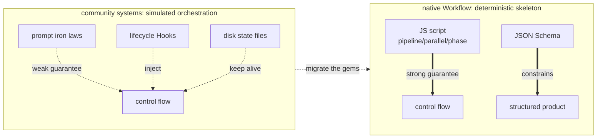

# Chapter 23 · Four Systems Compared

> Before native Workflow existed, the community was already "orchestrating" multiple agents through various approaches. This chapter analyzes four representative open-source systems (`ccg-workflow`, `superpowers`, `oh-my-claudecode`, `oh-my-openagent`) to examine their **real orchestration mechanisms**, then extracts the approaches that native Workflow can reuse.
>
> Every mechanism description here is based on a genuine reading of each repo's source code (file paths are noted); the goal is to "take the best," not to rank them.

---

## 23.1 An Insight Running Through the Whole Chapter

The conclusion comes first, then the evidence:

> **These four systems were all born before native Workflow; they all use "prompts + lifecycle hooks + disk state files" to _simulate_ a deterministic orchestration engine.** Because for a long stretch, Claude Code (and similar harnesses) had no native ability to "orchestrate agents with code."

The approaches each one developed are valuable: using disk state to fight context compaction, Hook-injected "breadcrumbs" to prevent drifting, the `Stop` hook preventing premature termination, tool-layer `throw` guardrails. Native Workflow, with `pipeline`/`parallel`/`phase` plus JSON Schema, directly provides the **deterministic skeleton** they worked to maintain.

So the through-line of this chapter (and Chapter 24) is: **native Workflow gives the skeleton, and these four systems' gems are the "resilience layer" sitting on top of it.** Combine the two and you get orchestration ready for production.

<div class="callout info">

**The through-line insight (remember this one sentence; the whole chapter argues it)**: these four systems **were all born before native Workflow**, so they could only use "prompts + lifecycle Hooks + disk state files" to **simulate** a deterministic orchestration engine. ccg injects a `<ccg-state>` breadcrumb each turn, OMC intercepts stopping with the `Stop` hook, OmO intercepts file writes with a tool-layer `throw`, superpowers injects a "behavioral constitution" via `SessionStart`. These are all patches designed under the constraint of **having no native control flow**. Native Workflow fills in, all at once, the two capabilities they most lacked: the **deterministic skeleton** provided by `pipeline`/`parallel`/`phase`, and the **tool-layer hard constraint** provided by JSON Schema. When reading each subsequent section, compare "what Hook or state file it uses to simulate this" with "which primitive native Workflow provides directly."

</div>



---

## 23.2 ccg-workflow: ccg Multi-Model Parallel Collaboration + Disk State Keeping Alive

**What it is**: CCG (Claude + Codex + Gemini) is a multi-model collaboration workflow engine installed on top of Claude Code. A single `/ccg:go` natural-language entry automatically judges task type/complexity/risk, picks one of 10 strategies, and pulls in external models for cross-verification while it runs. It fixes three pains: a single agent drifting on a long task, losing progress after context compaction, and a single model having blind spots.

**Real orchestration mechanism** (four layers stacked):

- **Slash command used as role injection**: `templates/commands/go.md` turns Claude into the "CCG Engine," walking it through the Phase 0–3 decision matrix.
- **Strategy files = prompt state machines**: e.g. `templates/engine/strategies/full-collaborate.md`, using `[phase-state:N]` to mark phases, `Gate`, `HARD STOP` checkpoints, and updating `task.json` one phase at a time.
- **A JS Hook engine (real code, zero dependencies)**: `templates/hooks/` injected into `~/.claude/settings.json`. Of these, `workflow-state.js` reads `task.json` on every `UserPromptSubmit` and injects a `<ccg-state>` breadcrumb, **the key to fighting context compaction**; `task-utils.js`'s `detectLoop` keeps a 10-turn rolling buffer and fires a deadlock warning after 3 consecutive turns stuck in the same phase.
- **A dual-track execution layer**: either Agent Teams (official) running in parallel, or external models via `~/.claude/bin/codeagent-wrapper` (a real Go binary, semaphore concurrency + DAG dependency scheduling).

**The most valuable takeaway**: **disk state plus per-turn Hook breadcrumb injection.** Land the workflow progress to disk as `task.json`, and re-feed it to the model each turn with a tiny `<ccg-state>`, solving at the lowest possible cost the root problem of the agent forgetting what it's doing on long tasks and after compaction.

The following two concrete forms ground the abstraction above.

First, **the "10 strategies" are a table you can count off**: `templates/commands/go.md`'s appendix lists exactly 10, each one mapping to a real strategy file under `templates/engine/strategies/`, and `/ccg:go` picks one in Phase 0 based on task type, complexity, and risk:

```text
direct-fix · quick-implement · guided-develop · full-collaborate · debug-investigate
refactor-safely · deep-research · optimize-measure · review-audit · git-action
```

Second, **multi-model routing is whatever the config says**. Which config actually takes effect is governed by the defaults in `src/utils/config.ts` (note: the `model-router.md` doc example writes gemini, but the runtime is governed by config.ts):

```javascript
// ccg-workflow · src/utils/config.ts defaults (source: _grounding.md D2)
const defaults = {
  frontend: { primary: 'antigravity' },          // frontend task → antigravity
  backend:  { primary: 'codex' },                // backend task → codex
  review:   { models: ['codex', 'antigravity'] },// review → two models in parallel, cross-verifying
}
```

External models run via `~/.claude/bin/codeagent-wrapper` (a real Go binary). Its `executor.go` uses `topologicalSort` (layered topological sort with cycle detection) to resolve the task DAG, then a `sem := make(chan struct{}, workerLimit)` semaphore in `executeConcurrentWithContext` to cap concurrency. This is one implementation of "deterministic scheduling," and exactly what native Workflow provides in a single line with `pipeline`/`parallel`.

> For reference: this book's multi-model review (codex reviews content, antigravity reviews the frontend) runs through CCG's `codeagent-wrapper` plus the `/ccg:frontend`, `/ccg:review` routing. The config is `review.models=['codex','antigravity']`, two models cross-verifying in parallel.

---

## 23.3 superpowers: Methodology as a Plugin + Two-Stage Review

**What it is** (obra/superpowers): a **complete software development methodology** for coding agents, made of a set of composable skills plus a boot bootstrap, across 7 harnesses, zero dependencies. It requires the agent to first clarify intent, produce a spec, write a plan, then implement with TDD, addressing the common problem of immediately writing code upon receiving a requirement.

**Real orchestration mechanism** (no JS orchestrator, no `commands/`/`agents/` directories, purely four layers of soft conventions):

- **A boot bootstrap hook**: `hooks/hooks.json` registers `SessionStart`, wraps the entire `using-superpowers/SKILL.md` in `<EXTREMELY_IMPORTANT>` and injects it into context. `CLAUDE.md` states explicitly: "without this bootstrap, the skills are dead code."
- **Mandatory skill self-check**: it mandates that **before any reply** (even just answering a question) it must first check skills, "if there's a 1% chance it's relevant it must be invoked."
- **Skills strung into a flow**: each skill ends by spelling out the next one with `REQUIRED SUB-SKILL`, forming the deterministic chain `brainstorming → writing-plans → subagent-driven-development → finishing-a-branch`.
- **State files are the handoff**: specs get written to `docs/superpowers/specs/`, plans tracked with `- [ ]` checkboxes.

**What its "two-stage review" looks like**: in `subagent-driven-development/SKILL.md`, each task's acceptance is a chain of **two stages in series, each looping until it passes**. Here's the shape sketched in pseudocode (prompt semantics, not a runnable script):

```text
# superpowers two-stage review (pseudocode · reconstructing SKILL.md's control structure)
for each task:
  loop:                               # stage 1: spec compliance
    review_spec(task)                 # over-implemented? under-implemented?
    if compliant: break
    fix(task); # review again
  loop:                               # stage 2: code quality
    review_quality(task)              # naming/error handling/edge cases
    if good: break
    fix(task); # review again
  # only after both stages pass, move to the next task
```

Note its "guarantee" rides entirely on a prompt asking the model to "review once more," a **soft convention**, not a hard control flow. This can be landed exactly as a **deterministic quality gate** with native Workflow's `pipeline` (two stages in series) plus JSON Schema (a `pass: boolean` gate field); Chapter 24 will weld this pseudocode into a runnable script line by line.

Also noteworthy: superpowers' subagent **structured state returns** use a set of fixed enum values like `DONE` / `BLOCKED` / `NEEDS_REVIEW`, enabling upstream branching. This is the precursor to "free text becomes a decidable conclusion," and native Workflow's `schema enum` upgrades it from a convention to tool-layer enforcement.

---

## 23.4 oh-my-claudecode: The Stop Hook Persistent Loop

**What it is**: a large orchestration plugin for Claude Code that packages "multi-agent collaboration + persistent execution + quality gating" into a ready-to-run workflow, addressing the problem of complex tasks being silently declared half-finished.

**Real orchestration mechanism** (hooks + state files + skills + 20-role subagents):

- **Hook-driven** (`hooks/hooks.json`): `UserPromptSubmit→keyword-detector` spots magic words and injects the corresponding SKILL; `SubagentStop→verify-deliverables`; **`Stop→persistent-mode`** is the core of it. It checks whether `.omc/state/` has an active mode, and if so **blocks stopping** and re-injects "The boulder never stops" to drive a loop.
- **State files are the control plane**: `.omc/state/sessions/{id}/` stores mode/phase/iteration, keeping the control plane and the data plane (`.omc/plans/`, `prd.json`) apart, so it can resume after a crash.
- **PRD-driven + independent reviewer sign-off**: `ralph` requires each story in `prd.json` to be `passes:true` and verified by an independent critic before it counts as done.

**What the `Stop` hook's core logic looks like**: it turns "whether stopping is allowed" into a judgment that runs at the `Stop` lifecycle point. Sketched in pseudocode (reconstructing `persistent-mode`'s control structure, not a runnable script):

```javascript
// OMC · Stop-hook pseudocode — "the boulder never stops"
// Trigger point: when Claude is about to end this turn
function onStop() {
  const mode = readActiveMode('.omc/state/')        // disk state: is a mode running?
  if (!mode) return { allow: true }                 // no active mode → let through, stop normally
  if (mode.allStoriesPass) return { allow: true }   // every PRD story is passes:true → let through
  return {                                          // otherwise: block stopping + re-inject a continuation prompt
    allow: false,
    inject: 'The boulder never stops. Keep advancing the unfinished stories.',
  }
}
```

This is the physical implementation of "execution complete ≠ acceptance passed": it maintains the loop by **intercepting the act of stopping.** Note it persists both the criterion (`allStoriesPass`) and the state (mode/phase/iteration) to `.omc/state/` on disk, because a prompt-driven loop has no memory.

**The most valuable takeaway**: **using the `Stop` hook plus state files to build a "completion-criteria loop."** Native Workflow ends when the script finishes; OMC makes "whether stopping is allowed" a programmable gate. Bringing this idea into Workflow, paired with JSON Schema validation of the product, upgrades "the pipeline finished" to "it counts as done only when acceptance criteria are met" (Chapter 18's "loop-until-dry" is its Workflow counterpart). Comparing the `Stop` hook above with Chapter 24's `while (!accepted)` loop: hook interception plus disk state simplify into a `while` and a few local variables.

---

## 23.5 oh-my-openagent: Tool-Layer Guardrails + Untrusted Verification

**What it is** (OmO, built on **opencode**, not Claude Code): a plugin-style Agent OS published as an npm package, expanding a single agent into a "development team." It registers **10 built-in roles**, e.g. Atlas commanding / Sisyphus executing / Metis…; planning is carried by the **Prometheus persona** (which appears in prompts but is not in the registered builtin-agent union). Models can be mixed and matched, and the entry is `ultrawork`/`ulw`.

**Real orchestration mechanism** (a runtime harness: plugin hooks + custom tools + state files):

- **Slash command + hook role-switching**: `/start-work` gets intercepted by `start-work-hook.ts`, which reads `boulder.json` to tell resume from init, then switches over to Atlas.
- **Programmatic subagent dispatch**: the `task()`/`call_omo_agent` tools really do call the opencode API to spin up a child session and poll it.
- **system-reminder injection driving the loop**: Atlas's hook family injects, every turn, `BOULDER_CONTINUATION_PROMPT` and `VERIFICATION_REMINDER` ("the sub-agent says it's done, it's lying, go verify"), and injects `DELEGATION_REQUIRED` to yank Atlas back when it oversteps to edit code.
- **Tool-layer guardrails**: `prometheus-md-only/hook.ts` hard-intercepts before tool calls; the planner's `Write/Edit` may only write `.omo/*.md`, and violations directly `throw`. **The planner physically cannot write code.**

Several concrete implementation details follow.

The entry is a regex keyword. `keyword-detector/constants.ts` matches the user's message against `/\b(ultrawork|ulw)\b/i` and, on a hit, summons the whole orchestration. Its sharing a name with native Workflow's **early community nickname** `ultrawork` is no coincidence (in the official v2.1.154 client that word is no longer a trigger, surviving only as the internal event name `ultrawork_request`).

The built-in roles it registers number exactly **10** (the `BuiltinAgentName` union in `src/agents/types.ts`):

```text
sisyphus · hephaestus · oracle · librarian · explore
multimodal-looker · metis · momus · atlas · sisyphus-junior
```

(The planning persona **Prometheus** appears in prompts but is **not** in this registered union. It is a "persona," a role the prompt plays, rather than a dispatchable builtin agent.)

And the guardrail that makes the planner "physically unable to write code" is essentially a single `throw` at the tool-call layer. Here it is sketched in pseudocode (reconstructing `prometheus-md-only/hook.ts`'s interception logic):

```javascript
// OmO · tool-layer guardrail pseudocode — the planner may only write .omo/*.md
function beforeToolCall(tool, args) {
  if (tool === 'Write' || tool === 'Edit') {
    if (!args.path.match(/^\.omo\/.*\.md$/)) {
      throw new Error('Planner may only write .omo/*.md')   // physical interception, not a prompt request
    }
  }
}
```

This turns "the planner should not modify code" from a **prompt-level convention** into a **runtime physical constraint**, exactly the starting point for Chapter 24's native rewrite as "a `schema`-constrained planner that can only emit a plan object."

**The two most valuable takeaways**: First, **use tool-layer guardrails plus system-reminder injection to enforce discipline, rather than relying on prompt-level conventions.** Second, **delegate by Category (semantic intent) rather than by model name.** The LLM sees `category="quick"/"ultrabrain"`, and the runtime maps that onto a model fallback chain, eliminating the distribution bias of "the model self-limiting," while keeping models hot-swappable. This is instructive for Workflow's `agent({model})` selection: decide by task category rather than hard-coding model names.

---

## 23.6 Comparison at a Glance

| System | Host | Orchestration mechanism | Determinism | Strongest suit | One-line takeaway |
|---|---|---|---|---|---|
| **ccg-workflow** | Claude Code | Prompt state machine + JS Hook + Go bridging multi-models | Weak (prompt constraints) | ccg multi-model parallel cross-verification + compaction resistance | Disk state + per-turn breadcrumb injection |
| **superpowers** | Across 7 harnesses | Skill chain + SessionStart-injected "constitution" | Weak (probabilistic) | Methodological discipline (TDD/brainstorm) | The two-stage review loop |
| **oh-my-claudecode** | Claude Code | hooks + state files + 20 roles | Medium (Stop hook fallback) | Resilience (resume/anti-silent-failure) | The Stop hook = a completion-criteria loop |
| **oh-my-openagent** | opencode | hooks + custom tools + state files | Medium (tool-layer guardrails) | Boundary guardrails + category delegation | Tool-layer throw + Category delegation |
| **native Workflow** | Claude Code | **JS script pipeline/parallel/phase + Schema** | **Strong (code)** | Determinism + structuring + reusability | —— |

**How to read this table**: the first four rows are "simulated orchestration," the last row is "the native skeleton." They are not competitors. **The recommended approach is to use native Workflow as the skeleton and integrate these four systems' best approaches as a resilience layer on top.**

<div class="callout warn">

**Do not copy the "orchestration mechanism" column verbatim.** That column describes the **implementation** (hooks, state files, Go bridging on a specific host), not the **pattern.** The valuable part is the **control structure** behind the "strongest suit" and "takeaway" columns: the essence of disk breadcrumbs is "pass structured state explicitly," the essence of the `Stop` hook is "the completion criterion is programmable," the essence of the tool-layer `throw` is "role boundaries are system-enforced." Copying the implementation into native Workflow creates compatibility issues. **How to extract the pattern from the implementation, then build a fresh implementation with `phase`/`schema`, is the entire subject of the next chapter.**

</div>

---

## 23.7 Chapter Summary

- All four systems, before native Workflow existed, simulated deterministic orchestration with **prompts plus Hooks plus state files.**
- Each one's gem: ccg is disk-state breadcrumbs, superpowers is the two-stage review, OMC is the Stop-hook completion criteria, OmO is tool-layer guardrails plus category delegation.
- Native Workflow supplies the **deterministic skeleton plus Schema constraints** they were missing; the two complement each other.

The next chapter presents "how to systematically extract and abstract valuable ideas from other systems, then rewrite them as reusable Workflows with `phase`/`schema`" as a methodology.

> Continue reading: [Chapter 24 · The Art of Extraction](#/en/p5-24)
