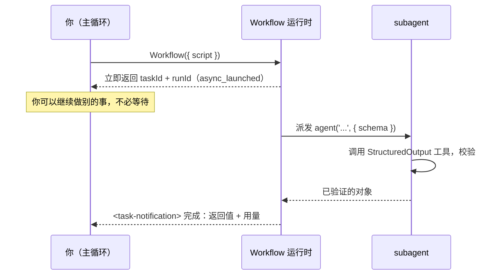

# 第 01 章 · Workflow 是什么

**动态工作流（Dynamic workflows）是 Claude Code 内置的一个工具。** 你写一段纯 JavaScript 脚本，它就能按你定的顺序编排成百上千个 subagent（官方上限：单 run 至多 1000 个、并发至多 16 个）。官方状态是 research preview（研究预览）；本书后文多简称「工作流 / Workflow」。

这一章不急着写复杂脚本。先把三件事讲透：它到底是个什么东西、运行时发生了什么、为什么值得专门花时间学。这是后面所有配方的地基。

据官方文档，Workflow 最适合这几类任务：

- **代码库审计**：并行派发大量 agent 扫描不同模块或维度
- **大规模迁移**：每个文件/模块走同一条流水线，自动处理依赖
- **跨源研究**：多路检索 + 交叉验证 + 汇总
- **多视角方案评审**：同一份方案拆给不同角色打分，最后汇总

---

## 1.1 从一次真实运行说起

想搞懂一个东西，最快的办法是看它跑起来是什么样。下面这段脚本，是本书第一个在真实 Claude Code 会话里跑过的 Workflow。

```javascript
export const meta = {
  name: 'hello-workflow',
  description: 'Smoke test: one subagent returns schema-constrained structured output',
  phases: [{ title: 'Greet', detail: 'One subagent confirms the runtime' }],
}

phase('Greet')
const r = await agent(
  'You are a smoke test for the Claude Code Workflow runtime. Return a one-sentence ' +
  'confirmation message, the integer value of 2+2, and a boolean confirming you ran ' +
  'as a workflow subagent.',
  {
    label: 'smoke',
    schema: {
      type: 'object',
      properties: {
        message: { type: 'string' },
        sum: { type: 'number' },
        runtimeConfirmed: { type: 'boolean' },
      },
      required: ['message', 'sum', 'runtimeConfirmed'],
    },
  }
)
log(`smoke result: ${JSON.stringify(r)}`)
return r
```

把它交给 Workflow 工具执行，**真实**得到的返回值是：

```json
{
  "message": "The Claude Code Workflow runtime smoke test executed successfully as a workflow subagent.",
  "sum": 4,
  "runtimeConfirmed": true
}
```

运行时还附带了一份真实用量数据：

```text
agent_count = 1   tool_uses = 1   total_tokens = 26338   duration_ms = 5506
```

> 来源：本次运行的原始记录见仓库 `assets/transcripts/primitives.md`（Run ID `wf_dacbd480-d5d`）。本书所有「真实运行」均可这样溯源。

这二十几行代码覆盖了 Workflow 的几个关键概念。下面逐个说明。

---

## 1.2 脚本的结构：经线与纬线

回到「织经」的隐喻。一个 Workflow 脚本由两部分构成：

### 经线（Warp）：`meta` 与 `phase`

脚本的第一条语句必须是 `export const meta = {…}`，而且必须是静态字面量（static literal），不能包含变量、函数调用、展开运算符或模板插值。如果格式不符，运行时会报错拒绝执行。

```javascript
export const meta = {
  name: 'hello-workflow',                       // 必填：工作流标识
  description: 'Smoke test: ...',               // 必填：一行描述，会显示在权限弹窗里
  phases: [{ title: 'Greet', detail: '...' }],  // 可选：阶段声明，驱动进度显示
}
```

为什么要求静态字面量（static literal）？运行时在执行脚本之前，需要先静态读取 `meta`，用来在权限弹窗里展示工作流的名称、用途和阶段。这一步不运行代码，如果 `meta` 里有 `Date.now()` 或变量引用，解析阶段无法求值。

`meta` 的字段（据官方类型定义与工具说明）：

| 字段 | 必填 | 作用 |
|---|---|---|
| `name` | 是 | 工作流名称 |
| `description` | 是 | 一行描述，显示在权限确认对话框 |
| `whenToUse` | 否 | 适用场景说明，显示在工作流列表中 |
| `phases` | 否 | 阶段数组，每项 `{ title, detail?, model? }`，驱动进度树分组 |

`phase('Greet')` 的作用是切换当前阶段。调用它之后，后续所有 `agent()` 在进度显示里都会归入「Greet」这一组。

### 纬线（Weft）：`agent()` 等全局函数

`meta` 之后的代码运行在一个 `async` 上下文中，可以直接使用 `await`。运行时会注入一组全局函数，不需要 import：

| 函数 | 作用 |
|---|---|
| `agent(prompt, opts?)` | 派发一个 subagent，返回它的产物 |
| `parallel(thunks)` | 并发执行一组任务，**屏障**：等全部完成 |
| `pipeline(items, ...stages)` | 让每个 item 独立流过多个阶段，**无屏障** |
| `phase(title)` | 切换当前阶段 |
| `log(message)` | 向用户输出一条进度信息 |
| `workflow(name, args?)` | 内联调用另一个工作流（子流程） |
| `args` | 调用方传入的参数对象 |
| `budget` | 本回合的 token 预算对象 |

上面的 `hello-workflow` 只用了 `agent()`：派发一个 subagent，等它返回结果。

<div class="callout warn">

**脚本里不能使用 `Date.now()`、`Math.random()`、无参 `new Date()`。** 这个限制分两层执行：

1. **提交前的源码扫描**：运行时在执行之前会扫描脚本源码，只要在**任何位置**（包括注释、字符串、未执行的代码块）发现这几个字面量，就会拒绝整段脚本。由于脚本根本没有运行，`try/catch` 无法捕获这个错误。
2. **运行时拦截**：即使通过动态手段（比如间接引用 `Date`）绕过了源码扫描，运行时也已经替换了这些全局对象，调用时仍然会抛出异常。这一层可以被 `try/catch` 捕获，但不建议利用这一点。

为什么有这个限制？1.7 节会详细解释。简单说，这三个函数每次调用返回不同的值，会破坏「相同脚本产生相同结果」的前提，导致断点续传失效。如果需要时间戳，通过 `args` 传入，或在工作流结束后补充；如果需要随机性，用 agent 的下标（index）来区分提示词。

</div>

---

## 1.3 `agent()`：一个 subagent 的诞生

`hello-workflow` 的核心是这一句：

```javascript
const r = await agent(prompt, { label: 'smoke', schema: {...} })
```

它的作用是：**派发一个 subagent 去执行 `prompt`，再把产物作为返回值。**

这里有两个关键设计，正是它和「手动开子任务」最大的区别。

**第一，subagent 被明确告知「最终输出就是返回值」。** 普通子任务返回的是一段写给人看的文本；Workflow 的 subagent 知道产物要交给**程序**处理，因此直接返回**原始数据**，不附带多余描述。

**第二，`schema` 把「原始数据」变成「结构化数据」。** 传入一个 `schema`（JSON Schema），运行时会强制 subagent 调用内部的 `StructuredOutput` 工具，并**在工具调用层**校验返回值是否符合 schema。不符合则让模型**重试**，直到合规为止。因此 `agent()` 带上 schema 时，返回的是一个**已经验证过的对象**，不需要额外的解析或容错代码。

回头看真实输出：要求的 `sum`（2+2）返回的是数字 `4`，**而不是字符串 `"4"`**。schema 中声明了 `sum: { type: 'number' }`，校验层将类型锁定。这正是结构化输出的价值所在，第 07 章会专门展开。

> **不带 schema 会怎样？** 据工具定义，不传 `schema` 时 `agent()` 返回 subagent 的最终文本（一个字符串）。带 schema 才返回校验过的对象。

`agent()` 的常用选项（完整清单见第 06 章与附录 A）：

```javascript
await agent(prompt, {
  label: 'smoke',          // 进度显示里的标签，默认自动编号
  schema: {...},           // JSON Schema：强制结构化输出
  phase: 'Greet',          // 显式归入某阶段（在 pipeline/parallel 内部尤其重要）
  model: 'haiku',          // 覆盖该 agent 的模型；省略则继承主循环模型
  isolation: 'worktree',   // 在独立 git worktree 中运行（并行改文件时用）
  agentType: 'Explore',    // 使用自定义 subagent 类型而非默认
})
```

---

## 1.4 运行时发生了什么：异步、taskId、后台

这是最容易被误解的一点：**Workflow 工具不会「跑完才返回」，而是立刻返回。**

据官方类型定义 `sdk-tools.d.ts`，`WorkflowOutput` 的 `status` 只有两个值：`"async_launched"` 和 `"remote_launched"`。也就是说，**调用 Workflow 工具后，它立即在后台开始运行，同时返回一个句柄**。

```text
Workflow launched in background. Task ID: wi7ye81mb
Run ID: wf_dacbd480-d5d
Script file: .../workflows/scripts/hello-workflow-wf_dacbd480-d5d.js
You will be notified when it completes. Use /workflows to watch live progress.
```

以下是返回信息中几条值得记住的**真实**数据：

- **`Task ID`**：本次后台任务的 ID。
- **`Run ID`**（形如 `wf_...`）：本次运行的标识，断点续传时需要用到（见 1.7 节）。
- **脚本保存路径**：每次调用，运行时都会把脚本**写入磁盘上的文件**。需要修改后重试时，直接 `Write`/`Edit` 那个文件，再带上 `{ scriptPath: ... }` 重新调用即可，不需要重新发送整段脚本。
- **`/workflows`**：一个斜杠命令，用于实时查看进度树。

工作流执行完成后，会收到一条**完成通知**（`<task-notification>`），包含最终返回值和用量统计。`hello-workflow` 的完成通知就是 1.1 节那段 JSON 加上 `agent_count=1 … duration_ms=5506`。



<div class="callout tip">

**异步 + 后台意味着可以同时启动多个工作流。** 一次性启动多个工作流并行运行，自己继续做其他事情，每个工作流完成时会各自发出通知。本书后面会大量使用这种模式。需要注意的是：由于是异步的，**Workflow 工具的返回值并不是工作流的结果**，只是一份「已启动」的回执，真正的结果在完成通知里。

</div>

---

## 1.5 怎样让 Claude 用上 Workflow

要让 Claude 真正运行一个 Workflow，需要先分清**两件事**。这两件事经常被混为一谈，是新手最大的困惑来源：

1. **能用**：Workflow 工具是否已在当前环境中启用？
2. **会用**：Workflow 工具已启用后，如何触发 Claude 使用它？

两件事分开管理，下面分两层说明。

### 第一层 · 能用：先看官方入口，再谈底层 flag

工具是否在当前环境中启用，**官方面向用户的入口是 `/config`**。底下还有一个二进制级的功能标志，那是原理层的事，放在后面讲。

**官方入口（你该这么做，信源=官方文档）：**

1. **确认版本**：`claude --version` 得是 **v2.1.154 及以上**（官方最低要求）。
2. **怎么开**：**所有付费计划**（Pro、Max、Team、Enterprise）都能用，也支持 Anthropic API 以及 Amazon Bedrock、Google Cloud Vertex AI、Microsoft Foundry。**Pro 计划**要在 `/config` 里找到 **"Dynamic workflows"** 那一行手动打开。其余计划（Max/Team/Enterprise）的默认状态官方未说明，建议在 `/config` 中确认。
3. **验证方法**：在输入中包含 `ultracode` 关键词，如果该词高亮成**紫罗兰色**，说明工作流已在当前会话中启用；或者输入 `/effort`，查看菜单中是否有 `ultracode` 挡位（见 §1.6）。

不再需要时，**关闭方式**：`/config` 里的开关、`settings.json` 的 `"disableWorkflows": true`、环境变量 `CLAUDE_CODE_DISABLE_WORKFLOWS=1`，或在 managed settings 里整组织关闭，四种方式任选其一。关闭后 bundled 命令、`ultracode` 触发关键词、`/effort` 里的 ultracode 挡位都会随之失效。这些关闭开关与各自的生效范围，详见[《官方操作面板》](#/zh/p2-ops)。

**底层 flag（原理层 / power-user，信源=客户端二进制 + 本机 `printenv`）：**

上述路径（`/config` 开关加三种关闭方式）是官方提供的开关入口。底层还有一个环境变量 `CLAUDE_CODE_WORKFLOWS`，但需要先明确：它**不是官方文档记录的开启方式**，官方记录的环境变量只有**关闭**用的 `CLAUDE_CODE_DISABLE_WORKFLOWS`。`CLAUDE_CODE_WORKFLOWS` 是从客户端二进制中观测到的底层开关，本书的测试环境恰好设置了它，但不应视为「必须设置才能使用」。原理上，工具是否可用由这个环境变量、服务端开关 `tengu_workflows_enabled` 和账户类型共同决定，客户端中的判断逻辑为 `FX5`。本书写作会话中，`printenv` 实测该变量存在且值为 `1`，工具确实可用：

```text
CLAUDE_CODE_WORKFLOWS = 1
```

读客户端 `FX5` 的真实逻辑，可用性分三种情况：

- 显式设 `CLAUDE_CODE_WORKFLOWS=1`：读取服务端开关 `tengu_workflows_enabled`，**取不到值时本地默认视为启用**，因此默认可用，除非服务端明确关闭；
- 显式设 `=0`：**强制关闭，无法覆盖**；
- 不设置：同样读取服务端开关，并按账户类型门控；只要该开关未被明确关闭，工具视为**启用**。官方文档未说明哪些计划默认启用，建议在 `/config` 中确认。

<div class="callout info">

**`=1` 和 `/config` 的关系。** 这是从二进制读出来的**底层机制**；官方面向用户的入口是 **`/config`**，Pro 用户尤其需要通过它操作。`=1` 适合 power-user 作为显式开关使用，本会话 `printenv` 实测 `=1` 且工具可用。服务端开关 `tengu_workflows_enabled` 由 Anthropic 灰度控制，用户无法直接修改，但它只在被**明确关闭**时才否决，其余情况（包括取不到值）均视为启用。因此 `=1` 是 power-user 侧的显式开关，但**它不是唯一方式，也不取代官方的 `/config` 入口**；两者并存，官方优先。

</div>

power-user 想显式设 `=1`，两种设法：

```bash
# 启动时设（当前会话生效）——下面是 macOS / Linux 写法
CLAUDE_CODE_WORKFLOWS=1 claude
# Windows CMD：先 set CLAUDE_CODE_WORKFLOWS=1，再另起一行跑 claude
# Windows PowerShell：$env:CLAUDE_CODE_WORKFLOWS="1"; claude

# 或写进 ~/.claude/settings.json 的 env 段（长期生效，跨平台通用）
{ "env": { "CLAUDE_CODE_WORKFLOWS": "1" } }
```

<div class="callout warn">

**此开关的作用是确认用户已了解工作流的 token 消耗。** 一个工作流可能一次并行派发几十个 subagent、消耗大量 token，开关的存在是为了确保使用者知情。工具定义也反复强调：**只有用户明确选择多 Agent 编排时，Claude 才会调用工作流**，不会仅凭「这个任务并行可能更快」就自行启动。

</div>

### 第二层 · 会用：四种「让 Claude 去编排」的方式

工具启用之后，下面任意一种方式都能触发 Claude 使用它。这是客户端注入给模型的官方清单，逐条实测自客户端二进制：

| 方式 | 触发范围 | 说明 |
|---|---|---|
| 消息里带 `ultracode` 关键词 | **单次** | 按官方说法，Claude Code 会把消息里的这个词**高亮成紫罗兰色**，然后改去写工作流脚本、而不是逐回合硬扛。最轻的触发（`workflow` 这个词在 2.1.160 起已不再触发，见本节末）。**误触发了？按 `alt+w` 本次忽略**（官方做法）。触发之后完整的命令行操作（运行前审批、观察、暂停续传、保存为命令）见[《官方操作面板》](#/zh/p2-ops)。 |
| `/effort ultracode` | **本会话常驻** | 让 Claude 默认就给每个像样的任务编排工作流，推理同时提到 xhigh。详见 §1.6。 |
| 用自己的话直接要求 | 单次 | 比如「跑个 workflow」「并行分发 agent」「用多 agent 编排这件事」。 |
| 技能 / 斜杠命令 | 单次 | 某些 skill、slash command 的指令里就写了要用工作流，调用它即触发。（注：你或脚本还能**直接调 Workflow 工具**、跑**具名工作流** `{ name: 'xxx' }`，那是程序化发起，不在这份「让模型 opt-in」清单里。） |

> `ultracode` 现在身兼两职：单独打在消息里是**单次**触发（上表第 1 行），用 `/effort ultracode` 设成挡位则**本会话常驻**（第 2 行）。2.1.160 把单次触发词从 `workflow` 改名成 `ultracode` 之后，两者就统一成同一个词了。

<div class="callout warn">

**`ultrawork` 不再是触发词了。** 早期社区流传「在输入框打 `ultrawork` 就能触发」，但在 2.1.154 官方客户端里，`ultrawork` 只作为一个**内部事件名**（`ultrawork_request`）存在，**输入它不会触发任何功能**。现在官方的触发关键词是 `ultracode`（2.1.160 起改名；此前是 `workflow` / `workflows`，那个词现在也不再触发了）。（另：第三方系统 oh-my-openagent 确实使用 `ultrawork` 作为入口词，但该实现属于第三方项目，与官方 Claude Code 无关，第 23 章会讲到。）

</div>

### 版本前提：Claude Code 得够新

官方要求 **v2.1.154 及以上**（动态工作流的最低版本）。本书的实测则横跨 **v2.1.150 到 v2.1.160**：Part I–IV 的基础机制多在 2.1.150 跑通，`/effort` 与 ultracode 这套（§1.6）实测于 **v2.1.154**，R11 又在 **v2.1.156** 把核心不变量整体复核了一遍，结论仍成立（见 `assets/transcripts/examples-r11.md`）；**R16（本次）在 v2.1.160 验证了一项行为变化——单次触发关键词从 `workflow` 改名为 `ultracode`，原来的 `workflow` 一词不再触发**（本会话亲测：消息里打 `ultracode` 触发了工作流 opt-in，而同一条消息里照样出现的 `workflow` 没有；并以官方 CHANGELOG 2.1.160 与客户端 `--version` 互证）。据社区反馈大约 **2.1.148** 前后就有早期形态，但**确切起始版本本书没独立核实**，当个大致下限就行。查你当前版本：

```bash
claude --version
```

### 一眼确认「到底能不能用」：一个 0 token 的探针

版本号只是参考，**真正的判据是工具能否被调用**。与其核对版本号，不如直接运行一个最小工作流来验证。它不派发任何 agent、不消耗 token，能正常返回就说明运行时环境就绪：

```javascript
export const meta = {
  name: 'check-runtime',
  description: 'Verify the Workflow runtime is available (0 agents, 0 tokens)',
  phases: [{ title: 'Check' }],
}

phase('Check')
log('Workflow runtime is live — 0 agents, 0 tokens')

// 0 个 agent、0 token：只读一下运行时状态就返回
return {
  ok: true,
  budgetTotal: budget.total,                    // 没加 +Nk 预算指令时 = null
  budgetTotalIsNull: budget.total === null,     // 印证它是「真 null」而非 falsy
  remaining: String(budget.remaining()),        // 对应 = "Infinity"
  argsIsUndefined: typeof args === 'undefined', // 没传 args 时 = true
}
```

本书实测（`wf_580909ca-b32`）：返回 `{ ok: true, budgetTotal: null, budgetTotalIsNull: true, remaining: "Infinity", argsIsUndefined: true }`，**0 agent / 0 token / 4ms**（上面代码块里的注释是为讲解额外加的，去掉注释就是本书实跑的脚本原文）。如果工具在当前环境中不存在，这一步根本无法发起，此时应回头检查 §1.5 的两层前提：版本是否低于 v2.1.154、账户级别的 `/config` 开关是否打开（Pro 用户尤其需要确认）、底层 flag 是否不可用。

---

## 1.6 `/effort` 与 ultracode：让 Claude 默认主动编排

上一节那张表里，`/effort ultracode` 是唯一「本会话常驻」的方式。它值得单独讲，因为它牵出了 Claude Code 的整套 **effort（思考力度）体系**。

### `/effort`：调节思考力度的旋钮

`/effort` 是一个斜杠命令，用于设置当前会话中 Claude 的思考力度。2.1.154 里它有七个挡（实测自客户端，每挡的官方说明如下）：

| 挡位 | 官方说明（原文直译） | 一句话理解 |
|---|---|---|
| `low` | 快速、直接的实现 | 赶时间的简单活 |
| `medium` | 均衡，带标准测试 | 日常 |
| `high` | 全面实现，带广泛测试 | **Opus 4.8 默认这挡** |
| `xhigh` | 延伸推理 + 彻底分析 | 官方建议「最难的任务」用它 |
| `max` | 最大能力 + 最深推理 | 推理最深 |
| `ultracode` | **xhigh + 动态工作流编排（仅本会话）** | 见下 |
| `auto` | 用你模型的默认挡 | 交给系统 |

用法就是 `/effort xhigh` 这样敲。Opus 4.8 上来默认 `high`；最难啃的任务，官方在启动横幅里直接建议 `/effort xhigh`。

### ultracode 的实际行为

ultracode 的推理挡位是 `xhigh`，而非 max。查看 2.1.154 客户端解析 effort 的真实代码可以确认这一点：

```javascript
// 2.1.154 客户端解析 /effort 参数的真实逻辑（节选；变量名可读化，
// 原始压缩代码见 assets/transcripts/effort-ultracode-r10.md）
if (effort === "ultracode" && workflowsAvailable())
    return { value: "xhigh" };   // ← ultracode 的推理深度 = xhigh
```

两者的分工如下：

<div class="callout info">

**论推理深度，`max` 比 `ultracode` 更深。** ultracode 使用的是 xhigh 级别的推理，它换取的是另一种能力。据官方说明：**开启后，Claude 会主动为每个像样的任务规划工作流，无需用户主动要求**。单个请求可以连续启动多个工作流（一个用于理解代码、一个用于修改、一个用于验证）；代价是当前会话中每个请求都消耗更多 token，执行也更慢。

</div>

二者的分工：

- **`max`**：追求**最深的推理**，让单个 agent 深入挖掘一个难题。
- **`ultracode`**：追求**默认启用多 agent 编排**，即 xhigh 推理加上主动并行派发。

如果任务适合「单个 agent 深入思考就能解决」，`max` 通常比 `ultracode` 更合适；如果任务适合「拆分并行、交叉验证」，才适合使用 `ultracode`。

### 三个必须知道的约束

1. **仅本会话有效，新会话重置。** ultracode 在客户端中反复标注 "this session only"：关闭窗口即失效，不会写入 settings，新会话也会重置。回到日常任务时，使用 **`/effort high` 退回**即可。其他挡位（low 到 max）选择后会被保存，下次仍然有效。
2. **只有支持 xhigh 的模型才显示这一挡位，能看到即代表「可用」。** 官方明确说明 ultracode **只在支持 `xhigh` 的模型上出现**，其他模型的 `/effort` 菜单中没有这一选项。加上代码中的 `workflowsAvailable()` 门控，**只有工作流可用时，菜单中才会出现 `ultracode` 选项**。因此它本身就是一个「是否可用」的判据：能看到这个选项，说明 §1.5 的启用前提已经满足。
3. **环境变量会覆盖手动选择。** 设置了 `CLAUDE_CODE_EFFORT_LEVEL`（例如 `=max`）后，它会**强制覆盖** `/effort` 中选择的挡位，界面会提示 "clear it and ultracode takes over"（清除后 ultracode 才能接管）。本书写作会话恰好锁定在 `CLAUDE_CODE_EFFORT_LEVEL=max`，这里特别说明，避免读者遇到同样的问题。

<div class="callout info">

**彩蛋：`ultrathink`。** 它和 `ultracode` 触发关键词走的是同一套「消息里关键词高亮」机制，但做的事不同：消息中包含 `ultrathink`，只会让 Claude「这一轮想得更深」（官方原文："requesting deeper reasoning on this turn"），不触发工作流编排。

</div>

<div class="callout warn">

**当心静默降级。** effort 挡位会被你当前模型的能力悄悄打折：选了某个模型撑不住的高挡，客户端会**不报错地降到它能跑的挡**（官方代码原文提到 "after any silent downgrade"）。所以「我选了 max」不等于「真按 max 在跑」，还得看模型撑不撑得住。

</div>

---

## 1.7 三个让它「与众不同」的运行时特性

除了「确定性 + 结构化」，Workflow 还有三个工程层面的重要特性。正是这些特性，使它真正做到了可复用、可测试、可分享。

### 并发上限：自动节流，无需手动管理

并发的 `agent()` 调用，每个工作流内最多 **`min(16, max(2, CPU 核心数 - 2))`** 个同时运行；超出的任务排队等待，有空位后自动补上。因此可以放心给 `parallel()` / `pipeline()` 传入 100 个 item，它们最终都会执行完成，只是任意时刻大约 10 个在同时运行。此外还有一个全局上限：单个工作流从头到尾，agent 总数最多 **1000** 个，防止失控的循环耗尽资源。

### 断点续传：同样的脚本，秒级缓存命中

1.2 节提到的「不能使用 `Date.now()`」，原因与这个特性直接相关。Workflow 支持**断点续传**：使用 `{ scriptPath, resumeFromRunId }` 重新调用时，**未修改的 `agent()` 调用会直接返回缓存结果**（秒级），只有被修改的调用及其后续调用才会重新执行。

续传**仅在同一个 Claude Code 会话内有效**：会话保持打开时，暂停后可以续传，缓存仍在。但退出 Claude Code 后，下次进入时工作流**从头运行**。官方明确说明「退出后下次会话从头开始」，没有跨会话的持久化。

> 「同样的脚本 + 同样的 args = 100% 缓存命中。」这要求脚本每次执行的过程可以**精确重放**。`Date.now()` / `Math.random()` 每次返回不同的值，导致重放无法对齐，因此被禁止。需要时间戳时，可在工作流结束后从外部补充，或通过 `args` 传入。

这个特性在「反复打磨一条长流水线」时非常有用：只修改了第 8 步，前 7 步那些耗时且昂贵的结果可以直接复用，无需从头重新运行。第 22 章详细讲解。

### 脚本即文件：可迭代、可保存、可分享

每次调用，脚本都会被存进会话目录下的一个 `.js` 文件。这带来两个好处：一是**好改**，改文件加 `scriptPath` 就能重跑；二是**能攒起来**，你可以把验证过的工作流脚本收进 `.claude/workflows/`，往后用 `{ name: 'my-workflow' }` 像喊一个具名命令那样直接复用。本书第五部「构建你自己的库」靠的就是这一点：[第 27 章](#/zh/p6-27) 教你从零创作一个工作流，[第 25 章](#/zh/p5-25) 教你把它收进自己的库。

---

## 1.8 它不是什么：先划清边界

初学者最容易把 Workflow 与 Claude Code 其他扩展机制混淆。这里先快速划定边界，第 03 章会用一张完整的「定位矩阵」详细对比。

| 它**不是** | 区别 |
|---|---|
| MCP | MCP 是连接**外部工具/数据源**的协议；Workflow 是**编排内部 subagent**的引擎。 |
| Skills | Skills 是按需注入的**提示词知识包**（改变 Agent「怎么想」）；Workflow 是**确定性控制流**（决定 Agent「按什么顺序做」）。 |
| Subagents | 单个 `agent()` 确实派发一个 subagent；但 Workflow 的价值在于用**代码**把许多 subagent **编排**起来：循环、并发、流水线、验证。 |
| Agent Teams | Agent Teams（`CLAUDE_CODE_EXPERIMENTAL_AGENT_TEAMS`）是**有状态、可互相通信**的长期协作团队；Workflow 是**无状态、确定性、一次性**的流水线脚本。两者解决不同问题。 |

如果任务能画成一张「先做什么、再做什么、哪几步并行」的流程图，适合用 Workflow。如果任务是开放式对话、需要随机应变，Workflow 则不合适。

---

## 1.9 本章小结

- Workflow（官方名**动态工作流 / Dynamic workflows**，research preview）是 Claude Code 内置工具，用**纯 JavaScript 脚本**编排 subagent。分两层用它：**能用**靠官方入口（`/config` 的 "Dynamic workflows" 行，Pro 必走），底层由 `CLAUDE_CODE_WORKFLOWS=1` 加服务端开关共同门控（power-user 可显式 `=1`）；**会用**靠 `ultracode` 关键词（单次；2.1.160 起取代旧的 `workflow`，误触发按 `alt+w` 忽略）、`/effort ultracode`（本会话常驻）、自然语言或具名工作流触发，`ultrawork` 不是触发词。
- `/effort` 有七挡（low/medium/high/xhigh/max/ultracode/auto）；**ultracode = xhigh 推理 + 默认主动编排（仅本会话）**，论推理深度不如 max，胜在「默认就多开 agent」。
- 脚本 = **经线**（`meta` 静态字面量 + `phase`）+ **纬线**（`agent` / `parallel` / `pipeline` / `log` / `workflow`）。
- `agent(prompt, { schema })` 派发 subagent 并返回**已验证的结构化对象**；schema 不匹配会自动重试。
- Workflow 工具**异步**：立即返回 `taskId` / `runId`，结果在完成通知里；用 `/workflows` 看实时进度。
- 三大工程特性：**并发自动节流**（≤16/工作流，总量 ≤1000）、**断点续传**（故禁用 `Date.now`/`Math.random`）、**脚本即文件**（可迭代、可存为具名工作流）。
- 官方文档列出的最适用场景：**代码库审计、大规模迁移、跨源研究、多视角方案评审**。

下一章换个角度，暂时不讨论 API，而是探讨**为什么**：Workflow 出现之前，多 Agent 编排是如何手动完成的、遇到了哪些问题，从而理解「确定性编排」到底解决了什么真实问题。

> 继续阅读：[第 02 章 · 为什么需要确定性编排](#/zh/p1-02)
