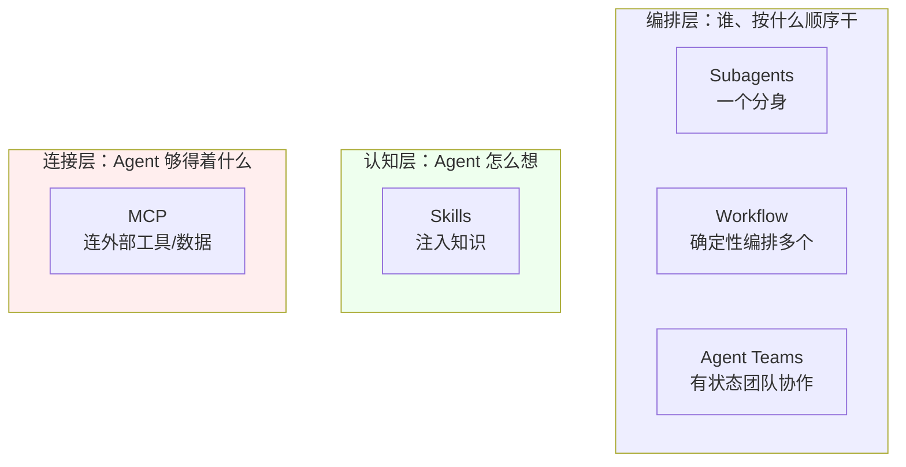
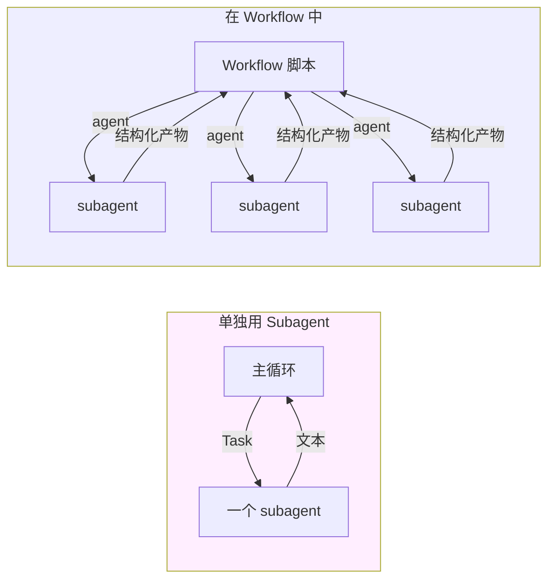
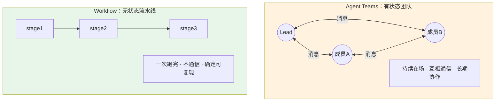
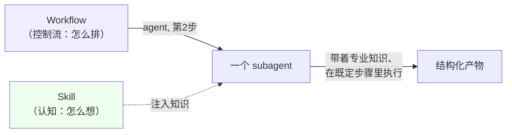
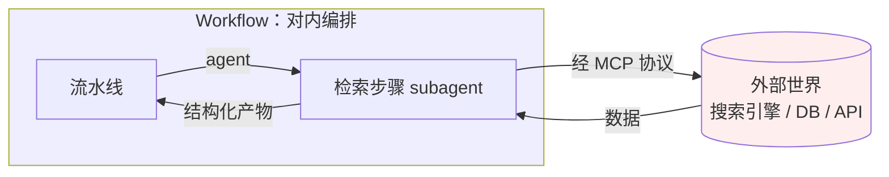
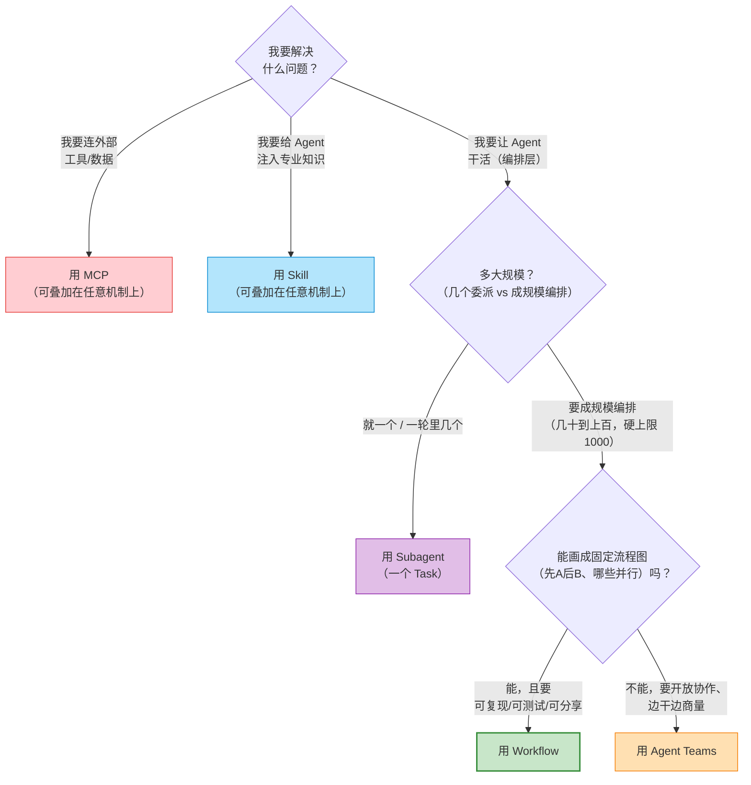
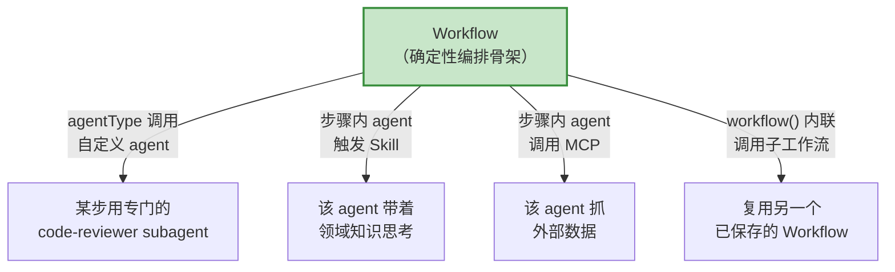

# 第 03 章 · 定位矩阵：五种扩展机制

> 上一章讲清了「为什么需要确定性编排」。但 Workflow 不是一座孤岛，它落在一个已经热闹起来的生态里：Subagents、Agent Teams、Skills、MCP，各干各的活儿。
>
> 新手最困惑的问题不是「Workflow 怎么用」，而是「**这么多机制，什么时候用哪个？它们之间会冲突吗？**」这一章用一张定位矩阵界定边界，然后说明一个更重要的事实：**它们是正交的、可组合的**。理解边界之后，才能有效地将它们叠加使用。

---

## 3.1 五个名字，五个不同的问题

五个主要机制逐一介绍，每个用一句话指出它**解决的核心问题**。这五个问题构成全章的骨架：

| 机制 | 它回答的问题 | 一句话定位 |
|---|---|---|
| **Subagents** | 「这一件事，能不能**派一个分身**去干、把结果拿回来？」 | 一次性 fork 出一个子 Agent，返回文本 |
| **Workflow** | 「**几十到上百个**分身，按什么顺序/并行/验证地干？」 | 用代码**按固定流程编排成规模的 subagent**（单 run 几十到上百、硬上限 1000） |
| **Agent Teams** | 「一群分身能不能**像团队一样长期协作、互相喊话**？」 | 有状态、可通信、长期协作的多 Agent |
| **Skills** | 「干这件事需要的**专门知识**，怎么按需喂给 Agent？」 | 按需注入的提示词知识包 |
| **MCP** | 「Agent 怎么**连上外部的工具和数据**？」 | 连接外部工具/数据源的协议 |

这五个问题分属三个完全不同的层面。宏观直觉先建起来，细节后面展开：

**为什么先分三层？** 真正容易混淆、需要做选择的，只有「编排层」内部的三个（Subagents / Workflow / Agent Teams）。Skills（认知层）和 MCP（连接层）与这三个**不在同一个维度上**，不存在二选一的关系，而是叠加使用。层次分清后，后续取舍才不会混乱。

---

## 3.2 Subagents：一次性的分身

### 它是什么

Subagent 是最小的单位：**主循环 fork 出一个子 Agent，分配一段任务，它独立执行后返回文本结果。** Claude Code 中通过 Task 工具派出的「子任务」，本质上就是一个 subagent。

特征明确：

- **一次性**：派出、执行、返回、结束。它不知道上一个 subagent 做了什么，下一个也不知道它的存在。
- **隔离上下文**：拥有独立的上下文窗口，这是它的核心价值。重度处理在它一侧完成，原始材料不需要传回主循环（对应第 02 章墙①）。
- **返回文本**：交回的是一段文本。

### 它和 Workflow 的关系：原子 vs 分子

这是最需要分清的一对。**Workflow 里 `agent()` 派出去的，正是一个 subagent。**

可以这么理解：

> **Subagent 是「原子」，Workflow 是「分子」。** 单独一个 subagent 解决的是「派一个分身干一件事」；Workflow 则用**代码**把一堆 subagent 拼成结构：并行、流水线、循环、验证、汇总。

第 01 章那个 `hello-workflow` 只派了**一个** agent，Workflow 退化成了「就一个 subagent」，编排的价值没显出来。它真正的舞台是**单 run 几十到上百个 subagent**（硬上限 1000）。官方的「何时使用」表拿**规模**当区分轴：Workflow 是「单 run 几十到上百个 agent」，subagent 则是「每轮就几个委派任务」。但**不必非得上百才划算**。本书后面很多例子就 3 个、6 个 agent（回看第 02 章的真实数据：parallel 3 个、pipeline 6 个 agent），照样把编排的价值跑出来了。它们是「小规模也能受益」的示范，不是 Workflow 的规模上限。

**什么时候只用 Subagent、不用 Workflow？** 只需要**派一个（或一轮中几个）分身去做一件相对独立的任务**时，比如「遍历这个目录并总结」「读这份长文档并提取要点」。一个 Task 子任务即可满足需求，套一层 Workflow 没有必要。**升级到 Workflow 的信号是：需要按结构调度的分身达到一定规模（单 run 几十到上百个，硬上限 1000），且彼此之间存在「顺序 / 并行 / 依赖 / 验证」关系。** 即使只有 3 个、6 个，只要这层结构关系成立，Workflow 同样值得使用。规模是它与 subagent 的区分轴。

---

## 3.3 Agent Teams：有状态的协作团队

### 它是什么

Agent Teams 由实验性标志 `CLAUDE_CODE_EXPERIMENTAL_AGENT_TEAMS` 门控，本书写作的会话环境中**该标志已开启**（见 `_grounding.md` A 节实测）。它采用一条**根本不同的协作路径**：

> 一组 Agent 组成一个**团队**：**有状态**、**可以互相通信**、进行**长期协作**。它们不是「派出后即结束」，而是像一个真实团队那样持续在场，通过消息传递分工和协调。

**本书的写作本身就运行在 Agent Teams 上。** 这一章是「织经」写作团队中一个特约作者 Agent 编写的，它通过消息机制与 team-lead 协调任务、汇报进度。这种「有状态 + 互相通信 + 长期在场」的工作模式，正是 Agent Teams 与一次性 subagent 的本质区别。

### 它和 Workflow 的关系：有状态团队 vs 无状态流水线

另一对**容易混淆**的概念，因为两者都涉及多个 Agent。但它们的内核恰好相反：

| 维度 | **Agent Teams** | **Workflow** |
|---|---|---|
| 状态 | **有状态**——成员持续在场，记得上下文 | **无状态**——脚本跑完即结束，不留团队 |
| 通信 | 成员之间**可互相通信**、喊话、协商 | subagent 之间**不通信**，只通过脚本变量传值 |
| 时间性 | **长期协作**，可持续多轮 | **一次性**流水线，一跑到底 |
| 控制方式 | 涌现式——成员各自决策、动态协调 | **确定性**——由代码精确规定顺序与并行 |
| 可复现性 | 协作过程依赖运行时动态，不保证复现 | 同脚本 + 同 args → 可复现（甚至缓存命中） |

一句话可以区分：

> **Agent Teams 像一个『长期在岗、随时沟通』的项目组**；**Workflow 像一条『照着图纸一次性跑完、不留人』的自动化流水线**。

### 怎么选

- **选 Workflow**：任务能画成一张「先做什么 → 再做什么 → 哪些并行」的**固定流程图**，而且你想要**可复现、可测试、可分享**。比如「分片审查 → 对抗复核 → 汇总」。
- **选 Agent Teams**：任务**开放、得随机应变、成员要边干边商量**，事先压根画不出一张流程图。比如「几个角色围着一个模糊需求一直讨论、动态分工往前推」（就像本书的写作）。

**不要把 Agent Teams 的开放协作模式强行放进 Workflow。** 如果任务中到处是「视情况而定」「成员之间需要边做边对齐」，用确定性脚本编排会非常不自然，这是 Agent Teams 的适用场景。反过来，一条结构固定、追求可复现的流水线，用 Agent Teams 运行，既浪费了「有状态团队」的能力，又丧失了确定性。**边界判断：流程图能固定 → Workflow；需要随机应变 → Agent Teams。**

---

## 3.4 Skills：注入的知识，改变 Agent「怎么想」

### 它是什么

Skills 是**按需注入的提示词知识包**。当某种任务出现时，对应的 Skill 会将一套专门知识（领域规范、方法论、推荐做法、操作步骤）**注入 Agent 的上下文**，改变它「**怎么想**」。

注意动词：Skill 改的是 Agent 的**认知**，不是它的**控制流**。它让 Agent 懂得多一点、想得专业一点，但**不决定**先做什么、后做什么。

### 它和 Workflow 的关系：怎么想 vs 怎么排

**正交性**的典型示例。第 01 章已经提到这一点，这里展开说明：

> **Skills 决定 Agent「怎么想」（认知）；Workflow 决定「按什么顺序做」（控制流）。** 一个管脑子里的知识，一个管步骤怎么衔接，它俩在两个不同的轴上，根本不冲突。

正因为正交，它们**可以叠加**。`agent()` 有一个 `agentType` 选项（`_grounding.md` B 节），可以让 subagent 使用自定义类型（如 `'Explore'`、`'code-reviewer'`）。一个携带特定 skill 的 Agent 在 Workflow 的某一步被派出时，**同时受 Workflow 的控制流调度，又带着 skill 注入的知识进行思考**。

Workflow 是**剧本**（规定第几幕、谁先上场、几条线并行）；Skill 是**演员的专业训练**（让演员演医生时真懂医学术语）。剧本不会因为演员更专业就改幕次，演员也不会因为剧本定死就忘了专业。两边各管各的，合起来才是一场好戏。

---

## 3.5 MCP：连接外部世界的协议

### 它是什么

MCP（Model Context Protocol）是**连接外部工具和数据源的协议**。它让 Agent 够得着自己之外的东西：数据库、搜索引擎、浏览器、公司内部 API。第 01 章已经说清楚：**MCP 是连接外部工具/数据源的协议；Workflow 是编排内部 subagent 的引擎。**

### 它和 Workflow 的关系：对外连接 vs 对内编排

这一对几乎不会被混淆，但仍值得用一句话明确方向：

> **MCP 是『朝外』的，把 Agent 连到外部世界；Workflow 是『朝内』的，把内部的 subagent 编排起来。** 一个解决「够得着什么」，一个解决「怎么组织自己人」。

它们同样**可组合**：Workflow 里的某个 subagent 完全可以在跑它那一步时调一个 MCP 工具去抓外部数据，再把结果当结构化产物交回流水线。比如一条「深度研究」流水线（第 13 章），「检索」步骤就让 subagent 通过 MCP 调搜索引擎。

---

## 3.6 决策矩阵：一表厘清五种机制

五种机制按关键维度横向排列，作为本章的速查表：

| 维度 | Subagents | **Workflow** | Agent Teams | Skills | MCP |
|---|---|---|---|---|---|
| **解决什么** | 派一个分身干活 | **确定性编排多个 subagent** | 有状态团队长期协作 | 注入领域知识 | 连接外部工具/数据 |
| **所属层面** | 编排层 | **编排层** | 编排层 | 认知层 | 连接层 |
| **Agent 数量/规模** | 每轮几个委派 | **单 run 几十到上百（硬上限 1000）** | 一个小团队（数个长期成员） | 不涉及 | 不涉及 |
| **状态** | 一次性 | **无状态** | 有状态 | 注入即生效 | 连接态 |
| **成员间通信** | 无 | **无（靠脚本变量传值）** | 有 | 不适用 | 不适用 |
| **控制方式** | 主循环直接派 | **确定性代码** | 涌现式协调 | 提示词注入 | 协议调用 |
| **可复现** | 单次 | **是（同脚本+args 可缓存）** | 否 | 是（知识固定） | 取决于外部 |
| **门控标志** | 内置 | `/config`「Dynamic workflows」行（所有付费档 + API/Bedrock/Vertex/Foundry 可用，Pro 须在此行手动开；`CLAUDE_CODE_WORKFLOWS` 仅 power-user env，非主开关。完整启用/关闭见 [p2-ops 操作面](#/zh/p2-ops)） | `..._AGENT_TEAMS` | 内置/技能系统 | MCP 配置 |
| **典型场景** | 探索/总结一件事 | **分片审查、对抗验证、流水线** | 开放式多角色协作 | 给某步注入专业规范 | 抓外部数据 |

> Workflow 的官方启用口径是 `/config` 的「Dynamic workflows」行（所有付费档及 API/Bedrock/Vertex/Foundry 均可用，Pro 须在此行手动打开；官方文档未声明 Max/Team/Enterprise 是否默认开，以自己 `/config` 里那一行的开关状态为准），不是某个环境变量。`CLAUDE_CODE_EXPERIMENTAL_AGENT_TEAMS` 才是门控 Agent Teams 的实验标志，本书写作会话中它和 `CLAUDE_CODE_WORKFLOWS=1` 都实测设着（`_grounding.md` A 节），但后者只是个 power-user 环境变量，并非官方启用开关。启用的两层模型和 0 成本探针在第 01 章 §1.5，完整的启用/关闭操作（含 `disableWorkflows` / `CLAUDE_CODE_DISABLE_WORKFLOWS`、组织级 managed settings）在 [p2-ops 操作面](#/zh/p2-ops)。

---

## 3.7 决策流程图：到底该用哪个

上述取舍编排成一棵决策树。遇到任务时从顶部向下走，落到哪个叶子节点就使用对应的机制：

关键分叉在最后那一问：**能不能画成固定流程图**。

- **能画死** → Workflow。比如「五维审查 → 逐条复核 → 去重汇总」，每一步都明确，顺序和并行都定死了。
- **画不死** → Agent Teams。比如「几个角色围着一个模糊目标一直讨论、看进展随时动态分工」。

**最常见的两个误判：**

1. **一看到「多个 Agent」就想到 Agent Teams。** 这是错误的。多个 Agent 但**流程是固定的**，应该用 Workflow。Agent Teams 的前提是「需要有状态的互相通信、随机应变」。
2. **把「Workflow / Skill / MCP」当成三选一。** 这也是错误的。它们不在同一维度上，**不是互斥关系**。一个 Workflow 步骤里的 subagent 完全可以同时携带 Skill 的知识并调用 MCP 的工具。下一节专门说明这一点。

---

## 3.8 诚实地说：它们是正交的、可组合的

前面为了界定边界，五种机制分开讨论。但实际应用中最有效的用法恰恰是**将它们叠加使用**。需要明确补充一点：**这些机制不是互相竞争的，而是正交、可组合的**。理解边界的目的是更好地组合，而非二选一。

Workflow 处在编排层的中心，天生就是其他机制的**载体**：

每个组合点都有 API 依据（`_grounding.md` B 节）：

- **Workflow + 自定义 Agent**：`agent()` 的 `agentType` 选项可以指定 subagent 类型（比如 `'Explore'`、`'code-reviewer'`），而且**可与 schema 组合**，既用专门 agent，又强制结构化输出。
- **Workflow + Skill**：被 Workflow 派出去的 subagent，在跑它那一步时可以触发 / 携带 skill 的知识。Workflow 管「这一步什么时候做」，skill 管「这一步怎么想得专业」。
- **Workflow + MCP**：流水线里某个 subagent 在执行时，通过 MCP 够到外部数据（比如「深度研究」的检索步骤）。
- **Workflow + Workflow**：`workflow(name, args?)` 可以内联调用另一个已保存的具名工作流（**嵌套仅一层**，子工作流里再调会抛错），让验证过的流水线变成可复用的积木。这是第五部「构建你自己的库」和第 20 章「嵌套 Workflow」的基础。

总结：

> **Workflow 是编排层的骨架；Skill 为骨架上的每个节点注入专业判断，MCP 让节点能够访问外部世界，自定义 agentType 使节点成为对口的专家。** 这些机制协同工作，而非相互竞争。

**这正是「织经」隐喻在生态层面的回响。** Workflow 是经线（确定的结构骨架），Skill / MCP / 自定义 agent 则是在其间穿梭的纬线（每一步的智能与连接）。五种机制不是五选一的单选题，而是一套可以经纬交织的工具箱（隐喻出处见 [前言](#/zh/00-preface)）。

---

## 3.9 本章小结

- 五种扩展机制分属三层：**编排层**（Subagents / Workflow / Agent Teams）、**认知层**（Skills）、**连接层**（MCP）。会混、要取舍的，只在编排层内部。
- **Subagents vs Workflow**：原子 vs 分子，区分轴是**规模**。每轮派几个分身 → Subagent；要把分身按顺序/并行/验证成规模地组织起来（单 run 几十到上百、硬上限 1000）→ Workflow。哪怕只编排 3、6 个也能受益，规模是上限，不是门槛。
- **Workflow vs Agent Teams**：无状态的确定性流水线 vs 有状态、能通信的团队。**流程图能画死 → Workflow；要开放协作、随机应变 → Agent Teams**。Workflow 的官方启用是 `/config`「Dynamic workflows」行（详见本节上方的门控脚注与 [p2-ops 操作面](#/zh/p2-ops)）；Agent Teams 由实验标志 `..._AGENT_TEAMS` 门控，本机已开。
- **Skills**（怎么想）和 **MCP**（够得着什么），跟 Workflow（按什么顺序做）是**正交**的，谈不上二选一，是叠加上去用的。
- 最强用法是**组合**：拿 Workflow 当骨架，用 `agentType` 调专家 agent、步骤内 agent 触发 skill / 调 MCP、`workflow()` 内联复用子流程（嵌套仅一层）。
- 一句话边界：**能画成「先做什么 → 再做什么 → 哪些并行」的流程图，就用 Workflow；开放式对话、随机应变，那就不是它的主场。**

认知篇三章至此完成：Workflow **是什么**（第 01 章）、**为什么需要它**（第 02 章），以及它在生态中的**定位**（本章）。第二部「基础篇」开始从零运行第一个 Workflow。

> 继续阅读：[第 04 章 · 第一个 Workflow](#/zh/p2-04)
