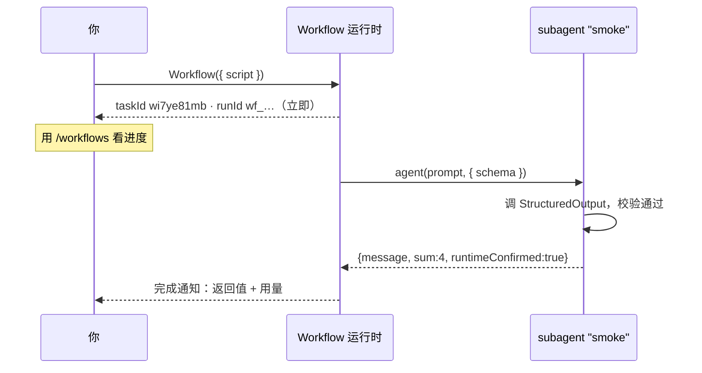
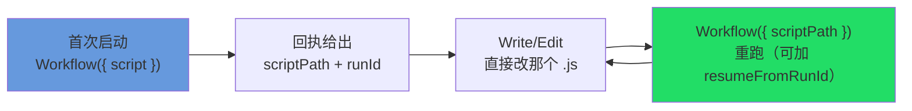

# 第 04 章 · 第一个 Workflow

> 本章从「确认环境」走到「跑通并读懂第一个 Workflow」，把启动、异步、进度、迭代这套流程完整走一遍。每一步都用**真实运行**的输出对照。

---

## 4.1 前置：先确认「能用」

第 01 章 §1.5 把这件事拆成了「能用 / 会用」两层。开始之前，先确认「能用」这层。

**开启与关闭。** Dynamic workflows 目前是 research preview（研究预览），需要 Claude Code v2.1.154 或更高版本。本书核心实测在 v2.1.156（触发词改名一项在 v2.1.160 复核）。运行 `claude --version` 确认版本，低于要求则先升级。本书的运行跨 v2.1.150 到 v2.1.160，v2.1.156 上复核仍然成立。所有付费计划都能用，也支持 Anthropic API 以及 Amazon Bedrock、Google Cloud Vertex AI、Microsoft Foundry。

- **怎么开**：**所有付费计划**（Pro、Max、Team、Enterprise）都能用。**Pro 计划**要在 `/config` 里找到「Dynamic workflows」那一行手动打开。官方文档**没说其余计划（Max/Team/Enterprise）默认是开还是关**，不要假设它们已经开好了，到 `/config` 里看同一个开关确认。
- **怎么关**（下面任选一种，都会一直生效）：在 `/config` 里关掉；或在 `~/.claude/settings.json` 写 `"disableWorkflows": true`；或设环境变量 `CLAUDE_CODE_DISABLE_WORKFLOWS=1`（启动时读取）。
- **整个团队/组织一起关**：在 managed settings 里写 `"disableWorkflows": true`，或用 Claude Code 管理后台的开关。
- 关掉之后：bundled 命令（如 `/deep-research`）用不了，prompt 里的 `ultracode` 触发关键词失效，`/effort` 菜单里的 ultracode 挡位也会消失。

<div class="callout info">

**关于 `CLAUDE_CODE_WORKFLOWS=1`。** 这是一个真实存在的环境变量，本书的测试环境里设置了它，但它**不是官方文档给的开启方式**。官方只把 `/config` 当作开启路径，记录在案的环境变量也只有**关闭**用的那一个。`CLAUDE_CODE_WORKFLOWS=1` 不是「必须设才能用」的前置条件，而是一个底层观测开关。本书 R11 复核会话里用 `printenv` 实测过：它确实在、值就是 `1`，而且 Workflow 工具可用。

```text
CLAUDE_CODE_WORKFLOWS = 1
```

</div>

<div class="callout tip">

**两个零成本的确认方法。** 第一个：在对话里输入「ultracode：跑个最小 workflow 确认运行时」。消息中包含 `ultracode` 一词，Claude 会调用 Workflow 工具——如果已开启则正常运行，未开启则会提示工具不可用。第二个：输入 `/effort`，查看选项中是否存在 `ultracode` 一格，存在则说明 workflow 已经「能用」（原理见 §1.6）。

</div>

至于「会用」：想让 Claude **默认就主动**编排，可以 `/effort ultracode` 一次设定、当前会话常驻（细节见第 01 章 §1.6）。本章的脚本都直接调 Workflow 工具来跑，不依赖这个常驻设定。

<div class="callout tip">

**「写脚本」不需要手动编写，Claude 会代为生成。** 用自然语言把需求说清楚就行，例如「跑个 workflow 把这仓库的 TODO 扫一遍归类」，Claude 会生成编排脚本；要更明确地点名让它编排，就在消息里带上 `ultracode` 关键词。运行前会弹出一次审批提示，确认即可；不确定时点 `View raw script` 查看原文。运行完成且满意后，按一个键即可**存成一条 `/` 命令**，下次直接复用。本章下面的脚本只需**读懂**，实际操作时由 Claude 生成、你审核、你保存。终端操作细节（审批的 4 个选项、按 `s` 存命令）在[《官方操作面板》](#/zh/p2-ops)有完整演示；本章专注「脚本本身的结构、怎么读懂它、怎么迭代它」。

</div>

---

## 4.2 Hello, Workflow

下面是本书第一个真实运行过的脚本。它只做一件事：派出一个 subagent，让它返回一份结构化的「运行确认」。

```javascript
export const meta = {
  name: 'hello-workflow',
  description: 'Smoke test: one subagent returns schema-constrained structured output',
  phases: [{ title: 'Greet', detail: 'One subagent confirms the runtime' }],
}

phase('Greet')
const r = await agent(
  'You are a smoke test for the Claude Code Workflow runtime. Return a one-sentence ' +
  'confirmation message, the integer value of 2+2, and a boolean confirming you ran ' +
  'as a workflow subagent.',
  {
    label: 'smoke',
    schema: {
      type: 'object',
      properties: {
        message: { type: 'string' },
        sum: { type: 'number' },
        runtimeConfirmed: { type: 'boolean' },
      },
      required: ['message', 'sum', 'runtimeConfirmed'],
    },
  }
)
log(`smoke result: ${JSON.stringify(r)}`)
return r
```

逐行说明（呼应第 01 章的「经纬」）：

| 行 | 作用 |
|---|---|
| `export const meta = {…}` | **经线**：静态字面量（static literal），写明名称、描述、阶段。运行时开跑前先静态读它一遍。 |
| `phase('Greet')` | 切到「Greet」阶段，后面派的 agent 在进度树里都归到这一组。 |
| `agent(prompt, { schema })` | **纬线**：派一个 subagent 出去，`schema` 强制它返回一个已验证的结构化对象。 |
| `log(...)` | 输出一行进度信息。 |
| `return r` | 工作流的最终返回值，出现在完成通知中。 |

<div class="callout warn">

**这是 Workflow 脚本，不是 Node 脚本——新手最常踩的第一个坑。** `meta`/`phase`/`agent`/`log`/`budget`/`args` 都是 Workflow **运行时注入的全局符号**（`_grounding.md` B 节：「运行时注入，无需 import」）。如果把这段代码保存为 `hello.js` 再用 `node hello.js` 执行，Node 没有这些全局符号，会直接抛出 `ReferenceError: phase is not defined`。**Windows、macOS、Linux 三平台表现一致**：这与操作系统无关，原因是 Node 没有 Workflow 运行时层。脚本只能在**工作流可用的 Claude Code 会话里**运行，由 Claude 调用内置 Workflow 工具执行。如何确认「可用」以及官方开启方式，见 §4.1 和 [第 01 章 §1.5](#/zh/p1-01)。触发方式：消息中包含 `ultracode` 一词即可（见 §4.1）。本书实测以此方式跑通：runtime 确认、schema 强制 `sum=4` 为**数字**、约 2.6 万 token / 约 5.5 秒（真实回执和用量见 4.3、4.4）。

</div>

---

## 4.3 启动：你会立刻拿到一个回执

脚本提交给 Workflow 工具后，它**不会等待执行完成**，而是立即返回一张回执。以下是真实输出：

```text
Workflow launched in background. Task ID: wi7ye81mb
Summary: Smoke test: one subagent returns schema-constrained structured output
Transcript dir: ...\subagents\workflows\wf_dacbd480-d5d
Script file: ...\workflows\scripts\hello-workflow-wf_dacbd480-d5d.js
Run ID: wf_dacbd480-d5d
You will be notified when it completes. Use /workflows to watch live progress.
```

这张回执对应 `_grounding.md` B 节中 `WorkflowOutput` 的各字段。逐一对照如下：

| 回执里看到的 | `WorkflowOutput` 字段 | 含义 / 用途 |
|---|---|---|
| `Task ID: wi7ye81mb` | `taskId: string` | 后台任务的句柄（可以配合 TaskStop 把它停掉）。 |
| `Run ID: wf_dacbd480-d5d` | `runId?: string` | 这次运行的标识，**断点续传得靠它**（仅限同一 session，退出即从头跑；第 22 章）；`remote_launched` 时没这一项。 |
| `Script file: ...js` | `scriptPath?` | 你的脚本被**写到了磁盘上**，这是迭代的关键（见 4.5）。 |
| `Transcript dir: ...` | `transcriptDir?` | subagent 完整执行记录所在的目录。 |
| `Summary: Smoke test...` | `summary?` | 回显的那行摘要（也就是 `meta.description`）。 |

<div class="callout info">

**回执的 `status` 只有两种取值。** 按 `_grounding.md` B 节，`WorkflowOutput.status` 只有 `"async_launched" | "remote_launched"`，没有第三种，也**没有**表示「已完成」的同步状态。本地运行为 `async_launched`（本次即是），在 CCR 远端运行则为 `remote_launched`（此时没有 `runId`，续传句柄改用返回的 session URL）。语法检查未通过时，返回会额外携带一个 `error` 字段（见 4.7）。理解这一点后就不会期望「调用一次 Workflow 就能直接拿到结果」。

</div>

<div class="callout info">

**为什么做成异步？** 一个工作流可能并行派发几十个 subagent，运行几分钟甚至更久。异步设计使得启动后可以继续其他工作，完成后收到通知即可。核心要点：**Workflow 工具返回的是一张「已启动」回执，不是结果**。真正的结果在完成通知中。

</div>

---

## 4.4 进度与完成

启动后，斜杠命令 **`/workflows`** 会显示一棵**实时进度树**：当前处于哪个 phase（来自 `meta.phases` 和 `phase()`）、哪些 agent 在运行、哪些已完成（叶子节点的名字来自每个 `agent()` 的 `label`）。这是「启动之后、通知之前」这段时间里的观察窗口，一个持续刷新的进度面板。`phase`/`log`/`/workflows` 三者的配合是第 09 章的专题。

等工作流真正跑完，你会收到一条**完成通知**。`hello-workflow` 的真实完成通知，返回值是这段：

```json
{
  "message": "The Claude Code Workflow runtime smoke test executed successfully as a workflow subagent.",
  "sum": 4,
  "runtimeConfirmed": true
}
```

再附上一份真实用量：

```text
agent_count = 1   tool_uses = 1   total_tokens = 26338   duration_ms = 5506
```

解读：

- `sum` 是数字 `4`，**不是**字符串 `"4"`。因为 schema 中声明了 `type: 'number'`，校验层确保了类型正确（这是结构化输出的作用，详见第 07 章）。
- 最简单的一次 agent 往返约 **5.5 秒 / 2.6 万 token**。以此作为基线单位，可以估算更大规模工作流的开销。



---

## 4.5 迭代流程：脚本即文件

脚本已经写入磁盘（即回执中的 `Script file` / `WorkflowOutput.scriptPath`），因此迭代一个工作流不需要每次重新发送整段代码。由此产生一个**「修改磁盘文件 + `scriptPath` 重跑」的迭代流程**：



拿到回执里的 `Script file` 路径之后，每一轮迭代就是这两步：

1. 用 `Write`/`Edit` 直接改那个 `.js` 文件；
2. 用 `{ scriptPath: "<那个路径>" }` 重新调一次 Workflow（`scriptPath` 优先级高于 `script`/`name`）。

如果还需要复用上次的**中间结果**（避免重复消耗 token），可以加上 `resumeFromRunId`：

```javascript
// 改完脚本后，断点续传重跑：未改动的 agent() 调用秒级返回缓存结果
Workflow({ scriptPath: ".../hello-workflow-wf_dacbd480-d5d.js", resumeFromRunId: "wf_dacbd480-d5d" })
```

「同样的脚本 + 同样的 args → 100% 缓存命中」。这也正是脚本里禁用 `Date.now()` / `Math.random()` 的原因（它们会破坏可重放性）。

注意：`resumeFromRunId` **只在同一个 session 内有效**。退出 Claude Code 后，缓存随 session 一起失效；下次进入时，这个工作流会**从头运行**，不会接续之前的进度。续传是「同会话内」的能力，不支持跨重启。续传的细节见第 22 章。

---

## 4.6 让它稍微大一点：两个 agent

把 hello 扩成「两个并发 agent + 一句汇总」，顺手体会一下 `parallel()`：

```javascript
export const meta = {
  name: 'hello-parallel',
  description: 'Two concurrent agents, then a one-line summary',
  phases: [{ title: 'Ask', detail: 'Two agents in parallel' }],
}

phase('Ask')
const [a, b] = await parallel([
  () => agent('In one sentence: what is a barrier in concurrency?', {
    label: 'q-barrier',
    schema: { type: 'object', properties: { answer: { type: 'string' } }, required: ['answer'] },
  }),
  () => agent('In one sentence: what is a pipeline in concurrency?', {
    label: 'q-pipeline',
    schema: { type: 'object', properties: { answer: { type: 'string' } }, required: ['answer'] },
  }),
])
log('both answers in')
return { barrier: a?.answer, pipeline: b?.answer }
```

`parallel()` 接收的是一个 **thunk 数组**（`() => …`），不是 Promise 数组。这是新手常见的错误，第 08 章会详细说明。

> 上面这段 `hello-parallel` 只是**示意**（未单独实跑）；它依赖的 `parallel()` 到底怎么跑，已经由第 08 章的 `parallel-demo`（Run `wf_52957913-6d2`）验证过了。

---

## 4.7 新手最常见的四个错

第一次写 Workflow，以下几个错误出现频率很高。逐一说明错误表现和正确写法。

**① `meta` 不是静态字面量（包括「在 `meta` 里算值」）。** `meta` 必须是静态字面量（static literal），运行时在**静态解析阶段**就读取它，任何变量引用、函数调用、展开、模板插值都会导致拒绝启动。新手常见的做法是在 `meta` 里计算值（比如拼接名字、按日期生成描述），但这正是出错最多的地方：

```javascript
// ✗ 错：变量引用 + 模板插值 + 函数调用，全是「计算」
const NAME = 'x'
export const meta = { name: NAME, description: `run ${NAME} at ${Date.now()}` }
// ✓ 对：静态字面量，一个字一个字写死
export const meta = { name: 'x', description: 'run x' }
```

**② schema 漏了 `required` 字段。** 传 `schema` 时，除了 `properties` 之外，还需要在 `required` 中列出**必须出现**的字段。否则模型可能合法地省略该字段，下游 `r.sum + 1` 就会得到 `undefined`：

```javascript
// ✗ 错：声明了 sum，却没把它列进 required —— 模型可以不返回它
schema: { type: 'object', properties: { sum: { type: 'number' } } }
// ✓ 对：required 钉死「这个字段一定要有」
schema: { type: 'object', properties: { sum: { type: 'number' } }, required: ['sum'] }
```

**③ 把它当同步调用，以为「调完就能拿到结果」。** 这是最常见的认知错误。Workflow **始终异步**：调用会立即返回一张回执（`status` 只会是 `async_launched`/`remote_launched`，见 4.3），结果在**完成通知**中。任何「`const result = Workflow(...)` 然后立刻使用 `result.sum`」的写法都是错误的，因为此时 `result` 只是回执，不是产物。

**④ 语法错误。** 脚本语法检查未通过时，`WorkflowOutput` 会携带 `error` 字段说明错误位置，工作流**不会启动**。应先在本地确保脚本语法正确，再提交。

<div class="callout warn">

**不要在脚本中使用 `Date.now()` / `Math.random()` / 无参 `new Date()`。** 它们会破坏可重放性，导致续传缓存失效（见 4.5）。这条禁令通过**两层**机制执行（提交期源码扫描 + 运行时陷阱），即使写在注释或字符串中也会被拦截，`try/catch` 无法捕获。两层的完整机理、报错原文、以及关于绕过/捕获的误区，集中在 [App B 的 B.5 / B.19](#/zh/app-b)，因果链见 [第 22 章](#/zh/p4-22)。替代写法：需要时间戳时用 `args` 从外部传入，需要随机性时用 agent 的下标 `index` 来变化提示词。

</div>

---

## 4.8 本章小结

- 先确认工作流在当前会话中可用：**所有付费计划**都支持，Pro 需要在 `/config` 的 "Dynamic workflows" 行手动打开。官方文档没说其余计划的默认状态，应在 `/config` 中查看开关（关闭三法见 §4.1）。`CLAUDE_CODE_WORKFLOWS=1` 只是一个底层观测开关，不是官方开启路径（两层见 [§1.5](#/zh/p1-01)）。不确定时可以让 Claude 运行一个最小工作流来确认。
- 它是 **Workflow 脚本，不是 Node 脚本**：`meta`/`phase`/`agent`/`log` 都是运行时注入的全局，`node hello.js` 会在三平台一致地报 `phase is not defined`，只能由 Claude 在工作流可用的会话里跑。
- 启动 Workflow **当场返回回执**（`WorkflowOutput`：`taskId`/`runId`/`scriptPath`/`transcriptDir`；`status` 只有 `async_launched`/`remote_launched`），结果在**完成通知**里；用 `/workflows` 看实时进度。
- 真实基线：单 agent 约 5.5s / 2.6 万 token；`schema` 保证返回类型（`sum` 是数字 4，不是字符串）。
- 迭代靠「脚本即文件」这个流程：改盘上的 `.js` + `scriptPath` 重跑，加 `resumeFromRunId` 复用缓存。
- 官方流程的**收尾**：跑通一个满意的 run，在 `/workflows` 视图里按 `s` 就能把它**存成一条 `/` 命令**，下次直接复用。对新手来说，「构建你自己的 workflow」最自然的入口就是这条（怎么积累成一个库见 [第 25 章](#/zh/p5-25)）。
- 新手四坑：① 在 `meta` 里算值（必须是静态字面量）；② schema 漏了 `required`；③ 把它当同步调用、以为立刻就能拿到结果；④ 语法错误，进 `error` 字段、不启动。

<div class="callout tip">

**构建自己的 workflow · 6 步。** 这条主线分布在全书各处，以下是一份完整的步骤索引：

| 步 | 做什么 | 去哪学 |
|---|---|---|
| ① | 跑通第一个 | 本章 |
| ② | 学审批与保存按键 | [《操作面板》§6](#/zh/p2-ops) |
| ③ | 从零创作 | [第 27 章](#/zh/p6-27) |
| ④ | 调试 | [第 28 章](#/zh/p6-28) |
| ⑤ | 收进库中 | [第 25 章](#/zh/p5-25) |
| ⑥ | 用 `{ name }` 复用 | 本章 |

</div>

基础篇至此，已经覆盖了跑通、读懂、迭代一个 Workflow 的完整流程。接下来三章（05/06/07）分别深入经线（`meta`/`phase`）、纬线核心（`agent()`）和结构化输出（`schema`），第 08 章则确立并发模型。

> 运行之后如何查看进度、如何停止、如何按 `s` 将满意的 run 存为 `/` 命令？终端操作的完整说明见[《官方操作面板》](#/zh/p2-ops)。

> 继续阅读：[第 05 章 · meta 与 phase：经线](#/zh/p2-05)
