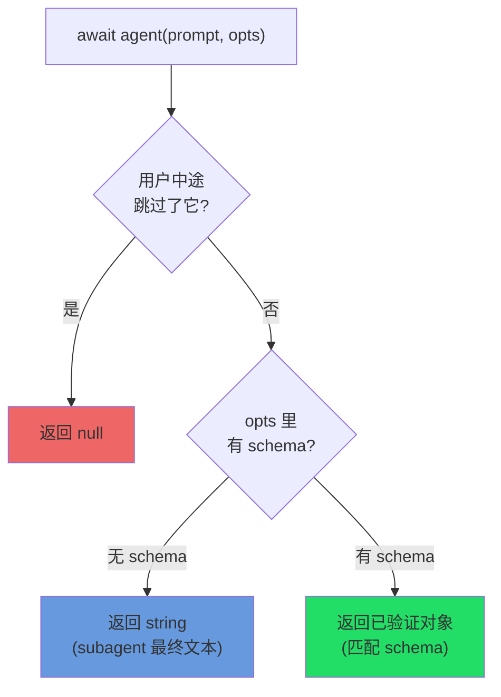
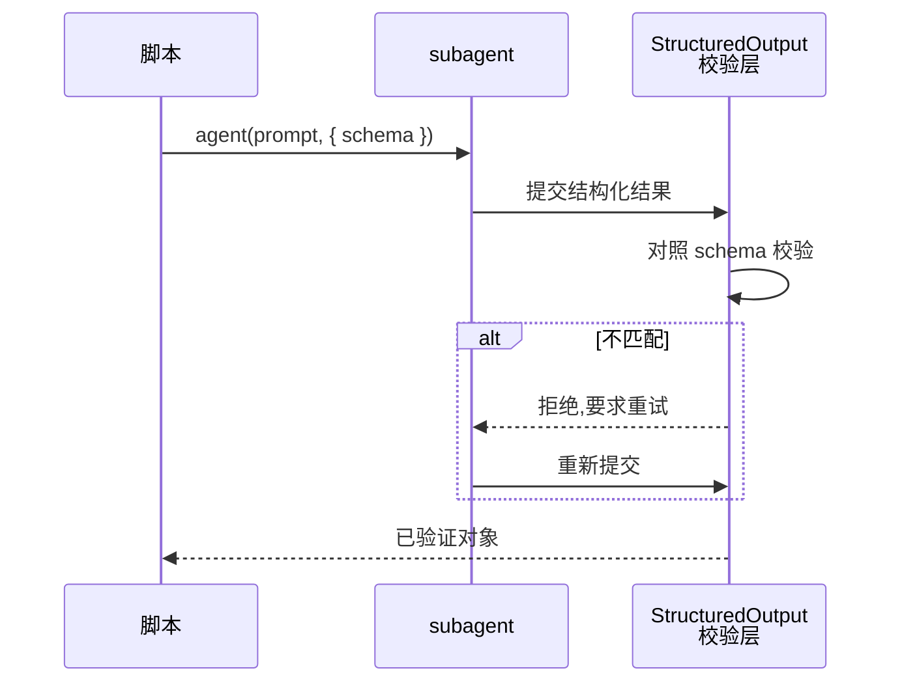
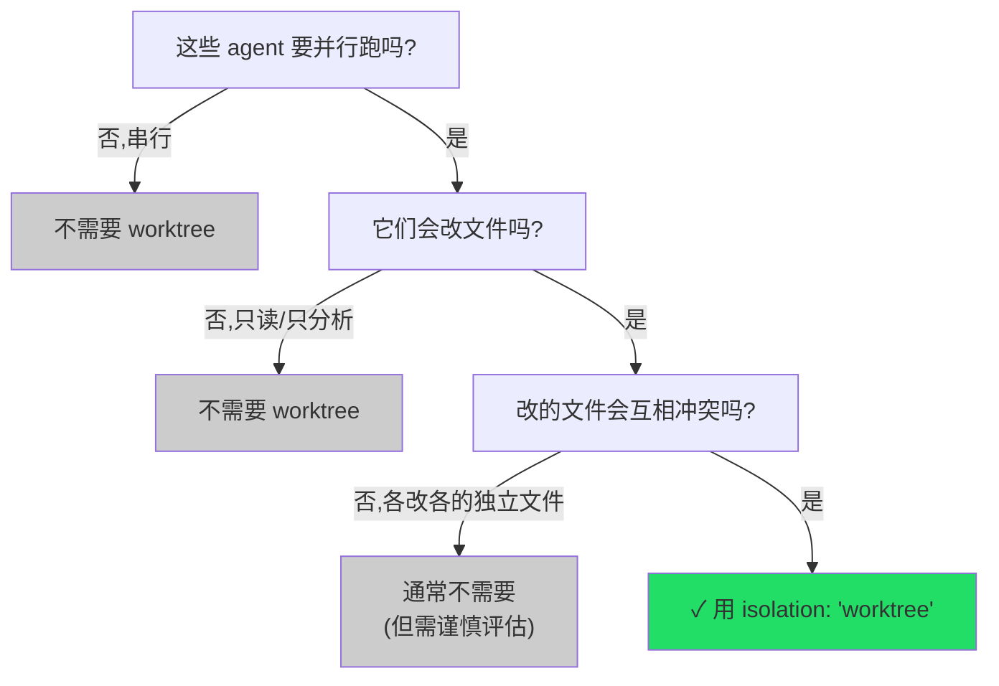
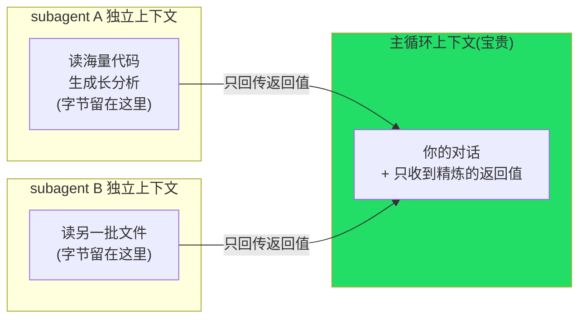

# 第 06 章 · agent() 完全指南

> **纬者,织之横丝也;穿经而行,成文成章。**
>
> 经线张好了，真正让布「长出花纹」的，是来回穿梭的纬线。Workflow 里的纬线就是 `agent()`：派一个 subagent 执行一项具体任务，等它完成，把产物交回编排脚本。
>
> 上一章拆解了 `meta` 和 `phase()` 的结构骨架。这一章聚焦 `agent(prompt, opts)`：它的返回值（文本、对象还是 `null`），每个选项（`label`、`schema`、`phase`、`model`、`isolation`、`agentType`）各自解决什么问题，以及它派出的 subagent 为什么能**保护主循环的上下文**。
>
> 这是全书使用频率最高的函数。理解它之后，后续所有实战配方都只是它的不同编排。

---

## 6.1 签名与全貌：一句话，两个参数

据 `_grounding.md` B 节，对照官方类型定义，`agent()` 的签名：

```javascript
agent(prompt: string, opts?: object): Promise<any>
```

- 第一个参数 `prompt` 是一段字符串，告诉 subagent 要做什么。
- 第二个参数 `opts` 是可选的选项对象，用来调这个 agent 的行为。
- 返回一个 `Promise`，你 `await` 它，就拿到 subagent 的产物。

`opts` 的全部字段先列一张总表，本章逐一展开：

| 选项 | 类型 | 一句话作用 | 本章小节 |
|---|---|---|---|
| `label` | string | 进度树里的显示名(不传则自动编号) | 6.3 |
| `schema` | JSON Schema | 强制结构化输出,返回**已验证对象** | 6.4 |
| `phase` | string | 显式归入某进度组(并发场景必备) | 6.5 |
| `model` | string | 覆盖该 agent 的模型(省略则继承主循环) | 6.6 |
| `isolation` | `'worktree'` | 在独立 git worktree 中运行(**昂贵**) | 6.7 |
| `agentType` | string | 用自定义 subagent 类型(如 `'Explore'`) | 6.8 |

一个最小的、不带任何选项的调用如下:

```javascript
const text = await agent('用一句话总结什么是确定性编排')
```

它派出一个 subagent，执行完成后返回**一段文本**。这是 `agent()` 最基本的形态。下面先明确返回类型，因为返回类型决定了后续代码的写法。

---

## 6.2 返回语义：文本、对象，还是 null？

`agent()` 的返回值有**三种**可能，取决于调用方式和用户响应。混淆这三种返回值会导致后续的 `.filter()`、解构、`JSON.parse` 出错。据 `_grounding.md` B 节，规则如下：



### 6.2.1 无 schema → 返回文本（string）

不传 `schema`，`agent()` 就返回 subagent 的**最终文本**，一个字符串。

```javascript
const summary = await agent('用一句话概括这个函数的作用:\n' + codeSnippet)
// summary 是一个 string,例如:"该函数对输入数组去重后按字典序排序并返回。"
log(summary)
```

这适合只需要自然语言结果的场景：总结、解释、起草文字。返回值就是 subagent 输出的最终文本。

### 6.2.2 有 schema → 返回已验证对象

传入 `schema`（一个 JSON Schema），`agent()` 就返回一个**已经过校验的对象**，严格匹配你声明的结构。这是第 01 章 `hello-workflow` 的真实例子（Run ID `wf_dacbd480-d5d`）：

```javascript
const r = await agent(
  'Return a one-sentence confirmation message, the integer value of 2+2, ' +
  'and a boolean confirming you ran as a workflow subagent.',
  {
    label: 'smoke',
    schema: {
      type: 'object',
      properties: {
        message: { type: 'string' },
        sum: { type: 'number' },
        runtimeConfirmed: { type: 'boolean' },
      },
      required: ['message', 'sum', 'runtimeConfirmed'],
    },
  }
)
```

**真实返回值**：

```json
{
  "message": "The Claude Code Workflow runtime smoke test executed successfully as a workflow subagent.",
  "sum": 4,
  "runtimeConfirmed": true
}
```

`sum` 是数字 `4`，**不是字符串 `"4"`**，因为 schema 声明了 `type: 'number'`，校验层强制了类型正确。可以直接 `r.sum + 1` 做算术，无需解析或容错。这套机制（以及它在工具调用层如何强制重试）是第 07 章的主题。这里只需记住：**有 schema 时，返回的是一个可以直接解构、直接计算的干净对象。**

### 6.2.3 用户跳过 → 返回 null

最容易被漏掉的情况：**用户在执行中途跳过了这个 agent**（比如在交互里选择略过某一步），`agent()` 返回 `null`。

据 `_grounding.md`：「用户中途跳过该 agent → 返回 `null`（用 `.filter(Boolean)` 过滤）」。

这就是为什么本书所有 `parallel()` / `pipeline()` 的真实示例，在用结果前几乎都跟着一个 `.filter(Boolean)`：

```javascript
const results = await parallel(/* ... */)
return results.filter(Boolean)   // 滤掉被跳过的 null
```

`.filter(Boolean)` 是惯用法：`Boolean` 当过滤函数，剔掉数组里所有假值（`null`、`undefined`、`0`、`''`、`false`）。这里它**把被跳过的 `null` 项清掉**，只留下有结果的项。

<div class="callout warn">

**不 `.filter(Boolean)` 就直接用，会被 `null` 引发错误。** 如果写 `results.map(r => r.findings)`，而其中某个 `r` 是 `null`，就会抛 `Cannot read properties of null`。建议养成习惯：**凡是 `parallel` / `pipeline` 的结果，用之前先 `.filter(Boolean)`。** 单个 `await agent(...)` 也一样：如果可能被跳过，用前先判断 `if (r) { ... }`。

</div>

### 6.2.4 三种返回值速查

| 你怎么调 | 用户响应 | 返回值 | 怎么用 |
|---|---|---|---|
| 无 `schema` | 正常 | `string` | 当文本用,或再喂给下一个 agent |
| 有 `schema` | 正常 | 已验证对象 | 直接解构/计算,无需解析 |
| 任意 | 跳过 | `null` | `.filter(Boolean)` 或 `if (r)` 兜住 |

---

## 6.3 `label`：进度树里的名字

`label` 是最简单的选项：改这个 agent 在 `/workflows` 进度树里的**显示名**。不传，运行时自动编号（如 `agent #3`）；传了，树上显示你给的标签。

```javascript
await agent('审查 auth.ts 的权限校验逻辑', { label: 'review:auth' })
```

纯粹**供人阅读**，不影响执行行为。但在并行派发几十个 agent 的工作流里，好的 `label` 决定了能否快速读懂进度树，而不是面对一堆 `agent #1...#40` 无从分辨。

真实运行 `parallel-demo`（Run ID `wf_52957913-6d2`，见 `assets/transcripts/primitives.md`）将维度名嵌入 label，使三个并发 agent 在树上清晰可辨：

```javascript
const dims = ['naming', 'error-handling', 'comments']
const results = await parallel(
  dims.map((d, i) => () =>
    agent(`Name one common ${d} code smell in exactly one sentence.`, {
      label: `smell:${d}`,        // ← smell:naming / smell:error-handling / smell:comments
      schema: { /* ... */ },
    })
  )
)
```

<div class="callout tip">

**label 的实用模式：`类型:实例`。** 像 `review:auth.ts`、`smell:naming`、`verify:race-condition` 这样用「前缀 + 冒号 + 具体对象」来命名，进度树会自然按前缀聚成分组，一眼即可区分哪些是 review、哪些是 verify、各自的进度如何。`assets/transcripts/primitives.md` 的三个真实运行（`smoke` / `smell:*` / `find:* / verify:*`）都采用了这个模式。

</div>

`label`（显示名）和上一章的 `phase`（归到哪个分组）是两件正交的事：`label` 决定**叶子上写什么字**，`phase` 决定**叶子挂在哪根树枝上**。下一节就讲 `phase`。

---

## 6.4 `schema`：把 agent 变成「结构化数据源」

`schema` 是 `agent()` 最重要的选项，也是 Workflow 区别于「手动开子任务」的关键：它让 subagent 的产物变成**程序可消费的结构化数据**，而不是一段自由文本。返回效果 6.2.2 已经展示过，这里说明它的**作用机制**和**适用场景**。

### 6.4.1 它做了什么：在工具调用层强制校验

据 `_grounding.md` B 节：

> 有 `schema`(JSON Schema)→ 强制 subagent 调 `StructuredOutput` 工具,**在工具调用层校验**,返回**已验证对象**;不匹配则模型重试。

拆开看：

1. 你传一个 JSON Schema 给 `agent()`。
2. 运行时**强制** subagent 通过内部的 `StructuredOutput` 工具交付结果，而不是写自由文本。
3. subagent 提交的结构在**工具调用层**被校验是否匹配 schema。
4. **不匹配就被要求重试**，直到合规。
5. 你 `await` 拿到的，是一个**保证匹配 schema** 的对象。



**无需编写任何解析代码或容错分支，就能从语言模型获得类型安全的结构化数据。** 没有 schema 的情况下，需要让模型输出 JSON，然后自行 `JSON.parse`、自行 `try/catch`、自行处理「模型多输出一句话导致 JSON 解析失败」的问题。schema 把这些工作全部交给了运行时。

### 6.4.2 最小示例

```javascript
const result = await agent('分析这段代码的圈复杂度,给出数值和一句话评价:\n' + code, {
  label: 'complexity',
  schema: {
    type: 'object',
    properties: {
      score: { type: 'number' },                    // 圈复杂度数值
      verdict: { type: 'string' },                   // 一句话评价
      tooComplex: { type: 'boolean' },               // 是否超阈值
    },
    required: ['score', 'verdict', 'tooComplex'],
  },
})

// 直接当对象用,类型有保证:
if (result.tooComplex) {
  log(`⚠️ 复杂度 ${result.score} 偏高:${result.verdict}`)
}
```

### 6.4.3 数组、嵌套：schema 能描述任意结构

schema 不止能描述扁平对象。（注：`pipeline-demo`，Run ID `wf_bf086b98-6ec`，的第一阶段其实是个**单字段对象** `{ example: string }`，并**没有**用数组；数组只是它能描述的更复杂结构之一。）这里给一个嵌套加数组的示例（示意，未实跑）：

```javascript
const review = await agent('审查这个文件,列出所有问题,每条含严重度和行号', {
  label: 'review:detailed',
  schema: {
    type: 'object',
    properties: {
      file: { type: 'string' },
      issues: {
        type: 'array',
        items: {
          type: 'object',
          properties: {
            severity: { type: 'string', enum: ['critical', 'warning', 'info'] },
            line: { type: 'number' },
            message: { type: 'string' },
          },
          required: ['severity', 'line', 'message'],
        },
      },
    },
    required: ['file', 'issues'],
  },
})

// review.issues 是一个对象数组,每项保证有 severity/line/message
const criticals = review.issues.filter(i => i.severity === 'critical')
log(`发现 ${criticals.length} 个 critical 问题`)
```

<div class="callout tip">

**什么时候传 schema？判据很简单：产物是否会被代码消费。** 如果后续代码需要读取字段、做条件分支、或将其作为下一个 agent 的 prompt 输入，就传 schema 获取干净对象。如果只需要一段给人看的自然语言（最终报告、一段解释），则不传，直接拿文本。实战工作流中，中间环节几乎全程带 schema（因为需要程序化串联），只有最后「给人阅读」的那一步可能返回纯文本。

</div>

`schema` 还能跟 `agentType`（6.8）**组合**，让一个自定义类型的 subagent 也返回结构化数据。这点 6.8 节细说。schema 的完整威力（`enum`、嵌套校验、重试机制的边界）是第 07 章的专题。

---

## 6.5 `phase`：并发场景下的显式归组

`phase` 选项在 [第 05 章 · meta 与 phase](#/zh/p2-05) 的 5.5.1 节已经深入讲过。这里从 `agent()` 的视角再做一次强调，因为它是**编写并发工作流时最容易遗漏的选项，一旦遗漏就会导致进度树混乱**。

据 `_grounding.md`，`opts.phase`「显式归入某进度组（在 pipeline/parallel 内部尤其重要，避免竞争全局 `phase()`）」。

**核心规则一句话：**

- **顺序代码**里，用全局 `phase('X')` 切一下当前阶段就行，后续 agent 自动归进去。
- **`parallel` / `pipeline`** 里，多个 agent 并发飞着，全局游标会被抢，所以必须给每个 `agent()` 传 `opts.phase: 'X'`，把归组信息**钉在 agent 自己身上**。

这正是真实运行 `pipeline-demo` 的写法（Run ID `wf_bf086b98-6ec`）：

```javascript
const out = await pipeline(
  items,
  (kind) =>
    agent(`Give a one-line code example of a ${kind} bug.`, {
      label: `find:${kind}`,
      phase: 'Find',                 // ← 钉在 Find,不靠全局游标
      schema: { /* ... */ },
    }),
  (found, kind) =>
    agent(`Is this genuinely a ${kind} bug? ...`, {
      label: `verify:${kind}`,
      phase: 'Verify',               // ← 钉在 Verify
      schema: { /* ... */ },
    }).then((v) => ({ kind, ...found, ...v }))
)
```

`phase: 'Find'` / `'Verify'` 里的字符串，同样要和 `meta.phases[].title` **精确匹配**（大小写、空格一字不差），这是第 05 章 5.5 节反复强调的机制。

<div class="callout warn">

**并发场景下优先使用 `opts.phase`。** 可以在 `pipeline` 之前写一句 `phase('Find')` 作为兜底，但真正决定每个并发 agent 归组的，是它自己的 `opts.phase`。两者同时存在时，**附着在 agent 上的 `opts.phase` 更可靠**，因为它不受并发交错的影响。

</div>

---

## 6.6 `model`：模型继承与单点覆盖

`model` 选项控制**这一个 agent** 用哪个模型。它是第 05 章 5.6 节模型选择里**唯一有官方明确语义、值得依赖**的旋钮：省略时继承主循环模型，给值则覆盖默认。第 05 章已强调 `meta.phases[].model` 的运行时效果未定，真要设模型就靠 `opts.model`。（顶层 `meta.model` 与各层的自动解析关系事实源未核实，见 5.6；本节只讲已确认的 `opts.model`。）

### 6.6.1 默认：继承主循环模型

据 `_grounding.md`，`opts.model`「省略则继承主循环模型；简单任务可用 `'haiku'`」。这是工具定义里关于 `model` 唯一明确的语义：**省略时继承主循环**。

不写 `model`，agent 用**主循环当前的模型**。前面这些真实运行所在的早期会话主循环是 Opus 4.7，subagent 模型由 `CLAUDE_CODE_SUBAGENT_MODEL=claude-opus-4-7[1m]` 指定（见 `_grounding.md` A 节）。所有真实运行（`hello` / `parallel` / `pipeline`）都**没有**显式传 `model`，subagent 跑在继承来的 Opus 模型上。（R11 复核会话已换成 Opus 4.8，`CLAUDE_CODE_SUBAGENT_MODEL=claude-opus-4-8[1m]`，printenv 实测；「不写 `model` 则继承主循环」这一结论与型号无关。）

<div class="callout warn">

**`CLAUDE_CODE_SUBAGENT_MODEL` 一旦设置，会覆盖每个 agent 的 `model`。** 这是一个**用户 / CI 级的环境旋钮，脚本管不着**。本书有一次专门探针（Run ID `wf_9c94951d-58c`）派了 5 个 agent，分别带 `'haiku'` / `'inherit'` / `'opus'` / 省略 / 处在 `meta.phases[]` 标了 `model:'haiku'` 的阶段，**5 个全部跑成了 Opus**，因为该会话设置了 `CLAUDE_CODE_SUBAGENT_MODEL=claude-opus-4-7[1m]`（直接观测到的环境事实）。换句话说，你在脚本里写的 `model`，**会被这个环境变量静默盖掉**。这正是为什么第 05 章没法单独隔离 `meta.phases[].model` 的效果：它和 `opts.model` 一起被这个旋钮覆盖了。结论是 `opts.model` 是脚本能控制的最细的旋钮，但它**不是最终裁决**，环境变量在它之上。

</div>

### 6.6.2 用 `'haiku'` 给简单任务降本

当一个 agent 的任务很简单（分类、抽取、格式转换、判断布尔值），使用强模型属于浪费。可以降级到 `'haiku'`：

```javascript
// 一个只需「判断输入是不是一个有效的 URL」的轻量任务
const check = await agent(`这是不是一个合法的 HTTP(S) URL?只回答 true 或 false:${input}`, {
  label: 'url-check',
  model: 'haiku',                 // ← 简单判断,用便宜模型
  schema: {
    type: 'object',
    properties: { valid: { type: 'boolean' } },
    required: ['valid'],
  },
})
```

### 6.6.3 为什么 model 选择直接关系到「钱」

`_grounding.md` C 节给了一条关键经验法则：

> token ≈ agent 数 × 每 agent 上下文(约 2.5–3 万/agent);wall-clock取决于关键路径,并发把 N 个压到「最慢的一个」。

本书三次真实运行（hello / parallel / pipeline）印证了它：`78844 ≈ 3 x 26338`、`158982 ≈ 6 x 26500`，**总 token 几乎线性正比于 agent 数**，每个 agent 稳定在约 2.5--3 万 token（完整用量表见 [第 09 章 · 进度·日志·续传·预算](#/zh/p2-09) §9.3）。背后的原因（每个 agent 是独立上下文）6.9 节讲。

直接推论：**降本最有效的手段，是把 agent 数量最多的阶段换成便宜模型。** 一个工作流在某个广度阶段并行派发 50 个 agent，从 opus 换成 haiku，节省的成本就是「50 x 单价差」，比优化其他环节更直接有效。这是第 05 章 5.6 节「广度阶段 haiku、深度阶段 opus」模式的经济学依据。

<div class="callout info">

**`model` 写在 `agent()` 上和写在 `meta.phases[]` 上的区别。** 两者语义不同，**可靠性也不同**：`meta.phases[].model` 是**声明性**的（写在经线上，表达「这一阶段计划用某模型」，方便读者了解成本结构），但它**运行时是否单独生效未定**（见 5.3.3）；`agent({ model })` 是**命令性**的（写在纬线上，**实际**决定这一个 agent 的模型）。实践中正确的组合是：在 `meta.phases` 上标注阶段意图，**同时**在该阶段的每个 `agent()` 上设置 `model`，前者用于文档可读性，后者确保实际生效。**不要只标 phases 而不在 agent 上设置 `model`。**

</div>

---

## 6.7 `isolation: 'worktree'`：昂贵但有时必需的隔离

`isolation: 'worktree'` 让 agent 在一个**独立的 git worktree** 中运行。这是 `agent()` 选项中**开销最大、需要最谨慎使用**的一个。

### 6.7.1 它解决什么问题

设想一个工作流：5 个 agent **并行**地各自修改代码（分头修 5 个不同的 bug，每个都要改文件）。如果它们都在**同一个工作目录**中写文件，就会互相冲突：A 改了 `utils.js`，B 也在改 `utils.js`，git 状态和文件内容彼此污染，结果不可预测。

`isolation: 'worktree'` 给每个 agent 一个**自己的 git worktree**（同一仓库，独立工作目录），在里头改文件，跟别的 agent 互不干扰。据 `_grounding.md`：

> `opts.isolation: 'worktree'` 在独立 git worktree 运行(**昂贵**,仅当并行改文件会冲突时用,无改动自动清理)。

```javascript
// 示意,未实跑:5 个 agent 并行改不同的 bug,各自在独立 worktree 里写文件
const fixes = await parallel(
  bugs.map((bug, i) => () =>
    agent(`修复这个 bug 并直接修改相关文件:${bug.description}`, {
      label: `fix:${bug.id}`,
      isolation: 'worktree',        // ← 各自独立 worktree,并行写文件不冲突
    })
  )
)
```

**实际路径**（本机实测，Run ID `wf_d9a10c19-b65-2`）：带 `isolation: 'worktree'` 的 agent 的工作目录为 `<repo>/.claude/worktrees/wf_<runId>-<n>/`，这是一个真正的 git worktree：在该目录内 `git rev-parse --show-toplevel` 指向此隔离目录，`git rev-parse --git-dir` 指向 `<repo>/.git/worktrees/wf_<runId>-<n>`。每个 worktree agent 都在**独立的工作树**中修改文件，彼此互不冲突，目录名按 `wf_<runId>-<n>` 编号。（注：**确切的清理时机、分支名、以及合并回主树的机制**，官方与本机实测都未取得确证，见 6.7.3。）

### 6.7.2 为什么说它「昂贵」

「昂贵」不是修辞。创建一个 git worktree 要做真实的磁盘操作，还有 git 开销。结合本书写作上下文给出的量级，**每个 worktree 约 200--500ms 起步，外加每个 agent 的磁盘占用**。给 50 个 agent 都加上 `isolation: 'worktree'`，这笔开销会攒成可观的延迟和磁盘消耗。

所以用不用的判据非常明确：**只有「并行 + 改文件 + 会冲突」三个条件同时成立时才用**。



### 6.7.3 自动清理

一个值得注意的细节：工具契约写明「**无改动自动清理**」（`auto-removed if unchanged`）。加了 `isolation: 'worktree'` 的 agent 运行完成后**没有产生任何文件改动**，运行时会自动清除该临时 worktree。这降低了「加了 worktree 却发现不必要」的善后成本，但**不构成**随意添加 worktree 的理由，因为创建开销已经产生。

需要明确的边界是：**「无改动则清理」这条工具契约已有记录，但确切的清理时机、worktree 的分支名、以及改动如何合并回主树，官方与本机实测都未取得确证**，本书将这几点按「未核实」对待，不作为实测确认的事实（完整的模式与权衡见第 19 章）。

<div class="callout warn">

**默认不要添加 `isolation: 'worktree'`。** 绝大多数 agent 执行的是**只读分析**（审查、研究、总结、判断），不写文件也就不存在冲突，添加 worktree 纯属浪费。即使需要写文件，只要各 agent 写的是**互不相关的独立文件**，通常也不需要隔离。这个选项是为「并行修改且会产生冲突」这一**特定**场景设计的，不是默认配置。Worktree 隔离的完整模式和权衡见第 19 章。

</div>

---

## 6.8 `agentType`：借用自定义 subagent 类型

`agentType` 让这个 agent 不走默认的通用 subagent，而是用一个**具名的自定义类型**。据 `_grounding.md`：

> `opts.agentType` 用自定义 subagent 类型(如 `'Explore'`、`'code-reviewer'`,与 schema 可组合)。

### 6.8.1 它解决什么问题

Claude Code 生态里有一些**预配置的 subagent 类型**，它们各自带着特定的系统提示、工具集或行为取向。比如：

- `'Explore'` 擅长在代码库里做开放式探索和检索。
- `'code-reviewer'` 面向代码审查，带审查取向的系统提示。

当你想让某个 agent **以某种专门角色行事**，而不是从通用 subagent 起步，就用 `agentType` 指定：

```javascript
// 用 Explore 类型做代码库探索
const findings = await agent('在代码库里找出所有处理用户鉴权的入口点', {
  label: 'explore:auth',
  agentType: 'Explore',           // ← 借用 Explore 类型的探索能力
})
```

### 6.8.2 与 `schema` 组合

`agentType` 和 `schema` **可以同时用**，既指定 agent 的角色类型，又约束它的输出结构：

```javascript
// 示意,未实跑:用 code-reviewer 类型审查,并强制结构化输出
const review = await agent('审查这个 diff,报告问题', {
  label: 'review:typed',
  agentType: 'code-reviewer',     // ← 用审查者类型
  schema: {                       // ← 同时约束输出结构
    type: 'object',
    properties: {
      issues: { type: 'array', items: { type: 'string' } },
      verdict: { type: 'string', enum: ['approve', 'request-changes'] },
    },
    required: ['issues', 'verdict'],
  },
})
// review 既由 code-reviewer 角色产出,又保证匹配 schema
```

这种组合同时覆盖了「谁来做」和「产物长什么样」两个轴：`agentType` 决定角色取向，`schema` 决定输出结构。两者正交，随意搭配。

### 6.8.3 `agentType` 有校验（已实测）：传错会在生成模型之前抛错

这是本书**亲手实测确认**的一条事实（Run ID `wf_a222f20f-0f5`）：给 `agentType` 传一个不存在的值，运行时**在派生任何模型之前**（0 token / 4ms）就抛错，并把**全部可用 agent 列出来**。探针用 `try/catch` 把这个错误兜住并返回，错误原文逐字如下：

```text
agent({agentType}): agent type 'definitely-not-a-real-agent-xyz' not found.
Available agents: claude, claude-code-guide, codex:codex-rescue, Explore,
general-purpose, get-current-datetime, init-architect, Plan, planner,
statusline-setup, team-architect, team-qa, team-reviewer, ui-ux-designer
```

两个可直接利用的事实：其一，**拼写错误或不存在的类型不会被静默忽略**，而是立即报错，因此 `agentType` 的问题容易排查。其二，错误信息**自带一份「可用类型清单」**，运行时会列出当前环境中注册的所有 agent 类型。

<div class="callout warn">

**`agentType` 已实测有校验，而 `model` 是否校验只是第三方说法。** 这是一个**有据可依的对比**：
- **`agentType`** **本书实测确认有校验**（`wf_a222f20f-0f5`）：未知值在生成模型前 0 token 抛错并列出可用类型。
- **`model`** 官方只明确了「省略则继承主循环」。至于「它**不**做校验、拼错（如 `'hauku'`）不在解析期报错、而是 passthrough 后才失败」，这是**第三方资料的说法，本书未独立实测**，所以不当作已证实的事实。

在实践中：写 `agentType` 时，拼写错误会被运行时立即拦截；但写 `model` 时，**不要依赖运行时来捕获拼写错误**，应确保模型名正确，或从一组预定义常量中取值。

</div>

<div class="callout info">

**`agentType` 可用的值取决于运行环境。** 上面的清单（`claude` / `Explore` / `planner` / `code` 相关类型等）是**本书实测会话**（`wf_a222f20f-0f5`）的注册表快照；实际可用的类型取决于 Claude Code 内置的以及在项目中（如 `.claude/agents/`）定义的自定义 subagent，**因环境而异**。不传 `agentType` 时，使用的是默认通用 subagent（其内部类型名为 `workflow-subagent`），本章其余真实运行示例都属于这种默认情况。查看当前环境可用类型的最快方法是故意传一个不存在的值，从报错信息中读取清单。

</div>

---

## 6.9 上下文隔离：agent() 为什么能「保护主循环」

介绍完所有选项后，回到一个贯穿全书的问题：**为什么用 `agent()` 并行分配工作，能保护主循环的上下文？**

答案藏在 `_grounding.md` 的一句事实里：

> subagent 被告知「最终文本即返回值」(不是给人看的话),故返回原始数据。

再加上那条经验法则给出的**强烈暗示**：既然真实数据一直呈现 `total_tokens ≈ agent_count × 每 agent 上下文`（C 节经验法则），**最自然的解释就是每个 agent 跑在各自独立的上下文里**，本节就据此推论展开。（注：这是从 token 经验法则反推出的合理解释，而非已核实的 API 内部机制；工具定义层面只确认了 subagent「最终文本即返回值」、以及各自的产出计入总 token。）

### 6.9.1 独立上下文意味着什么

和主循环对比着看：

- **主循环**有一个随对话不断变长的上下文窗口。你每读一个大文件、每跑一条产出长输出的命令，这些字节都**永久驻留**在主循环上下文里，挤占后面的推理空间。
- 每个 `agent()` 派出去的 subagent 跑在**自己独立的上下文**里。它读了 10 万行代码、生成了一大段分析，这些字节全留在**它自己的**上下文里。跑完后，**只有返回值**（文本或已验证对象）回到你的主循环。



这就是 `agent()` 「上下文保护」的本质：**把会污染主循环的「过程字节」（读到的原始资料、中间推理）隔离在 subagent 的一次性上下文里，只让「结果字节」（精炼的返回值）回流。** 一个要读 20 个文件才能回答的问题，你不必把 20 个文件读进主循环。派一个 agent 去读、去想，它只把答案带回来。

### 6.9.2 「最终文本即返回值」的设计

普通子任务返回的是**面向人类的文本**（「好的，我已经帮你看完了，这个文件主要做......」）。Workflow 的 subagent 则被明确告知：**最终输出就是程序的返回值，不是面向人类的寒暄。** 据 `_grounding.md`：

> subagent 被告知「最终文本即返回值」(不是给人看的话),故返回原始数据。
> 结构化输出在工具调用层校验,模型不合规会重试。

所以：

- **不带 schema** 时，subagent 把原始数据当最终文本返回（而不是客套话），你拿到的字符串就是可用的结果本身。
- **带 schema** 时，它走 `StructuredOutput` 工具，返回严格匹配的对象。

这个设计让 `agent()` 的返回值**适合被程序消费**，而不是给人读，这正是它能当「确定性编排的积木」的前提。

<div class="callout tip">

**将「需要大量阅读才能得出小结论」的任务交给 agent。** 通读一个大模块、扫描一批日志、研究一份长文档这类任务，都适合交给 `agent()` 处理。它在独立上下文中消化原始材料，只将结论返回主循环。这正是 `parallel` / `pipeline` 大规模并行派发时主循环上下文几乎不增长的原因，也是 Workflow 相比在主循环中直接读取的根本优势。

</div>

---

## 6.10 选项组合：把它们用在一起

实际使用中的 `agent()` 调用通常**同时**用到多个选项。下面的示例（示意，未实跑）组合了本章介绍的选项，标注了每个选项的意图：

```javascript
const review = await agent(
  `审查这个分片的代码质量,列出问题:${shard}`,
  {
    label: `review:${shard}`,        // 6.3 进度树显示名
    phase: 'Review',                 // 6.5 并发里显式归组(精确匹配 meta.phases)
    model: 'opus',                   // 6.6 这步要质量,用强模型(单次调用覆盖)
    agentType: 'code-reviewer',      // 6.8 用审查者类型
    schema: {                        // 6.4 强制结构化输出,返回已验证对象
      type: 'object',
      properties: {
        issues: {
          type: 'array',
          items: {
            type: 'object',
            properties: {
              severity: { type: 'string', enum: ['critical', 'warning', 'info'] },
              message: { type: 'string' },
            },
            required: ['severity', 'message'],
          },
        },
      },
      required: ['issues'],
    },
    // 注意:这里【没有】isolation——审查是只读分析,不写文件,无需 worktree(6.7)
  }
)

// 因为有 schema,review 是已验证对象,可直接消费:
const blockers = (review?.issues ?? []).filter(i => i.severity === 'critical')
```

逐项回看这次组合的决策:

| 选项 | 这里的值 | 为什么 |
|---|---|---|
| `label` | `review:${shard}` | 用「类型:实例」模式,进度树可读(6.3) |
| `phase` | `'Review'` | 这是并发审查,必须显式归组(6.5) |
| `model` | `'opus'` | 审查要质量,用强模型(6.6) |
| `agentType` | `'code-reviewer'` | 借用审查取向的类型(6.8) |
| `schema` | 嵌套对象+enum | 产物要被代码筛选 critical,需结构化(6.4) |
| `isolation` | **不设** | 只读分析,不写文件,无冲突风险(6.7) |

这张表本身就是选择 agent 选项的决策示范：**每个选项都应有明确的使用理由，而不是随意堆叠。** `isolation` 的「不设」和其他选项的「已设」一样，都是有意识的决定。

---

## 6.11 本章小结

- **`agent(prompt, opts)`** 派发一个 subagent 执行 `prompt`，`await` 返回其产物；它是全书使用频率最高的函数（6.1）。
- **三种返回语义**：无 `schema` → 文本 `string`；有 `schema` → **已验证对象**（可直接解构/计算）；用户跳过 → `null`（故 `parallel`/`pipeline` 结果消费前要 `.filter(Boolean)`）（6.2）。
- **`label`** 是进度树显示名，用「类型:实例」模式（如 `review:auth`）最易读，不影响执行（6.3）。
- **`schema`** 强制 subagent 走 `StructuredOutput` 工具、在工具调用层校验、不匹配则重试，让你**零解析、零容错**拿到结构化数据；判据是「产物要被代码消费吗」（6.4）。
- **`phase`** 显式归入进度组；顺序代码用全局 `phase()`，**并发（`parallel`/`pipeline`）里必须用 `opts.phase`** 避免竞争全局游标；字符串须与 `meta.phases[].title` 精确匹配（6.5）。
- **`model`** 省略则继承主循环（本章示例的早期会话为 Opus 4.7，R11 复核会话为 Opus 4.8，结论与型号无关）；简单任务用 `'haiku'` 降本。**它是脚本能控制的最细旋钮，但不是最终裁决**：`CLAUDE_CODE_SUBAGENT_MODEL` 一旦设置会覆盖每个 agent 的 `model`（`wf_9c94951d-58c`：5 个 agent 全 Opus）；`meta.phases[].model` 单独是否生效未定、顶层 `meta.model` 语义待核实（见 5.3.3、5.6）。由真实数据印证 **token ≈ agent 数 × 每 agent 上下文（~2.5–3 万）**，故把并行派发最多的阶段换便宜模型是最有效的降本杠杆（6.6）。
- **`isolation: 'worktree'`** 给 agent 独立 git worktree，**昂贵**（每个约 200–500ms + 磁盘），**仅当「并行 + 改文件 + 会冲突」三条件同时成立**才用，无改动自动清理（6.7）。
- **`agentType`** 借用自定义 subagent 类型（如 `'Explore'`、`'code-reviewer'`），决定 agent 的角色取向，**可与 `schema` 组合**；**已实测有校验**（`wf_a222f20f-0f5`）：未知值在生成模型前 0 token 抛错并列出可用类型，与 `model` 是否校验仅属第三方说法形成对比（6.8）。
- **上下文隔离**是 `agent()` 的核心：每个 subagent 独立上下文，只把**返回值**回流主循环，把「过程字节」隔离在一次性上下文里。这正是它**保护主循环上下文**、能大规模并行派发的根本原因（6.9）。

`agent()` 这根纬线的单丝至此介绍完毕。但单根线织不成花纹。下一章深入它最重要的选项 `schema`，说明「结构化输出」如何将一组独立的 subagent 组织成一条可被代码可靠消费的数据流水线。

> 继续阅读:[第 07 章 · 结构化输出与 Schema](#/zh/p2-07)
