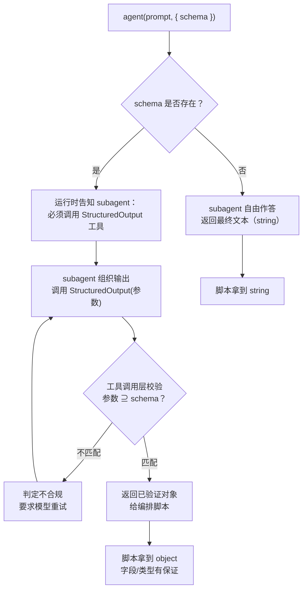
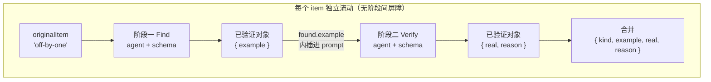

# 第 07 章 · 结构化输出与 Schema

> **给 `agent()` 传一个 `schema`，运行时就会强制这个 subagent 调用内部的 `StructuredOutput` 工具，在工具调用层校验返回值，不合规就让模型重试，最终交还给你一个保证结构正确的对象。**
>
> 这就是 Workflow 与「让模型自由发挥、再用正则提取数据」的根本区别。这一章完整说明：它解决了什么实际问题、运行时的具体行为、schema 的设计方法、schema 化的数据如何在流水线各阶段之间流动，以及哪些常见错误会把「校验」变成「反复重试、浪费 token」。

---

## 7.1 没有 schema 时会怎样

使用 LLM 做过自动化的人，对下面这种问题不会陌生。

假设需要让一个 subagent「找出这段代码里的所有 bug，每个给出文件、行号、严重程度和说明」。不带 schema，只能在 prompt 里**用自然语言要求**它按某种格式回复：

```javascript
// （示意，未实跑）—— 这是「没有 schema」的典型写法
const text = await agent(
  '审查这段代码，列出所有 bug。请严格按如下格式输出，每行一个：\n' +
  'FILE | LINE | SEVERITY | DESCRIPTION\n' +
  '不要有任何额外解释。'
)
// 现在 text 是一个字符串，你必须自己解析它……
const findings = text
  .split('\n')
  .filter((line) => line.includes('|'))
  .map((line) => {
    const [file, line_, severity, desc] = line.split('|').map((s) => s.trim())
    return { file, line: Number(line_), severity, desc }
  })
```

这段代码看上去可以运行，但**极其脆弱**。实际运行过的人知道接下来会发生什么：

- 模型在前面加了一句「好的，以下是我找到的问题：」，你的 `filter` 把它漏掉了，但万一这句话里也带个 `|` 呢？
- 模型把 `LINE` 写成了 `第 42 行` 或 `42-45`，于是 `Number('第 42 行')` 成了 `NaN`。
- 模型自作主张把 `SEVERITY` 翻成了中文「高」，你下游的 `if (severity === 'high')` 判断全废了。
- 模型觉得某个 bug 得详细说说，于是往 `DESCRIPTION` 里塞了一个带换行的 Markdown 列表，你的 `split('\n')` 当场就崩。
- 十次里九次完美，第十次它把一段 JSON 包在 ```` ```json ```` 代码块里返回来，因为它觉得这样更专业。

于是开始编写防御性代码：trim、正则、try/catch、兜底默认值、字段别名映射。**解析和容错逻辑很快就会比业务逻辑本身还长。** 而且每增加一个字段、每更换一个模型，都需要重新调整解析器。

<div class="callout warn">

**这就是「自由文本 + 事后解析」方案的根本问题**：「保证数据结构正确」被放到了**模型输出之后**。由于模型输出不可控，开发者始终在为模型的格式偏差编写补丁。结构化输出将这一保证**前移**到模型生成的时刻，由运行时强制执行。

</div>

---

## 7.2 一行 `schema` 改变一切：从真实冒烟测试说起

本书第一个真实运行的 Workflow（`hello-workflow` 冒烟测试）正是用来验证这一机制的。下面是它的**真实运行**结果。

它让一个 subagent 返回三项内容：一句确认消息（字符串）、`2+2` 的整数值（数字）、以及一个确认自身在工作流中运行过的布尔值。脚本核心部分如下：

```javascript
phase('Greet')
const r = await agent(
  'You are a smoke test for the Claude Code Workflow runtime. Return a one-sentence ' +
  'confirmation message, the integer value of 2+2, and a boolean confirming you ran ' +
  'as a workflow subagent.',
  {
    label: 'smoke',
    schema: {
      type: 'object',
      properties: {
        message: { type: 'string' },
        sum: { type: 'number' },
        runtimeConfirmed: { type: 'boolean' },
      },
      required: ['message', 'sum', 'runtimeConfirmed'],
    },
  }
)
```

交给 Workflow 工具执行后，**真实**返回值为（来源：`assets/transcripts/primitives.md`，Run ID `wf_dacbd480-d5d`）：

```json
{
  "message": "The Claude Code Workflow runtime smoke test executed successfully as a workflow subagent.",
  "sum": 4,
  "runtimeConfirmed": true
}
```

注意 `"sum": 4`。

它是**数字 `4`**，不是字符串 `"4"`。这不是巧合，也不是模型恰好遵守了格式。`schema` 中声明了 `sum: { type: 'number' }`，运行时的校验层要求**类型正确**才放行。拿到 `r` 后可以直接写 `r.sum + 1` 得到 `5`，无需先 `Number(r.sum)` 再担心是否为 `NaN`。

与上一节的手动解析相比，这是**质的变化**：

| 维度 | 自由文本 + 事后解析 | `agent({ schema })` |
|---|---|---|
| 谁保证结构正确 | 你写的解析器（在模型之后） | 运行时校验层（在模型生成时） |
| 类型 | 全是字符串，需手动转换 | 按 schema 保证（number 就是 number） |
| 缺字段 | 解析器拿到 `undefined`，可能静默出错 | required 缺失 → 校验失败 → 模型重试 |
| 模型「话痨」/加前缀 | 污染解析，需 trim/正则 | 不影响，返回的是工具调用的结构化参数 |
| 换模型/加字段 | 重新调教解析器 | 改 schema 即可 |
| 你要写的容错代码 | 大量 | **零** |

最后一行是重点：**编排者（你的脚本）拿到的是一个保证结构的对象，不用写任何解析或容错代码。** 这正是 Workflow 能做到「确定性编排」的前提。下游阶段可以放心地写 `r.findings.length`、`r.verdict === 'confirmed'`，因为这些字段存不存在、是什么类型，运行时已经替你担保了。

---

## 7.3 运行时到底做了什么：StructuredOutput 与重试

「校验」背后，运行时的具体行为是什么？这套机制有**官方工具定义**和**本书实测**双重佐证（见 `_grounding.md`），流程如下：

1. 当 `agent()` 带着 `schema`，运行时**强制**这个 subagent 去调一个内部工具，名叫 `StructuredOutput`。subagent 不再「写一段文本当最终答案」，而是必须把答案作为参数**调用这个工具**（官方）。
2. 工具的参数 schema 就是你传进去的那个 JSON Schema。所以校验发生在**工具调用层**：模型填的参数必须匹配 schema，否则这次工具调用就被判定为不合规（官方）。
3. 不匹配怎么办？**模型被要求重试**：重新组织输出，再调一次 `StructuredOutput`，直到参数合规（官方描述「不匹配则模型重试」；**确切的重试次数本书未实测**，见下方说明）。
4. 合规之后，运行时把这次工具调用的参数**作为已验证的对象**交还给你的脚本。也就是说，`agent()` 给你一个**已验证对象**，你拿到手就能 `r.field`，**无需 `JSON.parse`**，也不用写任何容错。



**「返回已验证对象」不光是官方说法，本书每一次带 schema 的运行都验证了它。** hello 冒烟测试（`wf_dacbd480-d5d`）、parallel-demo（`wf_52957913-6d2`）、pipeline-demo（`wf_bf086b98-6ec`），每一次带 `schema` 的 `agent()` 都成功拿回了字段齐全、类型正确的对象（本章后面会把真实返回值一个个摆出来）。所以「有 schema → 拿到已验证对象」这条，是**官方加实测**双重坐实的。

<div class="callout info">

**说到「重试」的边界，得把「官方行为」和「第三方声称」分开看。** 官方只讲了**行为**：不匹配则模型重试，直到合规。至于**实现细节和确切次数**，社区第三方资料（某 YouTuber 仓库，非官方）声称：运行时用 **AJV** 编译你的 schema，`StructuredOutput` 的入参 schema 就是这个 schema，而且当 subagent **始终不调用**该工具时「最多再催两次后失败」。**这几点（AJV、催两次）本书未独立实测，只记录它的说法，不作为事实采信。** 所以本书**不**断言任何确切的重试次数。你能放心依赖的硬边界，只有官方的**预算上限**（`spent()` 达 `total` 后再调 `agent()` 抛错，见第 09 章）：重试再多，也越不过这道预算闸门。

</div>

有两个设计细节值得单独说明，它们解释了 Workflow 的 subagent 输出为什么与普通聊天中看到的不同。

**其一：subagent 被明确告知，最终产物是返回值，不是面向人类的文本。** 据 `_grounding.md`「subagent 行为」一节，subagent 知道自己的输出会被**程序消费**，因此返回的是原始数据，而不是「好的，我帮你分析了一下......」这类寒暄。即使不带 schema，纯文本返回也是直接可用的内容而非客套。

**其二：校验发生在工具调用层，模型无法插入额外的自然语言。** 在普通对话中，模型可以先铺垫一大段再给出答案；但 `StructuredOutput` 是一次结构化的工具调用，参数就是参数，没有夹带自然语言旁白的空间。这从机制上消除了 7.1 节中「模型加前缀污染解析」那一整类问题。

<div class="callout info">

**一个常被忽略的推论：schema 把「格式遵从」从概率问题变成了确定性问题。** 不带 schema 时，模型会不会按格式回话是个概率事件，99% 也不是 100%。带 schema 时，运行时用「不合规就重试」这个循环把概率**逼向 100%**：要么最终返回一个合规对象，要么在极端情况下把本回合预算耗光而失败，但你**绝不会**拿到一个看着像、实际上字段缺失或类型错误的对象。确定性编排要的正是这种「拿到手就一定能用」的保证。

</div>

---

## 7.4 Schema 设计模式：从最小到可上线

JSON Schema 本身是一套成熟的规范，但在 Workflow 里你只用掌握高频的那几种构造。下面从最小例子一步步加码，每个都给出能用的范例。**带 Run ID 标注的来自真实运行，其余标注「（示意，未实跑）」。**

<div class="callout tip">

**放置规则：schema 写在脚本主体中，作为 `agent()` 的 `opts.schema` 传入，不要写进 `meta`。** `meta` 必须是**静态字面量（static literal）**（运行前被静态读取，禁止变量和函数调用，见 `_grounding.md`），它管理的是工作流的名称、描述、阶段。schema 是每次 `agent()` 调用各自的「输出契约」，因调用而异，也可以抽取为常量复用（比如下面把 schema 抽为 `const` 在多处引用）。区分这两者，可以避免「为什么在 meta 中放 schema 会报错」这类困惑。

</div>

### 模式一：扁平对象 + required（最常用的基石）

最基础的形态：一个对象，几个标量字段，用 `required` 声明哪些必须出现。`hello-workflow` 就是这种（Run ID `wf_dacbd480-d5d`）：

```javascript
schema: {
  type: 'object',
  properties: {
    message: { type: 'string' },
    sum: { type: 'number' },
    runtimeConfirmed: { type: 'boolean' },
  },
  required: ['message', 'sum', 'runtimeConfirmed'],
}
```

<div class="callout tip">

**`required` 是你最重要的杠杆。** 没列进 `required` 的字段，模型可以不给，于是你下游又得写 `if (r.foo !== undefined)`。把所有你下游会无条件读取的字段都列进 `required`，让「缺字段」触发重试，而不是把 `undefined` 漏进你的脚本。这是从「校验」拿到「担保」的关键一步。

</div>

### 模式二：单字段对象（流水线里的轻量产物）

有时候一个阶段只需要产出一样东西。真实的 `parallel-demo` 里，每个 agent 只返回一句 code smell（Run ID `wf_52957913-6d2`）：

```javascript
schema: {
  type: 'object',
  properties: { smell: { type: 'string' } },
  required: ['smell'],
}
```

**哪怕只有一个字段，也建议包成对象，而不是裸 string。** 一来方便以后扩展（加字段不会破坏调用方），二来对象形态让 `StructuredOutput` 的语义更清晰。当然，如果你确实只要一段文本，不带 schema 拿 string 也完全可以，怎么取舍见 7.7 节。

### 模式三：枚举 enum（把「判决」收敛到有限取值）

这是结构化输出价值最高的场景之一。当需要 subagent 做「判定」时，用 `enum` 将答案限定在有限集合内，而不是让模型自由选择措辞：

```javascript
// （示意，未实跑）—— 对抗验证里典型的「判决」schema
schema: {
  type: 'object',
  properties: {
    verdict: { type: 'string', enum: ['confirmed', 'refuted', 'uncertain'] },
    confidence: { type: 'number' },
    reasoning: { type: 'string' },
  },
  required: ['verdict', 'confidence', 'reasoning'],
}
```

有了 `enum`，下游可以放心写 `if (r.verdict === 'confirmed')`，无需担心模型返回的是 `'Confirmed'`、`'CONFIRMED'`、`'已确认'` 还是 `'I confirm this'`。**枚举将分支逻辑变成可靠的状态机迁移**，这在第四部「对抗验证」中是核心构造。

### 模式四：布尔门控字段（让脚本据此分流）

布尔字段是流水线里最廉价的「闸门」。真实的 `pipeline-demo` 第二阶段就用 `real: boolean` 来表达「这个 bug 是不是真的」（Run ID `wf_bf086b98-6ec`）：

```javascript
schema: {
  type: 'object',
  properties: {
    real: { type: 'boolean' },
    reason: { type: 'string' },
  },
  required: ['real', 'reason'],
}
```

拿到结果后，编排脚本就能据此分流，`results.filter((r) => r.real)` 只留下被确认的项。**布尔门控加数组过滤**是 Workflow 里最常见的「收口」搭配。

### 模式五：数组（findings 列表这类「多条产物」）

当一个 subagent 要返回**一组**东西（多个 bug、多条引用、多个建议），就用 `array`，再用 `items` 描述每个元素的结构：

```javascript
// （示意，未实跑）—— 一个分片审查 agent 返回一组发现
schema: {
  type: 'object',
  properties: {
    findings: {
      type: 'array',
      items: {
        type: 'object',
        properties: {
          file: { type: 'string' },
          line: { type: 'number' },
          severity: { type: 'string', enum: ['low', 'medium', 'high', 'critical'] },
          description: { type: 'string' },
        },
        required: ['file', 'line', 'severity', 'description'],
      },
    },
  },
  required: ['findings'],
}
```

回看 7.1 节的手动解析，它要做的正是这件事。而在这里，**每个 finding 的 `line` 保证是数字，`severity` 保证是四个枚举值之一，四个字段一个都不会缺少**。拿到 `r.findings` 后可以直接 `.filter()`、`.sort((a, b) => severityRank[b.severity] - severityRank[a.severity])`、`.length`。7.1 节那几十行防御代码，在这里**完全不需要**。

### 模式六：嵌套对象（带元数据的复合产物）

生产环境的产物通常需要分层。例如一份审查报告，既包含概要又包含明细：

```javascript
// （示意，未实跑）—— 嵌套：summary 元数据 + findings 明细
schema: {
  type: 'object',
  properties: {
    summary: {
      type: 'object',
      properties: {
        totalIssues: { type: 'number' },
        highestSeverity: { type: 'string', enum: ['low', 'medium', 'high', 'critical'] },
        reviewedFiles: { type: 'number' },
      },
      required: ['totalIssues', 'highestSeverity', 'reviewedFiles'],
    },
    findings: {
      type: 'array',
      items: {
        type: 'object',
        properties: {
          file: { type: 'string' },
          severity: { type: 'string', enum: ['low', 'medium', 'high', 'critical'] },
          description: { type: 'string' },
        },
        required: ['file', 'severity', 'description'],
      },
    },
  },
  required: ['summary', 'findings'],
}
```

嵌套对象使得在**一次** agent 调用中就能获得结构化的「报告 + 明细」，下游既可以通过 `r.summary.highestSeverity` 做快速分流，又可以遍历 `r.findings` 做详细处理。

六种模式汇总成速查表：

| 模式 | 关键构造 | 典型用途 | 真实佐证 |
|---|---|---|---|
| 扁平对象 + required | `type:'object'` + `required` | 一切的基石 | hello `wf_dacbd480-d5d` |
| 单字段对象 | 一个 property | 流水线轻量产物 | parallel `wf_52957913-6d2` |
| 枚举 enum | `enum:[...]` | 判决/分类，钉死取值 | （示意，未实跑） |
| 布尔门控 | `type:'boolean'` | 闸门 + 数组过滤 | pipeline `wf_bf086b98-6ec` |
| 数组 | `type:'array'` + `items` | findings 多条产物 | （示意，未实跑） |
| 嵌套对象 | object 套 object/array | 报告 + 明细 | （示意，未实跑） |

---

## 7.5 schema 化的数据如何在流水线里流动

结构化输出真正的威力，不在单个 agent，而在**它让数据能在阶段之间安全流动**。这正是 `pipeline()` 的设计前提。

回顾真实的 `pipeline-demo`（Run ID `wf_bf086b98-6ec`，`agent_count=6`）：3 个 bug 类型，每个独立流过两阶段，Find（产出一个候选 bug 示例）→ Verify（对抗性地核验它是不是真的 bug）。

```javascript
const items = ['off-by-one', 'null-dereference', 'race-condition']
const out = await pipeline(
  items,
  // 阶段一 Find：产出 { example }
  (kind) =>
    agent(`Give a one-line code example of a ${kind} bug.`, {
      label: `find:${kind}`, phase: 'Find',
      schema: {
        type: 'object',
        properties: { example: { type: 'string' } },
        required: ['example'],
      },
    }),
  // 阶段二 Verify：消费上一阶段的 example，产出 { real, reason }
  (found, kind) =>
    agent(
      `Is this genuinely a ${kind} bug? Example: "${found.example}". Reply boolean + short reason.`,
      {
        label: `verify:${kind}`, phase: 'Verify',
        schema: {
          type: 'object',
          properties: { real: { type: 'boolean' }, reason: { type: 'string' } },
          required: ['real', 'reason'],
        },
      }
    ).then((v) => ({ kind, ...found, ...v }))
)
return out.filter(Boolean)
```

注意阶段二回调的第一行：`found.example`。这里的行为正是本节的核心要点。

**阶段一的 schema 化产物（保证有 `example` 字段的对象）被喂给了阶段二。** 阶段二的回调签名是 `(found, kind)`，`found` 就是阶段一返回的那个已验证对象，`kind` 是 `originalItem`（原始输入项）。因为阶段一的 schema 担保了 `example` 字段的存在和类型，阶段二就能**毫无顾虑**地把 `found.example` 内插进自己的 prompt 里，当作待核验的证据。

如果阶段一返回的是自由文本，阶段二就需要先解析那段文本、提取代码示例、处理各种格式异常，而这恰恰是**每一对相邻阶段之间**都要重复的逐字段解析。schema 彻底消除了这个问题：**每个阶段的输出，都是下一个阶段可以直接作为对象使用的输入。**

真实返回值印证了这条数据链是完整的（节选）：

```json
[
  {
    "kind": "off-by-one",
    "example": "for i in range(len(arr)): print(arr[i+1])  # ...out of bounds",
    "real": true,
    "reason": "Genuine off-by-one bug... raising IndexError..."
  }
]
```

最终对象同时带着 `kind`（来自 originalItem）、`example`（阶段一产物）、`real`/`reason`（阶段二产物），这是靠 `.then((v) => ({ kind, ...found, ...v }))` 在阶段内把三者合并出来的。**这就是「用 schema 把发现结构化、好让后续做对抗验证」的最小完整范例**：Find 阶段产出结构化的「发现」，Verify 阶段消费它，再产出结构化的「判决」。第四部会把这个两阶段骨架扩展成完整的对抗验证流水线。



<div class="callout tip">

**在 Workflow 里，schema 既校验输出，也定义阶段之间的契约。** 上游 agent 的 schema 就是下游 agent 能依赖的接口。设计一条多阶段流水线时，先把每个阶段的 schema（也就是契约）想清楚，阶段之间的衔接就会变得像调用普通函数一样自然：前一个函数的返回类型，就是后一个函数的参数类型。

</div>

<div class="callout tip">

**一条衔接技巧：把上游对象 `JSON.stringify` 进下游 prompt。** 上例只内插了单个标量 `found.example`。当你要把**整个已验证对象**（多字段、嵌套）传给下一阶段时，最稳的写法是把 `JSON.stringify(found)` 拼进下个 `agent()` 的 prompt 字符串里，下游模型按 JSON 来读，不容易因为换行或引号闹歧义。这跟 7.6 的 `JSON.stringify(report)` 是同一招：**编排脚本负责把结构化数据序列化进提示词，下游 agent 再把它当输入消费。**

</div>

---

## 7.6 陷阱与推荐做法

结构化输出能力强大，但使用不当会从帮手变成障碍。下面的实践准则大多可以从「schema 在工具调用层校验、不合规就重试」这一机制推导出来。

### 陷阱一：schema 过严 → 反复重试，烧 token 又变慢

校验失败的代价是**重试**。如果你的 schema 给模型设了一道它很难一次过的关，模型就会反复重试，直到合规或者耗尽预算。

「过严」常见的几种样子：

- 用 `enum` 限定了一组取值，但提示词里没说清这些取值各自是什么意思，模型猜不中。
- 字段语义模糊（比如要个 `score: number`，却没说范围是 0–1 还是 0–100），模型给出的值你下游又判定为不合理。
- 要一个嵌套极深、字段极多的巨型对象，模型一次生成很难面面俱到。

<div class="callout warn">

**重试不是免费的。** 单个 agent 一次往返约 2.6 万 token、5.5 秒（hello，`wf_dacbd480-d5d`；这个指标的详细说明见 [第 09 章 · 进度·日志·续传·预算](#/zh/p2-09)）。每多一次重试，就大约多付一次这样的成本。一个本该一次成功的 agent 如果反复重试三四次，token 和耗时都会翻几倍。schema 的「严格」应当用在**下游真正依赖**的约束上，而不是制造不必要的重试。

</div>

### 做法一：字段语义在 prompt 里讲清，别指望模型猜

schema 定义的是**结构**（有哪些字段、什么类型），但**语义**（这个字段到底要填什么）必须在 prompt 里讲明白。schema 和 prompt 是一对搭档：

```javascript
// （示意，未实跑）—— prompt 与 schema 协同：schema 管结构，prompt 管语义
await agent(
  '评估下面这条 bug 报告的可信度。\n' +
  '- verdict: 你的判决，只能是 confirmed（确属 bug）/ refuted（误报）/ uncertain（证据不足）之一。\n' +
  '- confidence: 0 到 1 之间的小数，表示你对判决的把握。\n' +
  '- reasoning: 一句话给出关键理由。\n\n' +
  `待评估报告：${JSON.stringify(report)}`,
  {
    schema: {
      type: 'object',
      properties: {
        verdict: { type: 'string', enum: ['confirmed', 'refuted', 'uncertain'] },
        confidence: { type: 'number' },
        reasoning: { type: 'string' },
      },
      required: ['verdict', 'confidence', 'reasoning'],
    },
  }
)
```

prompt 把每个字段「该填什么、取值范围是多少」逐条说清，这样模型一次就能命中，几乎不会触发重试。

<div class="callout tip">

**字段名本身也是给模型的提示，应当用后续分支判断的具体命题来命名。** 含糊的字段名（比如 `ok`）会迫使模型猜测语义：`ok` 是「草稿合格」还是「这一步执行成功」？一旦代码中的 `if (result.ok)` 与模型理解的 `ok` 语义不一致，分支就会走错。曾有第三方报告，在「生成、批评、修复」循环中将评审字段命名为 `ok`，结果与冒烟测试的「ok = 成功」语义冲突，导致误判。本书做过对照实测：同一条**明确写错**的草稿，分别用字段 `ok` 和 `draftIsFactuallyCorrect`，**两者都正确返回了 `false`，并未复现该问题**（`wf_e8cb23ff-829`）。因此这不是一个硬性 bug，而是一种**清晰度风险**：草稿越含糊，字段名的选择就越关键。将 `ok` 替换为 `draftIsFactuallyCorrect`、`shouldRetry`、`hasBlockingIssue` 这类名称一目了然的写法，几乎零成本就能消除隐患。

</div>

### 做法二：善用 `description` 字段引导模型

JSON Schema 的每个字段都可以带一个 `description`，运行时会把它一并交给模型当作填写指引。**对于语义不那么显然的字段，在 schema 里就近写 `description`，比全靠 prompt 描述更不容易漏**，还能让 schema 自带文档：

```javascript
// （示意，未实跑）—— 用 description 把语义写进 schema 本身
schema: {
  type: 'object',
  properties: {
    severity: {
      type: 'string',
      enum: ['low', 'medium', 'high', 'critical'],
      description: '按可被利用性与影响面评级：critical=可远程利用且影响核心数据，low=仅代码异味',
    },
    line: {
      type: 'number',
      description: '问题所在的起始行号（1-based）；若跨多行，填第一行',
    },
  },
  required: ['severity', 'line'],
}
```

`description` 和 prompt 引导可以一起用：prompt 讲整体任务、讲这个产物为什么要做，`description` 就在字段旁边讲这一格具体怎么填。两者叠加，重试率最低。

### 做法三：大产物用句柄，不要内联进 schema

这一条呼应贯穿全书的「控制面 / 数据面分离」思想（见 `_grounding.md` D 节对 OMC 的精华提炼，以及第四部相关章节）。

假设一个 subagent 生成了一份 5000 行的报告或一大段重构后的代码。如果将整段内容放入 schema 的某个 string 字段返回，那么：

- 这一大坨数据会进到**编排脚本的上下文**里，挤占你主循环的 token；
- 如果它还要喂给下游好几个 agent，就等于反复搬运一大块数据，成本随阶段数放大。

更好的做法是**让 agent 把大产物写到磁盘或某个存储，schema 只返回一个「句柄」**（路径、ID、引用），下游 agent 凭句柄按需取用：

```javascript
// （示意，未实跑）—— schema 返回句柄而非内联大产物
schema: {
  type: 'object',
  properties: {
    artifactPath: { type: 'string', description: '生成报告写入的文件路径' },
    lineCount: { type: 'number', description: '报告行数，供编排层快速判断规模' },
    headline: { type: 'string', description: '一句话摘要，编排层据此分流，无需读全文' },
  },
  required: ['artifactPath', 'lineCount', 'headline'],
}
```

这样，**控制面**（编排脚本看到的 `headline` / `lineCount` / `artifactPath`，轻量、可路由）与**数据面**（5000 行报告本体，保留在原位按需取用）就分离了。编排层仅凭 `headline` 就能做出决策，无需将全文载入上下文。

<div class="callout info">

**一个环境约束**：据 `_grounding.md`「硬约束」一节，Workflow 脚本本身**没有文件系统和 Node API**，而且 `ctx_execute` 或 Bash 子进程的写入不持久化到宿主文件系统，文件写入要用原生 Write/Edit 工具。所以「写到磁盘」这一步通常由 **subagent 自身**（它有工具权限）来做，编排脚本只负责把返回的句柄在阶段间传来传去。这才是「句柄模式」在 Workflow 里的正确落地方式。

</div>

### 做法四：用 `null` 语义处理「被跳过的 agent」

最后一条跟 schema 间接相关，但极常见。用户中途跳过某个 agent 时，这次 `agent()` 返回的是 `null` 而不是 schema 对象（这条返回语义的来龙去脉见 [第 06 章 · agent() 参考](#/zh/p2-06)）。所以**凡是消费 schema 产物的地方，都要先 `.filter(Boolean)` 把 `null` 滤掉**，不然你对 `null` 取字段会抛错：

```javascript
const results = await parallel(/* ... */)
// 先滤掉被跳过的 null，再安全地读 schema 字段
return results.filter(Boolean).map((r) => r.smell)
```

真实的 `parallel-demo` 和 `pipeline-demo` 末尾都有这一句 `.filter(Boolean)`，就是这个原因。

---

## 7.7 何时**不**用 schema

结构化输出是默认推荐方案，但并非所有场景都适用。有一种情况下不带 schema 更合适：**当 agent 的产物是最终供人阅读的散文，且没有下游程序需要消费其结构时。**

例如，一条流水线的**最后一步**是「将前面所有结构化发现汇总成一段人类可读的报告」。这段报告本身就是终点，不会再被解析。此时添加 schema 反而限制了模型自由组织叙述的能力。不带 schema，直接获取文本即可：

```javascript
// （示意，未实跑）—— 终点是给人读的散文，不带 schema 更自然
const report = await agent(
  '把下面这些已验证的发现，汇总成一段面向工程团队的简明报告：\n' +
  JSON.stringify(verifiedFindings, null, 2)
)
// report 是 string，直接展示给用户
log(report)
```

判断准则如下：

| 问自己 | 用 schema？ |
|---|---|
| 下游还有 agent / 脚本要**读取它的字段**吗？ | 是 → 用 schema |
| 我需要据某个字段**做分支 / 过滤 / 排序**吗？ | 是 → 用 schema（尤其 enum / boolean） |
| 它是流水线**终点**、产物就是给人看的散文吗？ | 否 → 不带 schema，拿 string |
| 我只要一段自由文本、不关心结构吗？ | 否 → 不带 schema |

<div class="callout tip">

**一条实用的经验**：**中间阶段几乎总需要 schema**（因为要传给下游），**终点阶段视情况而定**（供人阅读的散文可以不用）。不确定时，考虑「接收这个返回值的下一行代码是否会读取它的字段」。如果会，就使用 schema。

</div>

---

## 7.8 本章小结

- **结构化输出把「保证数据结构正确」从模型输出之后（手动解析）往前挪到了模型生成之时（运行时强制）。** 给 `agent()` 传 `schema`，运行时强制 subagent 调用 `StructuredOutput` 工具，在**工具调用层校验**，不合规则**重试**，最终返回**已验证对象**。
- 真实佐证：hello 冒烟测试要 `sum`（2+2），schema 声明 `type:'number'`，真实返回数字 `4` 而不是字符串 `"4"`（Run ID `wf_dacbd480-d5d`）。
- **编排者拿到保证结构的对象，不用写任何解析或容错代码。** 这是 Workflow 跟「自由发挥加正则抠数据」的本质区别，也是确定性编排能成立的前提。
- 六种 schema 设计模式：扁平对象加 `required`（基石）、单字段对象、`enum`（钉死判决取值）、布尔门控（闸门加过滤）、数组（findings 多条产物）、嵌套对象（报告加明细）。
- **schema 是阶段之间的契约**：上游的 schema 化产物（比如 `found.example`）被下游 agent 当对象消费（pipeline `wf_bf086b98-6ec` 印证），消除了相邻阶段之间的手动解析。
- 四条纪律：schema 别过严（重试烧 token，单 agent 一次约 2.6 万 token）、字段语义在 prompt 里讲清、用 `description` 就近引导、大产物用**句柄**而不是内联（控制面与数据面分离）；消费产物前先 `.filter(Boolean)` 滤掉被跳过的 `null`。
- 中间阶段几乎总要 schema；终点要是给人读的散文，那不带 schema 拿 string 更自然。

下一章从单个 agent 的产物提升到一组 agent 的编排结构：`parallel` 的屏障与 `pipeline` 的流水线之间的差异及选型方法。

> 继续阅读：[第 08 章 · parallel 屏障 vs pipeline 流水线](#/zh/p2-08)
