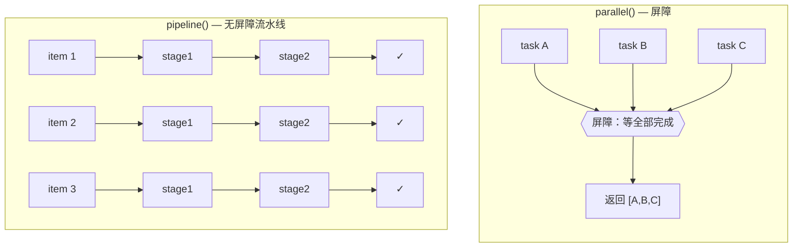
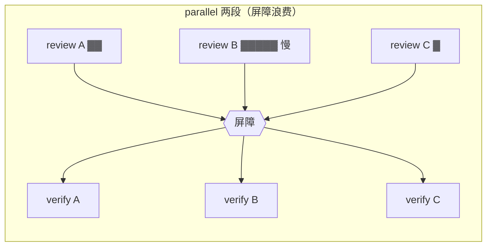

# 第 08 章 · parallel 屏障 vs pipeline 流水线

> 基础篇中**最容易用错**的就是这两个原语。`parallel()` 和 `pipeline()` 看上去都能让多个 agent 并发运行，但它们的并发模型完全不同。选择错误，轻则浪费数倍的wall-clock 时间，重则将本可以流动的流水线阻塞为串行。
>
> 这一章通过两段**真实运行**的对照，一次性说明两者的区别。

---

## 8.1 一句话区分

- **`parallel(thunks)`** 是**屏障（barrier）**：一组任务并发跑，**等全部完成**才把结果数组返回给你。
- **`pipeline(items, ...stages)`** 是**流水线**：每个 item **各走各的**流过全部阶段，**阶段之间没有屏障**，A 项可能已经走到第 3 阶段，B 项还卡在第 1 阶段。

记住这张图，本章剩余内容都是它的展开：



---

## 8.2 `parallel()`：屏障，要么全有要么等

`parallel()` 收一个**thunk 数组**（每个 thunk 是 `() => Promise`），把它们并发跑起来，等全部 settle 之后返回一个**和输入顺序一致**的结果数组。

### 真实运行：3 个 agent 并发

```javascript
export const meta = {
  name: 'parallel-demo',
  description: 'parallel() barrier: 3 agents run concurrently, all results awaited together',
  phases: [{ title: 'Fan-out', detail: 'Three concurrent agents' }],
}

phase('Fan-out')
const dims = ['naming', 'error-handling', 'comments']
const results = await parallel(
  dims.map((d, i) => () =>
    agent(`Name one common ${d} code smell in exactly one sentence.`, {
      label: `smell:${d}`,
      schema: { type: 'object', properties: { smell: { type: 'string' } }, required: ['smell'] },
    })
  )
)
log(`barrier released with ${results.filter(Boolean).length}/${dims.length} results`)
return results.filter(Boolean)
```

**真实返回值**（Run ID `wf_52957913-6d2`）：

```json
[
  {"smell":"...vague, non-descriptive identifiers like `data`, `temp`, `obj`..."},
  {"smell":"...the \"empty catch block,\" where an exception is caught but silently swallowed..."},
  {"smell":"Redundant comments that merely restate what the code already clearly expresses..."}
]
```

**真实用量**：`agent_count=3` | `total_tokens=78844` | `duration_ms=8395`

### 三个要点

**① 真并发，不是串行。** 单个 agent 的基线大约 5.5 秒（见第 04 章 hello 测试），这里 3 个 agent 只花了 **8.4 秒**，远小于 3 x 5.5 = 16.5 秒。并发确实在跑。

**② 结果顺序 = 输入顺序。** 哪怕 `error-handling` 那条最先返回，它在结果数组里照样排在 `naming` 后面。`parallel()` 保证结果顺序跟 thunk 顺序对得上，你放心用下标去对位。

**③ 注意 `() =>`。** 传给 `parallel()` 的是**函数数组**，不是 Promise 数组。

<div class="callout warn">

**最常见的错误：传 Promise 而不是 thunk。**

```javascript
// ✗ 错：map 出 agent() 调用会立刻执行——它们在到达 parallel 之前就已经在跑了
await parallel(dims.map(d => agent(...)))

// ✓ 对：map 出 thunk（() => ...），由 parallel 控制何时启动
await parallel(dims.map(d => () => agent(...)))
```

第一种写法传递的是**已经创建好的 Promise**，而不是 `() => ...` thunk，后果有两个。第一，这些 Promise 在到达 `parallel` 之前就已经开始执行，`parallel` 无法控制它们的启动时机。第二，丢失了 `parallel()` 的**异步失败归集语义**：async reject 或 agent 出错本应在结果数组对应位置变成 `null`，但绕过 `parallel` 直接 `await` 后，一个 reject 就可能导致整个 `await` 跟着 reject。务必传 thunk。

</div>

### 错误处理：区分同步 throw 与异步 reject

`parallel()` 的错误语义**取决于失败走哪条路径**，不能一刀切地说"抛错 → `null`"：

- **thunk 函数体内的同步 `throw`**（`() => { throw ... }`）会让整个 `parallel()` 调用 **reject**。`.filter(Boolean)` **接不住**（你根本拿不到那个数组），但只要在 `await parallel(...)` 外面包一层 `try/catch`，就能干净地接住，**workflow 照常完成**；**只有未被捕获的同步 throw 才会中止 run**（实测 Run `wf_b7c75d40-c26`：`{runSurvived:true, callRejected:true, caughtByTryCatch:true}`）。
- 只有**异步失败**才会在结果数组对应位置变成 `null`：返回一个随后 reject 的 promise（`() => Promise.reject(...)`）或内部 `agent()` 出错。此时 `parallel()` 本身**不** reject，其余照常返回、**workflow 正常完成**（实测 Run `wf_b1d45b4c-445`：shape `["alpha","NULL","gamma"]`、`callRejected:false`）。

如果 thunk 体内可能运行同步逻辑（解析、断言、`JSON.parse`、下标越界），**不要**将其裸放在 thunk 中。要么将它移入被 `await` 的 `agent()` 调用（走异步路径，会被归集为 `null`），要么在 `await parallel(...)` 外层自行 `try/catch` 捕获。对**异步路径**产生的 `null`，**使用结果前先 `.filter(Boolean)`** 过滤：

```javascript
const results = (await parallel(thunks)).filter(Boolean)
```

这实现了「尽力而为」的语义：一个 reviewer 异步失败，不应该导致整批 review 全部失败。S8.8 用实测数据明确了同步和异步这一边界情况。

---

## 8.3 `pipeline()`：流水线，让每个 item 自己往前流

`pipeline(items, stage1, stage2, ...)` 让**每个 item 独立地**依次流过所有 stage。核心特征是**独立**：阶段之间**没有屏障**。

### 真实运行：3 项 x 2 阶段（Find → Verify）

```javascript
export const meta = {
  name: 'pipeline-demo',
  description: 'pipeline(): each item flows Find -> Verify independently, no barrier between stages',
  phases: [{ title: 'Find', detail: 'Produce a candidate' }, { title: 'Verify', detail: 'Adversarially check it' }],
}

const items = ['off-by-one', 'null-dereference', 'race-condition']
const out = await pipeline(
  items,
  (kind) =>
    agent(`Give a one-line code example of a ${kind} bug.`, {
      label: `find:${kind}`, phase: 'Find',
      schema: { type: 'object', properties: { example: { type: 'string' } }, required: ['example'] },
    }),
  (found, kind) =>
    agent(`Is this genuinely a ${kind} bug? Example: "${found.example}". Reply boolean + short reason.`, {
      label: `verify:${kind}`, phase: 'Verify',
      schema: { type: 'object', properties: { real: { type: 'boolean' }, reason: { type: 'string' } }, required: ['real', 'reason'] },
    }).then((v) => ({ kind, ...found, ...v }))
)
return out.filter(Boolean)
```

**真实用量**（Run ID `wf_bf086b98-6ec`）：`agent_count=6` | `total_tokens=158982` | `duration_ms=26743`

3 项 x 2 阶段 = **6 个 agent**，`agent_count=6` 一分不差。

### 阶段回调签名：`(prevResult, originalItem, index)`

这是 `pipeline()` 最实用、也最容易被忽略的设计：**每个 stage 回调都收到三个参数**。

- 第一阶段：`(item, item, index)`，`prevResult` 就是 item 自己。
- 后续阶段：`(上一阶段的返回值, 原始 item, 下标)`。

看看真实脚本里的第二阶段：

```javascript
(found, kind) => agent(`Is this genuinely a ${kind} bug? Example: "${found.example}" ...`)
```

`found` 是第一阶段返回的 `{ example }`，`kind` 是**原始 item**（`'off-by-one'` 等）。**不需要将原始输入硬塞进上一阶段的返回值中逐层传递**，后续阶段随时可以访问 `originalItem` 和 `index`。这在第三部的配方中会反复使用。

<div class="callout tip">

**`.then()` 合并上下文的惯用法**：第二阶段用 `.then((v) => ({ kind, ...found, ...v }))` 把"原始 kind + 第一阶段的 example + 第二阶段的 real/reason"拼成一条完整记录。`pipeline()` 最终数组里每一项因此自带全部上下文。

</div>

### 某阶段抛错 → 该 item 掉到 `null`，跳过其余阶段

如果某个 item 在 stage 2 抛错，其结果为 `null`，并且**不会**继续进入 stage 3。其他 item 不受影响，照常流动。同样，使用结果前先 `.filter(Boolean)`。

---

## 8.4 差异的本质：屏障在哪里

选型的关键在于屏障的位置。设想一个两阶段任务：5 个 item，每个都要先 review 再 verify。

**用 parallel 搭两段（有屏障）：**

```javascript
// （示意）阶段间有屏障：必须等 5 个 review 全部完成，才能开始任何一个 verify
const reviews = await parallel(items.map(it => () => agent(reviewPrompt(it), {schema: R})))
const verified = await parallel(reviews.filter(Boolean).map(r => () => agent(verifyPrompt(r), {schema: V})))
```

**用 pipeline（无屏障）：**

```javascript
// 每个 item 自己流：item A 的 review 一完成，它的 verify 立刻开始——
// 不必等 item B、C 的 review
const verified = await pipeline(items,
  it => agent(reviewPrompt(it), {schema: R}),
  review => agent(verifyPrompt(review), {schema: V})
)
```



假如 review B 特别慢，parallel 两段写法中 **A 和 C 早已完成 review，但它们的 verify 也必须等待 B**，屏障将快的拖到慢的节奏上。pipeline 则不同：A、C 的 review 一完成就立刻开始 verify，wall-clock 时间约等于**最慢的那条单链**，而不是各阶段最慢的累加。

<div class="callout info">

**官方给出的判据**：**多阶段任务默认用 `pipeline()`。** 只有当第 N 阶段要用到前一阶段**全部** item 的结果时，才该上屏障（`parallel`）。

</div>

---

## 8.5 那什么时候才该用屏障？

屏障（`parallel` 夹在两阶段之间）**只在**第 N 阶段需要**跨 item 的全局信息**时才正确：

1. **去重 / 合并**：在昂贵的下游活儿开工前，得先拿到上一阶段的全部结果做一次全局去重。
2. **零结果早退**："0 个 bug → 整个验证阶段跳过"，你得先知道总数。
3. **下一阶段要引用其它发现**来做横向对比。

下面这几条**不构成**使用屏障的理由（pipeline 中的 stage 即可处理）：

- 「需要先 flatten / map / filter」：在 pipeline 的 stage 中处理即可，`pipeline(items, stageA, r => transform([r]).flat(), stageB)`。
- 「两个阶段在概念上是分开的」：pipeline 本身就是对分开阶段的建模，分开不等于需要同步。
- 「这样代码更整洁」：屏障造成的延迟是实际的性能代价。

<div class="callout warn">

**代码异味自检**：如果写出

```javascript
const a = await parallel(...)
const b = transform(a)          // flatten / map / filter，没有跨 item 依赖
const c = await parallel(b.map(...))
```

中间那个 `transform` 完全不需要屏障。将其改写为 pipeline，把 transform 放入某个 stage。**不确定时，选择 pipeline。**

</div>

### 正确使用屏障的真实形态（去重）

```javascript
// （示意）确实需要"全部发现"一起去重，再做昂贵验证——此时屏障正确
const all = await parallel(DIMENSIONS.map(d => () => agent(d.prompt, { schema: FINDINGS })))
const deduped = dedupeByFileAndLine(all.filter(Boolean).flatMap(r => r.findings))  // 需要全部
const verified = await parallel(deduped.map(f => () => agent(verifyPrompt(f), { schema: VERDICT })))
```

---

## 8.6 并发上限对两者都生效

无论 `parallel` 还是 `pipeline`，同时运行的 agent 都受**每工作流 `min(16, CPU核心数 - 2)`** 的节流限制。**可以**一次传入 100 个 item，它们都会执行完成，但任意时刻只有约 10 个在运行，其余排队等待。此外还有单工作流 agent 总数上限 **1000** 作为兜底。

不需要手动分批：将全部 item 交给 `pipeline()`，节流机制会自动管理并发水位。

---

## 8.7 选型速查

| 你的情况 | 用 |
|---|---|
| 一组独立任务，需要**全部结果**一起拿来用 | `parallel()` |
| 多阶段，每个 item 可独立地一路流到底 | `pipeline()`（默认） |
| 第 N 阶段需要前一阶段**所有** item 的结果（去重/早退/横向对比） | 两段之间用 `parallel()` 屏障 |
| 只是要 flatten/map/filter | 放进 `pipeline()` 的某个 stage，**别**为它加屏障 |

---

## 8.8 失败语义：抛错到底变 `null` 还是崩溃？

S8.2 / S8.3 给出的是简化版本：「thunk/stage 抛错 -> 该位置变 `null`」。这句话对 `pipeline()` 完全成立，但对 `parallel()` 来说**不够精确**。结果是变 `null` 还是整个 `parallel()` 调用 reject，取决于抛错是**同步**发生在 thunk 函数体中，还是来自一个**返回后才 reject 的 promise**。而且即使同步 throw 导致 `parallel()` reject，run 也**不一定**会中止：**外层的 `try/catch` 可以捕获它，run 照常完成**。本节用实测数据明确这一边界情况。

### 三种抛错形态的最小对照

```javascript
// A. parallel + thunk 函数体内同步 throw
//    → 整个 parallel() reject（.filter(Boolean) 接不住）；
//      但 try/catch 包住 await 能接住、run 照常活；只有未捕获时才中止 run
try {
  await parallel([
    () => agent('ok-1'),
    () => { throw new Error('deliberate failure inside a parallel thunk') },  // ✗ 同步抛
    () => agent('ok-2'),
  ])
} catch (e) { /* 同步 throw 在此被接住，run 不崩 */ }

// B. parallel + 返回一个随后 reject 的 promise（或内部 agent 出错）
//    → 该位置变 null，其余存活，workflow 正常完成
await parallel([
  () => agent('ok-1'),
  () => Promise.reject(new Error('returned-promise rejection, no synchronous throw')),  // → null
  () => agent('ok-2'),
])

// C. pipeline + stage 函数体内同步 throw
//    → 只有该 item 掉到 null 并跳过其余 stage，其它 item 不受影响
await pipeline(
  ['ok', 'boom', 'ok2'],
  (kind) => { if (kind === 'boom') throw new Error('stage-1 synchronous throw for "boom"'); return agent(`s1 ${kind}`) },
  (prev, kind) => agent(`s2 ${kind}`),
)
```

### 为什么 A 会让 `parallel()` reject（以及为什么不一定崩 run）

关键在于 `parallel(thunks)` 是**逐个调用** thunk 的。形态 A 中，thunk 被调用时**函数体的同步 `throw` 立即向上抛出**，此时 `parallel()` 还没有获得任何 promise，因此没有机会「将这一格收集为 `null`」，异常穿透 `parallel()`，导致整个调用 **reject**。形态 B 不同：thunk **正常返回了一个 promise**，`parallel()` 拿到后才去 `await`，其错误归集机制只能处理**异步 reject**，所以这一格变为 `null`、`parallel()` 自身**不会** reject。总结：能否被归集为 `null`，取决于 `parallel()` 是否有机会先获得那个 promise。

<div class="callout warn">

**最隐蔽的陷阱：`parallel()` 中 thunk 体内的同步 throw 会导致整个 `parallel()` 调用 reject。`.filter(Boolean)` 无法捕获，但 `try/catch` 可以。**

实测 Run `wf_b7c75d40-c26`：脚本为 `parallel([正常, () => { throw ... }, 正常])`，外层包裹 `try/catch`，结果为 `{runSurvived:true, callRejected:true, caughtByTryCatch:true}`。`callRejected:true` 证实同步 throw 确实导致 `parallel()` 整体 reject（因此拿不到数组，`.filter(Boolean)` 无从操作），`caughtByTryCatch:true` 加 `runSurvived:true` 证实该 reject 被 `try/catch` 正常捕获、**run 照常完成**。工具定义中的「a thunk that throws resolves to null; the call never rejects」对**异步 reject** 成立，对**同步 throw 不成立**（实测会 reject）。准则：**不要将有风险的同步逻辑（解析、断言、`JSON.parse`、下标越界等）裸放在 `parallel()` 的 thunk 函数体中**。要么将其放入被 `await` 的 `agent()` 调用内部（只有异步路径才会被归集为 `null`），要么在 `await parallel(...)` 外层自行 `try/catch`。

</div>

异步路径在 Run `wf_b1d45b4c-445` 中得到正面确认：`parallel([正常, () => Promise.reject(...), 正常])` 执行完成，返回数组的形状为 `["alpha","NULL","gamma"]`，中间一格变为 `null`、其余 2 格存活，而 `parallel()` 调用本身 `callRejected:false`、**workflow 正常完成**。该次异步失败仍被单独记录在运行的 `<failures>` 注记中：`parallel[1] failed: ...`，**失败没有被静默忽略，同时也没有导致 `parallel()` reject 或 workflow 中止**。两条路径至此明确：异步 reject 走「归集为 `null`」路径，同步 throw 走「整体 reject、需 `try/catch` 捕获」路径。

### pipeline 的 stage 更宽容

形态 C 是 `pipeline()`：哪怕 stage 函数体**抛错**，也只让**该 item** 掉到 `null` 并跳过它**余下的 stage**，其它 item 照样流完。这跟 `parallel()` 那种"整体 reject"截然不同。实测 Run `wf_b1d45b4c-445`：`pipeline(['keep1','boom','keep2'], stage1, stage2[对 boom 抛])`，返回数组形状是 `["s2:s1:keep1","NULL","s2:s1:keep2"]`，`boom` 那一项在抛错的 stage 处掉到 `null` 并跳过其余 stage，`keep1`/`keep2` 照常流完两阶段；那次失败也被单独记在 `<failures>` 注记里：`pipeline[1] failed: ...`。`pipeline()` 对每个 item 的每个 stage 都做了 per-item 包裹，抛错只波及这一项、不波及 `pipeline()` 调用整体。

### 对照表（实测）

| 场景 | `parallel()` | `pipeline()` |
|---|---|---|
| thunk/stage **同步 throw**（`() => { throw }`） | **reject 整个调用**：`.filter(Boolean)` 接不住，但 `try/catch` 包住 `await` 能接住、**run 照常活**；仅未捕获时才中止 run（Run `wf_b7c75d40-c26`：`runSurvived:true, callRejected:true, caughtByTryCatch:true`） | 仅该 **item 变 `null`** 并跳过其余 stage，其余存活（Run `wf_b1d45b4c-445`：`["s2:s1:keep1","NULL","s2:s1:keep2"]`） |
| 返回的 promise **异步 reject**（`() => Promise.reject(...)`）/ agent 出错 | 该位置 **`null`**，调用本身**不** reject、其余存活（Run `wf_b1d45b4c-445`：`["alpha","NULL","gamma"]`、`callRejected:false`） | 仅该 item 变 `null` |
| 失败如何呈现 | 完成/失败都在运行的 `<failures>` 注记中列出 | 同左 |

**实践准则**：`parallel()` 中有风险的同步逻辑不要裸放在 thunk 体中（原因和处理方式见上面的陷阱提示），`pipeline()` 的 stage 容错性更强（stage 抛错只影响该 item），而**两者对异步路径产生的 `null`，使用结果前都必须先 `.filter(Boolean)`**。

> 把这条对照看成 [B.4](#/zh/app-b)（传 thunk）的姊妹陷阱：B.4 讲的是"类型传错了（传成 Promise 而不是 thunk）"，本节讲的是"类型传对了，但 thunk 体内同步抛错"，两者都会让 `parallel()` 偏离你心里以为的"抛错→null"直觉。

---

## 8.9 本章小结

- `parallel()` = 屏障，等全部完成、结果按输入顺序排、传 **thunk** 而不是 Promise。失败语义分两路：thunk 体内**同步 throw → reject 整个调用**（`.filter(Boolean)` 接不住，但 `try/catch` 包住 `await` 能接住、run 照常活，仅未捕获才中止 run），只有**异步 reject → 该位置 `null`**、`parallel()` 自身不 reject（S8.8）。
- `pipeline()` = 无屏障流水线，每个 item 各自流过各 stage，回调签名 `(prevResult, originalItem, index)`，wall-clock约等于最慢单链。
- **多阶段默认 pipeline**；只有需要跨 item 的全局信息（去重/早退/横向对比）时，才在阶段间加屏障。
- 两者都受并发上限节流，大数组尽管传。
- 真实数据：parallel 3 并发 8.4s/79K token；pipeline 3x2=6 agent 26.7s/159K token。

下一章补齐基础篇的最后一部分：**进度可视化（`phase`/`log`/`/workflows`）、断点续传（`resumeFromRunId`）和预算控制（`budget`）**，使长流水线可观察、可中断、可控制成本。

> 继续阅读：[第 09 章 · 进度·日志·续传·预算](#/zh/p2-09)
