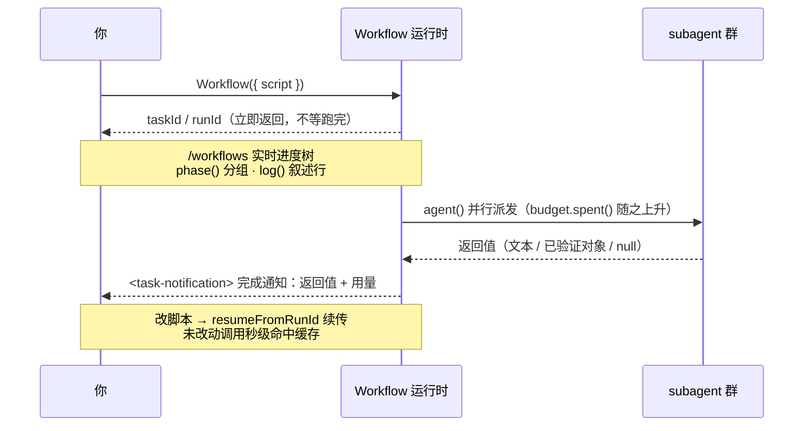

# 第 09 章 · 进度·日志·续传·预算

> 基础篇最后一块拼图：怎样让长流水线**看得见**（进度与日志）、**停得下、接得上**（断点续传）、**省着跑**（预算）。这三件事把工作流从「能跑」升级成「能放心交付」。

---

## 9.1 一图看懂：异步生命周期

前八章的「启动 → 异步回执 → 看进度 → 完成通知」串成一条时间线。本章四件事挂在这条线的不同位置上：`phase()`/`log()` 给**运行中**那段加可观测性，`/workflows` 是你**观察**的窗口，`budget` 在运行中**管着花钱**，`resumeFromRunId` 让你在这条线**跑完后再接一段**。



记住这条线长什么样：**Workflow 工具的返回值永远是「已启动」回执，不是结果**（第 04 章），结果在 `<task-notification>` 里。本章的四个原语把这条「看不见的」后台时间线变成**看得见、停得下、省着跑、接得上**。

---

## 9.2 进度：`phase()` + `log()` + `/workflows`

工作流启动之后，需要知道「它现在在干嘛」。三件工具配合提供可观测性：

### `phase(title)` —— 把进度分组

`phase('Review')` 把当前阶段切到 Review，之后所有 `agent()` 调用都归到进度树的「Review」分组。配上 `meta.phases` 声明，就能得到一棵结构化的进度树。下面是一个**完整可跑**的两阶段脚本（`meta.phases` 里的 `title` 跟 `phase()` 实参一一对应）：

```javascript
export const meta = {
  name: 'two-phase',
  description: 'phase() groups agents in the live progress tree',
  phases: [
    { title: 'Scan', detail: 'find candidates' },
    { title: 'Verify', detail: 'check each one' },
  ],
}

const FOUND = {
  type: 'object',
  properties: { candidates: { type: 'array', items: { type: 'string' } } },
  required: ['candidates'],
}
const OK = {
  type: 'object',
  properties: { verified: { type: 'array', items: { type: 'string' } } },
  required: ['verified'],
}

phase('Scan')                                  // ← 切到 Scan 阶段
const found = await agent(
  'List three plausible naming smells one might find in a JS module.',
  { label: 'scan', phase: 'Scan', schema: FOUND }
)
log(`扫描到 ${found.candidates.length} 个候选`)  // ← 叙述行

phase('Verify')                                // ← 切到 Verify 阶段
const ok = await agent(
  `Of these candidates, which are genuinely smells? ${JSON.stringify(found.candidates)}`,
  { label: 'verify', phase: 'Verify', schema: OK }
)
log(`确认 ${ok.verified.length} 个`)
return ok
```

> 本段为**示意（未实跑）**；它依赖的 `phase()`/`schema`/`agent()`，真实行为已被第 04/06/08 章的真实运行（`hello` Run `wf_dacbd480-d5d`、`pipeline-demo` Run `wf_bf086b98-6ec`）验证过了。

<div class="callout warn">

**在 `parallel()` / `pipeline()` 内部，别依赖全局 `phase()`。** 多个分支同时往前跑，全局这个「当前阶段」就会被抢来抢去。正确的做法是给每个 `agent()` 显式传 `phase`：

```javascript
await pipeline(items,
  d => agent(d.prompt, { phase: 'Review', schema: R }),   // 显式归组
  r => agent(verify(r), { phase: 'Verify', schema: V }),
)
```

`opts.phase` 跟 `meta.phases` 的 `title` 按字符串精确匹配，名字一样就是同一组。

</div>

### `log(message)` —— 给用户一行叙述

`log()` 在进度树上方打一行叙述文字。单参数、无返回值：`log(message: string): void`（见 `_grounding.md` B 节）。用它报里程碑、报计数、报决策。旁观者不看代码、只盯 `log()` 行，也能跟上工作流跑到哪了：

```javascript
log(`扫描到 ${shards.length} 个分片，开始并发审查`)
// ... 一轮工作之后 ...
log(`${bugs.length}/10 已发现，剩余预算 ${Math.round(budget.remaining() / 1000)}k`)
```

`log()` 的作用是「工作流的旁白」。有效的旁白回答三个问题：**并行分发了多少**（`扫描到 N 个分片`）、**收敛到几个**（`确认 M 个`）、**还剩多少预算**（`剩余 Xk`）。下一节预算循环每轮都 `log()` 一行进度，就是这个用法的范本。

<div class="callout info">

**`console.log` 也能用，但管的事不一样。** 沙箱自省运行（Run `wf_59bf3654-183`）实测确认：脚本里 `console` 是注入的对象，`console.log` 能调，输出进**工作流日志**。区别在于 `log()` 是给用户看的进度旁白（显示在进度树上方），`console.log` 更像开发时随手记的诊断输出（落进日志）。想让旁观者跟上进展，用 `log()`；想留排查痕迹，用 `console.log`。

</div>

### `/workflows` —— 实时进度树

斜杠命令 `/workflows` 打开一棵实时树：每个 phase 一个分组框，框里是各 agent 的标签（来自 `label`）和状态。`meta.phases` 的 `title` 决定分组框，`agent()` 的 `label` 决定叶子节点名字，所以**描述性的 label 既利于搜索，也利于观察**。这里写的是脚本侧「怎么把进度做出来」；在 `/workflows` 视图里**怎么操作**这棵树（方向键钻取、`p`/`x`/`r` 暂停停止重启、`s` 存成命令），见[《官方操作面板》](#/zh/p2-ops)。

---

## 9.3 完成通知里的真实用量

每个工作流跑完，完成通知都带一份用量统计，这就是你估成本的依据。基础篇三次真实运行汇总：

| Workflow | agent_count | tool_uses | total_tokens | duration_ms |
|---|---|---|---|---|
| hello（单 agent + schema） | 1 | 1 | 26,338 | 5,506 |
| parallel（3 并发） | 3 | 3 | 78,844 | 8,395 |
| pipeline（3 项 × 2 阶段） | 6 | 8 | 158,982 | 26,743 |

两条经验法则：

- **token ≈ agent 数 × 每 agent 上下文**（约 2.5–3 万 / agent，会随提示和产物上下浮动）。
- **wall-clock看的是关键路径**，不是 agent 总数：并发会把 N 个 agent 的时间压到差不多「最慢的那一个」。

<div class="callout info">

**编排本身不花模型钱。** 「token ≈ agent 数 ×…」还有个干净的边界：**不调任何 `agent()` 的纯编排工作流花 0 token。** 实测两个例子印证了这点：沙箱自省运行（`wf_59bf3654-183`）和嵌套工作流运行（`wf_2b04881f-6a9`）都是 **0 agent / 0 token**（分别 4ms、29ms 跑完）。`phase()`/`log()`/`pipeline()`/`parallel()` 这套编排骨架自己不消耗 token，**token 只在 `agent()` 真正派出 subagent 时才产生**。省钱的根本策略是：把控制逻辑留在脚本（编排层），只把「需要模型处理的任务」交给 `agent()`。

</div>

---

## 9.4 断点续传：`resumeFromRunId`

长流水线的常见问题是「跑到第 8 步崩了，前 7 步的结果全白费」。Workflow 用**断点续传**解决这个问题：

```javascript
// 改完脚本后，带上一次的 runId 重跑
Workflow({ scriptPath: ".../my-flow-wf_xxx.js", resumeFromRunId: "wf_xxx" })
```

机制如下：**最长一段没改过的 `agent()` 前缀**直接返回缓存结果（秒级），只有**第一个被改过或新增的调用及其后续**才重新执行。「同样的脚本 + 同样的 args → 100% 缓存命中」。

本书实测拿到了**字面证据**。拿第 04 章那次 `hello-workflow`（Run `wf_dacbd480-d5d`）来说，用**未改动的脚本** + `resumeFromRunId` 重跑，两次运行的真实用量：

| 运行 | agent_count | tool_uses | total_tokens | duration_ms |
|---|---|---|---|---|
| 首次（真实执行） | 1 | 1 | **26,338** | **5,506** |
| 续传（缓存命中） | **0** | **0** | **0** | **8** |

两次返回值**逐字节相同**（`{"message":"...","sum":4,"runtimeConfirmed":true}`）。续传那次**0 token、0 工具调用、8 毫秒**：运行时**没有重新派发 subagent**，直接复用了缓存结果（见 `assets/transcripts/advanced.md`，沿用同一 Run ID `wf_dacbd480-d5d`）。这就是「重跑前 7 步几乎免费」的字面依据：没改过的前缀从缓存返回，只有真正改动的部分才产生费用。

<div class="callout info">

**脚本禁用 `Date.now()` / `Math.random()` / 无参 `new Date()`，根本原因就在这里**：续传靠「同样的执行必然产生同样的结果」这种可重放性，而时间和随机会破坏它（同一段脚本两次产生不同的结果，缓存就无法比对了）。

这条「确定性守卫」实测是**双层**的，即使写在注释、字符串、或永不执行的分支里也会被拦截，`try/catch` 也无法捕获（提交期源码扫描在运行前就拒绝，运行时陷阱拦截别名绕过）。两层的完整机理、被拒报错原文、以及常见误区，集中在 [App B 的 B.5 / B.19](#/zh/app-b)，整条因果链见 [第 22 章](#/zh/p4-22)。这里只需记住替代写法：需要时间戳就用 `args` 传进来，或在工作流跑完后在外部添加；需要随机就用 agent 的下标 `index` 去变化提示词。

</div>

续传是**同会话**内的能力（缓存活在本次会话里）。续传前，先用 `TaskStop` 把上一次运行停掉。完整用法、缓存命中规律、跨会话兜底方案，见 [第 22 章 · 断点续传与缓存](#/zh/p4-22)。

---

## 9.5 预算：`budget`

当用户用「+500k」这种指令给本回合定下 token 目标时，脚本里的全局 `budget` 可以根据目标**动态调节**工作流的规模和深度。它有三个成员（见 `_grounding.md` B 节）：

```javascript
budget.total        // number | null：本回合 token 目标；null = 未设目标
budget.spent()      // number：本回合已花的 output token（主循环 + 所有工作流共享池）
budget.remaining()  // number：max(0, total - spent())；未设目标时为 Infinity
```

按官方工具定义，它是个**硬上限**：`spent()` 一旦达到 `total`，再调 `agent()` 就会**抛错**。「预算耗尽即停」防止工作流不受控地消耗 token。工作流消耗的 token 计入用量配额和速率限制。

<div class="callout info">

**`spent()` 计的是「本回合 output token」，主循环加上所有工作流共享一个池**（官方）。你在主对话里花掉的 output，加上同一回合任何工作流里 `agent()` 花掉的，全算进同一个 `spent()`。`budget` 管的是「这一整个回合」的总开销，不是某个单独的工作流。

</div>

### 9.5.1 实测：未设目标时 `budget.total === null`

理解 `budget` 的第一步是看最常见的情形：「**没设目标**」时它的值。沙箱自省运行（Run `wf_59bf3654-183`，0 agent / 0 token / 4ms）在脚本里直接读出了 `budget`：返回对象里 `typeof budget === 'object'`，且 **`budget.total === null`**。

第一条事实确认了：

- **未设目标 → `budget.total === null`**（实测，`wf_59bf3654-183`），不是 `0`，也不是某个默认数。

另外两条来自官方 API 定义（`_grounding.md` B 节），跟 `total` 的取值咬合：

- **`total` 为 null 时，`budget.remaining()` 返回 `Infinity`**（`remaining()` 定义为 `max(0, total - spent())`，null 等于没有上限）。这个值会导致问题，9.5.3 专门讨论。
- **`budget.spent()` 跟 `total` 是否为 null 无关**：它永远反映本回合真实花掉的 output token。按本书基线，1 个 agent 跑一个来回约 2.6 万 token（hello，`wf_dacbd480-d5d`），`spent()` 随每次 `agent()` 往上累加。

**一条探针同时验证了三件事。** 本书另外跑了一条带 1 个真实 agent 的预算探针（Run `wf_fd09a6ed-38a`，1 agent / 26,211 token / 6,933ms），在未设目标的会话里一次读全：`budget.total === null`；agent 跑前跑后 `budget.remaining()` **实测都是 `Infinity`**（`remainingBefore` / `remainingAfter` 都是 `"Infinity"`，是真读到的，不是按定义推断）；同一次里 `budget.spent()` 也确实**上升了**（`spentIncreased: true`，从近 0 升到约 2.6 万 token）。三条事实从「各自单独成立」收紧成「同一次运行里同时成立」：开关（`total`）始终 `null`、余额（`remaining()`）始终 `Infinity`，计数器（`spent()`）持续增长。

`total` 是「用户有没有设目标」的开关（没设就是 `null`），`spent()` 是「实际花了多少」的计数器，两者各管各的。这个区别是后面所有用法的地基。

### 9.5.2 两种典型用法

**① 动态循环（按预算决定干多久）：**

```javascript
const BUGS = {
  type: 'object',
  properties: { bugs: { type: 'array', items: { type: 'string' } } },
  required: ['bugs'],
}

const bugs = []
while (budget.total && budget.remaining() > 50_000) {   // ← 必须有 budget.total &&
  const r = await agent('Find one more distinct bug in this module.', {
    label: `hunt:${bugs.length}`,
    schema: BUGS,
  })
  bugs.push(...r.bugs)
  log(`${bugs.length} 个，剩余 ${Math.round(budget.remaining() / 1000)}k`)
}
```

**② 静态扩缩（按预算一次性决定并行分配多少）：**

```javascript
// 有目标：每 10 万 token 配 1 个 agent；没目标：退回安全默认值 5
const FLEET = budget.total ? Math.floor(budget.total / 100_000) : 5
log(`本次并行派发 ${FLEET} 个 agent`)
```

两种模式**都靠 `budget.total` 判别「有没有目标」**：动态循环把它当 `while` 守卫，静态扩缩把它当三元条件。这不是巧合，下一节说明为什么**必须**这么写。

### 9.5.3 警告：无守卫的 `while` 会跑到天荒地老

反面写法：一个故意**只判 `remaining()`、不判 `total`** 的循环：

```javascript
// ✗ 反例：缺少 budget.total 守卫
while (budget.remaining() > 50_000) { /* ... 派 agent ... */ }
```

把 9.5.1 的两条事实接起来：未设目标时 `budget.total === null`（实测，`wf_59bf3654-183`），按官方定义此时 `remaining()` 返回 `Infinity`，于是判据 `Infinity > 50_000` **永远为真**。还有一条**正向实测**佐证：带守卫的 `while (budget.total && …)` 在未设目标时**实跑 0 轮**，`wf_fd09a6ed-38a` 的 `guardRounds: 0` 就是它，守卫在第 0 轮就掐死了循环。

<div class="callout warn">

**未设目标时，没守卫的 `while (budget.remaining() > N)` 会变成死循环。** `remaining()` 返回 `Infinity`，`Infinity > N` 恒真，循环一直派 agent，直到撞上**单工作流 1000 个 agent 的全局兜底上限**才停（官方硬约束，`_grounding.md`；这个上限是安全网而非业务退出条件，详见 [第 18 章](#/zh/p4-18)）。正确写法 `while (budget.total && budget.remaining() > N)` 在未设目标时，`budget.total` 是 `null`（假值）直接**短路**成假，一轮都不跑。动态循环**必须**带这个守卫。**口诀：动态循环的条件，第一项永远是 `budget.total &&`。**

</div>

<div class="callout info">

**关于「预算耗尽抛什么错」和同步超时。** 官方散文文档只描述了**行为**：预算耗尽后再调 `agent()` 会出错，达到 1000 agent 上限也会出错，但**没给错误类名**。这两类错误分别是 `WorkflowBudgetExceededError` 和 `WorkflowAgentCapError`，**类名已经过 R10 二进制核查确认**（不再是「第三方未核实」的声称）。仍未实测的只剩**抛错那一刻在途 agent 的处置语义**：已派出的 agent 是被中止还是放任跑完。即便类名可靠，也别把控制流押在 `catch` 某个具名异常上。同步超时方面，脚本 VM 的 **30000ms 同步超时**已**实测确认**（Run `wf_e3b2b123-5f4`：一个没有 `await` 的长同步循环在 30,222ms 处被掐断，报错原文 `Error: Script execution timed out after 30000ms`）。它只管**同步**执行（掐死死循环），**不是** wall-clock 上限；带 `await agent()` 的工作流照样能跑好几分钟。

</div>

预算的完整用法（含规模化策略）见 [第 21 章 · 动态预算与规模化](#/zh/p4-21)。

---

## 9.6 把可观测性当成一等公民

社区系统的经验（见第五部）表明：**编排不仅要调度，还需要说明自己在干什么**。不报进度的工作流，正常运行 5 分钟和卡死 5 分钟，从外部无法区分。

实践清单：

- 每个 `agent()` 都给一个**描述性 `label`**（`review:auth.ts` 比 `agent-7` 更有辨识度）。
- 每到一个里程碑就 `log()` 一行（并行分发了多少、收敛到几个、还剩多少预算）。
- 用 `phase()` / `opts.phase` 把进度分组，让 `/workflows` 那棵树看着清爽。
- 如果工作流做了**有损取舍**（只取 top-N、不重试、抽样），**必须 `log()` 出来**，否则静默截断会被误读成「全覆盖了」。

---

## 9.7 本章小结

- **异步生命周期**：启动立刻返回 `taskId`/`runId` 回执 → `/workflows` 看进度 → `<task-notification>` 带回结果和用量；本章四原语分别挂在这条线的不同位置（9.1）。
- **进度**：`phase()` 分组、`log()` 叙述、`/workflows` 看实时树；并发内部用 `opts.phase`，别用全局 `phase()`。
- **用量**：完成通知带 `agent_count`/`tool_uses`/`total_tokens`/`duration_ms`；token≈agent 数×每 agent 上下文，wall-clock看关键路径。
- **续传**：`resumeFromRunId` 让没改过的前缀秒级命中缓存，实测 **0 token / 0 工具调用 / 8 ms**（Run `wf_dacbd480-d5d`）；可重放性的要求决定了 `Date.now`/`Math.random` 被禁用。
- **预算**：`budget.total/spent()/remaining()` 是官方硬上限，`spent()` 是本回合 output token、主循环加所有工作流共享一个池。实测未设目标时 `total === null`（Run `wf_59bf3654-183`）；按官方定义此时 `remaining()` 为 `Infinity`，所以**动态循环务必用 `budget.total &&` 守卫**，否则 `Infinity > N` 恒真，会一路冲到官方 1000 个 agent 兜底上限。
- 把可观测性当一等公民：描述性 label、里程碑 log、显式 phase、有损取舍要说出来。

**基础篇到这里结束。** `meta`/`phase`/`agent`/`schema`/`parallel`/`pipeline`/`log`/`resume`/`budget` 已经全部覆盖。从第三部开始，这些原语将被组合成实用的配方，以真实运行为目标：**已实跑的配方附上 Run ID 和真实用量（见 [`assets/transcripts/`](https://github.com/AGI-is-going-to-arrive/workflow-cookbook/tree/main/assets/transcripts)），没实跑的示意脚本会明确标注**。

> 继续阅读：[第 10 章 · 分片代码审查](#/zh/p3-10)
