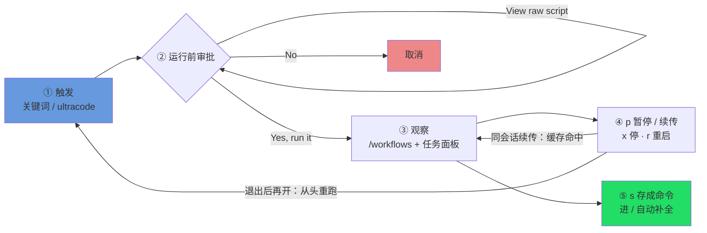

# 官方操作面板：在终端里驾驭一次 run

> 前面几章讲的是「怎么写一段 workflow 脚本」。本章换一个视角：脚本已经在运行，**重点是终端前的操作——可以按哪些键、执行哪些动作**。从触发、审批、观察，到暂停、续传、停止，再到将满意的 run 存为命令，以及官方自带的那一个 workflow。全部为用户视角的操作面。
>
> 本章覆盖的是官方 Dynamic workflows 的命令行操作面（信源：`code.claude.com/docs/en/workflows`）。它目前是 **research preview（研究预览）**。下面这些 UX、提示文案、键位有可能随版本演进，读到时以你手上那一版 Claude Code 的实际表现为准。

---

## 1 触发：怎么让一次 workflow 跑起来

不需要记忆特定命令，**在对话中描述意图即可**。官方提供了以下几种入口：

**① 关键词触发。** 消息中只要出现 `ultracode` 一词，Claude Code 会把它**高亮成紫罗兰色**，表示它接下来会生成一段 workflow 脚本。从这一刻起，Claude 转为「编排脚本」的工作方式，而不是逐回合执行。

例如输入：

```text
ultracode 把这个仓库里所有 TODO 扫一遍，归归类一下
```

「ultracode」会被高亮成紫罗兰色，Claude 接着替你写脚本、交给运行时跑。

<div class="callout tip">

**误触发了怎么办？按 `alt+w`。** 有时只是顺带在聊 `ultracode` 这个词本身（比如讨论它怎么用），并非要立即运行。此时关键词已经高亮、Claude 也准备生成脚本。按 **`alt+w`** 可以**本次忽略**这个触发，让 Claude 按普通对话处理。这是一个「本次跳过」的快捷开关。

</div>

**② `/effort ultracode`：让 Claude 默认主动编排。** 如果希望 Claude 无需提醒就**自主判断**何时该用 workflow，输入 `/effort ultracode` 即可。一次设定、当前会话常驻，之后一个请求中 Claude 可以连续启动多个 workflow（先理解、再修改、再验证）。这种模式消耗更多 token，退回普通模式使用 `/effort high`。触发与启用的完整说明在第 01 章 SS1.5 / SS1.6（见 [p1-01](#/zh/p1-01)）。

三种入口的对比如下：

| 入口 | 你做什么 | 适合 |
|---|---|---|
| 关键词 `ultracode` | 在消息里自然带上这个词 | 这一次想明确地跑一个 workflow |
| `alt+w` | 误触发时按一下 | 只是提到，并不需要现在运行 |
| `/effort ultracode` | 敲一次、当前会话常驻 | 想让 Claude 默认就主动编排 |

> 第一次跑通一个 workflow 的完整流程（从确认环境到读懂回执），在 [p2-04](#/zh/p2-04) 有手把手的演示。本章假设你已经能跑通，专讲「跑起来之后怎么驾驭」。

---

## 2 运行前审批：脚本交上来，先问你一句

Claude 写好脚本、真正开跑**之前**，Claude Code 会先弹一个**运行前审批**提示，把决定权交给你。提示里通常是这 4 个选项，具体文案会随你的 permission mode 变化：

| 选项 | 含义 |
|---|---|
| **Yes, run it** | 就跑这一次。 |
| **Yes, and don't ask again for `<name>` in `<path>`** | 跑，而且信任它：**在这个项目（`<path>`）里这个 workflow 以后不再问**。 |
| **View raw script** | 先别跑，**把脚本原文调出来看一眼**，看完再决定。 |
| **No** | 取消，不跑。 |

这个提示上还有两个键位。**`Tab` 在几个选项之间循环切换**，不用方向键也能选。**`Ctrl+G` 把脚本原文在编辑器里打开**，和 `View raw script` 看的是同一份脚本，区别在于它在你的 `$EDITOR` 里展开，可以舒舒服服地滚动、搜索，而不是挤在终端里逐行看。

<div class="callout tip">

**建议养成习惯：不确定时先选 `View raw script`。** workflow 脚本会并行派发几十甚至上百个 subagent，其中写明了它要派出哪些 agent、执行什么操作、修改哪些文件。第一次运行某个脚本，或者它涉及重要文件时，先选 **View raw script** 阅读原文，确认编排逻辑符合预期，再返回选 Yes。这一步几乎零成本，但可以避免「没预料到的操作」。

</div>

<div class="callout info">

**「don't ask again」记的是「这个项目里的这个 workflow」。** 选了第二项之后，免审批的范围是 `<name>` + `<path>` 这一对，也就是**当前项目里、这个具名 workflow**。换个项目、换个 workflow，该问还是会问。它的意思是「我信任这个项目里的这条流程」，不会扩大成「以后所有 workflow 都别问我」。

</div>

---

## 3 权限模式：审批提示什么时候出现，子代理被允许干什么

第 2 节的审批提示**是否出现、出现几次**，由当前会话的**权限模式（permission mode）**决定。这里有两个常被混淆的问题，需要分别理解：(1) **workflow 的这次 run 本身**是否需要批准；(2) run 启动后，**它派出的子代理**被允许执行什么操作。两者遵循不同的规则。

**run 级别的审批提示，按权限模式分类。** 运行前审批在什么条件下出现：

| 权限模式 | 运行前审批的行为 |
|---|---|
| **Default** / **acceptEdits** | **每次 run 都问**。例外是你之前对这个 workflow 选过「don't ask again for `<name>` in `<path>`」，那么在该项目里这个具名 workflow 就不再问了。 |
| **Auto** | 只在**首次启动**时问；任何一次按 **Yes** 都会把你的同意**记进 user settings**，之后的 run 直接放行。在 **`/effort ultracode`** 下，这个提示**被完全跳过**（ultracode 本就是「主动编排」模式，不会停下来问你）。 |
| **Bypass** / `claude -p`（print 模式）/ **Agent SDK** | **从不弹审批**。这些要么是非交互场景、要么是「信任调用方」的场景，run 不经审批闸直接起。 |

<div class="callout warn">

**子代理永远运行在 `acceptEdits` 模式，与会话模式无关。** 这是最容易产生误解的一点：无论**当前**处于哪种模式，**workflow 派出的子代理永远运行在 `acceptEdits` 模式，并继承工具白名单**。具体表现为：**文件编辑被自动批准**（子代理写文件、读文件、删文件，不会弹出确认），但**不在白名单中的 shell 命令、网络访问、或 MCP 调用，仍可能在 run 进行中弹出确认提示**。

文件编辑部分，本书有第一手验证：在 Run `wf_b1d45b4c-445` 中，一个子代理用 Write 创建文件、用 Read 回读、再用 Bash `rm` 删除。其中文件写入**没有任何审批提示**，与官方「子代理运行 acceptEdits、文件编辑自动批准」的契约一致。

因此两个提示控制的是两件不同的事：run 级别的提示（第 2 节）控制的是**是否启动 workflow**，而「acceptEdits + 继承白名单」控制的是**被派出的 agent 在无需确认的前提下能执行什么操作**。如果不希望子代理的 shell/web/MCP 操作中途打断运行，应在启动前将相关工具加入白名单。

</div>

**在桌面 App 里，审批是一张卡片，不是按键菜单。** 如果你是在 Claude 桌面 App（而不是终端）里跑 workflow，运行前审批会以一张**审批卡**的形式出现，上面列着 **workflow 名字**和它的 **phase 列表**，还带一句**关于 token 用量的提醒**（提示你 workflow 可能并行派发很多 agent）。卡片上的按钮是 **Once / Always / Deny**，对应终端的「就跑这一次 / 以后别问 / 取消」。run 起来之后，你在**后台任务（Background tasks）**侧栏里看进度，它就是终端 `/workflows` 视图在桌面端的对应物。

---

## 4 观察运行：`/workflows` 与任务面板

run 启动后，有两个观察窗口。

**入口一：斜杠命令 `/workflows`。** 输入 `/workflows`，用方向键选择目标 run，按 `Enter` 进入**进度视图**。该视图按 **phase** 组织，每个 phase 显示：派出的 agent 数量、token 合计消耗、耗时。还可以继续**钻取**：进入某个 phase，再进入某个具体 agent，查看它的 prompt、近期调用的工具、返回的结果。

**入口二：输入框下方的任务面板。** 无需输入命令，输入框正下方有一个任务面板，**一行**显示当前进度。需要详细信息时，按 `↓` 将焦点移到面板、再按 `Enter` 展开。这是一个可以随时查看的进度条。

`/workflows` 视图里的键位一览（官方原文）：

| 键 | 作用 |
|---|---|
| `↑` / `↓` | 在 phase 列表、或某个 phase 内的 agent 列表里上下选。 |
| `Enter` 或 `→` | 钻进去看更细：先钻进 phase，再钻进某个 agent，看它的 prompt、近期工具调用、结果。 |
| `Esc` | 退回上一层。 |
| `j` / `k` | 当某个 agent 的详情太长、一屏装不下时，用它俩上下滚动。 |
| `p` | **暂停 / 续传**这个 run（详见第 5 节）。 |
| `x` | **停掉**选中的那个 agent；如果焦点正落在整个 run 上，就停**整个 workflow**。 |
| `r` | **重启**选中的那个**正在运行**的 agent。 |
| `s` | 把这次 run 的脚本**存成一条命令**（详见第 6 节）。 |

<div class="callout info">

**`x` 停止什么，取决于焦点所在的层级。** 这是一个容易误操作的地方：焦点在**某个 agent** 上按 `x`，停止的是那一个 agent；焦点在**整个 run**（最上层）上按 `x`，停止的是**整条 workflow**。操作前应确认高亮所在的层级。

</div>

进度/日志这套机制（脚本侧用 `log()` 往进度树上写叙述行、phase 怎么组织进度）在 [p2-09](#/zh/p2-09) 有从脚本视角的讲解。本章只讲你在终端里**看**和**操作**这一面。

---

## 5 暂停 · 续传 · 停止 · 重启

运行到中途，如果需要暂停查看、修改、或终止，以下操作都在 `/workflows` 视图中通过单键完成。

- **暂停 / 续传：`p`。** 选中一个 run 按 `p` 暂停；再按一次（或让 Claude 用同一段脚本重启）就续传。续传的好处是：**已经跑完的 agent 返回缓存结果**（不重花 token），其余的才真正实跑。
- **停掉一个 agent / 整个 workflow：`x`。** 见上一节，焦点在 agent 上停那一个，在 run 上停整条。
- **重启一个 agent：`r`。** 选中某个**正在运行**的 agent 按 `r`，把它重启。

<div class="callout warn">

**续传只在「同一个会话」内有效——这是最容易踩到的边界。** 停止一个 run，稍后在**同一个 Claude Code 会话**中续传，缓存仍然有效、已完成的 agent 即时返回。但**一旦退出 Claude Code，下次打开就是一个新会话；新会话会将这条 workflow 从头重新运行**（官方原文：「the next session starts the workflow fresh」）。续传缓存**不跨会话保留**。如果一个 run 运行到一半想留到之后继续，关闭再打开不会接续进度，而是从头开始。

</div>

<div class="callout info">

**终端中的 `p` 续传，与脚本侧的 `resumeFromRunId` 是同一机制的两个入口。** 在 `/workflows` 中按 `p` 续传，是**交互式**入口；脚本侧的程序化入口是调用 Workflow 工具时传入 `resumeFromRunId: "wf_..."`，未改动的 `agent()` 调用同样即时返回缓存结果。本书实测同脚本 + 同 args 续传 = **100% 缓存命中、0 新 token**（Run `wf_9c94951d-58c`）。两条路径指向同一套缓存机制，详细说明见 [p4-22](#/zh/p4-22)。

</div>



---

## 6 把满意的 run 存成命令

一次 run 完成后，如果对结果满意并希望**之后直接复用**这条流程，在 `/workflows` 视图中按 **`s`**，即可将这次 run 背后的脚本**保存为一条命令**。

保存后会产生三个效果：

1. 这个 workflow 变成了一条**具名命令**；
2. 它会出现在你敲 `/` 时的**自动补全**列表里；
3. 它和官方自带的命令**并列**，用起来没区别，下次 `/<你起的名字>` 就能再跑。

<div class="callout tip">

**这是积累 workflow 库最轻量的方式。** 不需要先创建文件或配置目录：运行一个满意的 run，按 `s` 保存，它就进入了命令列表。积累到一定数量后，如果需要正式管理（版本、参数、团队共享），参见 [p5-25](#/zh/p5-25) 中系统构建 workflow 库的方法；作者视角的创作流程在 [p6-27](#/zh/p6-27)。

</div>

---

## 7 唯一自带的 workflow：`/deep-research`

Claude Code **自带**的具名 workflow 只有一个：**`/deep-research <你的问题>`**。本书在 v2.1.156 实测确认，内置具名工作流注册表中只有它；早期版本中的其他内置 workflow 已移除，不可依赖。

它执行的是一套标准的研究流程：

1. **多角度并行检索**：从不同角度同时去查；
2. **抓取并交叉核对**：把查到的来源抓回来互相对照；
3. **对每条论断投票**：多个 agent 给每个结论投票；
4. **输出带引用的报告**：报告落回你的会话，带信源引用，而且**没过交叉核对的论断已经被过滤掉了**。

用法示例：

```text
/deep-research Dynamic workflows 的并发上限到底是多少？官方和实测各是什么口径？
```

<div class="callout warn">

**`/deep-research` 需要 WebSearch 工具可用。** 它的整套流程建立在「真的去网上查」之上，因此环境中必须有 WebSearch 工具。如果没有，这条流程无法运行。

</div>

`/deep-research` 的配方拆解和真实运行效果（含一次真实运行 `wf_6090decc-8a5`），在 [p3-13](#/zh/p3-13) 有详细说明。

---

## 8 边界与跨平台 corner case

本节列出几条实际使用中会遇到的边界。提前了解可以减少排查时间。

**研究预览。** 整个 Dynamic workflows 还是 research preview，上面这些 UX、提示文案、字段、键位都**可能随版本演进**。把本章当「v2.1.154+ 这一代的操作地图」，真有出入以你手上那版的实际表现为准。

**在哪些地方能用。** Dynamic workflows **所有付费计划都能用**（Pro、Max、Team、Enterprise），另外也支持 **Anthropic API**、**Amazon Bedrock**、**Google Cloud Vertex AI**、**Microsoft Foundry**，所以本章这套操作在以上各处都适用，不只限于第一方的 CLI。**Pro** 要在 `/config` 的 **Dynamic workflows** 那一行手动打开；官方文档**没说**其他计划默认是开还是关，所以如果某个 workflow 触发不了，先去你自己的 `/config` 里看那一行的开关。（启用的来龙去脉，包括两层模型和 0 成本探针，在第 01 章 SS1.5，见 [p1-01](#/zh/p1-01)。）

**运行中不能插入用户输入。** run 启动后，**无法**像普通对话那样中途添加消息改变执行方向；会**自动**中途打断运行的，只有 **agent 触发的权限提示**（「是否允许执行某个操作」的确认）。但仍可以**主动**操控它：在 `/workflows` 中按 `p` 暂停/续传、按 `x` 停止某个 agent 或整条 run（见第 4 节的键位表）。如果需要「运行一个阶段、人工确认后再运行下一阶段」这样的模式，正确做法是**将每个阶段拆成独立的 workflow**，每段完成后查看结果、确认后再手动启动下一段。

**脚本本身没有文件系统 / shell。** workflow 脚本只负责**编排**，它本身无法读取文件或运行命令；所有实际的 IO（读写文件、运行 shell）都由它派出的 **agent** 执行。脚本中不会出现 `fs`、`require`、`process` 等 API（细节见 [p2-04](#/zh/p2-04) 中对「Workflow 脚本 vs Node 脚本」的说明）。

**并发与总量上限。** 一次 workflow 同时最多跑 **16 个并发 agent**（如果你机器 CPU 核心少，上限还会更低）；超出的会**排队**，不是报错。另外，**单个 run 最多派 1000 个 agent**，这是一道「防失控循环」的总闸。

**用量与配额。** 工作流消耗的 token 计入你的用量配额和速率限制。一个并行派发了大量 agent 的 workflow 可能在几分钟内消耗你相当一部分配额，规划脚本时把这一点考虑进去。

<div class="callout info">

**关闭整个功能，以及关闭后的影响。** 如果不需要 Dynamic workflows，有四个开关可供选择，任选一个即可：

- **单机层面**：在 `/config` 的 **Dynamic workflows** 那一行关掉；或在 `settings.json` 里写 `"disableWorkflows": true`；或设环境变量 `CLAUDE_CODE_DISABLE_WORKFLOWS=1`（启动时读取，三系统写法和启用式一致：macOS/Linux 跑 `CLAUDE_CODE_DISABLE_WORKFLOWS=1 claude`，Windows CMD 先 `set CLAUDE_CODE_DISABLE_WORKFLOWS=1` 再跑 `claude`，PowerShell 跑 `$env:CLAUDE_CODE_DISABLE_WORKFLOWS="1"; claude`；想长期生效、跨平台通用就写进 `settings.json` 的 `env` 段）。
- **整个组织**：在组织的 **managed settings** 里写 `"disableWorkflows": true`，或用 Claude Code **管理后台页面**上的开关。

一旦关掉，有三件事会立刻变样：**自带命令没了**（比如 `/deep-research` 不再存在）、**`ultracode` 触发关键词失效**（打它不再高亮、也不再把 Claude 切到编排模式）、**`/effort` 菜单里的 ultracode 挡位消失**。如果你发现 `/deep-research` 不见了、或关键词不触发了，第一个要查的就是某个关闭开关是不是被打开了。

</div>

**TUI 键位是跨平台一致的。** 上面那张键位表里的 `↑↓`、`Enter`、`Esc`、`j`/`k`、`p`/`x`/`r`/`s`，是终端通用的按键，macOS、Linux、Windows 上**表现一致**，不用为不同系统记两套。

<div class="callout warn">

**唯独 `alt+w` 这种带 Alt 的键，在 macOS 上要留个心。** macOS 的 **Alt 就是 Option 键**。有些终端（比如 macOS 自带的 Terminal.app）默认不把 Option 当 Meta 键，于是 `alt+w` 可能按下去没反应。解决办法是去终端设置里打开「**Use Option as Meta key**」（Terminal.app 在 Settings > Profiles > Keyboard；iTerm2 在 Profiles > Keys）。

这是**通用的终端知识**，并非 Dynamic workflows 专属的官方保证，但它实实在在会影响你用不用得了 `alt+w`，如实提醒一句。

</div>

---

## 本章小结

- **触发**：消息里带 `ultracode`（会高亮成紫罗兰色）；误触发按 `alt+w` 本次忽略；想让 Claude 默认主动编排用 `/effort ultracode`。
- **审批**：开跑前 4 选项，`Yes, run it` / `Yes, and don't ask again for <name> in <path>`（本项目内不再问）/ `View raw script`（先读再定，推荐）/ `No`；提示上 `Tab` 循环切选项、`Ctrl+G` 把脚本在编辑器里打开。
- **权限模式**：Default/acceptEdits 每次 run 都问（除非已选 don't-ask-again）；Auto 仅首次问（`ultracode` 下完全跳过）；Bypass / `claude -p` / Agent SDK 从不问。**子代理永远跑 acceptEdits 且继承你的白名单**，与会话模式无关：文件编辑自动批准（第一手实测，Run `wf_b1d45b4c-445`），但不在白名单的 shell/web/MCP 仍可能 mid-run 弹窗。桌面 App 里是一张审批卡（名字 + phase 列表 + token 提醒；Once/Always/Deny），进度在后台任务侧栏看。
- **观察**：`/workflows` 进进度视图（按 phase 看 agent 数 / token / 耗时、可钻取），输入框下方任务面板看一行进度；键位 `↑↓ Enter/→ Esc j/k p x r s` 全在第 4 节那张表里。
- **暂停续传停止**：`p` 暂停/续传（已完成 agent 走缓存）、`x` 停 agent 或整条 run、`r` 重启 agent；**续传仅同会话**，退出 Claude Code 再开会**从头重跑**；终端 `p` 与脚本侧 `resumeFromRunId` 是同一套缓存的两个面。
- **存为命令**：满意就按 `s`，workflow 进 `/` 自动补全、与自带命令并列。
- **自带 workflow**：只有 `/deep-research <question>`（多角度检索 → 交叉核对 → 投票 → 带引用、已过滤的报告），需 WebSearch 可用。
- **可用范围**：所有付费计划（Pro/Max/Team/Enterprise）+ Anthropic API + Bedrock + Vertex AI + Microsoft Foundry；Pro 走 `/config` 那一行开启，其他计划官方未给默认值。
- **关闭**：`/config` 开关 / `settings.json` 写 `"disableWorkflows": true` / `CLAUDE_CODE_DISABLE_WORKFLOWS=1` / managed settings 或管理后台（整组织）。关掉后：自带命令没了、`ultracode` 触发关键词失效、`/effort` 里的 ultracode 挡位消失。
- **用量**：工作流消耗的 token 计入你的用量配额和速率限制。
- **边界**：研究预览（UX 可能变）；运行中不能插入输入；脚本无 fs/shell；最多 16 并发 / 单 run 1000 agent；TUI 键位跨平台一致，唯 `alt+w` 在**部分 macOS 终端**可能需把 Option 设为 Meta。

> 继续阅读：[第 09 章 · 进度·日志·续传·预算](#/zh/p2-09)
