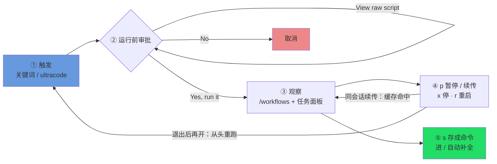

# 官方操作面板：在终端里驾驭一次 run

> 前面几章讲的是「怎么写一段 workflow 脚本」。这一章换个视角：脚本已经在跑了，**你坐在终端前，手里能按哪些键、做哪些事**——从触发、审批、观察，到暂停续传停止、把满意的 run 存成命令，再到官方自带的那一个 workflow。全是用户视角的操作面，照着就能上手。
>
> 本章覆盖的是官方 Dynamic workflows 的命令行操作面（信源：`code.claude.com/docs/en/workflows`）。它目前是 **research preview（研究预览）**，所以下面这些 UX、提示文案、键位有可能随版本演进——读到时以你手上那一版 Claude Code 的实际表现为准。

---

## 1 触发：怎么让一次 workflow 跑起来

你不用记什么命令，**在对话里把意图说出来就行**。官方给了几个台面入口：

**① 关键词触发。** 你的消息里只要出现 `workflow` 或 `workflows` 这个词，Claude Code 会**把这个词高亮**出来，提醒你「我接下来要去写一段 workflow 脚本了」——然后 Claude 就改用「编排脚本」的方式来干活，而不是逐回合自己慢慢做。

比如你打：

```text
帮我跑一个 workflow，把这个仓库里所有 TODO 扫一遍，归归类
```

「workflow」会被高亮，Claude 接着替你写脚本、交给运行时跑。

<div class="callout tip">

**误触发了怎么办？按 `alt+w`。** 有时候你只是顺口提到了「这个 workflow 的设计」，并不是真要现在跑一个。这时候关键词会被高亮、Claude 准备写脚本——你按一下 **`alt+w`**，就能**本次忽略**这个触发，让 Claude 当普通对话处理。这是「这次别当真」的快捷开关。

</div>

**② `/effort ultracode`：让 Claude 默认主动编排。** 如果你希望 Claude 不用你提醒、**自己判断**什么时候该用 workflow，敲一次 `/effort ultracode` 就好——它一次设定、整场会话常驻，之后一个请求里 Claude 可以连开好几个 workflow（先理解、再改、再验证）。它更耗 token，想退回普通模式用 `/effort high`。这套触发与启用的来龙去脉，第 01 章 §1.5 / §1.6 讲得最细（见 [p1-01](#/zh/p1-01)）。

把这三种入口放一起对比，你就知道什么时候该用哪个：

| 入口 | 你做什么 | 适合 |
|---|---|---|
| 关键词 `workflow`/`workflows` | 在消息里自然带上这个词 | 这一次想明确地跑一个 workflow |
| `alt+w` | 误触发时按一下 | 你只是提到、并不想现在跑 |
| `/effort ultracode` | 敲一次、整场常驻 | 想让 Claude 默认就主动编排 |

> 第一次跑通一个 workflow 的完整流程（从确认环境到读懂回执），在 [p2-04](#/zh/p2-04) 有手把手的演示——本章假设你已经能跑通，专讲「跑起来之后怎么驾驭」。

---

## 2 运行前审批：脚本交上来，先问你一句

Claude 写好脚本、真正开跑**之前**，Claude Code 会先弹一个**运行前审批**提示，把决定权交给你。提示里通常是这 4 个选项（具体文案会随你的 permission mode 变化）：

| 选项 | 含义 |
|---|---|
| **Yes, run it** | 就跑这一次。 |
| **Yes, and don't ask again for `<name>` in `<path>`** | 跑，而且**在这个项目（`<path>`）里这个 workflow 以后不再问**——信任它了。 |
| **View raw script** | 先别跑，**把脚本原文调出来看一眼**，看完再决定。 |
| **No** | 取消，不跑。 |

<div class="callout tip">

**养成习惯：拿不准就先 `View raw script`。** workflow 脚本会替你扇出几十上百个 subagent，里面写了它要派谁、干什么、改哪些文件。第一次跑某个脚本、或者它要动你在意的东西时，先选 **View raw script** 把原文读一遍——确认它的编排逻辑和你想的一致，再回头选 Yes。这一步几乎零成本，却能帮你拦下「我没想到它会这么干」的意外。

</div>

<div class="callout info">

**「don't ask again」记的是「这个项目里的这个 workflow」。** 选了第二项之后，免审批的范围是 `<name>` + `<path>` 这一对——也就是**当前项目里、这个具名 workflow**。换个项目、换个 workflow，该问还是会问。所以它是「我信任这个项目里的这条流程」，不是「以后所有 workflow 都别问我」。

</div>

---

## 3 观察运行：`/workflows` 与任务面板

run 一旦跑起来，你有两个观察窗口。

**入口一：斜杠命令 `/workflows`。** 敲 `/workflows`，用方向键选中你要看的那个 run，按 `Enter` 进**进度视图**。这个视图按 **phase** 组织，每个 phase 给你看：派了几个 agent、token 合计花了多少、耗了多久。你还能继续往里**钻取**——钻进某个 phase、再钻进某个具体 agent，看它的 prompt、最近调了哪些工具、返回了什么结果（也就是「这个 agent 到底找到了什么」）。

**入口二：输入框下方的任务面板。** 不用专门敲命令，你输入框正下方就有一个任务面板，**一行**显示当前进度。想细看，按 `↓` 把焦点移过去、再按 `Enter` 展开。它是你余光里随时能瞄一眼的进度条。

`/workflows` 视图里的完整键位，列成一张表（官方原文）：

| 键 | 作用 |
|---|---|
| `↑` / `↓` | 在 phase 列表、或某个 phase 内的 agent 列表里上下选。 |
| `Enter` 或 `→` | 钻进去看更细：先钻进 phase，再钻进某个 agent，看它的 prompt、近期工具调用、结果。 |
| `Esc` | 退回上一层。 |
| `j` / `k` | 当某个 agent 的详情太长、一屏装不下时，用它俩上下滚动。 |
| `p` | **暂停 / 续传**这个 run（详见第 4 节）。 |
| `x` | **停掉**选中的那个 agent；如果焦点正落在整个 run 上，就停**整个 workflow**。 |
| `r` | **重启**选中的那个**正在运行**的 agent。 |
| `s` | 把这次 run 的脚本**存成一条命令**（详见第 5 节）。 |

<div class="callout info">

**`x` 停什么，取决于你的焦点落在哪。** 这是个容易按错的地方：焦点在**某个 agent** 上按 `x`，停的是那一个 agent；焦点在**整个 run**（最上层）上按 `x`，停的是**整条 workflow**。按之前先看清楚高亮停在哪一层。

</div>

进度/日志这套机制（脚本侧用 `log()` 往进度树上写叙述行、phase 怎么组织进度）在 [p2-09](#/zh/p2-09) 有从脚本视角的完整讲解——本章只讲你在终端里**看**和**操作**这一面。

---

## 4 暂停 · 续传 · 停止 · 重启

跑到一半，你想停下来看看、改改、或者干脆叫停——这几个动作都在 `/workflows` 视图里用单键完成。

- **暂停 / 续传：`p`。** 选中一个 run 按 `p` 暂停；再按一次（或让 Claude 用同一段脚本重启）就续传。续传的关键好处是：**已经跑完的 agent 直接返回缓存结果**（不重花 token），其余的才真正实跑。
- **停掉一个 agent / 整个 workflow：`x`。** 见上一节——焦点在 agent 上停那一个，在 run 上停整条。
- **重启一个 agent：`r`。** 选中某个**正在运行**的 agent 按 `r`，把它重启。

<div class="callout warn">

**续传只在「同一个会话」里有效——这是最关键的一条边界。** 你停掉一个 run、过一会儿在**同一个 Claude Code 会话**里续传，缓存还在、已完成的 agent 秒回。但是——**一旦你退出了 Claude Code，下次再打开，是一个新会话；这个新会话会把这条 workflow 从头重新跑一遍**（官方原文：「the next session starts the workflow fresh」）。换句话说，续传的缓存**不跨会话保留**。所以如果一个 run 跑到一半你想留着明天接着弄，别指望关掉再开能接上——它会从头开始。

</div>

<div class="callout info">

**终端里的 `p` 续传，和脚本侧的 `resumeFromRunId` 是同一件事的两个面。** 你在 `/workflows` 里按 `p` 续传，是**交互式**的入口；脚本侧还有一个程序化的入口——调 Workflow 工具时带上 `resumeFromRunId: "wf_..."`，未改动的 `agent()` 调用同样秒回缓存。本书实测过同脚本 + 同 args 续传 = **100% 缓存命中、0 新 token**（Run `wf_9c94951d-58c`）。两条路通向同一套缓存机制，深入细节见 [p4-22](#/zh/p4-22)。

</div>



---

## 5 把满意的 run 存成命令

一次 run 跑完，结果你很满意，想**以后一键重用**这条流程——在 `/workflows` 视图里按 **`s`**，就能把这次 run 背后的脚本**存成一条命令**。

存好之后会发生三件事：

1. 这个 workflow 变成了一条**具名命令**；
2. 它会出现在你敲 `/` 时的**自动补全**列表里；
3. 它和官方自带的命令**并列**，用起来没区别——下次直接 `/<你起的名字>` 就能再跑。

<div class="callout tip">

**这是「积累自己的 workflow 库」最轻的一种方式。** 你不用先去写文件、配目录——跑通一个满意的 run，按个 `s` 存下来，它就进了你的命令表。等你攒多了、想正经管理（版本、参数、分享给团队），再看 [p5-25](#/zh/p5-25) 怎么系统地构建自己的 workflow 库；作者视角的完整创作流程在 [p6-27](#/zh/p6-27)。

</div>

---

## 6 唯一自带的 workflow：`/deep-research`

Claude Code **自带**的具名 workflow 只有一个：**`/deep-research <你的问题>`**。本书在 v2.1.156 实测确认过——内置具名工作流注册表里就剩它一个（早期版本里那几个内置已经不在了，不可依赖）。

它干的事，是一套很标准的研究流程：

1. **多角度扇出检索**——从不同角度同时去查；
2. **抓取并交叉核对**——把查到的来源抓回来互相对照；
3. **对每条论断投票**——多个 agent 给每个结论投票；
4. **输出带引用的报告**——报告落回你的会话，带信源引用，而且**没过交叉核对的论断已经被过滤掉了**。

用法很直接：

```text
/deep-research Dynamic workflows 的并发上限到底是多少？官方和实测各是什么口径？
```

<div class="callout warn">

**`/deep-research` 需要 WebSearch 工具可用。** 它的整套流程建立在「真的去网上查」之上——所以你的环境里得有 WebSearch 工具。如果没有，这条流程跑不起来。

</div>

`/deep-research` 怎么写成食谱、真跑出来什么样（含一次真实运行 `wf_6090decc-8a5`），在 [p3-13](#/zh/p3-13) 有完整拆解。

---

## 7 边界与跨平台 corner case

最后这一节，是几条你迟早会撞上的边界。先记住它们，能省掉不少「咦怎么不对」的时间。

**研究预览。** 整个 Dynamic workflows 还是 research preview，上面这些 UX、提示文案、字段、键位都**可能随版本演进**——把本章当「v2.1.154+ 这一代的操作地图」，真有出入以你手上那版的实际表现为准。

**运行中不能插入用户输入。** run 一旦跑起来，你**没法**像平时对话那样中途补一句话去改它的走向——会**自动**中途打断它的，只有 **agent 触发的权限提示**（「要不要允许它执行某个操作」那种确认）。但你仍能**主动**操控它：在 `/workflows` 里按 `p` 暂停/续传、按 `x` 停掉某个 agent 或整条 run（见第 3 节那张键位表）。所以如果你要的是「跑一阶段、我签收一下、再跑下一阶段」这种人工卡点，正确做法是**把每个阶段拆成独立的 workflow**，一段跑完看一眼、满意了再手动起下一段。

**脚本本身没有文件系统 / shell。** workflow 脚本只负责**编排**，它自己读不了文件、跑不了命令——所有真正的 IO（读写文件、跑 shell）都由它派出去的 **agent** 去做。所以你在脚本里看不到 `fs`、`require`、`process` 这些（细节见 [p2-04](#/zh/p2-04) 那一章对「这是 Workflow 脚本、不是 Node 脚本」的拆解）。

**并发与总量上限。** 一次 workflow 同时最多跑 **16 个并发 agent**（如果你机器 CPU 核心少，上限还会更低）；超出的会**排队**，不是报错。另外，**单个 run 最多派 1000 个 agent**——这是一道「防失控循环」的总闸。

**TUI 键位是跨平台一致的。** 上面那张键位表里的 `↑↓`、`Enter`、`Esc`、`j`/`k`、`p`/`x`/`r`/`s`，是终端通用的按键，macOS、Linux、Windows 上**表现一致**，不用为不同系统记两套。

<div class="callout warn">

**唯独 `alt+w` 这种带 Alt 的键，在 macOS 上要留个心。** macOS 的 **Alt 就是 Option 键**。问题在于：**有些终端（比如 macOS 自带的 Terminal.app）默认不把 Option 当 Meta 键**，于是 `alt+w` 可能按下去没反应。解决办法是去终端设置里打开「**Use Option as Meta key**」（Terminal.app 在 Settings → Profiles → Keyboard；iTerm2 在 Profiles → Keys）。

这是**通用的终端知识**，不是 Dynamic workflows 专属的官方保证——但它实实在在会影响你用不用得了 `alt+w`，所以在这儿如实提醒一句。

</div>

---

## 本章小结

- **触发**：消息里带 `workflow`/`workflows`（会高亮）；误触发按 `alt+w` 本次忽略；想让 Claude 默认主动编排用 `/effort ultracode`。
- **审批**：开跑前 4 选项——`Yes, run it` / `Yes, and don't ask again for <name> in <path>`（本项目内不再问）/ `View raw script`（先读再定，推荐）/ `No`。
- **观察**：`/workflows` 进进度视图（按 phase 看 agent 数 / token / 耗时、可钻取），输入框下方任务面板看一行进度；键位 `↑↓ Enter/→ Esc j/k p x r s` 全在第 3 节那张表里。
- **暂停续传停止**：`p` 暂停/续传（已完成 agent 走缓存）、`x` 停 agent 或整条 run、`r` 重启 agent；**续传仅同会话**——退出 Claude Code 再开会**从头重跑**；终端 `p` 与脚本侧 `resumeFromRunId` 是同一套缓存的两个面。
- **存为命令**：满意就按 `s`，workflow 进 `/` 自动补全、与自带命令并列。
- **自带 workflow**：只有 `/deep-research <question>`（多角度检索 → 交叉核对 → 投票 → 带引用、已过滤的报告），需 WebSearch 可用。
- **边界**：研究预览（UX 可能变）；运行中不能插入输入；脚本无 fs/shell；最多 16 并发 / 单 run 1000 agent；TUI 键位跨平台一致，唯 `alt+w` 在**部分 macOS 终端**可能需把 Option 设为 Meta。

> 继续阅读：[第 09 章 · 进度·日志·续传·预算](#/zh/p2-09)
