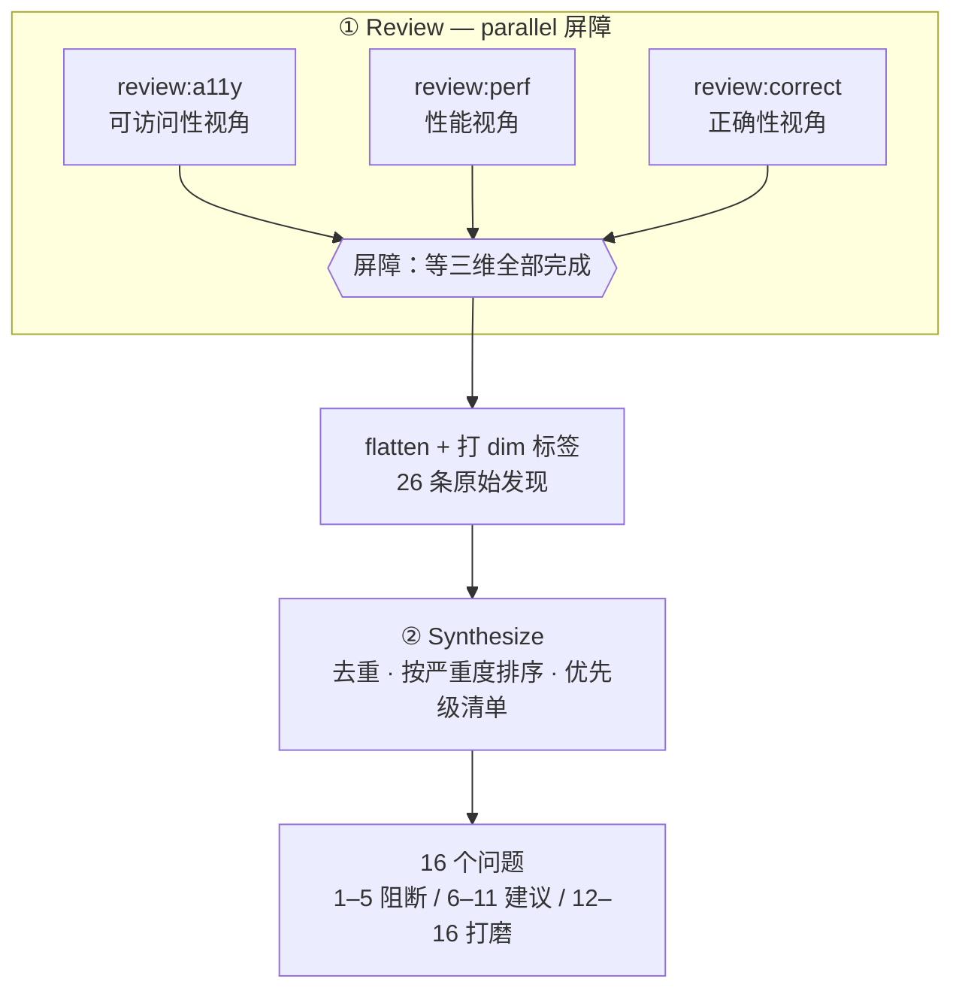
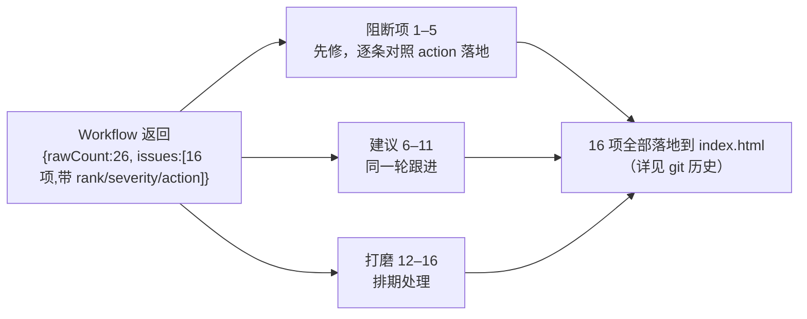

# 第 11 章 · PR 多视角 Review

> 一次有效的 Code Review 需要覆盖多个角度。安全工程师看注入和 XSS，性能工程师看阻塞和重排，可访问性专家看焦点和对比度。他们**各看各的、互不影响**，最后由一个人把所有意见**汇总、去重、排出修复顺序**。本章把这套人类协作搬进 Workflow：**parallel 并发评审（a11y / perf / correctness）→ 一个 synthesize agent 综合成优先级清单**。贯穿案例是一次**真正的 dogfooding**：用这个配方审查了本书自己的前端 `index.html`，发现了 XSS、无焦点指示、重复 heading ID 等问题，并据此**真实修复了 16 项**。

---

## 11.1 配方动机

第 10 章的「分片代码审查」解决的是**单一视角、规模太大**的问题：一个 diff 几千行，切成片让多个 agent 分头看。本章解决的是另一个**正交问题**：**同一份代码，三个独立视角（a11y、perf、correctness）**。

为什么不能让一个 agent「把所有角度一起看」？三个现实原因：

- **注意力会被稀释。** 让同一个 agent 同时关注安全、性能、可访问性，每个角度都只能浅尝辄止，产出的清单看似覆盖全面，实际每项都不够深入。把角度**拆给独立 agent**，每个 agent 只带一个视角深入检查，发现密度明显更高。
- **天然可以并发。** a11y 评审不依赖性能评审的结论，三个视角互不相关，这正是 `parallel()` 屏障的**教科书场景**：并发执行，统一收集。
- **汇总是一道单独的工序。** 三个视角各自产出的发现会**重叠**（例如「CDN 脚本阻塞渲染」既是性能问题，也可能被 a11y 评审附带提到），也需要**跨视角排优先级**（一个 CRITICAL 的 XSS 必须排在一个 LOW 的文案问题前面）。这道「去重加排序」的工作，需要交给**一个能看到全部发现的 agent**，因此它必须在并发屏障**之后**。

于是这个配方就是一个干净的两阶段结构：



<div class="callout info">

**为什么这里该用屏障（`parallel`），不是 `pipeline`？** 回顾第 08 章的判据：多阶段默认 pipeline，只有当下一阶段需要前一阶段「全部」item 的结果时才用屏障。synthesize 要做的是**全局去重和跨视角排序**，它必须等三个视角**都**交卷才能下手。这正是第 08 章列举的「正确使用屏障的真实形态：去重」。

</div>

---

## 11.2 完整脚本

**（依据 transcript 骨架补全的示意脚本，未逐字实跑；本次真实运行的 Run ID 与用量见 11.3。）** 下面是这次真实运行的脚本骨架，结构与 `assets/transcripts/frontend-review.md` 一致。transcript 里三个视角的 `prompt` 和 synthesize 的 schema 用 `...`/`{...}` 省略了，这里**补全成可以直接运行的样子**，并逐处标注「（示意补全）」；transcript 里本来就有的部分（`meta`、`FINDINGS`、`parallel` 评审与 flatten、synthesize 调用、`return`）保持原样。

```javascript
export const meta = {
  name: 'frontend-review',
  description: 'Multi-dimension review of index.html: a11y, performance, correctness',
  phases: [{ title: 'Review' }, { title: 'Synthesize' }],
}

const FILE = '/abs/path/to/index.html'  // 被评审的真实文件

// 所有维度共用同一套发现 schema：严重度 + 标题 + 细节 + 修复建议
const FINDINGS = {
  type: 'object',
  properties: {
    findings: {
      type: 'array',
      items: {
        type: 'object',
        properties: {
          severity: { type: 'string', enum: ['critical', 'high', 'medium', 'low'] },
          title: { type: 'string' },
          detail: { type: 'string' },
          fix: { type: 'string' },
        },
        required: ['severity', 'title', 'detail', 'fix'],
      },
    },
  },
  required: ['findings'],
}

// 三个正交维度，每个带各自的视角化 prompt（示意补全：transcript 中以 ... 省略）
const dims = [
  {
    key: 'a11y',
    prompt:
      `You are an accessibility (a11y) reviewer. Read ${FILE} and find WCAG / keyboard / ` +
      `screen-reader / focus / contrast / landmark issues. Be specific with selectors and WCAG refs.`,
  },
  {
    key: 'perf',
    prompt:
      `You are a web performance reviewer. Read ${FILE} and find render-blocking resources, ` +
      `layout thrash, unthrottled handlers, oversized/eager assets, main-thread work. Be specific.`,
  },
  {
    key: 'correct',
    prompt:
      `You are a correctness/security reviewer. Read ${FILE} and find XSS sinks, race conditions, ` +
      `state desync, missing error handling, logic bugs. Be specific and show the offending code.`,
  },
]

phase('Review')
// 三维并发评审：每条 thunk 跑一个 agent，schema 强制结构化发现，再打上 dim 标签
const reviews = await parallel(
  dims.map((d) => () =>
    agent(d.prompt, { label: `review:${d.key}`, phase: 'Review', schema: FINDINGS })
      .then((r) => ({ dim: d.key, findings: (r && r.findings) || [] }))
  )
)
// 屏障释放后：过滤掉挂掉的维度，摊平成一条扁平发现流，每条带 dim 来源
const all = reviews.filter(Boolean).flatMap((r) => r.findings.map((f) => ({ ...f, dim: r.dim })))

phase('Synthesize')
// 综合 agent 看到全部发现：去重、按严重度排序、给出可执行的优先级清单
const SUMMARY = {  // 示意补全：transcript 中以 {...} 省略
  type: 'object',
  properties: {
    issues: {
      type: 'array',
      items: {
        type: 'object',
        properties: {
          rank: { type: 'number' },
          severity: { type: 'string', enum: ['critical', 'high', 'medium', 'low'] },
          title: { type: 'string' },
          action: { type: 'string' },
          dims: { type: 'array', items: { type: 'string' } },  // 该问题被哪些维度命中
        },
        required: ['rank', 'severity', 'title', 'action'],
      },
    },
    blockers: { type: 'array', items: { type: 'number' } },  // 上线阻断项的 rank
  },
  required: ['issues'],
}
const summary = await agent(
  `These are ${all.length} findings (JSON): ${JSON.stringify(all)}. ` +
    `Dedup across dimensions, rank by severity, and produce a prioritized action list. ` +
    `Mark which ranks are release blockers.`,
  { label: 'synthesize', phase: 'Synthesize', schema: SUMMARY }
)

const byDimension = dims.reduce(
  (acc, d) => ({ ...acc, [d.key]: all.filter((f) => f.dim === d.key).length }),
  {}
)
return { rawCount: all.length, byDimension, ...summary }
```

三个值得注意的写法：

- **复用 `schema`**。三个视角共用同一个 `FINDINGS` schema，使不同视角的产出**结构完全一致**，synthesize 阶段才能把它们当成同质数据流来处理。schema 的强约束细节见第 07 章。
- **用 `.then()` 打标签**。每个评审 agent 返回后立刻 `.then((r) => ({ dim, findings }))`，把「这条发现来自哪个视角」**附加**到结果里。这是第 08 章介绍的 `.then()` 合并上下文惯用法。
- **用 `opts.phase` 显式归组**。在 `parallel` 内部，每个 `agent()` 都显式带上 `phase: 'Review'`，避免并发的 agent 竞争全局的 `phase()`（第 08/05 章的进度归组陷阱）。

---

## 11.3 真实运行结果

> **真实运行**：Run ID `wf_4c5caabb-b73`，Task ID `wss21eu0x`。原始记录见 `assets/transcripts/frontend-review.md`。
> 真实用量：`agent_count=4`（3 评审 + 1 综合）｜ `tool_uses=13` ｜ `total_tokens=221648` ｜ `duration_ms=272643`（约 4.5 分钟）。

### 从 26 条原始发现到 16 个问题

三个视角并发交卷，一共产出 **rawCount = 26** 条原始发现：

| 视角 | 原始发现数 |
|---|---|
| a11y（可访问性） | 10 |
| perf（性能） | 6 |
| correct（正确性/安全） | 10 |
| **合计** | **26** |

synthesize agent 看完全部 26 条后，**跨视角去重，再按严重度排序**，收敛成 **16 个明确问题**，并给出三档修复顺序：**1--5 上线阻断项、6--11 强烈建议、12--16 打磨**。

<div class="callout tip">

**26 → 16 这一步，就是 synthesize 的全部价值。** 10 条 a11y 发现里，「无焦点指示」和「焦点不可见」其实是同一回事；perf 的「CDN 阻塞」和 correct 顺带提的「脚本加载方式」也有重叠。只有一个能看到**全部** 26 条的 agent，才能把它们合并，并判定「XSS 排第 1、文案问题排第 13」。单个视角的评审 agent **做不到**这事，它只看得见自己负责的部分。

</div>

### 上线阻断项（synthesize 真实判定的 top 5）

以下是综合 agent 判定的必须先修的 5 项，均为真实产出，节选判定和修复建议：

| # | 严重度 | 问题 | 真实判定与修复 |
|---|---|---|---|
| 1 | CRITICAL | **DOM XSS** | `marked.parse()` 的结果直接塞进 `innerHTML`；marked v12 没有内置消毒（v5 起就移除了），`gfm:true` 又放行原始内联 HTML → 同源 `.md` 里的 `` 就会执行脚本。**修**：引入 DOMPurify 包一层；mermaid 错误回退也要转义 `&`/`"`，而不是只转 `<`。 |
| 2 | CRITICAL | **无焦点指示** | 全局 `button{border:none}` 抹掉了 outline，整张样式表里一条 `:focus-visible` 都没有 → 整页能 Tab，但焦点看不见（WCAG 2.4.7）。**修**：加上 `:focus-visible{outline:2px solid var(--accent);outline-offset:2px}`。 |
| 3 | HIGH | **重复 heading ID** | `enhance()` 纯按文本生成 id，又不去重 → 重复标题撞 id，TOC/锚点永远跳到第一个；空标题或纯标点标题 → `id=''`。**修**：每次渲染用 slugger 去重 + 空值兜底 `section-<i>`。 |
| 4 | HIGH | **异步渲染竞态** | `renderChapter()` 的 `fetch` 不带取消，快速 A→B 导航时，A 的响应会晚到、把 B 盖掉。**修**：用一个单调递增的 `routeSeq` 令牌，await 之后再校验。 |
| 5 | HIGH | **强调橙对比度不足** | 链接、内联 code、激活态导航等多处都 < 4.5:1（WCAG 1.4.3）。**修**：文字颜色加深（≥`#B8430F`），大字和进度条保留亮橙。 |

<div class="callout warn">

**第 3 项的背景值得注意。** 这个「重复 heading ID 加空值兜底」问题，与第 12 章 GCF 配方在 `slugify` 上发现的教训是**同一个根因**：都是「按文本生成 id，不去重，也不处理空字符和 astral 字符」。两次独立的 Workflow 运行（一次是 GCF 推演 slugify，一次是本章对真实文件做多视角评审）指向同一类 bug，最终一起落到了 `index.html` 的 heading-ID 生成逻辑里。**这体现了 dogfooding 的累积效益**：配方跑得越多，越能交叉验证同一类缺陷。

</div>

### 强烈建议与打磨（6--16，节选）

- **6**（perf）：三个 CDN 脚本阻塞渲染 + mermaid（~500KB）在没有图的首页也照样加载 + `highlightAuto` 跑在主线程上 → 改成 `defer`、按需懒加载、再加 `preconnect`。
- **7**（perf）：scroll handler 没节流，每帧跑 2 次 `querySelectorAll` + 每个标题一次 `getBoundingClientRect` → 用 rAF 节流 + 缓存 NodeList + 改用 `IntersectionObserver`。
- **9**（a11y）：移动端抽屉没有 `aria-expanded`/Esc/焦点管理；侧栏收起后里面的链接还能 Tab 到。
- **11**（correct）：Copy 按钮假定 `navigator.clipboard` 存在、又没有 `.catch` → 在 `file://`、不安全 http 下会抛错或静默失败。
- **12--16**：语言偏好 desync、动态内容没暴露给 AT、缺 `prefers-reduced-motion`、锚点的 a11y 名没意义、manifest 没错误处理等打磨项。

### 评审产物如何直接驱动修复

这次运行**不是演示**，它跑出来的是一份**能直接照着干的修复工单**：



能「直接驱动」的关键在 schema：每个 issue 都带 `rank`（修复顺序）、`severity`（紧急度）、`action`（具体怎么改）。产出的是一份**结构化、可逐条核对**的清单，而不是一段看似全面但无法据以行动的散文。无论是人还是下游 agent 都能按照执行。这 16 项**已经逐条落地**到本书前端 `index.html`。

---

## 11.4 视角可替换：换成你需要的角度

视角可以自由替换。本例用了 a11y、perf、correctness 三个，但具体选哪些**完全自定义**。把 `dims` 数组换成下面任意一组，脚本主体不需要改动：

| 评审场景 | 建议视角 |
|---|---|
| 后端 PR | 安全（注入/认证）· 并发（竞态/死锁）· 错误处理 · API 契约 |
| 前端 PR（本章） | 可访问性 · 性能 · 正确性/安全 |
| 数据管道 | 正确性 · 幂等性 · 可观测性 · 成本 |
| 文档 PR | 准确性 · 完整性 · 一致性 · 可读性 |

视角之间**越正交**（彼此越不重叠），并发的收益和发现密度就越高。其余要点（统一 schema、综合 agent 看全部发现、给发现打来源标签）在本章小结中一并总结。

<div class="callout tip">

**成本直觉**：`agent_count=4`，`total_tokens≈221K`，符合那条「token ≈ agent 数 × 每 agent 上下文」的经验法则（推导见第 09 章）。这次单个 agent 的上下文偏高（≈55K/agent），因为每个评审 agent 都**真的把整个 `index.html` 读了一遍**，读文件的 token 全进了上下文。视角越多、被评的文件越大，成本就越高，但**wall-clock不会随视角数线性涨**：在屏障下，3 个视角只花「最慢那个」的时间。

</div>

---

## 11.5 变体

<div class="callout info">

**变体 A · 评审 → 验证 → 综合（三阶段）**：在 Review 和 Synthesize 之间塞一个「对抗验证」阶段，让独立 agent 逐条确认每个发现**真的成立**（剔掉误报），再去综合。这时前两阶段可以改用 `pipeline`（每条发现独立流过「提出→验证」），最后用一个屏障做综合。详见第 17 章对抗验证。

**变体 B · 多文件 PR**：真实的 PR 往往改了好几个文件。用 `pipeline(files, reviewAllDims, synthesizePerFile)` 让每个文件独立流过「多视角评审 → 单文件综合」，最后再加一道跨文件的总综合。每个文件内部的多视角评审仍然是 `parallel`，这就是 `pipeline` 套 `parallel` 的常见组合。

**变体 C · 视角加权计分**：不光排序，还给每个视角配个权重（比如安全 ×3、文案 ×1），让 synthesize 算出一个量化的「PR 健康分」，拿来做 CI 门禁，低于阈值就阻断合并。这就把本章的「优先级清单」升级成了「能自动化的质量闸」。

**变体 D · 评审 + 自动修复**：把本章（产出工单）和第 12 章 GCF（照工单修复）串成一个嵌套 Workflow（第 20 章）：上层评审产出 issues，下层对每个 issue 跑「修复 → 验证」。这就是「评审产物直接驱动修复」的全自动版。

</div>

---

## 11.6 本章小结

- PR 多视角 Review = **parallel 并发评审**（每个视角一个带独立角度的 agent）加上**一个 synthesize agent 综合去重、排优先级**。
- 用屏障（`parallel`），不用 `pipeline`：因为综合阶段要拿到**全部**视角的发现，才能做全局去重和排序，这是第 08 章「正确使用屏障」的真实形态。
- 真实运行（拿本书前端 `index.html` 做 dogfooding）：`agent_count=4`、`total_tokens=221648`、`duration_ms=272643`；**26 条原始发现 → 16 个问题**，top 5 含 DOM XSS、无焦点指示、重复 heading ID 等，**16 项已全部真实落地修复**。
- 四条要点：视角**正交且可替换**（SS11.4 给了换视角的参考表）、用**统一 schema** 约束所有视角、综合 agent 必须看到**全部发现**、给每条发现**打上来源标签**让结果能解释。
- 评审产物是一份**结构化工单**（带 rank/severity/action），能**直接驱动修复**，而不是一段读后无法据以行动的散文。

下一章我们换一种协作形态：从「多个视角看同一份代码」，换成「一个写、一个挑刺、一个照着刺重写」的**生成-批评-修复循环**。

> 继续阅读：[第 12 章 · 生成-批评-修复循环](#/zh/p3-12)
