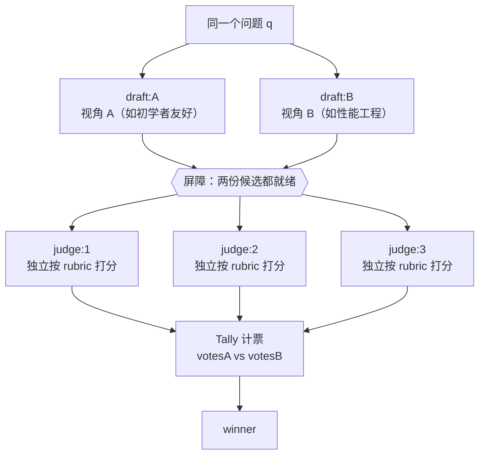

# 第 14 章 · 评委面板：A/B 评估

> 有两份（或 N 份）候选答案时，如何客观地挑出更好的那个？最差的做法是交给一个 agent「看看哪个好」。单个裁判既有自己的偏好，也有自己的盲区。本章将现实世界的评委面板引入 Workflow：N 个候选，先让多名互相独立的评委按同一套 rubric 打分，再计票聚合定出胜负。整个配方基于一次真实运行：两份候选答案，3 名独立评委，最终 **3:0** 判出胜者。这几名评委还完成了一件意料之外但很有价值的事。

---

## 14.1 配方动机

LLM 当裁判（LLM-as-judge）本身不新鲜，难点在于如何做到可靠。单评委有三个结构性缺陷：

- **偏好偏差**。一个 agent 对「啰嗦但全面」还是「简洁但浅」有自己的倾向，这种倾向会混入裁决。无法区分到底是 B 真的更好，还是评委恰好偏爱 B 的风格。
- **不稳定**。同一个评委、同一对候选，措辞稍有变化就可能翻盘，无法判断结果的稳定性。
- **无法计票**。一个评委只给一个结论，得不到「多大比例认为 B 更好」这类置信度信息。

评委面板用多个互不通信的独立评委，把这三点一次性解决：



本章围绕三个关键设计展开：

1. **评委必须独立**。用 `parallel` 让每个评委各自打分，互相看不见对方的结论。否则评委会从众，面板退化为单评委。
2. **打分要有 rubric**。用 `schema` 把评分维度（accuracy / clarity / completeness）固定为数字，强制评委结构化思考，而不是给出一句「我觉得 B 好」。
3. **聚合靠计票**。最终胜负由计票决定，而不是再派一个 agent 来综合大家的意见。后者会把多评委的独立性重新压缩为单点判断。

---

## 14.2 完整脚本

**（依据 transcript 骨架补全的示意脚本，未逐字实跑；本次真实运行的 Run ID 与用量见 14.3。）** 下面是这次真实运行的脚本，结构跟 `assets/transcripts/judge-panel.md` 一致。transcript 里 `answer` 和 `SCORE` 这两处 schema 都用 `{...}` 省略掉了，这里把它们补成能跑的样子，并逐处标了「（示意补全）」。transcript 里真实有的部分（`meta`、`q`、`parallel` 起草、3 评委 `parallel` 打分、Tally 计票和 `return`）原样照搬。

```javascript
export const meta = {
  name: 'judge-panel',
  description: 'A/B evaluation: two candidates scored by 3 independent judges, then tallied',
  phases: [{ title: 'Draft' }, { title: 'Judge' }, { title: 'Tally' }],
}

const q = 'When should you use parallel() vs pipeline() in a Claude Code Workflow?'

// 候选答案的 schema（示意补全：transcript 中以 {...answer} 省略）
const ANSWER = {
  type: 'object',
  properties: { answer: { type: 'string' } },
  required: ['answer'],
}

phase('Draft')
// 两份候选并发产出，刻意用不同视角，制造真实的质量差异
const [a, b] = await parallel([
  () => agent(`${q} Write a thorough answer from a beginner-friendly angle.`,
    { label: 'draft:A', phase: 'Draft', schema: ANSWER }),
  () => agent(`${q} Write a thorough answer from a performance-engineering angle.`,
    { label: 'draft:B', phase: 'Draft', schema: ANSWER }),
])

phase('Judge')
// rubric 固化为 schema：三个评分维度 + 胜者枚举 + 理由（示意补全 SCORE）
const SCORE = {
  type: 'object',
  properties: {
    scoreA: {
      type: 'object',
      properties: {
        accuracy: { type: 'number' },
        clarity: { type: 'number' },
        completeness: { type: 'number' },
      },
      required: ['accuracy', 'clarity', 'completeness'],
    },
    scoreB: {
      type: 'object',
      properties: {
        accuracy: { type: 'number' },
        clarity: { type: 'number' },
        completeness: { type: 'number' },
      },
      required: ['accuracy', 'clarity', 'completeness'],
    },
    winner: { type: 'string', enum: ['A', 'B'] },
    reason: { type: 'string' },
  },
  required: ['scoreA', 'scoreB', 'winner', 'reason'],
}

// 3 名评委各自独立打分：parallel 屏障，互不可见对方的裁决
const judges = await parallel(
  [1, 2, 3].map((i) => () =>
    agent(
      `Independently score answers A and B on accuracy, clarity, completeness (0-10 each), ` +
        `then pick the better overall.\nA: ${a.answer}\nB: ${b.answer}`,
      { label: `judge:${i}`, phase: 'Judge', schema: SCORE }
    )
  )
)

phase('Tally')
// 计票聚合：数票，不让某个 agent「综合大家意见」
const valid = judges.filter(Boolean)
const votesA = valid.filter((j) => j.winner === 'A').length
const votesB = valid.filter((j) => j.winner === 'B').length
return {
  votesA,
  votesB,
  winner: votesA > votesB ? 'A' : 'B',
  judgeReasons: valid.map((j) => j.reason),
}
```

这个结构和第 11 章 PR 多维 Review 形式相似，但本质不同。两者都用 `parallel` 屏障并发，但分工方式相反：

- 第 11 章：每个 agent 看**不同**的维度（分工），最后把产出**综合**。
- 本章：每个评委看**同一对**候选（重复评判），最后把投票**计票**。

分工后综合交给 agent；重复后计票交给代码。评委面板的核心在于：把聚合从「再调一个 agent 拍板」降级为一段确定性的计票代码，这样每个评委的独立性才能保持。

---

## 14.3 真实运行结果

> **真实运行**：Run ID `wf_f5b69668-b18`，Task ID `w7rykwriv`。原始记录见 `assets/transcripts/judge-panel.md`。
> 真实用量：`agent_count=5`（2 起草 + 3 评委）｜ `tool_uses=26` ｜ `total_tokens=201852` ｜ `duration_ms=79462`。

### 计票结果：3:0 判 B 胜

脚本真实返回的值：

```json
{
  "votesA": 0,
  "votesB": 3,
  "winner": "B",
  "judgeReasons": [ "...三段详尽理由..." ]
}
```

**3 名评委一致（3:0）判 B 胜**。理由高度收敛。B（性能工程视角）在 **completeness** 上明显领先：它带有**真实测量数据**，并指出了「back-to-back parallel 屏障浪费」这个反模式（正是第 08 章的内容）。A（初学者视角）在 **clarity** 上略占优势，但深度不足。三个维度综合来看，completeness 的差距超过了 clarity 的微小优势。

<div class="callout tip">

**`agent_count=5` 与脚本结构的对应关系。** 2 份草稿加 3 名评委等于 5 个 agent，与真实用量完全吻合，也验证了第 08 章的经验法则「token ≈ agent 数 x 每 agent 上下文」（`201852 / 5 ≈ 40K/agent`）。`tool_uses=26` 偏高，下一节说明原因：评委额外做了一件事。

</div>

### 两个意料之外、却极有价值的观察

这次运行最有价值的发现不是「B 赢了」，而是评委**如何**得出这个判断：

<div class="callout info">

**观察 1 · 评委主动求证。** 3 名评委在各自的理由中都写明了，它们**确实读取了 `docs/en/p2-08-parallel-vs-pipeline.md` 和 `assets/_grounding.md` 来交叉核对**，将候选答案中的数字逐条比对：`8.4s / 78844 token`、`26.7s / 158982 token`、`3x5.5≈16.5s` 基线、`min(16, cores−2)` 并发上限、`1000` agent 兜底。三名评委各自的结论都是「zero factual errors，每个数字精确吻合」。

`tool_uses=26` 偏高的原因就在于此：评委不是凭印象打分，而是**实际读取了事实源**。这带来一个附加收益：**顺带验证了本书 p2-08 章的全部真实数据准确无误**。运行一次评委面板，附赠一次事实核查。

**观察 2 · 独立评委会收敛。** 三名**互不通信**的评委，各自独立却得出了完全一致的结论（3:0）。这正是评委面板价值的体现：候选质量明显有别时，多个独立视角会**稳定收敛**到同一结论。如果候选质量接近，则会出现 2:1 甚至分裂的打分——这本身就是「两者差距不大」的信号。

</div>

这两个观察共同说明一件事：**结构化的 rubric（schema）会推动评委认真求证，而不是给出模糊评价。** 当 schema 要求评委给 `accuracy` 打一个具体数字时，评委自然会去核对事实。这是 schema 约束带来的额外收益。

---

## 14.4 设计要点

**① 评委独立是不可妥协的红线。** 用 `parallel` 让评委并发跑，而且互相看不见对方的裁决。一旦你写成「评委 2 看着评委 1 的打分再打」，面板就退化成一个评委加几个附和者，多视角降偏差的价值归零。

<div class="callout warn">

**反例**：不要这样串行喂结论。

```javascript
// ✗ 错：评委 2/3 看得到前面的裁决 → 从众，独立性丧失
let prev = null
for (const i of [1, 2, 3]) {
  prev = await agent(`Previous judge said: ${JSON.stringify(prev)}. Now you score...`, { schema: SCORE })
}
```

正确写法就是脚本里那句 `parallel([1,2,3].map(...))`：三个评委一起跑，谁也看不见谁。

</div>

**② rubric 必须用 schema 固化为数字。** 让评委给 `accuracy / clarity / completeness` 各打一个 `number`，比让它写一段「总体感觉」有效得多。数字可比较、可解释（可以直接看出 B 赢在 completeness），还可加权（变体 B）。schema 在工具调用层校验（第 07 章），评委打分不合规会被要求重打，打分从软建议变成了硬结构。

**③ 聚合用计票，不用综合 agent。** 最后的 `Tally` 阶段是**纯 JavaScript**，`filter` 加计票。不要在这里插入一个 agent 去综合三位评委的意见、给出最终结论：那等于把三个独立信号压回为单点判断，之前保持的独立性全部失效。计票是确定性的、可复现的、零额外 token，正是 Workflow「确定性骨架」应当承担的工作（呼应第 02 章）。

**④ 候选之间要有真实差异。** 本例刻意让 A 走初学者视角、B 走性能工程视角，以制造可区分的质量差。如果两份候选几乎相同，评委只能在噪声中勉强选择，结果没有参考价值。候选可以来自不同 prompt、不同模型、不同温度，或者同一 prompt 多次采样。

**⑤ 评委数取奇数。** 3、5、7 这样的奇数个评委才不会平票。本例 3 名就够在质量明显有别时稳定收敛；要是候选势均力敌、或者赌注很高，加到 5 名能进一步压低单评委的噪声。代价是 token 线性增长，但wall-clock仍受屏障约束，不会随评委数线性增长。

---

## 14.5 变体

<div class="callout info">

**变体 A · N 候选锦标赛**：候选不止两份时，把 schema 的 `winner` 从 `enum:['A','B']` 扩成 `enum:['A','B','C',...]`，让评委挑最优；或者让每个评委把全部候选**排个序**（返回一个 ranking 数组），Tally 阶段用 Borda 计数这类排序聚合法定胜负。

**变体 B · 加权 rubric**：给不同维度配上权重（比如 `accuracy×3 + completeness×2 + clarity×1`），在 Tally 阶段把每个评委的 `scoreA/scoreB` 加权求和再比大小。投票升级成了加权计分，适合各维度重要性不一样的场景。

**变体 C · 评委 + 强制淘汰**：给 schema 加一个 `disqualify: boolean` 字段（比如「含事实错误」「越权」）。Tally 时只要任一评委标记淘汰，就移除这份候选，把打分和红线检查拆开，呼应第 17 章对抗验证。

**变体 D · 接在 GCF / 生成之后（N 选优）**：这正好是第 12 章 GCF「变体 C」的落点。Generate 阶段用 `parallel` 产出 N 个候选，**用本章的评委面板挑出最佳那个**，再对胜者跑 Critique→Fix。任何「先发散、后收敛」的流水线，那道**收敛闸**都可以交给评委面板。

**变体 E · 嫁接式综合（保留落选者的优点）**：更强的收敛不只是选出胜者，还要**以胜出候选为主干，将落选候选中独有的优点嫁接进来**。落选不等于全部否定：一个总分第二的候选，可能在某个维度上更优，例如某个被胜者遗漏的边界条件、一句更准确的措辞。做法是计票选出胜者之后，**再加一个综合 agent**，输入胜者全文、各份落选者、以及评委指出的各自亮点，让它产出一份以胜者为骨架、择优吸收落选者长处的最终稿。

```javascript
// （示意，未实跑）—— 计票选出胜者后，嫁接式综合
const winnerDraft = votesA > votesB ? a.answer : b.answer
const final = await agent(
  // 以胜者为主干综合，将落选候选中独有的优点嫁接进来
  `以下方为主干改写出最终答案：\n${winnerDraft}\n\n` +
    `从以下落选候选中，仅吸收其独有的、胜者缺失的优点（如遗漏的边界情形、更准的措辞）：\n${votesA > votesB ? b.answer : a.answer}`,
  { label: 'synthesize', phase: 'Tally', schema: ANSWER }
)
```

这个综合 agent **加在计票之后**，并不替代计票。胜负仍由 14.4 节「③ 聚合用计票」那段确定性代码定出，综合只发生在主干已定之后，不会破坏评委独立性。它跟「让一个 agent 综合大家意见来拍板胜负」那条红线有本质区别：前者用 agent 拼装文本，后者用 agent 拍板胜负。

</div>

---

## 14.6 本章小结

- 评委面板 = N 个候选，多名独立评委按同一 rubric 打分，再计票聚合。它靠多视角压下单评委的偏好偏差和不稳定。三条红线（评委独立、rubric 固化成数字、聚合用计票代码）见 14.4 节。
- 与第 11 章形式相似、本质不同：PR 评审是分工后综合（用 agent），评委面板是重复后计票（用代码）。
- 真实运行：`agent_count=5`、`total_tokens=201852`、`duration_ms=79462`；2 候选、3 评委、**3:0 判 B 胜**。
- 两个实证观察：评委**主动读 `docs/en/p2-08` 与 `_grounding.md` 交叉核对**（这就是 `tool_uses=26` 的来由，顺手验证了本书 p2-08 数据全对）；三名互不通信的评委**各自独立却收敛到一处**。
- 变体：N 候选锦标赛、加权 rubric、强制淘汰、接在生成/GCF 之后做 N 选优，以及**嫁接式综合**（以胜者为主干、将落选者独有的优点吸收进来，保留落选稿中的有价值内容）。

下一章进入「Bug 猎手」配方：自繁殖的 finder 池流入对抗验证，把一条分支里的潜在缺陷挖出来。

> 继续阅读：[第 15 章 · Bug 猎手](#/zh/p3-15)
