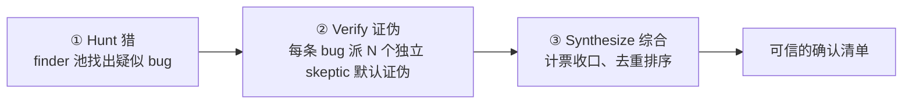
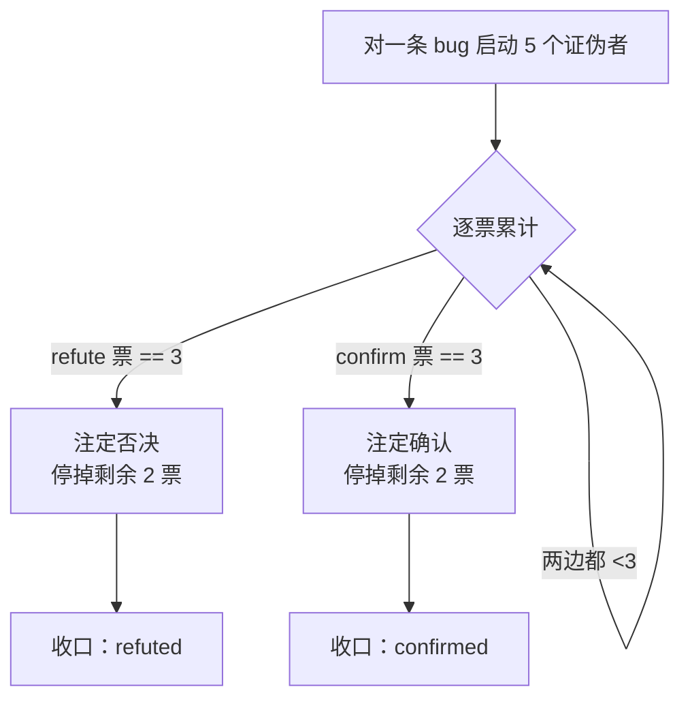
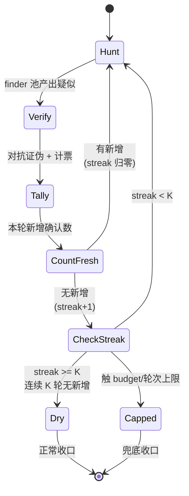

# 第 15 章 · Bug 猎手

> 让 agent「找 bug」不难，难的是**信**它找到的 bug。LLM 很会编出「看起来像 bug」的假阳性。本章的 Bug 猎手配方用**对抗验证**解决这个信任问题：先猎，再派一个独立的「唱反调」agent **默认证伪**，挺过证伪的那条才算数。
>
> 本章基于一次真实运行（Run `wf_53da9a06-915`，11 个 agent / 311,134 token / 61,660ms，5/5 确认），它顺带演示了对抗验证最大的亮点：**验证者反过来纠正了猎手。** 在那之上，我们把一个 bug-hunter 工作流从头搭出来（**finder 池 → 对抗证伪 → 综合**），再看它怎么靠 **pigeonhole 提前退出** 和 **连续 K 轮 dry-streak** 既省钱又防漏。
>
> <div class="callout warn">
>
> **关于「自带 bughunt」的一条版本说明（必读）。** 早期 v2.1.150 的内置注册表里确实有 `bughunt` / `bughunt-lite` 两个具名工作流（Run `wf_2b04881f-6a9` 实测列出过），本书前几版也以「调内置 `bughunt`」为前提。但**到 v2.1.156，内置具名工作流注册表已经只剩 `deep-research` 一个**（Run `wf_03e38250-1bb` 报错原文 `Available: deep-research`），与官方文档「Claude Code 只自带 `/deep-research` 这一个 bundled workflow」完全一致。`bughunt` / `bughunt-lite` **已不在注册表、不可再依赖**（详见 [附录 A.13.1](#/zh/app-a)）。所以本章不再教你调内置，而是带你**自己写一个 bug-hunter 工作流**，这也正好落在全书「构建你自己的 workflow」这条主线上。下文凡提到 `bughunt` / `bughunt-lite`，都请当成**早期内置的设计参照**来读：它们当年的编排骨架仍有借鉴价值，但已经不是你今天能调起来的命令。
>
> </div>

---

## 15.1 配方动机：一个「未知规模 + 不可信」的双重难题

「找 bug」是典型的**未知规模发现任务**（unknown-scale discovery）。事先不知道有几个 bug，因此无法写成「找出这 5 个」那种定额循环。更麻烦的是，它同时命中了发现任务最棘手的两个问题：

1. **假阳性（false positive）**：模型倾向于总要报告些什么。即使一个真 bug 都没找到，它也会编出几个看上去像真的「bug」作为输出，因为空白结果在它看来等于没完成任务。
2. **错误论证（wrong argumentation）**：即使 bug 是真的，模型给出的「为什么错」也可能是错的——症状判断正确，但机理解释不对。

两个问题叠加的结果是：**仅凭一个猎手 agent 的输出，既无法确认它是否找全了，也无法确认它找对了。** 本章的配方用三段编排，同时压制这两种不确定性：



- **① Hunt（猎）** 负责「找全」：用一个 finder agent，或一**池** finder agent，列出疑似 bug。规模未知时，让池子能自我复制、循环到干（15.5、15.7）。
- **② Verify（证伪）** 负责「找对」：对**每一条**疑似 bug，派 N 个**互相独立**的验证者，并明确要求它们默认证伪。举证责任由此落在「这是真 bug」这一方。这是第 17 章对抗验证的落地。
- **③ Synthesize（综合）** 收口：用**代码**计票、去重、排序，产出最终的确认清单。

<div class="callout info">

**为什么是「证伪」而不是「确认」？** 确认偏误（confirmation bias）是单向的：问一个 agent「这是不是 bug」，它倾向于点头。指令它「尽力**证伪**这条、拿不准就判 refuted」，它才会主动去找反例。把默认值设成 refuted，**模型的沉默和犹豫就都倒向了「不算数」**，假阳性自然被滤掉。「默认证伪、翻转举证责任」的完整机理由第 17 章（[对抗验证](#/zh/p4-17)）展开，本章是它在「猎 bug」场景下的落地。

</div>

---

## 15.2 完整脚本

下面是本章真实运行用的脚本，一个 finder（Hunt）加每条 bug 两个证伪者（Verify）的最小可信形态：

```javascript
export const meta = {
  name: 'bug-hunter',
  description: 'Hunt bugs in a target file, then adversarially verify each finding',
  phases: [{ title: 'Hunt' }, { title: 'Verify' }],
}
const FILE = '.../assets/samples/buggy-cart.js'

phase('Hunt')
const hunt = await agent(
  `Read the file ${FILE} and find genuine bugs. For each: function name, one-line bug, why it's wrong.`,
  { label: 'hunt', schema: { type: 'object', properties: {
    bugs: { type: 'array', items: { type: 'object',
      properties: { fn: { type: 'string' }, bug: { type: 'string' }, why: { type: 'string' } },
      required: ['fn','bug','why'] } } }, required: ['bugs'] } }
)

const verified = await pipeline(
  hunt.bugs,
  (b) => parallel([1,2].map(i => () =>
    agent(`You are a skeptic. Try to REFUTE this claimed bug in ${FILE}. Default to refuted=true if not certain. ` +
          `Claim — in \`${b.fn}\`: ${b.bug} (${b.why}). Read the file to check.`,
      { label: `refute:${b.fn}:${i}`, phase: 'Verify',
        schema: { type: 'object', properties: { refuted: { type: 'boolean' }, reason: { type: 'string' } }, required: ['refuted','reason'] } })
  )).then(votes => {
    const v = votes.filter(Boolean)
    const confirms = v.filter(x => !x.refuted).length
    return { ...b, confirmVotes: confirms, refuteVotes: v.length - confirms, confirmed: confirms >= 1 }
  })
)
const confirmed = verified.filter(Boolean).filter(b => b.confirmed)
return { hunted: hunt.bugs.length, confirmedCount: confirmed.length, confirmed }
```

结构上，**Hunt 是单个 agent**（产出疑似列表），**Verify 用 `pipeline`**，每条 bug 独立流过「2 个证伪者并发 + 计票」这一阶段。这是 `pipeline` 里嵌套 `parallel` 的典型组合（第 8 章）。`pipeline` 阶段之间没有屏障，因此 bug A 还在被证伪时，bug B 可能已经进入综合；而每条 bug 内部的两个证伪者用 `parallel` 屏障等齐，方便计票。

<div class="callout tip">

**这个最小形态足以建立直觉，但它有意省略了三件事**，本章后面逐一补上：① Hunt 只有一个 finder，规模一大就会漏，对应 15.5 的 finder 池；② 每条 bug 跑满全部证伪者才计票，多数已否决也不早停，对应 15.6 的 pigeonhole；③ 单轮 Hunt，漏掉的尾部 bug 永远找不回，对应 15.7 的 loop-until-dry。建议先理解最小形态，再逐层叠加。

</div>

---

## 15.3 真实运行结果

> **真实运行**：Run ID `wf_53da9a06-915`，Task ID `wsj4ypt3x`。原始记录见 `assets/transcripts/bug-hunter.md`。
> 真实用量：`agent_count=11`（1 猎手 + 5×2 证伪者）｜ `tool_uses=25` ｜ `total_tokens=311134` ｜ `duration_ms=61660`。

目标文件是 `assets/samples/buggy-cart.js`（合成样本，故意埋了 5 个 bug）。猎手**全部找到、全部以 2:0 通过验证**：

| 函数 | bug | 票数 |
|---|---|---|
| `applyDiscount` | percent 无边界校验（>100 得负价、负 percent 反而抬价） | 2:0 |
| `cartTotal` | off-by-one：`i < items.length-1` 跳过末项 | 2:0 |
| `checkout` | 缺 `await`，`gateway.charge()` 返回 Promise 恒真，未付款就清空购物车 | 2:0 |
| `findItem` | `==` 而非 `===`，类型强制误配 | 2:0 |
| `mergeCarts` | 原地 `a.push()` 修改入参（别名 bug） | 2:0 |

11 个 agent 的计算方式：`1 个 finder + 5 条 bug × 2 个证伪者 = 11`。token 约 31 万，wall-clock约 62 秒。wall-clock远小于 11 个 agent 串行执行的总和，因为 5 条 bug 的证伪在 pipeline 里是**重叠**进行的：wall-clock取决于关键路径，而非所有 agent 耗时之和（第 8 章）。

<div class="callout info">

**为什么用合成样本作为猎手目标？** 要验证猎手的准确率，需要先有**已知的标准答案**。`buggy-cart.js` 里每个 bug 都埋了种子注释，因此「找到 5/5」是可以逐条核对的硬指标，而不是「看着找了不少」的模糊感觉。真实项目里没有这种标注，这恰恰是 ② Verify 存在的理由：用对抗证伪去**逼近**真值。

</div>

---

## 15.4 最大亮点：验证者纠正了猎手

`applyDiscount` 的证伪者在**确认 bug 真实**的同时，纠正了猎手（和种子注释）的一处错误论证。种子注释和猎手都声称「percent 作字符串会拼接」，证伪者指出：

> "the source comment's 'percent as string concatenates' claim is false — `*` and `/` coerce strings to numbers, so `applyDiscount(100,'10')` correctly returns 90; concatenation would require `+`."

它说得对：`*`/`/` 会把字符串强制转成数字，只有 `+` 才拼接。所以 `applyDiscount(100,'10')` 实际返回 `90`（正确），bug 的真正机理是无边界校验（`percent>100` 得负价），而非字符串拼接。

<div class="callout tip">

**这正是对抗验证的核心价值**：它不只过滤假阳性，还能**附带修正真阳性里的错误推理**。一个只会附和的检查者无法发现这类问题；只有被要求「默认证伪、拿不准就判 refuted」的验证者才会逐条较真，包括藏在前提里的小瑕疵。证伪者交回来的不只是一张「真/假」选票，还附带**一份可审计的推理**，而这份推理本身就能纠正上游。这也是 15.2 的证伪 schema 中 `reason` 被设为必填字段的原因。

</div>

---

## 15.5 finder 池：固定 vs 自我复制

15.2 的最小形态只有**一个** finder。目标较小时足够，但一旦从 40 行的合成文件扩展到一整条分支的几十个文件，单个 finder 的注意力被摊薄，漏报几乎不可避免。这时需要 **finder 池（finder pool）**：多个猎手并发扫描，把各自的发现**汇流（stream）**进同一个证伪管道。

早期 v2.1.150 的内置注册表里有两个跟 bug 猎手同源的具名工作流 `bughunt` 与 `bughunt-lite`（Run `wf_2b04881f-6a9` 实测：调用未知具名工作流时报错并列出当时的清单 `bughunt, bughunt-lite, deep-research, plan-hunter, review-branch`）。**到 v2.1.156 这俩已不在注册表了**（只剩 `deep-research`，见本章开头的版本说明与 [附录 A.13.1](#/zh/app-a)）。所以下面不是教你去调它们，而是**拿它们当年的编排骨架当蓝本，自己把同样的结构写出来**。下表把这套骨架拆成「固定池」与「自我复制池」两种形态：

| 工作流 | finder 池 | 验证 | 收口 |
|---|---|---|---|
| `bughunt-lite` | **固定**：3 个 rapid + 2 个 deep，跑完即止 | 5 票对抗证伪（pigeonhole 提前退出） | 综合 |
| `bughunt` | **自我复制**：3 个 rapid + deep 猎手持续派发，直到 **dry-streak** | 5 票对抗证伪（pigeonhole 提前退出） | 综合 |

<div class="callout warn">

**「池子结构」这一层从来就不是官方/实测真值，请按推测读，版本漂移之后更要这么读。** 上表的「3 rapid / 2 deep / 5 票 / pigeonhole / dry-streak」措辞，来自 `bughunt` / `bughunt-lite` 当年（v2.1.150）在技能列表里的**一行注册简介**（`bughunt`：「Self-respawning finder pool (3 rapid + deep-until-dry-streak) streams into 5-vote adversarial verification with pigeonhole early-exit, then synthesis」；`bughunt-lite`：「fixed 3-rapid+2-deep finders stream into 5-vote adversarial verification (pigeonhole early-exit), then synthesis. Simpler than bughunt: no self-respawning, no dry-streak」）。按本书接地分级（`_grounding.md` A2），关于这两个工作流，**当年被实测确认的只是「它们曾在注册表里存在」这一层**（v2.1.150，Run `wf_2b04881f-6a9`）。它们的**内部架构从无官方工具定义、也没经本书实测复现**，而且**到 v2.1.156 连「存在」这一层都没了**（注册表只剩 `deep-research`，Run `wf_03e38250-1bb`）。所以本章据这段简介与通用模式给出的池子拆解和下文骨架代码，**纯粹是本书的推测性示例实现，绝非官方架构**：拿它建立直觉、当自建工作流的蓝本就好，别把那些数字与流程当成已验证事实，更别指望今天还能调起 `bughunt`。

</div>

两种池的区别只在一个轴上：**finder 的数量是否固定**。

- **固定池（fixed pool）**：派出 `N` 个猎手，收回 `N` 份发现，编排可预测、成本有上界。适合「目标规模大致已知」或「需要确定性预算」的场景。`bughunt-lite` 的「3 rapid + 2 deep」就是固定 5 个 finder。
- **自我复制池（self-respawning pool）**：finder 池会**持续补充新猎手**，直到满足停止条件（dry-streak，见 15.7）。适合「目标规模完全未知、宁可多花也不能漏」的场景。代价是成本上界不确定，因此必须配合 dry-streak + budget 双重制动（第 18 章）。

两种池中都有的「rapid + deep」是另一个正交的设计维度，快慢分工：

- **rapid finder**：快速、浅层、广撒网，先把一眼可见的可疑点捞上来（可以用 `model:'haiku'` 降低成本）。
- **deep finder**：慢速、深层、抠细节，专门找出 rapid 漏掉的、需要跨函数推理才能发现的隐蔽 bug。

「池流入管道」（finders **stream into** verification）是关键概念：finder 不必全部跑完才开始证伪。这正是 `pipeline` 阶段间**无屏障**特性的用武之地（第 8 章）：某个 finder 刚交回一条发现，证伪管道就能立刻开工，不必等其余 finder 跑完。

下面是一个**固定池 + 汇流去重 + 流入证伪**的骨架（呼应 `bughunt-lite`）：

```javascript
// （示意，未实跑）—— 固定 finder 池：rapid 撒网 + deep 深挖，汇流去重后流入证伪
const BUG = { type: 'object', properties: {
  bugs: { type: 'array', items: { type: 'object',
    properties: { fn: { type: 'string' }, bug: { type: 'string' }, why: { type: 'string' } },
    required: ['fn','bug','why'] } } }, required: ['bugs'] }

phase('Hunt')
// 3 个 rapid（浅、用 haiku 降本）+ 2 个 deep（深、默认模型）并发撒网
const finders = await parallel([
  ...[0,1,2].map(i => () => agent(
    `RAPID pass #${i}: skim ${FILE} and surface obvious-looking bugs fast. ` +
    `Cover a different region than other passes (use index ${i} to vary focus).`,
    { label: `find:rapid:${i}`, phase: 'Hunt', model: 'haiku', schema: BUG })),
  ...[0,1].map(i => () => agent(
    `DEEP pass #${i}: read ${FILE} carefully, reason across functions, find subtle bugs ` +
    `(aliasing, async, coercion) that a quick skim would miss.`,
    { label: `find:deep:${i}`, phase: 'Hunt', schema: BUG })),
])

// 汇流：把池里所有 finder 的发现拍平、用 (fn+bug) 归一化去重（确定性，交给代码）
const pooled = finders.filter(Boolean).flatMap(f => f.bugs || [])
const seen = new Set()
const candidates = pooled.filter(b => {
  const key = (b.fn + '|' + b.bug).toLowerCase().replace(/\s+/g, ' ').trim()
  return seen.has(key) ? false : (seen.add(key), true)
})
log(`finder 池汇流 ${pooled.length} 条，去重后 ${candidates.length} 条进入证伪`)
// candidates 随后流入 15.6 的证伪管道
```

<div class="callout warn">

**finder 池必须在「汇流去重」后再进入证伪，且去重应使用代码而非 agent。** 多个 finder（尤其 rapid 与 deep）必然报出重复的 bug；如果不先去重，同一个 bug 会被 N 组证伪者各验一遍，token 成倍浪费。去重是**确定性操作**（同输入同输出），用 `Set` + 归一化键零成本即可完成，这与第 18 章「确定性操作交给代码、判断交给 agent」的原则一致。让 agent 做去重，既昂贵又引入不确定性。

</div>

---

## 15.6 pigeonhole 提前退出：多数已否决就别再投了

15.2 的证伪是「每条 bug 跑满全部 N 个证伪者，再计票」。当 N 较大时（`bughunt` 用 **5 票**），存在明显的浪费：**如果一条 bug 已经被多数证伪者否决了，剩余的票无论怎么投都无法翻转结果**，结论已经确定。

这就是 **pigeonhole（鸽笼）提前退出**：把「多数」视为一个可以提前到达的阈值，一旦某一方的票数已经锁定胜负，就在**逻辑上**提前判决，不再等待剩余的票。但需要注意一个前提：**已经发出的 agent 通常仍会跑完，只是结果被忽略**（机制见本节下方的提示框、`_grounding.md` 与第 18 章）。要在**物理上**减少 agent 调用，需要**分批投票**——先发出达到多数线所需的票，平票或接近时才追加后续的票。

拿 5 票、「多数确认才保留」（≥3 票 confirm）举例，鸽笼原理给出两个提前退出点：

- **提前否决**：一旦累计到 **3 张 refute 票**，无论剩下 2 票怎么投，confirm 都不可能 ≥3 → 这条 bug 注定被否决 → 停掉剩余证伪者。
- **提前确认**：一旦累计到 **3 张 confirm 票**，多数已达成 → 这条 bug 注定保留 → 停掉剩余证伪者。



节省幅度：在「5 票多数」下，最快第 3 票就能定局，省下 2 个证伪者，**接近 40% 的验证成本**；而且越是一边倒的 bug（真 bug 全 confirm、假阳性全 refute），节省越多。

实现上存在一个约束：`parallel` 是**屏障**（需要等齐所有 thunk），不支持中途叫停。要实现 pigeonhole 提前退出，需要换成一种「可以提前结算的竞速」结构。下面是一个**示意**骨架，用 `Promise` 竞速加一个计票闭包实现，已经超出了 `parallel` 的标准用法，仅用于演示思路：

```javascript
// （示意，未实跑）—— pigeonhole 提前退出的思路骨架
// 注意：parallel 是屏障、不支持中途停；这里用 Promise 竞速演示「多数锁定即结算」的逻辑。
async function verifyWithPigeonhole(bug, voters = 5) {
  const majority = Math.floor(voters / 2) + 1   // 5 票 → 3
  let confirms = 0, refutes = 0, done = 0, settled = false
  let resolve
  const decided = new Promise(r => { resolve = r })

  for (let i = 0; i < voters; i++) {
    agent(
      `You are skeptic #${i}. Try to REFUTE this claimed bug in \`${bug.fn}\`: ${bug.bug}. ` +
      `Default refuted=true if not certain. Read the file to check.`,
      { label: `refute:${bug.fn}:${i}`, phase: 'Verify',
        schema: { type: 'object', properties: { refuted: { type: 'boolean' }, reason: { type: 'string' } }, required: ['refuted','reason'] } }
    ).then(v => {
      if (settled) return
      done++                       // 统计「已返回」的票（含被跳过返回 null 的）
      if (v) (v.refuted ? refutes++ : confirms++)   // 跳过/失败返回 null 的票不计入任一方
      // 鸽笼：任一方达到多数，胜负已定，立即结算
      if (confirms >= majority) { settled = true; resolve({ ...bug, confirmed: true,  confirmVotes: confirms, refuteVotes: refutes }) }
      else if (refutes >= majority) { settled = true; resolve({ ...bug, confirmed: false, confirmVotes: confirms, refuteVotes: refutes }) }
      // 兜底：所有投票者都已返回、仍无多数（被跳过的 null 太多）→ 结算为 uncertain，避免 promise 永不 resolve
      else if (done >= voters) { settled = true; resolve({ ...bug, confirmed: false, uncertain: true, confirmVotes: confirms, refuteVotes: refutes }) }
    })
  }
  return decided   // 多数锁定即返回；全部返回仍无多数则兜底为 uncertain。剩余票的结果被忽略（已在途的 agent 仍会跑完）
}
```

<div class="callout warn">

**「提前退出」节省的是「等待和决策」时间，不一定节省「已经在途的 agent」。** 据 `_grounding.md`，`parallel` 一旦启动 N 个 thunk，它们就并发运行。上面的竞速骨架能在**多数锁定的那一刻立刻拿到结论、不被阻塞**，但已经发出的 agent 调用通常仍会跑完，只是结果被忽略。要在物理上减少 agent 调用，需要**分批投票**：先发 3 票（多数线），只有平票或接近时才追加第 4、5 票。这一步才把 pigeonhole 从「逻辑早停」升级为「物理节省」。无论哪种方式，要点相同：**不要为一个已成定局的判决支付满额成本。**

</div>

---

## 15.7 loop-until-dry 与「连续 K 轮无新发现」：防漏尾

单轮 Hunt 即使使用了 finder 池，仍然可能漏掉尾部的 bug，尤其是那些隐蔽问题——往往需要前几轮的发现作为「线索」才能联想到。对于「不知道有多少」的发现任务，最后的办法是**循环到干（loop-until-dry）**（第 18 章）：反复派新猎手，直到**连续 K 轮都没新增**确认 bug 才停。

关键在于**停止条件的设计**。两种写法差别很大：

- **简单写法**：「这一轮没找到新 bug 就停」（K=1）。问题在于发现任务经常出现「空轮」——某一轮恰好没有新发现，但下一轮换个角度又能挖出来。K=1 会**过早收手**，漏掉尾部。
- **dry-streak 写法**：「**连续 K 轮**（如 K=2 或 3）都没新增才停」。这给了猎手「再试几次」的机会，漏尾概率显著降低。这正是 `bughunt` 注册描述中 **deep-until-dry-streak** 的含义：deep 猎手持续派出，直到连续多轮都无法产出新发现。



下面把 finder 池 + 对抗证伪 + dry-streak 拧成一个完整的循环骨架：

```javascript
// （示意，未实跑）—— loop-until-dry：连续 K 轮无新增确认 bug 才停
const K = 2                 // dry-streak 阈值：连续 2 轮无新增才判干
const MAX_ROUNDS = 5        // 硬上限（防失控，第 18 章）
const confirmed = []        // 累积已确认的 bug
const seen = new Set()      // 跨轮去重键
let dryStreak = 0, round = 0

phase('Hunt')
while (dryStreak < K && round < MAX_ROUNDS) {
  // budget 兜底：单轮约数万 token，不够就提前收口（budget 是硬上限，第 9 章）
  if (budget.total !== null && budget.remaining() < 80_000) {
    log(`预算告急（剩余 ${budget.remaining()}），提前收口`); break
  }
  round++

  // 1) Hunt：finder 池（这里简化为 1 个，生产用 15.5 的池），告知「已确认的、勿重复」
  const known = confirmed.map(b => `- ${b.fn}: ${b.bug}`).join('\n') || '（暂无）'
  const hunt = await agent(
    `Read ${FILE} and find genuine bugs NOT already listed below.\n已确认（勿重复）：\n${known}`,
    { label: `hunt:round-${round}`, phase: 'Hunt', schema: BUG })

  // 2) 去重 + 对抗证伪（复用 15.2 / 15.6 的证伪管道）
  const fresh = (hunt.bugs || []).filter(b => {
    const key = (b.fn + '|' + b.bug).toLowerCase().replace(/\s+/g, ' ').trim()
    return seen.has(key) ? false : (seen.add(key), true)
  })
  const verified = await pipeline(fresh, b => verifyWithPigeonhole(b))   // 见 15.6
  const newlyConfirmed = verified.filter(Boolean).filter(b => b.confirmed)

  // 3) dry-streak 计数：本轮无新增确认 → streak+1；有新增 → 归零
  if (newlyConfirmed.length === 0) {
    dryStreak++
    log(`第 ${round} 轮无新增确认，连续无新增 ${dryStreak}/${K} 轮`)
  } else {
    dryStreak = 0
    confirmed.push(...newlyConfirmed)
    log(`第 ${round} 轮新增确认 ${newlyConfirmed.length} 条`)
  }
}
return { rounds: round, confirmedCount: confirmed.length, confirmed }
```

三个角色的分工需要明确：**finder 池**负责「找」（每轮传入「已确认清单」，要求只报新增）；**对抗证伪管道**负责「筛」（每条新疑似仍需通过证伪）；**`while` + `dryStreak` 计数器**负责「何时停」。最后这部分是 JavaScript 控制流：模型只负责判断，编排由代码完成。

<div class="callout warn">

**dry-streak 能防漏尾，但硬上限不可去掉。** `while` 条件中的 `round < MAX_ROUNDS` 和 `budget.remaining()` 检查是**安全机制**，不是装饰。如果猎手总能编出新疑似，dry-streak 会被反复清零，循环永远退不出去。据 `_grounding.md`，`budget` 是硬上限（达到 `total` 后再调 `agent()` 就抛错），单工作流生命周期 agent 总数上限 1000 是最后一道全局安全网，但**不应该**依赖它们来终止业务循环。正确的策略是：**dry-streak 决定「正常情况下何时停」，轮次上限 + budget 决定「最坏情况下何时强停」，三者缺一不可**（详见第 18 章 §18.3）。

</div>

---

## 15.8 设计要点

**① 验证者必须各自独立。** 用 `parallel`（或竞速）让多个证伪者**独立判断**、互相不可见，这样它们的错误才不相关，多数表决才有意义。一旦让它们看到彼此的票，就退化为跟风，投票失去价值。

**② 默认证伪（refute-by-default）。** 在 prompt 中写死「Default to refuted=true if not certain」，把举证责任置于「这是真 bug」的一方。宁可漏报，也不让假阳性通过。

**③ 用计票，不让单个 agent 裁定。** 让一个 agent 综合判断真假，会把它自身的偏差一并带入；多个独立证伪者加计票，结果稳定得多。计票、去重、过滤都是**确定性操作**，交给 JS 代码（`filter`/`Set`/`reduce`），不交给 agent。

**④ 阈值可调，且直接影响成本。** 本章真实运行用 2 票、「没被多数否决就保留」（`confirms >= 1`，较宽松，适合「宁可多报也不漏」）；`bughunt` 用 5 票多数。需要更严格时，增加到 3-5 票，并改为「必须多数**确认**才保留」（见第 17 章 §17.6）。票数越多越可信，也越贵，用**判错的代价**来决定票数。

**⑤ finder 池规模应匹配目标规模。** 目标小（单文件）一个 finder 即可；整条分支用固定池（`bughunt-lite` 的 3+2 形态，5 个 finder）；只有当规模完全未知、且漏报代价很高时，才使用自我复制池 + dry-streak（`bughunt` 形态）。

| 决策维度 | 宽松（省） | 严格（稳） |
|---|---|---|
| finder 池 | 单 finder / 固定小池 | 自我复制池 + dry-streak |
| 证伪票数 | 2 票 | 5 票 |
| 保留判据 | `confirms >= 1`（未被多数否决） | 多数确认（≥3/5） |
| 提前退出 | 跑满再计票 | pigeonhole 提前退出 |
| 循环 | 单轮 | loop-until-dry（K≥2） |

---

## 15.9 与「代码审查」「对抗验证」的边界

Bug 猎手容易与第 10/11 章的 review、第 17 章的对抗验证混淆。它们使用同一批底层 primitive（`agent`/`pipeline`/`parallel`/`schema`），但**目标**不同。划清边界，才能选择正确的配方：

| | 偏向 | 切分方式 | 问题 | 真实运行 |
|---|---|---|---|---|
| **第 10 章** 分片审查 | **覆盖**（不漏文件） | 按**文件/模块**分片 | 「每一片都审到了吗」 | frontend-review `wf_4c5caabb-b73` |
| **第 11 章** 多维 Review | **覆盖**（不漏维度） | 按**维度**切（a11y/性能/正确性…） | 「每个维度都查到了吗」 | `wf_4c5caabb-b73`（26→16） |
| **第 17 章** 对抗验证 | **真伪**（母题） | 生成 ↔ 验证分离 | 「这个论断是真的吗」 | pipeline-demo `wf_bf086b98-6ec` |
| **第 15 章** Bug 猎手（本章） | **发现 + 证伪** | finder 池 → 证伪 → 综合 | 「有哪些真 bug，且我能信」 | `wf_53da9a06-915`（5/5） |

一句话区分：

- **Review（10/11）偏「分维度覆盖」**。它假设目标边界已知（这些文件、这些维度），任务是每一块都审到、一块都不漏。难点在**如何切分**和**如何综合去重**，对抗验证只是其 Verify 阶段中的一步（第 10 章骨架中的一环）。
- **对抗验证（17）是「判真伪」的母题**。它不关注「找全」，只关注「把一个已生成的论断证伪或证实」。它是一个**可复用的子结构**，被 Bug 猎手、评委面板（第 14 章）、分片审查（第 10 章）反复引用。
- **Bug 猎手（15）偏「发现 + 证伪」**。它面对的目标规模**未知**（不知道有几个 bug），因此核心任务有两个：① 如何**找全**（finder 池、loop-until-dry、dry-streak），② 如何**建立信任**（对抗证伪、pigeonhole）。它是「未知规模发现」与「对抗验证」的组合。

<div class="callout tip">

**怎么选？** 看你的「不确定性」主要在哪一边：
- 不确定「**审没审到**」（边界已知、怕漏块）→ 用 **review**（第 10/11 章）。
- 不确定「**是不是真的**」（已有一个论断、怕假阳性）→ 用 **对抗验证**（第 17 章）。
- 不确定「**有几个、且哪些是真的**」（规模未知 + 怕假阳性）→ 用 **Bug 猎手**（本章），它把两种不确定性一次性按下去。

</div>

---

## 15.10 本章小结

- Bug 猎手 = **Hunt（finder 池找疑似）→ Verify（每条 bug 派 N 个独立、默认证伪的验证者 + 计票）→ Synthesize（代码去重排序收口）**。它专治「未知规模 + 不可信」的双重难题。五条设计要点见 15.8 节。
- 真实运行 `wf_53da9a06-915`（11 agent / 311,134 token / 61,660ms）：5 个种子 bug 全部找到并 2:0 确认；验证者还**纠正了猎手的错误论证**（字符串拼接那条）。
- 三层加固：**finder 池**（固定池 `bughunt-lite` 的 3 rapid + 2 deep，或自我复制池 `bughunt` 的 deep-until-dry-streak，rapid 撒网、deep 深挖，finder **流入**无屏障的证伪管道）；**pigeonhole 提前退出**（多数票锁定胜负就别再投，逻辑早停省「等待」、分批投票省「物理 agent」）；**loop-until-dry + dry-streak**（用「连续 K 轮 K≥2 无新增」而非「一轮没找到就停」来防漏尾，硬上限 + budget 是不可去掉的安全带）。
- 与 review（偏分维度**覆盖**）、对抗验证（偏**真伪**母题）的边界：Bug 猎手 = **发现 + 证伪** 的合体。

下一章是本部最后一个配方：把分散在大量文件里的同类改动一次性扫完的「文档/迁移大扫除」。

> 继续阅读：[第 16 章 · 文档与迁移大扫除](#/zh/p3-16)
