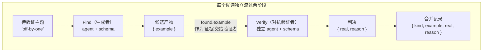
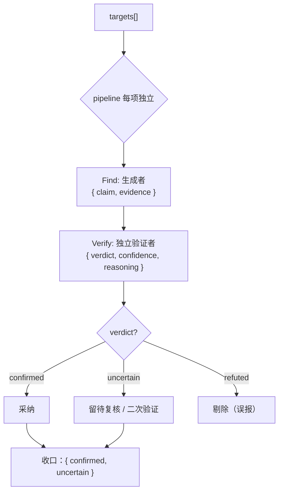

# 第 17 章 · 对抗验证

> 一句话：**让一个独立的 subagent 去「找茬」前一个 subagent 的产物。它的任务是尽力证伪，不是附和。再用 schema 把这个证伪结果收敛成一个可信的判决，你就得到了一条能自我纠错的流水线。**
>
> 这是进阶模式篇的第一章，也是后面所有「质量门」模式的基础。基础篇已经教过你 `agent` / `pipeline` / `schema`，这一章把它们拼成一个工程上高价值的结构：**生成和验证分开**。

---

## 17.1 为什么需要对抗验证：自我评估的根本缺陷

这是一个常见的场景。

让一个 subagent「找出这段代码的 bug」，它返回了三个。随后追问「你确定这些都是真 bug 吗？」，它几乎总是回答「是的，我确认这些都是真实存在的问题」。

**问题在于：让同一个模型评估自己的产物，会产生很强的「确认偏误」。** 这些 bug 是它刚生成的，上下文中全是「这是 bug」的论证，此时再让它自查，它的立场已经被锁定。它只会为自己辩护，不会质疑自己。这不是模型能力的问题，根源在**自我评估这种任务结构本身**：评估者和被评估者共用同一份上下文，站同一个立场，结构上存在缺陷。

对抗验证的核心思路是：**把验证者换成一个全新的、独立的 subagent，并且明确告知它「你的任务就是证伪」。**

- 它有**独立的上下文**：没有「这是我刚生成的」这层包袱，看到的只是一条待核验的论断。
- 它有**对抗性的立场**：prompt 明确要求它作为怀疑论者，去找反例、挑漏洞，而非附和。
- 它的判决是**结构化的**：用 schema 把「真/假/存疑」固定为枚举，而不是一段含糊的散文。

三者叠加，就把「模型自我感觉良好」替换成了「两个独立视角的对抗」。而让两个视角对抗，正是逼近真相最古老也最可靠的方法。

<div class="callout info">

**Workflow 将社区早已验证过的实践重新实现为原生结构。** 据 `_grounding.md` D 节，superpowers 系统的核心之一是「两段式评审循环」（spec 合规 → code quality，各自循环到通过），oh-my-claudecode 强调「独立 reviewer 签核」，oh-my-openagent 靠「VERIFICATION_REMINDER 注入纠偏」。这些系统都在用提示词和 Hook **模拟**「生成与验证分离」。原生 Workflow 允许用 `pipeline` + `schema` 直接将其写成**确定性的、可复用的**结构，这正是本章要讲的。

</div>

---

## 17.2 从真实运行看最小对抗验证骨架

从一次真实运行开始理解对抗验证。本书基础篇用过的 `pipeline-demo`（Run ID `wf_bf086b98-6ec`，`agent_count=6`）正好是一个最小的对抗验证实例。它的 Find 阶段产出一个候选 bug，Verify 阶段对抗性地核验它是否为真 bug。

```javascript
const items = ['off-by-one', 'null-dereference', 'race-condition']
const out = await pipeline(
  items,
  // 阶段一 Find：生成一个候选
  (kind) =>
    agent(`Give a one-line code example of a ${kind} bug.`, {
      label: `find:${kind}`, phase: 'Find',
      schema: { type: 'object', properties: { example: { type: 'string' } }, required: ['example'] },
    }),
  // 阶段二 Verify：对抗性核验
  (found, kind) =>
    agent(
      `Is this genuinely a ${kind} bug? Example: "${found.example}". Reply boolean + short reason.`,
      {
        label: `verify:${kind}`, phase: 'Verify',
        schema: {
          type: 'object',
          properties: { real: { type: 'boolean' }, reason: { type: 'string' } },
          required: ['real', 'reason'],
        },
      }
    ).then((v) => ({ kind, ...found, ...v }))
)
return out.filter(Boolean)
```

它**真跑出来的返回值**（来源：`assets/transcripts/primitives.md`，节选）：

```json
[
  {
    "kind": "off-by-one",
    "example": "for i in range(len(arr)): print(arr[i+1])  # off-by-one: ...out of bounds",
    "real": true,
    "reason": "Genuine off-by-one bug... at i=2 it accesses arr[3]=arr[len(arr)], raising IndexError..."
  },
  {
    "kind": "null-dereference",
    "example": "int *p = NULL; *p = 5;",
    "real": true,
    "reason": "...Dereferencing a NULL pointer is undefined behavior and crashes (segfault)..."
  }
]
```

这个骨架已经包含了对抗验证的全部要素，逐一拆解如下：

**第一，验证者是一个全新的 agent。** Verify 阶段的 `agent()` 调用与 Find 阶段是两个完全独立的 subagent，各有独立的上下文（token 从共享的 run 预算中扣除，并非各自一份）。真实数据印证了这一点：3 项 × 2 阶段 = `agent_count=6`。Verify 看到的不是「我生成的 bug」，而是一条待核验的论断 `found.example`。

**第二，验证者需要做判断，而非复述。** prompt 问的是「Is this genuinely a ... bug?」，这是一个是非题，要求它表明立场。

**第三，判决被 schema 收敛。** `real: boolean` 是一个**门控字段**，它把「这是不是真 bug」从一段可能含糊的话固定为 `true`/`false`。编排脚本拿到它即可 `filter`，这正是「生成-验证分离」能落实为确定性流程的关键。



<div class="callout tip">

**`pipeline` 在此场景中的作用值得注意**：pipeline 阶段之间没有屏障，某个候选还在 Verify 时，另一个可能还在 Find（这套并行语义详见 [第 08 章 · parallel 屏障 vs pipeline 流水线](#/zh/p2-08)）。对抗验证天然适合 pipeline，因为「生成→验证」本身就是一条两阶段的链，而通常需要多个候选并行通过这条链。这使得wall-clock 时间约等于最慢的那条 Find→Verify 链，而非所有 Find 加上所有 Verify 的总和。

</div>

---

## 17.3 把判决升级：从 boolean 到三态枚举

`real: boolean` 在最简单的场景下够用，但生产级的对抗验证通常需要**三态**，因为现实中除了「是」和「否」，还有大量「证据不足，无法判定」的情况。信息不全时强制验证者二选一，等于强制它猜测，这恰好与对抗验证追求严谨的初衷相悖。

用 `enum` 把判决升级成三态：

```javascript
// （示意，未实跑）—— 三态判决 schema：对抗验证的标准形态
const verdictSchema = {
  type: 'object',
  properties: {
    verdict: {
      type: 'string',
      enum: ['confirmed', 'refuted', 'uncertain'],
      description:
        'confirmed=证据充分，确属真实问题；refuted=确认是误报，给出反例或理由；' +
        'uncertain=现有证据不足以判定，需要更多信息',
    },
    confidence: {
      type: 'number',
      description: '0 到 1 的小数，表示你对该判决的把握程度',
    },
    reasoning: {
      type: 'string',
      description: '一句话给出关键理由或反例；若 refuted，必须指出为何不成立',
    },
  },
  required: ['verdict', 'confidence', 'reasoning'],
}
```

三个字段各有职责：

| 字段 | 类型 | 作用 |
|---|---|---|
| `verdict` | enum 三态 | 核心判决，取值钉死，下游靠它做状态机分流 |
| `confidence` | number | 把握度，可以用来「给低置信度的结果做二次验证」或加权 |
| `reasoning` | string | 让判决可审计，尤其 `refuted` 时必须给反例，迫使验证者进行实质推理 |

`enum` 在这里是核心保障。回顾 `_grounding.md`，schema 在工具调用层做校验，`enum` 限定的字段一旦不在取值集合内就会触发重试。这意味着下游可以**完全放心**地编写：

```javascript
// （示意，未实跑）—— 据三态判决分流
const confirmed = results.filter((r) => r.verdict === 'confirmed')
const needsReview = results.filter((r) => r.verdict === 'uncertain')
// refuted 的直接丢弃，不再污染下游
```

不必担心模型是否会返回 `'Confirmed'`、`'真'` 或 `'I think it is confirmed'`，运行时保证它只会是那三个值之一。**枚举把对抗验证的输出变成了可靠的状态机迁移。**

---

## 17.4 对抗者 prompt 的写法：如何激发怀疑精神

对抗验证是否有效，另一半不在 schema，在**验证者的 prompt**。schema 管的是判决结构是否正确，而「验证者是否真的在对抗」，取决于如何定义它的角色。

一个常见的失败模式是 prompt 过于客气：「请检查这个发现是否正确」——模型会礼貌地点头。要激发真正的对抗，prompt 需要做三件事：

**其一，给它一个对抗角色。** 明确告知「你是怀疑论者 / 红队 / 找茬专家」，它的成功标准是找出这条论断站不住脚的地方。

**其二，要求它举证，而非仅表态。** 不要只问「对不对」，而是要求它「如果认为是误报，必须给出一个反例或具体理由」。举证义务会迫使模型真正去推敲，而不是凭感觉投票。

**其三，给它原始证据，不给原作者的论证。** 只传递「待验证的结论 + 必要的原始材料」，**不要**把生成者「我为什么觉得这是 bug」的论证也传入。否则验证者会被原作者的思路带偏，对抗性就不复存在。

```javascript
// （示意，未实跑）—— 一个有对抗性的验证者 prompt
const verify = (claim, evidence) =>
  agent(
    '你是一名严格的代码审查红队成员。你的职责不是附和，而是尽力**证伪**下面这条论断。\n' +
    '只有当你无法找到任何反例、且证据确凿时，才判 confirmed。\n' +
    '若你能构造一个反例、或论断依赖未经证实的假设，判 refuted 并说明。\n' +
    '若现有证据不足以判定，判 uncertain，不要猜测。\n\n' +
    `待验证论断：${claim}\n` +
    `相关代码证据：\n${evidence}`,
    { schema: verdictSchema, label: 'adversary' }
  )
```

注意这里**没有**把生成者的推理过程传进去。`claim` 是结论，`evidence` 是原始代码，验证者必须自己从头判一遍。

<div class="callout warn">

**对抗不等于无理否定。** 一个常见的矫枉过正是把验证者调得过于多疑，以至于连真 bug 都判为 refuted（假阴性）。平衡的关键在 `confidence` 和 `reasoning`：要求验证者判 refuted 时**必须给出具体反例**。如果给不出反例、只是「感觉不对」，那应该判 `uncertain`。用举证义务约束对抗的力度，避免从「确认偏误」滑向另一端的「否认偏误」。

</div>

---

## 17.5 完整骨架：生成 → 对抗验证 → 收口

把前面几节拼起来，就得到一条能上生产的对抗验证流水线。它拿一组待审查项，每一项都独立地走「生成候选发现 → 独立验证者证伪 → 按判决收口」。

```javascript
// （示意，未实跑）—— 完整对抗验证流水线
export const meta = {
  name: 'adversarial-review',
  description: '对每个目标生成发现，再由独立验证者对抗性核验，仅保留确认项',
  phases: [
    { title: 'Find', detail: '生成候选发现' },
    { title: 'Verify', detail: '独立验证者证伪' },
  ],
}

const verdictSchema = {
  type: 'object',
  properties: {
    verdict: { type: 'string', enum: ['confirmed', 'refuted', 'uncertain'] },
    confidence: { type: 'number' },
    reasoning: { type: 'string' },
  },
  required: ['verdict', 'confidence', 'reasoning'],
}

const targets = args.targets // 由调用方传入的待审查目标列表

const reviewed = await pipeline(
  targets,
  // 阶段一：生成者
  (target) =>
    agent(
      `审查目标「${target}」，找出其中最可疑的一个问题，给出 claim（结论）与 evidence（支撑证据）。`,
      {
        label: `find:${target}`, phase: 'Find',
        schema: {
          type: 'object',
          properties: { claim: { type: 'string' }, evidence: { type: 'string' } },
          required: ['claim', 'evidence'],
        },
      }
    ),
  // 阶段二：独立对抗验证者
  (found, target) =>
    agent(
      '你是严格的红队审查者，职责是证伪以下论断。能给出反例则判 refuted；' +
      '证据确凿无法反驳才判 confirmed；证据不足判 uncertain。\n' +
      `论断：${found.claim}\n证据：${found.evidence}`,
      { label: `verify:${target}`, phase: 'Verify', schema: verdictSchema }
    ).then((v) => ({ target, ...found, ...v }))
)

// 收口：滤掉被跳过的 null，按判决分类
const valid = reviewed.filter(Boolean)
const confirmed = valid.filter((r) => r.verdict === 'confirmed')
const uncertain = valid.filter((r) => r.verdict === 'uncertain')
log(`确认 ${confirmed.length} 项，存疑 ${uncertain.length} 项，已剔除误报 ${valid.length - confirmed.length - uncertain.length} 项`)
return { confirmed, uncertain }
```

几处工程细节值得说明：

- **`.filter(Boolean)` 不可省略。** 用户中途跳过某个 agent 时，该调用会返回 `null`；pipeline 某个阶段抛错，也会把该 item 变为 `null`（null 惯用法详见 [第 06 章 · agent() 完全指南](#/zh/p2-06)）。使用前必须先将其过滤掉。
- **`phase` 需要显式标注。** 在 pipeline 内部，给每个 `agent()` 都传入 `phase: 'Find'` / `'Verify'`，避免它们与全局的 `phase()` 冲突，进度树也能清晰分组。这是 `_grounding.md` 明确建议的做法。
- **三态收口。** `confirmed` 直接采纳，`refuted` 丢弃，`uncertain` 单独留出，交给人工复核或送入二次验证（见下一节）。



---

## 17.6 进阶：多验证者投票与置信度加权

单个验证者已经远优于自我评估，但它毕竟只是**一个**视角。当判决的代价很高（例如要决定是否阻止一次发布），可以让**多个独立验证者**各自投票，再用代码聚合。这就从「对抗」升级为「陪审团」。

机制很简单：对同一个 claim，用 `parallel` 并行派发 N 个验证者，各自独立判决，最后多数表决。

```javascript
// （示意，未实跑）—— 多验证者投票
const jurors = await parallel(
  [0, 1, 2].map((i) => () =>
    agent(
      // 用下标 i 微调视角，避免完全同质（呼应「禁用 Math.random，用 index 制造差异」）
      `你是第 ${i + 1} 位独立审查者，从${['可利用性', '影响面', '复现难度'][i]}角度证伪以下论断。\n` +
      `论断：${claim}\n证据：${evidence}`,
      { label: `juror:${i}`, schema: verdictSchema }
    )
  )
)

const votes = jurors.filter(Boolean)
const confirmedVotes = votes.filter((v) => v.verdict === 'confirmed').length
// 多数确认才算确认；置信度可取均值
const finalVerdict = confirmedVotes > votes.length / 2 ? 'confirmed' : 'refuted'
const avgConfidence = votes.reduce((s, v) => s + v.confidence, 0) / votes.length
```

<div class="callout tip">

**推荐一条可复用的默认规则：默认判 `refuted`，除非「多数」独立验证者（如 3 票中至少 2 票）投 `confirmed`。** 一条论断**只有在多数验证者主动确认时才能存活**，平票或「证据不足」一律默认证伪。上面那行 `confirmedVotes > votes.length / 2` 就是这条规则的代码实现：3 票需 ≥2、5 票需 ≥3 才算 `confirmed`，否则收口为 `refuted`。这是对抗验证的默认收口策略，**举证责任在「确认」一方，沉默与分歧都倒向证伪。** 这与本章 17.3 节「`uncertain` 不作为 `confirmed` 采纳」的口径一致——存疑不等于通过。

</div>

这里有两个细节，呼应了全书的硬约束：

**用 `index` 制造视角差异，不用随机。** 脚本禁用 `Math.random()`，因为它会破坏可重放性、导致续传失效（这条确定性禁令的完整解释见 [第 01 章 · Workflow 是什么](#/zh/p1-01) §1.2）。要让多个验证者产生差异，正确做法是**用下标 `i` 变化 prompt**，例如让第 0 位关注可利用性、第 1 位关注影响面。这样既有了多样性，又保持了确定性。

**`parallel` 是屏障，等所有票到齐再聚合。** 这正是投票场景所需的——必须拿到全部选票才能计票。代价是 token 随陪审团规模线性增长：参考真实数据，3 个并发 agent 约 `78844` token（`wf_52957913-6d2`），约为单 agent 的 3 倍（「token ≈ agent 数 × 每 agent 上下文」法则的推导见 [第 09 章 · 进度·日志·续传·预算](#/zh/p2-09)）。验证者越多越可靠，但也越贵，应根据判错的代价来决定陪审团规模。

<div class="callout tip">

**这就是第 14 章「评委面板」与本章的衔接点。** 评委面板把「多个独立评估者 + 投票聚合」这套模式用在 A/B 方案评估上，本章把它用在真伪判定上。两者底层是同一个结构：**独立视角 + 结构化判决 + 代码聚合**。理解了对抗验证，评委面板不过是更换了评估对象。

</div>

---

## 17.7 反模式：对抗验证的常见误用

以下是会导致对抗验证流于形式的常见错误：

| 反模式 | 问题 | 正确做法 |
|---|---|---|
| 验证者和生成者共享上下文 | 退化成自我评估，确认偏误 | 验证者必须是独立的 `agent()` 调用，只给结论+原始证据 |
| 把生成者的推理喂给验证者 | 验证者被引导，失去独立性 | 只传 claim + evidence，让验证者自己重新判 |
| 验证者 prompt 太客气 | 模型礼貌附和，缺乏实质对抗 | 给它红队角色 + 举证义务（refuted 须给反例） |
| 判决用自由文本 | 无法可靠分流，退回到字符串解析 | 用 `enum` 三态 + `required` 固定判决取值 |
| 每个小产物都跑一遍陪审团 | token 爆炸，成本过高 | 单验证者作默认；只有高代价判决才上多投票 |
| 忘了 `.filter(Boolean)` | 跳过/出错的 `null` 导致收口失败 | 用判决之前一律先滤掉 null |

<div class="callout warn">

**对抗验证有成本，它至少把 agent 数翻一倍。** 一条「生成 + 验证」流水线，agent 数是纯生成的 2 倍（真实印证：pipeline-demo 3 项两阶段 = 6 个 agent，`158982` token）。再加陪审团则成倍增长。因此对抗验证应用在**判错代价高**的地方：决定是否合并、是否发布、是否上报安全漏洞。对于「仅供参考」的低风险产物，一次生成可能就足够了。验证的力度应与判错的代价匹配。

</div>

---

## 17.8 本章小结

- **对抗验证 = 生成与验证分离。** 派一个**独立**的 subagent 去证伪上一阶段的产物，绕开「同一个模型自我评估」的确认偏误。
- 最小骨架就是真实跑过的 `pipeline-demo`（Run `wf_bf086b98-6ec`）：Find 阶段生成候选，Verify 阶段用独立 agent 对抗核验，`real: boolean` 门控收口。
- 生产级判决用 **`enum` 三态**（`confirmed` / `refuted` / `uncertain`）加 `confidence` 加 `reasoning`，把判决变成可靠的状态机迁移；`refuted` 必须给反例。
- 对抗者 prompt 三要素：**给红队角色、要它举证、只给结论加原始证据**（不给原作者的推理）。
- 高代价判决可以升格成**多验证者投票**（`parallel` 屏障聚合），用**下标 `index`** 而不是 `Math.random` 制造视角差异，以保持可重放性。
- 始终注意成本：对抗验证至少把 agent 数翻一倍，token 随之翻倍，验证力度应与判错的代价匹配。

下一章，我们把「验证」从「判真伪」往「判完整」推一步：怎么用一个循环，让流水线**反复地生成-批评**，直到一个完整性 agent 判定「再也榨不出新东西了」为止。

> 继续阅读：[第 18 章 · 循环到干与完整性批评](#/zh/p4-18)
