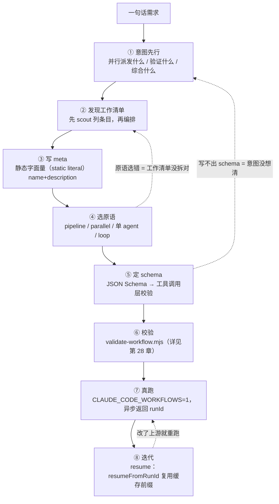
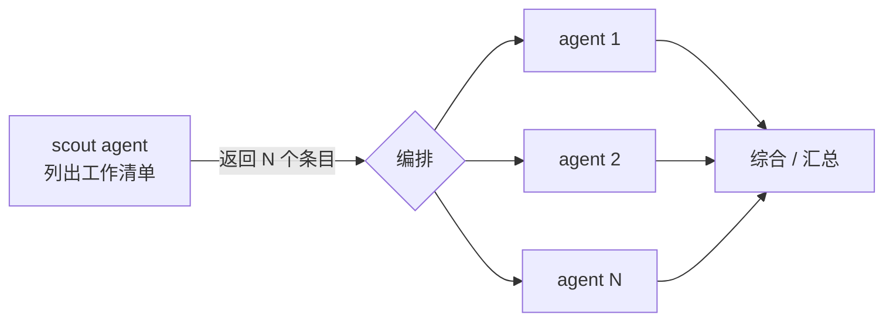
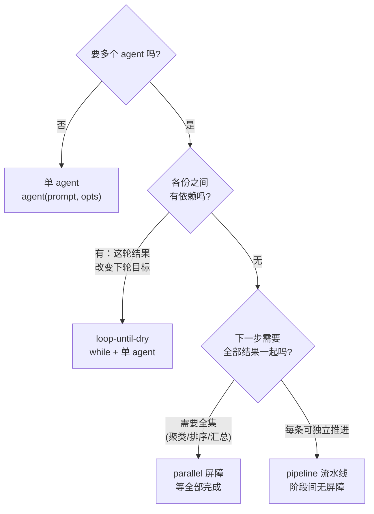
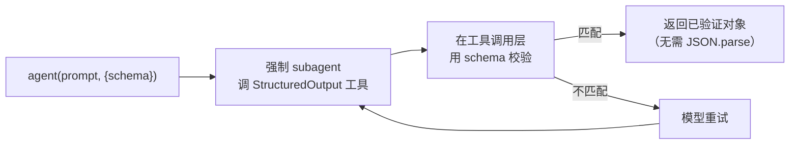
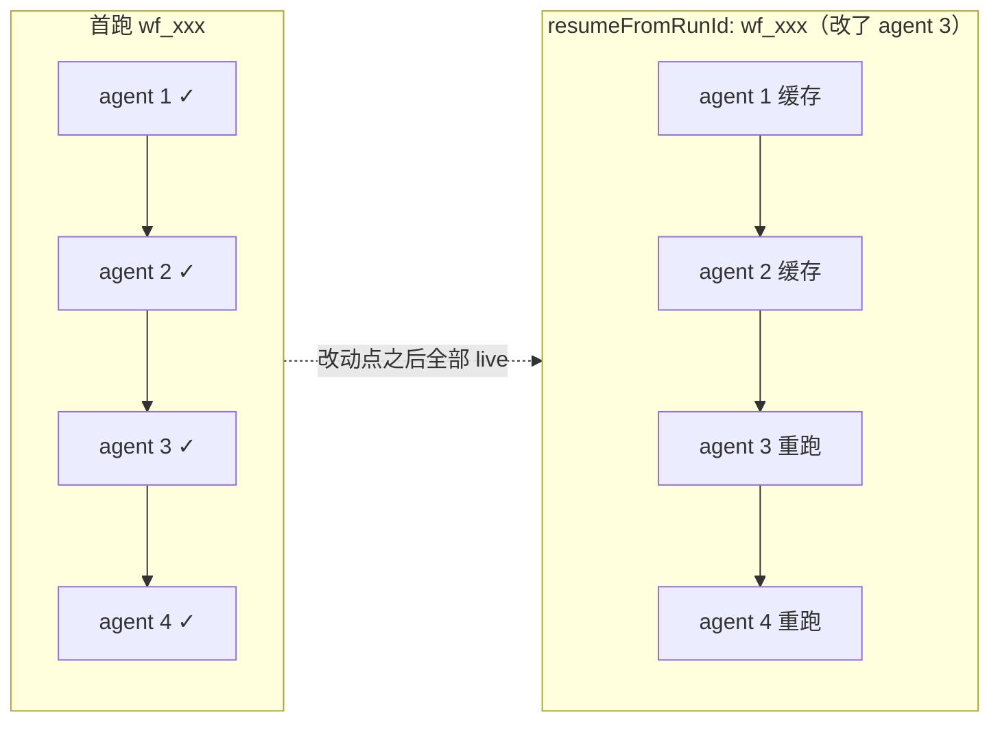
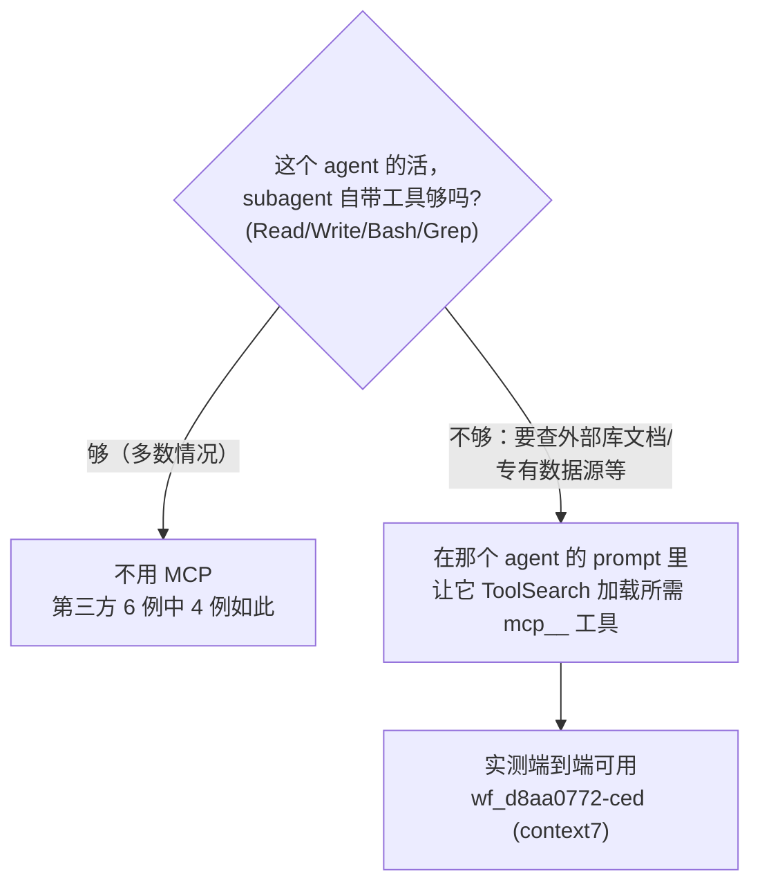

# 第 27 章 · 工作流创作流程

> 一句话：**写一个 Workflow，不是从打开编辑器、敲 `pipeline(` 开始的，而是从一句话需求开始：要并行派发什么、验证什么、综合什么。意图一旦想清楚，该用哪个原语（pipeline / parallel / 单 agent / loop）几乎自动浮现。如果意图不清楚，再漂亮的脚本也只是把一堆没头绪的东西并行化了一遍。**
>
> 本章提供一条可复跑的创作流水线：意图 → 工作清单 → meta → 选原语 → schema → 校验 → 真跑 → 迭代。每一步都以本书三个真跑过的示例脚本（review-spa、dead-code-scan、feedback-themes）为决策案例，引用它们真实的 Run ID 和用量。读完会形成一套从需求到可复跑工作流的肌肉记忆，外加一份可以直接拿去改的脚手架骨架。

---

前面几章把 Workflow 的零件逐一拆解过：第 5 章讲 `meta`/`phase`，第 6 章讲 `agent()`，第 7 章讲 schema，第 8 章讲 `parallel` 屏障与 `pipeline` 流水线，第 17 章讲对抗验证，第 18 章讲 loop-until-dry。但认识每个零件和会把零件拼成一台机器是两回事。本章不讲新零件，只讲怎么拼：面对「帮我审一下这个 PR」「把这堆反馈归个类」这类一句话需求时，实际的决策流程是什么。

下面画的是一条直线流水线，但真正的创作过程是来回迭代的。任何一步都可能退回上一步（schema 写不出来，通常说明意图还没想清楚）。



<div class="callout info">

这一章是「创作侧」的总览；往下接的是第 28 章（校验与调试）和第 29 章（示例画廊，还是这三个脚本，但看的是**端到端跑出来的结果**）。本章管「怎么写出来」，第 29 章管「跑出来长什么样」。两章引用同一组 Run ID，可以对着看。

</div>

---

## 27.1 意图先行：要并行派发什么、验证什么、综合什么

新手最常犯的错误，是一上来就纠结「该用 pipeline 还是 parallel」。这是拿工具去套问题，顺序反了。**先回答一个更基本的问题：这个任务的并行，目的是什么？**

Workflow 的全部价值归结为三个动词：

| 动词 | 你在做什么 | 它换来什么 | 典型原语 |
|---|---|---|---|
| **并行派发 (fan-out)** | 把一个大任务切成 N 份，N 个 subagent 同时做 | **规模 / 速度**——wall-clock压到「最慢的一份」 | `parallel` / `pipeline` |
| **验证（verify）** | 让另一个 agent 去核对/反驳第一个 agent 的产出 | **可信**——单 agent 会幻觉、会夸大 | 并行派发后接一个验证 stage |
| **综合（synthesize）** | 把 N 份独立结果合成一个结论 | **全面**——跨全集才能看出主题/排序 | 屏障后接一个综合 agent |

动手写脚本前，先用一句话把意图讲明白：**是为了全面、为了可信，还是为了规模**？这一句话直接决定后续所有取舍。本书三个真跑示例各自的「意图句」：

<div class="callout tip">

- **review-spa**：「对一份代码做**多角度**审查，且**不轻信** reviewer 的每条发现。」→ 并行派发（按维度）+ 验证（对抗）。为**规模**也为**可信**。
- **feedback-themes**：「把一批反馈**综合**成排序主题。」→ 并行派发（逐条摘要）+ 综合（聚类全集）。为**全面**。
- **dead-code-scan**：「**反复**扫描直到确认没有遗漏。」→ 递进式扫描，一轮可能揭示下一轮的目标。为**全面**（穷尽），但用串行循环而非并行派发。

</div>

注意 dead-code-scan 的意图里没有「同时做 N 份」。它是**串行**循环。这说明「意图先行」能帮助避开一个常见误区：**不是所有任务都该并行派发**。一旦出现「这一轮的结果会改变下一轮该找什么」，并行派发反而是错的，因为各份之间存在依赖。把意图想清楚，自然不会把一个递进任务强塞进 `parallel`。

<div class="callout warn">

**警惕「为并行而并行」**。Workflow 的并发不是免费的：每个 `agent()` 大约消耗 2.5--3 万 token 的上下文（这条经验法则的推导见 [第 09 章 §9.3](#/zh/p2-09)）。`feedback-themes` 真跑一次消耗了 **607,307 token**（Run `wf_b3febb70-ad9`），原因就是并行派发了 20 个 agent。如果任务单 agent 就能完成，并行派发只是多花 20 倍的费用去并行一件不需要并行的事。先问自己「为什么需要多个 agent」，如果答不上来，就用单 agent。

</div>

---

## 27.2 发现工作清单：先 scout 列条目，再编排 pipeline

意图清楚了，下一个问题随之而来：**要并行派发的「N 份」，到底是哪 N 份？** 很多任务在开始时并不知道 N 是多少。要审的文件清单、要研究的子问题、要摘要的反馈条数，通常需要先侦察一遍才能确定。

这引出一个关键的两段式结构：**先 scout（侦察），再编排（处理）**。不要在写脚本时硬编码一个估计的清单，而是让第一个 agent **列出**清单，再把这份清单传给后续的 `pipeline`/`parallel`。

`feedback-themes` 是典型的「scout 先行」。它的第一个 `agent()` 不做任何摘要，只做一件事——**把 CSV 读成一个条目数组**：

```javascript
  phase('Load')
  const { items } = await agent(
    `Read ${SOURCE} (a CSV with columns id,text). Return every row as an item with its id and text.`,
    { label: 'load', phase: 'Load', schema: ITEMS },
  )
  log(`${items.length} feedback item(s) loaded`)

  // 现在才知道 N = items.length，下一步据此并行派发
  const summaries = await parallel(items.map(it => () =>
    agent(/* 每条一个摘要 agent */),
  ))
```

真跑时这个 scout 读出了 18 行，于是 `parallel` 并行派发 18 个摘要 agent（加上 1 个 load、1 个 cluster，`agent_count` 实测正好 **20**，Run `wf_b3febb70-ad9`）。脚本中没有硬编码「18」，清单是运行时从数据中读出的。这是 scout-then-orchestrate 的核心优势：**同一个脚本，输入 18 行产出 20 个 agent，输入 50 行自动产出 52 个 agent**，不需要改动任何代码。



<div class="callout tip">

**scout 的产出必须带 schema**。因为它的返回值要被 `.map()` 展开为下一批 `agent()`，必须是**结构化数组**，而非散文。`feedback-themes` 的 scout 使用了 `schema: ITEMS`（`{items: [{id, text}]}`），`items.map(...)` 才能安全展开。没有 schema，返回的就是一段需要额外解析的文本，等于把确定性又交回给了模型。

</div>

并非每个工作流都需要显式 scout。`review-spa` 的「清单」就是固定的三个维度（bugs/security/a11y），直接写成字面量 `DIMENSIONS` 数组即可，因为清单本身不依赖运行时数据。判断标准很简单：**清单是写脚本时就已知的（写成字面量），还是需要从输入中读出的（用 scout agent）？**

---

## 27.3 写 meta：静态字面量（static literal）的「身份证」

清单和编排思路都确定之后，先把 `meta` 写出来。这不只是走流程——`meta` 是工作流的身份证，也是**运行前唯一被静态读取**的部分。

`meta` 有两条铁律（都已实测）：

1. **必须是静态字面量（static literal）**，而且是脚本的**第一条语句**。不能有变量引用、函数调用、展开运算符、模板插值。运行时在执行脚本主体**之前**就会静态读取它，因此它必须能被「读取」而不需要「执行」。
2. **`name` 和 `description` 必填**。`description` 就**一行**，会显示在权限确认对话框里（官方类型定义/工具契约）；`whenToUse` 会显示在工作流列表里（官方类型定义/工具契约）。

```javascript
  export const meta = {
    name: 'review-spa',
    description: "Review the book's SPA (index.html) across dimensions, then adversarially verify each finding",
    whenToUse: 'A real-run demo of fan-out review + adversarial verification',
    phases: [
      { title: 'Review', detail: 'one reviewer per dimension' },
      { title: 'Verify', detail: 'try to refute each finding', model: 'haiku' },
    ],
  }
```

这是 `review-spa` 真实的 `meta`。注意 `phases` 数组：它声明了工作流包含几个阶段，**应当与脚本里实际调用的 `phase()` / `opts.phase` 保持一致**。`review-spa` 声明了 `Review` 和 `Verify` 两个阶段，脚本里两个 `agent()` 也分别标了 `phase: 'Review'` 和 `phase: 'Verify'`。一一对应，进度树才能正确显示。

<div class="callout warn">

**`meta` 如果不是静态字面量（static literal），提交时会被拒绝，脚本无法运行**。实测中 `export const meta = {…, constructor: 'x'}`（保留键）在提交期被拒，原文：`Script must begin with export const meta = { name, description, phases } (pure literal). meta must be a pure literal: reserved key name not allowed in meta: constructor`。同理，任何 `name: 'x-' + suffix`、`description: \`...${v}\`` 都会被拒。需要动态拼接的内容应放到脚本主体中（写进 `agent()` 的 prompt），`meta` 必须写死。

</div>

关于 `phases[].model`：官方工具描述将其描述为「某阶段要用特定模型 override 时加上」，措辞含糊；而本书因为 `CLAUDE_CODE_SUBAGENT_MODEL` 一直在覆盖，**未能独立隔离**它在运行时是否被读取。**稳妥的做法**是把 `phases[].model` 当作对话框上的「标签」：如果确实要让某阶段跑 Haiku，应在该阶段的每个 `agent()` 上写 `model:'haiku'`，不要依赖 `phases[].model` 自动生效（模型覆盖的两层环境变量细节见 [附录 A · A.4](#/zh/app-a)）。

---

## 27.4 选原语：四选一的真实决策

到这一步，意图、清单、meta 都齐了。现在才轮到选原语。因为前三步已经做扎实，这一步基本是「对号入座」。Workflow 提供四种编排形态，区别归结为一个核心问题：**下一步什么时候能开始？**



| 原语 | 屏障语义 | 何时进入下一步 | wall-clock特征 | 选它的信号 |
|---|---|---|---|---|
| **单 agent** | — | 顺序 | 单任务时延 | 一个 subagent 即可完成 |
| **`pipeline`** | **无屏障** | 每条链各走各的，谁先好谁先走 | ≈ 最慢的**单条链** | 多条独立链，希望「先好先走」（**多阶段默认**） |
| **`parallel`** | **有屏障** | **等全部完成**才返回 | ≈ 最慢的**单个 agent** | 下一步需要全集 |
| **loop** | 串行 | 满足终止条件才停 | N 轮串行之和 | 一轮揭示下一轮目标 |

下面拿三个真跑示例，把这张表从抽象落成具体的决策。

### review-spa 为何选 pipeline

意图是「3 个维度各自独立审查，某个维度一审完就**立即**验证它的发现，不等其它维度」。这是 `pipeline` 的典型场景：**每个 item（维度）独立流过两个 stage（审查 → 验证），阶段之间没有屏障**。

```javascript
  const reviewed = await pipeline(
    DIMENSIONS,
    // Stage 1 — 审查一个维度。
    d => agent(d.prompt, { label: `review:${d.key}`, phase: 'Review', schema: FINDINGS }),
    // Stage 2 — 对该维度的每条发现，并行验证。
    (review, d) => parallel(
      (review?.findings ?? []).map(f => () =>
        agent(/* 对抗验证，model:'haiku', schema: VERDICT */)
          .then(v => ({ ...f, dimension: d.key, verdict: v })),
      ),
    ),
  )
```

为什么**不**用 `parallel`？如果用 `parallel`，三个维度的审查会全部卡在同一道屏障上，必须等最慢的维度审完，三组验证才能一起开始。但验证 bugs 的发现根本不需要等 a11y 审完。`pipeline` 让 bugs 一审完就立即进入验证 stage，wall-clock因此变成「最慢的**单条**审查→验证链」的时长，而不是「最慢审查 + 最慢验证」之和。

真跑数据展示了这套编排的代价和产出：Run `wf_97b81e86-a0b`，**22 个 agent**（3 审查 + 19 验证）、**991,554 token**、**395,166ms**（约 6.6 分钟），最终 **18 条发现通过了对抗验证**（bugs 6 / security 4 / a11y 8）。注意验证阶段虽然标了 `model:'haiku'`，但本会话 `CLAUDE_CODE_SUBAGENT_MODEL` 将其覆盖，19 个验证 agent 实际运行的是 Opus。这是 token 接近百万的主要原因。

<div class="callout info">

**pipeline 内部的 `agent()` 必须显式设置 `opts.phase`**。因为 pipeline 的多条链并发运行，如果依赖全局 `phase()` 来切换阶段，多条链会**竞争**同一个全局 phase 指针，导致进度树混乱。`review-spa` 为每个 `agent()` 都明确指定了 `phase: 'Review'` 或 `phase: 'Verify'`，将归组固定下来，各链互不干扰。（这一问题在 [第 08 章](#/zh/p2-08) 有更详细的分析。）

</div>

### feedback-themes 为何选 parallel 屏障

意图是「逐条摘要，再把**全集**聚成排序主题」。聚类这一步有一个无法绕开的硬依赖：**无法只看一条摘要就做聚类**，必须等**所有**摘要到齐，才能判断哪些该归为一类、哪一类最大。这正是「屏障」的定义：等全部完成，再一起进入下一步。

```javascript
  // 故意用屏障：下一步跨全集聚类，必须全部摘要到齐才能跑。
  const summaries = await parallel(items.map(it => () =>
    agent(/* 单条摘要 */, { label: `summarize:${it.id}`, phase: 'Summarize', model: 'haiku' })
      .then(summary => ({ id: it.id, summary })),
  ))

  const labelled = summaries.filter(Boolean)

  phase('Cluster')
  const { themes } = await agent(
    `Here are ${labelled.length} summarized feedback items. Cluster them into themes...`,
    { label: 'cluster', phase: 'Cluster', schema: THEMES },
  )
```

为什么**不**用 `pipeline`？因为 pipeline 的语义是「每条 item 各自独立流到底」，而聚类需要的是「**所有** item 汇聚后的一个下一步」。pipeline 中不存在「等所有人到齐」的时刻，而聚类恰恰需要这个时刻。因此这里必须使用 `parallel` 屏障。

真跑数据：Run `wf_b3febb70-ad9`，**20 个 agent**（1 load + 18 summarize + 1 cluster）、**607,307 token**、**122,391ms**（约 2.0 分钟），18 项 → **8 个主题**（按 count 降序）。注意 `.filter(Boolean)` 的用法：`parallel` 返回的数组中，异步出错或被中途跳过的位置会是 `null`，聚类前先过滤掉即可（这一失败语义在 [第 08 章 §8.8](#/zh/p2-08) 有详细说明）。

<div class="callout warn">

**屏障的代价是「木桶效应」**：`parallel` 的wall-clock由**最慢的那一个** thunk 决定。20 个摘要中只要有一个特别慢，整个屏障就会被它拖住。这是为全面性付出的代价，但因为聚类**确实**离不开全集，这个代价是值得的。反过来，如果使用了 `parallel` 却**不需要**全集（下一步其实可以各自独立推进），就应该换成 `pipeline`。

</div>

### dead-code-scan 为何选 loop

意图是「**反复**扫描直到确认干净」。关键在于：**这一轮认定某个符号是死代码，可能让下一轮发现更多**（移除一个没人引用的函数后，原本「被它引用」的符号也变成了无引用状态）。各轮之间**存在依赖**，这正是「不该并行派发、应串行循环」的信号。

```javascript
  const DRY_STREAK = 2 // 连续这么多空轮就停
  const MAX_ROUNDS = 5 // 硬上限，保证循环一定终止

  let emptyRounds = 0
  let round = 0

  while (emptyRounds < DRY_STREAK && round < MAX_ROUNDS) {
    round++
    phase('Find')
    const { items } = await agent(
      `Round ${round}. Read ${TARGET}... Ignore anything already reported: ` +
      `${found.map(r => r.symbol).join(', ') || 'nothing yet'}.`,
      { label: `find:round-${round}`, phase: 'Find', schema: DEAD },
    )
    if (items.length === 0) { emptyRounds++; continue }
    emptyRounds = 0
    found.push(...items)
  }
```

为什么**不**用 `parallel`/`pipeline`？因为并行派发的前提是「N 份彼此独立、能同时执行」。但 dead-code-scan 的第 2 轮 prompt 明确携带「忽略已报告的：`${found...}`」，**第 2 轮的输入依赖第 1 轮的输出**。存在这种轮次依赖时，并行派发是错误的选择：第 1 轮尚未出结果，根本无法启动第 2 轮。因此只能串行循环。

真跑数据：Run `wf_2283ab37-710`，**2 个 agent**（2 轮 x 1 finder）、**116,344 token**、**246,496ms**（约 4.1 分钟），返回 `{ rounds: 2, candidateCount: 0 }`：两轮全部干净、0 候选，**连续 2 个空轮触发 `DRY_STREAK` 正常终止**（没有跑满 5 轮上限）。这验证了一个重要性质：**loop-until-dry 即使零发现也能正确收敛**。

<div class="callout warn">

**任何循环都必须有硬上限**。`dead-code-scan` 同时设置了两个终止条件：`DRY_STREAK`（连续 2 空轮）负责正常收敛，`MAX_ROUNDS=5` 负责防失控兜底。即使模型每轮都报出新发现、导致 `DRY_STREAK` 永远凑不齐，`MAX_ROUNDS` 也能保证循环终止。生命周期层面还有一道官方硬上限（单次工作流 `agent()` 总数不超过 1000），但那只是安全网，不应依赖它触发，第一道闸永远应该是自己写的 `MAX_ROUNDS`（详见 [第 18 章 §18.3](#/zh/p4-18)）。

</div>

---

## 27.5 定 schema：让确定性落在工具调用层

原语选好了，下一步是给每个会被「程序消费」的 `agent()` 配 schema。判断标准：**这个 agent 的返回值是给人看的散文，还是给代码 `.map()`/`.filter()`/取字段用的数据？** 如果是后者，就必须配 schema。

它的机制（官方 + 实测）很关键，值得仔细理解：



- 有 `schema`，就**强制** subagent 去调 `StructuredOutput` 工具，**在工具调用层校验**，返回**已验证对象**；对不上就让模型重试。
- 因为校验在工具调用层就做完了，你拿到的 `agent()` 返回值**就是已验证对象**：直接读 `result.findings`、`result.items` 即可，**绝不要 `JSON.parse`**（它已经是对象，不是字符串了）。

看看三个示例的 schema 设计，全都照着「程序要读什么，就 `required` 什么」来：

```javascript
  // review-spa：每个 reviewer 必须返回这个形状
  const FINDINGS = {
    type: 'object',
    required: ['findings'],
    properties: {
      findings: {
        type: 'array',
        items: {
          type: 'object',
          required: ['title', 'evidence', 'severity'],
          properties: {
            title: { type: 'string' },
            evidence: { type: 'string' },
            severity: { type: 'string', enum: ['low', 'medium', 'high'] },
          },
        },
      },
    },
  }
```

注意 `severity` 用了 `enum`——这将「严重度只能是这三个值之一」从提示词中的一个请求，提升为了工具调用层的硬约束。下游 `.filter(f => f.verdict?.isReal)` 之所以能直接读字段，正是因为 schema 保证了字段存在且类型正确。

<div class="callout tip">

**schema 写不出来，通常是意图尚未明确的信号**。如果无法说清这个 agent 到底该返回哪几个字段，大概率是 §27.1 的意图还没收敛，尚不清楚下游要拿这份结果做什么。这时不要硬凑 schema，而应回到第一步把「并行派发 / 验证 / 综合」想清楚。schema 是意图的形式化表达，意图模糊，schema 必然也模糊。

</div>

并非每个 `agent()` 都需要 schema。`feedback-themes` 的摘要 agent **故意不带 schema**：它的返回值（一句话摘要）直接拼进下一个 prompt 的文本中供模型读取，不通过代码取字段。**散文传散文，结构传结构**：要传给 `.map()` 的用 schema，要传给下一个 prompt 的，纯文本即可。

---

## 27.6 校验：提交前先过一遍 lint

脚本写完、真跑之前，先用第三方校验器 `validate-workflow.mjs` 做一遍静态检查。它能把「meta 是否为静态字面量（static literal）」「是否使用了 `Date.now()`/`Math.random()`」「是否误用了宿主 API」这些会导致**提交期被拒或运行时崩溃**的问题，提前在本地发现。

```bash
  node validate-workflow.mjs assets/examples/review-spa.js
  # 合法脚本：ok ... passes
```

这一步本章只简要提及：**完整的校验规则清单、每条错误的原文、以及真跑失败后如何用 `/workflows` 和 transcript 调试，全在 [第 28 章](#/zh/p6-28)**。这里只需要记住一点：**真跑要消耗 token（动辄几十万），先过一遍零成本的本地 lint 能挡掉大半低级错误**。不要把真跑当 lint 用。

---

## 27.7 真跑：异步、门控、拿 runId

校验通过后，正式真跑。三件事需要注意：

1. **门控**：先确认 Workflow 工具可用。官方正式入口是 `/config` 里的「Dynamic workflows」行（所有付费档都可用，Pro 必须从这里手动开；Max/Team/Enterprise 是否默认开官方未声明，以自己 `/config` 那一行的开关状态为准）。`CLAUDE_CODE_WORKFLOWS=1` 是 power-user 的底层显式开关，**不取代** `/config`（详见 [第 01 章 §1.5](#/zh/p1-01)）。
2. **怎么调**：脚本保存到磁盘后用 `Workflow({ scriptPath: '...' })` 触发（`scriptPath` 的优先级高于内联 `script` 和具名 `name`）。也可以在消息里带个 `ultracode` 关键词来触发（`workflow` 这个词在 2.1.160 起已不再触发，见 [第 01 章 §1.5](#/zh/p1-01)）。
3. **返回是异步的**：Workflow 工具**立即返回** `taskId` 和 `runId`（形如 `wf_...`），**不阻塞**。真正跑完时，由 `<task-notification>` 回传 `usage` 和 `result`。

```bash
  # 在 CLAUDE_CODE_WORKFLOWS=1 的会话里
  Workflow({ scriptPath: 'assets/examples/feedback-themes.js' })
  # → 立即返回 { status: 'async_launched', taskId: '...', runId: 'wf_b3febb70-ad9' }
  # → 完成时 <task-notification> 回传 { itemCount: 18, themeCount: 8, themes: [...] }
```

`runId` 很重要——**记下它，下一步迭代需要用它做续传**。真跑期间可以用斜杠命令 `/workflows` 查看实时进度树。本书三个示例的 runId 全部记录在 `assets/transcripts/examples-r5.md`，每条都可溯源。

<div class="callout info">

**编排本身零模型开销**。一个不含任何 `agent()` 调用的纯编排脚本，实测 **0 token / 4ms**（Run `wf_59bf3654-183`）。token 全部花在 `agent()` 叶子节点上。因此脚本逻辑无论多复杂都不产生费用，真正产生费用的是并行派发了多少个 subagent。这也是「先想清楚是否需要并行派发」如此重要的原因。

</div>

---

## 27.8 迭代：用 resume 复用没改动的部分

第一次真跑很少一次到位——某个 prompt 措辞不当、某个 schema 漏了字段都很常见。这时**最浪费**的做法是从头重跑：`review-spa` 重跑一次又是 99 万 token、6.6 分钟。Workflow 提供了一个节省成本的机制：**断点续传（resume）**。

机制（官方 + 实测）是这样：传 `resumeFromRunId: '<上次的 runId>'`，运行时会**复用最长的、未改动的那段 `agent()` 调用前缀**，这些秒级就把缓存结果吐回来、**0 新 token**；而**第一个被你改过或新增的 `agent()` 调用，连同它之后的全部**，都 live 重跑（完整机制见 [第 22 章](#/zh/p4-22)）。

```bash
  # 改了脚本后半段，前半段没动 → 复用前缀缓存
  Workflow({
    scriptPath: 'assets/examples/feedback-themes.js',
    resumeFromRunId: 'wf_b3febb70-ad9',
  })
```

实测数据：同脚本 + 同 args 重跑，5 个 agent **全部命中缓存**，结果与首跑完全一致、**0 token / 3ms**（首跑 133,691 token / 32,959ms，Run `wf_9c94951d-58c` 首跑 + 续传）。也就是说，如果只改了脚本**末尾**的聚类 prompt，前面 19 个摘要 agent 全部走缓存，只需为重跑那 1 个聚类付费。



<div class="callout warn">

**续传有两个硬性前提**（官方）：①**仅同会话**，跨会话的 runId 无法续传；②**续传前需停掉上一次运行**（用 `TaskStop`），否则两次运行会冲突。另外，缓存命中的判定依据是「`agent()` 调用是否有改动」，因此即使只在某个 prompt 中改了一个字，该 agent 及其之后的所有 agent 都会重跑。建议将需要反复调整的 agent 尽量放在脚本**后面**，这样每次迭代能最大程度复用前面的缓存。

</div>

### 收尾：跑顺了，按 `s` 存成命令

迭代到满意为止，这条流水线还有一个**官方收尾步骤**：把跑通的工作流**固化下来**，避免下次又从 `{ script }` 起手。最轻量的方式是在 `/workflows` 视图中按 **`s`**，将本次 run 背后的脚本**保存为一条 `/` 命令**，进入自动补全、与 `/deep-research` 并列，下次 `/<名字>` 直接复用（操作见 [《官方操作面板》§6](#/zh/p2-ops)）。

> **按键速记**：在 `/workflows` 里选中这次 run，按 `s`，用 `Tab` 切项目级 / 个人级，按 `Enter`。
> 完整操作（每个按键、每个落点的细节）仍看[《官方操作面板》§6](#/zh/p2-ops)。

作为脚本作者，整个过程是用 `scriptPath` 在磁盘上反复打磨（§27.7--§27.8）。跑通之后有两个去处，按需选择。**轻量**：按 `s` 存成命令，即时固化、零配置。**正式**：把 `.js` 文件收进 `.claude/workflows/`，用 `{ name }` 调用，从此版本化、参数化、可回归测试、可分享给团队。后者是「构建自己的 workflow 库」的标准做法，[第 25 章](#/zh/p5-25) 专门讲述，它衔接的正是本章的 `scriptPath` 迭代循环。

至此，一条完整的创作流水线已经跑通：意图 → 清单 → meta → 原语 → schema → 校验 → 真跑 → 迭代 → 存为命令。但还有一个高频问题未回答：**整个过程需要 MCP 吗？**

---

## 27.9 诚实的「我需要 MCP 吗？」

创作工作流时，这是最容易被误导的一个问题。社区中常把「Workflow + MCP」当作卖点宣传，好像不接 MCP 就没有发挥 Workflow 的全部能力。**实测数据不支持这个说法。** 以下逐条说明。

**第一个事实：多数工作流根本不需要 MCP。** 第三方仓库 `claude-code-workflow-creator` 的 6 个示例中，**4 个零 MCP**，它们需要的只是文件读写、shell、代码分析，这些 subagent 原生就具备（Read/Write/Bash/Grep）。（官方自带的 bundled 工作流只有 `/deep-research` 一个，这 6 例并非官方出品，见 [附录 E](#/zh/app-e)。）本书三个真跑示例（review-spa / dead-code-scan / feedback-themes）**也全部零 MCP**：审查 SPA、扫描死代码、聚类反馈，依靠 subagent 自带的文件工具即可完成。因此默认假设应该是「**不需要 MCP**」，而非相反。

**第二个事实：默认 subagent 启动时手里 0 个 `mcp__` 工具。** 实测探针（Run `wf_1d4c6a71-56a`）显示，默认的 `workflow-subagent` 类型一启动**连一个 `mcp__` 工具都没有**，本机是「延迟工具环境」。但它带着 `ToolSearch`，可以**按需加载** MCP 工具再去调用。

**第三个事实：真要用时，MCP 确实端到端能跑通。** 实测里（Run `wf_d8aa0772-ced`），一个 subagent 经 `ToolSearch` 成功**加载并调用**了 `mcp__context7__resolve-library-id`，端到端跑通，还顺手发现它的 schema 要求 `query` 和 `libraryName` 都必填。MCP 端到端确实可用。



三个事实综合起来，结论是克制的：

<div class="callout tip">

**MCP 是「需要时可用」，不是卖点。** 判断标准很简单：如果 agent 的工作靠 subagent 自带的 Read/Write/Bash/Grep 就能完成（审查代码、读写文件、运行命令、grep），就**不要**引入 MCP；如果确实需要某个外部能力（查询某个库的最新文档、访问某个专有数据源），就在对应 agent 的 prompt 中让它先通过 `ToolSearch` 加载相应的 `mcp__` 工具再使用。本机实测证明这条路径可行（`wf_d8aa0772-ced`），但绝大多数工作流不会用到。

</div>

<div class="callout info">

**为什么默认不预装 MCP 工具反而是好事**？因为每个工具的 schema 都会占用 subagent 的上下文预算。默认 0 个 `mcp__` 工具配合 `ToolSearch` 按需加载，意味着 subagent 不会被几十个用不到的工具定义占满上下文，需要哪个就按需搜索加载。这是「延迟工具环境」的设计意图，与 Workflow「token 是稀缺资源」的整体理念一致。

</div>

---

## 27.10 可运行脚手架骨架

将本章的流程固化为一个可直接编辑的骨架。它演示了「scout 先行 → 选原语 → schema → 综合」的标准结构，只需替换 prompt、schema 和编排原语即可使用。

<div class="callout warn">

下面是一个**示意脚手架（未实跑）**，它把 §27.2–§27.5 的结构抽象成了一个模板，用来起手新工作流。真正跑过、可溯源的脚本是 `assets/examples/` 下的那三个（见 §27.4 的 Run ID）。拿这个骨架起手之后，务必先过 §27.6 的校验、再 §27.7 真跑。

</div>

```javascript
  // 示意脚手架（未实跑）：scout → 编排 → 综合
  export const meta = {
    name: 'my-workflow',
    description: 'One line shown in the permission dialog — say what it produces',
    whenToUse: 'Shown in the workflow list — when should a reader pick this?',
    phases: [
      { title: 'Scout' },
      { title: 'Process' },
      { title: 'Synthesize' },
    ],
  }

  // ① schema：程序要读什么，就 required 什么
  const WORKLIST = {
    type: 'object',
    required: ['items'],
    properties: {
      items: {
        type: 'array',
        items: {
          type: 'object',
          required: ['id'],
          properties: { id: { type: 'string' }, note: { type: 'string' } },
        },
      },
    },
  }
  const RESULT = {
    type: 'object',
    required: ['ok'],
    properties: { ok: { type: 'boolean' }, detail: { type: 'string' } },
  }

  // ② scout 先行：让第一个 agent 把工作清单「列出来」（带 schema，才能 .map）
  phase('Scout')
  const { items } = await agent(
    'Discover the work items for this task and return them as a structured list.',
    { label: 'scout', phase: 'Scout', schema: WORKLIST },
  )
  log(`${items.length} item(s) discovered`)

  // ③ 选原语：每条可独立推进 → pipeline；需要全集 → 换成 parallel 屏障
  const processed = await pipeline(
    items,
    // Stage 1：处理每条
    it => agent(`Process item ${it.id}.`, { label: `process:${it.id}`, phase: 'Process', schema: RESULT }),
    // Stage 2（可选）：对每条结果再验证 / 加工
    (res, it) => agent(`Verify result for ${it.id}: ${JSON.stringify(res)}`,
      { label: `verify:${it.id}`, phase: 'Process', schema: RESULT }),
  )

  // ④ 综合：若需要跨全集（聚类/排序/汇总），这里换成一个 parallel 屏障后接综合 agent
  const ok = processed.flat().filter(Boolean).filter(r => r.ok)
  log(`${ok.length} item(s) passed`)

  // 编排本身零 token（Run wf_59bf3654-183）；成本全在上面的 agent() 叶子
  return { total: items.length, passed: ok.length, results: ok }
```

骨架中每个决策点都对应本章的一节：`meta` 对应 §27.3，scout 对应 §27.2，`pipeline` 的选择对应 §27.4，schema 对应 §27.5。将它保存到 `.claude/workflows/` 下，下次创建新工作流时复制一份、修改 prompt 即可。

---

## 27.11 本章小结

将「从一句话需求到可复跑工作流」收敛为一条可反复使用的流水线：

- **① 意图先行**（§27.1）：先回答「并行派发什么 / 验证什么 / 综合什么」，是为了规模、为了可信，还是为了全面。这一句话决定一切。三个示例的意图句各不相同：review-spa（规模 + 可信）、feedback-themes（全面）、dead-code-scan（穷尽但串行）。
- **② 发现工作清单**（§27.2）：先 scout 列条目，再编排。`feedback-themes` 的 scout 读出 18 行 → 自动并行派发 20 个 agent（Run `wf_b3febb70-ad9`），脚本不写死 N。
- **③ 写 meta**（§27.3）：静态字面量（static literal）、首语句、`name`+`description` 必填。不是字面量（比如保留键 `constructor`）提交期就被拒。
- **④ 选原语**（§27.4）：**review-spa 为何用 pipeline**（各维度先好先走，`wf_97b81e86-a0b`，22 agent / 991,554 token）、**feedback-themes 为何用 parallel 屏障**（聚类要全集，`wf_b3febb70-ad9`，20 agent / 607,307 token）、**dead-code-scan 为何用 loop**（轮次有依赖，`wf_2283ab37-710`，2 agent / 116,344 token，DRY_STREAK 终止）。
- **⑤ 定 schema**（§27.5）：JSON Schema → 工具调用层校验 → 返回已验证对象（不要 `JSON.parse`）→ 不匹配就重试。schema 写不出 = 意图没想清。
- **⑥ 校验**（§27.6）：`validate-workflow.mjs` 零成本本地 lint，详见 [第 28 章](#/zh/p6-28)。
- **⑦ 真跑**（§27.7）：`CLAUDE_CODE_WORKFLOWS=1`，`Workflow({ scriptPath })` 异步返回 `runId`；编排本身 0 token（`wf_59bf3654-183`）。
- **⑧ 迭代 + 收尾**（§27.8）：`resumeFromRunId` 复用最长未改动的 `agent()` 前缀，秒级返回缓存、0 新 token（`wf_9c94951d-58c`）；仅同会话、续传前先停掉上次运行。跑顺后官方收尾：按 `s` 存成 `/` 命令（轻），或把 `.js` 收进 `.claude/workflows/` 用 `{ name }` 调用（重，见 [第 25 章](#/zh/p5-25)）。
- **⑨ 我需要 MCP 吗**（§27.9）：**多数不需要**（第三方仓库 `claude-code-workflow-creator` 的 6 例里 4 例零 MCP，官方自带的只有 `/deep-research`；本书三个示例也全部零 MCP）；默认 subagent 持 0 个 `mcp__` 工具，但有 `ToolSearch` 能按需加载；context7 端到端实测跑通（`wf_d8aa0772-ced`）。结论是「要用时能用」，不是卖点。

创作流程接下来进入「校验与调试」：脚本写好之后，如何在崩溃之前和之后都能可靠地定位问题？

> 继续阅读：[第 28 章 · 校验与调试](#/zh/p6-28)
