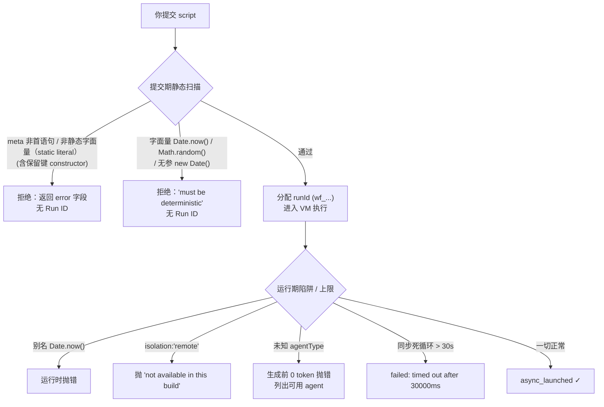
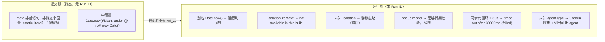
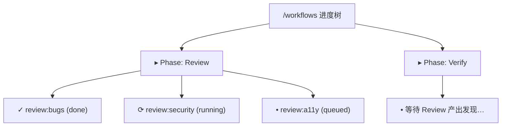
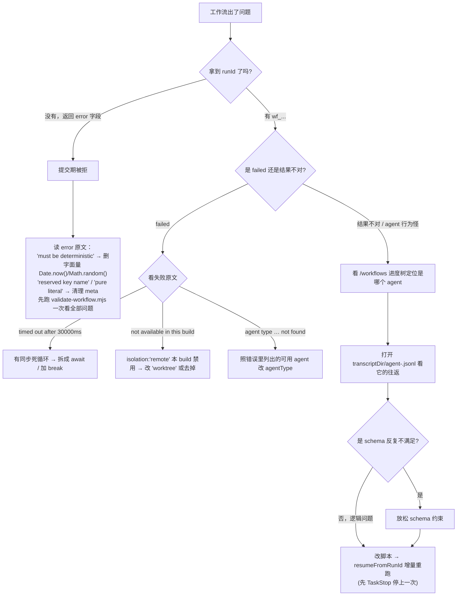

# 第 28 章 · 校验与调试

> **Workflow 把「确定性」视为铁律，因此在两个时刻设置了关卡。** 一个是提交那一刻的静态扫描：不合规的脚本直接被拒、无法运行。另一个是运行期的运行时陷阱和上限：脚本执行后仍可能因别名违规、隔离不可用、同步死循环、未知 agentType 而抛错。本章逐条明确这两道关卡：提交期拒绝什么、运行期抛出什么，每条都配有真实错误原文和 Run ID。随后介绍三件调试工具（`/workflows` 进度树、`agent-<id>.jsonl` journal、`resumeFromRunId` 增量重跑），用于快速定位问题，修复后无需从头消耗 token。
>
> 前面 27 章讲的是如何正确编写工作流。本章假设工作流已经写好，但出了错。出错是常态：`meta` 多了一个键、写了 `Date.now()`、`isolation` 拼错、循环没有设预算守卫。好消息是 Workflow 的错误信息非常直接，会**逐字说明**哪里出错、为什么出错、甚至如何修复。本章帮助读懂这些信号。

---

本章所有论断分三层来源，阅读时请对照：

- **官方工具定义**：Claude Code 内置 Workflow 工具的描述和 input-schema（比如脚本体积上限、并发上限）。
- **本机真实实测**：`assets/transcripts/*-r4.md` 里那些带 Run ID 的运行记录，错误原文逐字摘出来。
- **第三方工具 `validate-workflow.mjs`**：它来自第三方仓库 `claude-code-workflow-creator`（某个 YouTube 创作者的配套仓库，**非 Claude/Anthropic 官方**），但**它的行为我们已经在本机实跑确认过**。所以本章引用它的时候统一标注「**第三方工具、行为已实测**」，既不把它当官方，也如实记下它到底输出了什么。

<div class="callout info">

**两道关卡**。**提交期**是静态扫描：不执行代码，只读取源码和 `meta` 字面量，违规直接拒绝，连 `taskId` 都不会返回。**运行期**是真正执行：脚本已在 VM 中运行，违规通过抛错（`throw`）暴露，此时已经持有 `runId`（`wf_...`）。「为什么禁止非确定性调用、为什么要分两层拦截」的底层原因在 [第 01 章 §1.2](#/zh/p1-01) 中讲过，本章则逐条明确每道关卡**具体拒绝/抛出什么**，并配上错误原文和 Run ID。下面两节分别拆解。

</div>



---

## 28.1 提交前用校验器把关：`validate-workflow.mjs`

在将脚本提交给 Workflow 工具之前，可以先用一个**静态 lint** 做预检查。这个 lint 是第三方仓库自带的 `validate-workflow.mjs`。

<div class="callout warn">

**先说明来历**：`validate-workflow.mjs` 来自第三方仓库 `claude-code-workflow-creator`，**不是 Claude/Anthropic 官方工具**。但本书**已在本机实际运行并确认了它的真实行为**（Node v22.22.0，2026-05-25），因此下面引用的都是它**实测**输出的原文，而非照搬其文档。它检查的规则本身（`meta` 须为首语句、确定性禁用、宿主 API、thunk 形状）都可溯源到**官方工具定义 + 本书实测**，这个 lint 只是将这些规则封装成了一个可本地运行的脚本。

</div>

### 为什么要有这一步

提交期的静态拒绝能拦下违规脚本，但有两个不便之处：一是**反馈需要等一个网络往返**（需要实际调用一次工具）；二是**每次只报第一类致命错误**（提交被拒就停止了，无法看到还有哪些问题）。本地 lint 弥补了这个缺口：它**一次列出全部问题**（错误 + 警告），而且**不消耗任何 token、不发起任何调用**。将它接入保存钩子或 CI，可以在提交之前完成自查。

### 它检查什么

按照本机实测（`assets/transcripts/validator-r4.md`）加上官方规则，它覆盖下面这些检查项：

| 检查项 | 由什么触发 | 严重级 |
|---|---|---|
| 脚本体积上限（来源：**官方 input-schema 的 `script.maxLength`**，非 validator 实测） | 源码超过 **524288 字节（512KB）** | ERROR |
| `meta` 必须是**首语句** | `export const meta` 之前有任何代码（如一个 `const`） | ERROR |
| `meta` 必须**静态字面量（static literal）** | `meta` 里有变量引用 / 函数调用 / 展开运算符 / 模板插值 / 保留键（如 `constructor`）；或缺 `name`/`description` | ERROR |
| 禁用非确定性调用 | 字面量 `Date.now()` / `Math.random()` / 无参 `new Date()` | ERROR |
| 宿主 API 警告 | 编排层里出现 `require` / `import` / `process` | warning |
| `parallel([...])` 裸 promise 警告 | `parallel([agent(...), agent(...)])` 直接传 promise，而非 thunk | warning |

注意把 **ERROR** 和 **warning** 分清楚：**ERROR 会让退出码变成 1**（应当阻断提交）；**只有 warning 的时候退出码还是 0**（脚本能跑，只是有改进空间）。

### 实测示例一：合法脚本 → 通过，退出 0

将一个能正常运行的工作流（前面的模型解析测试脚本）传入：

```bash
  $ node validate-workflow.mjs <…>/model-resolution-test-wf_9c94951d-58c.js
  ok — model-resolution-test-wf_9c94951d-58c.js passes (1853 bytes)
  (exit=0)
```

输出 `ok … passes`，附带字节数，退出码 0。这是「通过」的样子。

### 实测示例二：违规脚本 → 逐条报错，退出 1

以下是一个故意违反多条规则的脚本：

```javascript
  // A deliberately broken workflow, to capture the validator's real output.
  const setupBeforeMeta = 5 // code before meta → ERROR: meta must be first

  export const meta = {
    name: 'bad-example',
    description: 'demonstrates validator errors',
  }

  const stamp = Date.now() // banned non-deterministic call → ERROR
  const fs = require('node:fs') // host API in orchestrator → warning

  const results = await parallel([agent('do x'), agent('do y')]) // bare promises → warning
  return { stamp, results }
```

校验器的输出（逐字摘自实测）：

```text
  warn  `require()` at line 10 — no Node/host APIs in the orchestrator; do file/shell work inside an agent() instead
  warn  parallel([...]) at line 12 looks like it holds bare agent(...) calls — wrap each as a thunk: () => agent(...)
  ERROR `export const meta` must be the FIRST statement (line 4) — code precedes it
  ERROR banned non-deterministic call `Date.now()` at line 9 — it throws inside a workflow (breaks resume)

  2 error(s) in bad-example.js — fix before running.
  (exit=1)
```

校验器一次列出了全部 4 个问题：2 个 ERROR（`meta` 不是首语句、字面量 `Date.now()`）加 2 个 warning（编排层中的 `require`、`parallel` 传了裸 promise）。最后一行明确提示 `2 error(s) … fix before running`，退出码 1。

<div class="callout tip">

**将它接入工作流**：这个 lint 的价值在于**提交之前**拦下会被静态拒绝的脚本，并一次展示全部问题。一个简单的用法是保存 `.claude/workflows/*.js` 时自动运行，或在 CI 中对 PR 涉及的工作流脚本运行。注意它是**静态预检**，覆盖范围比 Workflow 工具自身的提交期拒绝**更广**（它还报告 warning），但本质来源相同：`meta`-first、确定性禁用、宿主 API、thunk 形状这些规则，最终都以**官方工具定义 + 本书实测**为准。

</div>

---

## 28.2 提交期 vs 运行期：两类拒绝的边界

校验器是「自行预检」。真正的关卡是 Workflow 工具本身，它在两个时刻进行把关。确定错误发生在哪个时刻，就是定位问题的第一步：**是否拿到了 `runId`，就是分界线**。

| 维度 | 提交期（静态拒绝） | 运行期（运行时抛错 / 上限） |
|---|---|---|
| 发生时刻 | 脚本被解析/执行**之前**，只做静态扫描 | 脚本已在 VM 里**执行中** |
| 有没有 `runId` | **没有**（连工作流都没启动） | **有**（`wf_...`，可用于续传/排错） |
| 返回形态 | `WorkflowOutput` 带 `error` 字段 | 运行 `failed`，或脚本内 `try/catch` 接住的异常 |
| 典型触发 | `meta` 非首语句/非静态字面量（static literal）、字面量 `Date.now()` | 别名 `Date.now()`、`isolation:'remote'`、同步死循环、未知 agentType |
| 能否 `try/catch` 兜住 | **不能**（脚本没跑，何来 try） | **能**（异常在你的代码里抛出） |

下面一类一类看真实的错误原文。

### 提交期拒绝（无 Run ID）

**(1) 字面量 `Date.now()` / `Math.random()` / 无参 `new Date()`：静态扫描拒绝**

脚本中只要出现这些**字面量形式**的非确定性调用，就会在**提交时**被静态扫描拒绝，脚本不会被解析或运行。逐字错误原文如下：

```text
  Workflow scripts must be deterministic: Date.now()/Math.random()/new Date() are
  unavailable (breaks resume). Stamp results after the workflow returns, or pass
  timestamps via args.
```

<div class="callout warn">

**`try/catch` 无法捕获它**。常见的第一反应是「把 `Date.now()` 包进 `try/catch`」，但这行不通。这是**提交时的静态源码扫描**，发生在脚本被解析/执行**之前**，`try/catch` 还没有机会运行，脚本就已经被拒绝了。如果需要时间戳，应通过 `args` 传入，或在工作流返回之后再添加。（信源：`sandbox-r4.md` §A，提交拒绝实测，无 Run ID。）

</div>

**(2) `meta` 保留键：静态拒绝**

`meta` 必须是「静态字面量（static literal）」，且不能包含保留键。提交 `export const meta = { name, description, constructor: 'evil' }` 后在**提交时被拒**，逐字原文：

```text
  Script must begin with `export const meta = { name, description, phases }` (pure literal).
  meta must be a pure literal: reserved key name not allowed in meta: constructor
```

这证实了「保留键（`__proto__` / `constructor` / `prototype`）会被拒绝」（本书以 `constructor` 实测验证）。同样**没有 Run ID**，工作流未启动。（信源：`repo-claims-r4.md` §X1。）

### 运行期抛错（带 Run ID）

以下这些**通过了**提交期静态扫描（已获得 `runId`），但在运行过程中因各种原因抛错或失败。

**(1) 别名形式的非确定性调用：运行时陷阱抛错**

如果用别名绕过静态扫描（`const D = Date; D.now()`），提交**会通过**，但该调用会在**运行时**被 VM 的陷阱捕获并抛错，且可以被脚本自身的 `try/catch` 捕获。实测返回（`wf_59bf3654-183`，0 agent / 0 token / 4ms）中，两个别名调用各自抛出了**不同的**错误信息：

```json
  {
    "aliasedDateNowError": "Date.now() / new Date() are unavailable in workflow scripts (breaks resume). Stamp results after the workflow returns, or pass timestamps via args.",
    "aliasedMathRandomError": "Math.random() is unavailable in workflow scripts (breaks resume). For N independent samples, include the index in the agent label or prompt."
  }
```

注意 `Math.random()` 的运行时错误甚至**直接提供了替代方案**：「为 N 个独立采样，将下标编入 agent 标签或提示词」。而 `new Date(具体值)` 是正常的（`new Date(0)` → `1970-01-01T00:00:00.000Z`）。这就是「**双层防护**」：字面量在提交期被拦截，别名在运行期被拦截（这套两层模型的来由见 [第 01 章 §1.2](#/zh/p1-01)）。（信源：`sandbox-r4.md` §B。）

**(2) `isolation:'remote'` 抛错；未知 isolation 静默忽略**

`opts.isolation` 在运行期只对两个值做特判。实测（`wf_dace2fc6-966`，3 agent / 52,014 token / 5,253ms）：

```json
  {
    "isoRemote": { "threw": true, "err": "agent({isolation:'remote'}) is not available in this build" },
    "isoBogus":  { "threw": false, "result": "OK" },
    "badModel":  { "threw": false, "result": "OK" }
  }
```

- `isolation:'remote'` → **抛错**，逐字 `agent({isolation:'remote'}) is not available in this build`（证实 `'remote'` 是存在的，只是本 build 禁用了）。
- `isolation:'totally-bogus'` → **不抛错**，agent 照常返回 `OK`。

这纠正了一个常见的误解：运行时只对 `'worktree'`（执行隔离）和 `'remote'`（拒绝）做特判，**其它未知值被静默忽略**，而非「只接受 `'worktree'`、其余一律报错」。因此 `isolation` 拼错（如 `'worktreee'`）不会报错，但 agent **也不会被隔离**，形成静默陷阱。（信源：`repo-claims-r4.md` §X2。）

**(3) `opts.model` 无解析期校验**

同一次运行（`wf_dace2fc6-966`）中，`model: 'totally-not-a-real-model-xyz'` 这个**明显拼错**的模型字符串，**没有**在提交/解析期被拒绝，agent 照常运行并返回 `OK`。这与 `agentType` 形成了鲜明对比（见下）。

<div class="callout info">

**为什么本次会话观测不到「在 API 调用阶段才失败」**：本次会话设置了 `CLAUDE_CODE_SUBAGENT_MODEL=claude-opus-4-7[1m]`，它**覆盖了每一个 per-call `model`**，因此那个无效字符串从未真正发送给 API，「拼错会在 API 调用时失败」这一步由于被覆盖而**未被观测到**（属第三方声称、未核实）。本书只断言已实测的部分：`model` **无解析期校验**（该覆盖变量的完整机制见 [附录 A · A.4](#/zh/app-a)）。（信源：`repo-claims-r4.md` §X4 + `sandbox-r4.md` §C。）

</div>

**(4) VM 同步超时 = 30000ms：抓死循环**

一个纯同步的长循环 `for (i=0; i<1e12; i++) {}`（没有任何 `await`）被中止，工作流状态为 **failed**。逐字失败原文和 Run ID：

```text
  Error: Script execution timed out after 30000ms
```

- **Run ID**：`wf_e3b2b123-5f4` · **status: failed** · 0 agent · 实测耗时 **30222ms**。

这证实了 **30000ms 同步执行上限**。需要理解的关键点是：它只约束**同步**执行部分（用于捕获死循环），**不是wall-clock上限**。包含 `await agent(...)` 的异步工作流运行几分钟很常见（例如 `wf_6090decc-8a5` 深度研究运行了 298,530ms 且正常完成）。（信源：`repo-claims-r4.md` §X3。）

**(5) 未知 `agentType`：生成前 0 token 抛错，并列出可用 agent**

与「不校验的 `model`」相反，`agentType` **有校验**。未知值会在**生成模型之前**（0 token / 4ms）抛错，并列出全部可用 agent。逐字错误原文和 Run ID（`wf_a222f20f-0f5`）如下：

```text
  agent({agentType}): agent type '…' not found. Available agents: claude,
  claude-code-guide, codex:codex-rescue, Explore, general-purpose,
  get-current-datetime, init-architect, Plan, planner, statusline-setup,
  team-architect, team-qa, team-reviewer, ui-ux-designer
```

这是一个**有帮助的**错误：它不仅指出该 agentType 不存在，还列出了当前会话可用的全部 14 个 agent 名称，可以直接参照修改。（信源：`assets/transcripts/` + grounding A2。）

下面把这两类拒绝的「检查 → 时机 → 带不带 Run ID」浓缩成一张图：



---

## 28.3 三件调试利器

脚本运行后出现问题，如何定位？Workflow 提供了三件互补的工具：**实时查看进度、回放每个 agent 的明细、修改后增量重跑**。

### 利器一：`/workflows` 实时进度树

Workflow 工具**始终是异步的**：调用后立即返回 `taskId`/`runId`，运行完成时才发送 `<task-notification>`。在运行期间并非只能等待。斜杠命令 `/workflows` 提供一棵**实时进度树**，按 `phase()` 分组，逐个 agent 显示状态。需要了解工作流当前进度、哪个 agent 卡住、哪个阶段尚未开始时，这是第一手信息来源。



<div class="callout tip">

**配合 `log()` 使用**：脚本中的 `log(message)` 会在进度树**上方**打印一行说明。将其用作给人看的旁白，在关键节点写一句（例如 `log('维度 1 审出 7 条，开始并行派发验证')`），进度树就从一堆 agent 名称变成了有上下文的过程叙述。`log()` 不影响返回值，纯粹用于展示。（`phase()`/`log()`/`/workflows` 这套可观测性原语的全貌见 [第 09 章 §9.2](#/zh/p2-09)。）

</div>

### 利器二：`agent-<id>.jsonl` journal

`WorkflowOutput` 包含 `transcriptDir` 字段，指向本次运行的记录目录，该字段是**工具契约确认**的（`sdk-tools.d.ts`）。在该目录下，**每次 `agent()` 调用**都会生成一份 journal。**文件名 `agent-<id>.jsonl` 来自 Workflow 工具契约**（工具描述的「续传兜底」段落明确提到读取 transcript 目录下的 `agent-<id>.jsonl`），逐行 JSON 记录该 subagent 的完整往返：接收到的提示、工具调用、最终输出。如果某个 agent 返回了意外结果，或带 schema 的 agent 持续重试，打开对应的 journal 就能查看它的推理过程、调用了哪些工具、为何未满足 schema。

> 说明：`transcriptDir`（`sdk-tools.d.ts`）和文件名 `agent-<id>.jsonl`（Workflow 工具描述的「续传兜底」段点名）都有**工具契约**背书；但 `.jsonl` 的**逐行内容形态**本书未做逐字核验，而且本机实测在盘上**确切见到的是 sidecar `agent-<id>.meta.json`**（记着这个 agent 的元信息，实测里是 `{"agentType":"workflow-subagent"}`，默认 agent 类型），所以那部分属**观测/推断**。

<div class="callout info">

**journal 是 resume 的物理基础**：续传能够秒级返回缓存，正是因为每次 `agent()` 的结果都被 journal 记录了。下文讲的 `resumeFromRunId` 读取的就是这些 journal。因此 journal 不仅用于事后排错，也是增量重跑的数据来源。

</div>

### 利器三：`resumeFromRunId` 增量重跑

调试工作流最大的成本，是**每改一行就从头消耗一遍 token**。`resumeFromRunId` 解决的就是这个问题：将上一次的 `runId` 传入 `WorkflowInput.resumeFromRunId`，**最长未改动的 `agent()` 前缀**会秒级返回缓存结果，只有**第一个被编辑/新增的调用及其之后的调用**才 live 重跑（续传与缓存的完整机制见 [第 22 章](#/zh/p4-22)）。

实测对比最能说明问题（`wf_9c94951d-58c`）：

| 运行 | agent 数 | total tokens | duration |
|---|---|---|---|
| 首跑 | 5 | 133,691 | 32,959ms |
| 续传（同脚本 + 同 args） | 5（全缓存） | **0** | **3ms** |

同脚本、同 args 续传，5 个结果完全一致、**0 新 token / 3ms**。修改一处后续传，该处之前的 agent 仍走缓存，之后的才重新计算。

<div class="callout warn">

**续传的三条规则**：①**仅同会话**，跨会话不命中；②**续传前先停掉上一次运行**（用 `TaskStop`），否则两次运行会冲突；③缓存粒度是「**最长未改动前缀**」，如果在脚本中间插入一个 agent，其后的所有 agent 都会重跑（即使内容没有变化），因为前缀被打断了。因此调试时建议**从后往前**修改，或者将最可能反复调整的 agent 放在脚本靠后的位置。

</div>

### 关于「schema 不匹配时模型重试」

带 `schema` 的 `agent()` 会强制 subagent 去调 `StructuredOutput` 工具、在工具调用那一层校验，**不匹配模型就重试**。这是官方工具定义里写明的行为，本书每次带 schema 的运行也都成功返回了已验证的对象（schema 校验机制详见 [第 07 章](#/zh/p2-07)）。

<div class="callout warn">

**重试次数：不要断言具体数字**。第三方仓库声称「用 AJV 编译 schema、subagent 始终不调用时最多再催两次后失败」，但**确切的重试次数属第三方声称、未核实**，本书**不**断言任何具体数字。只需了解两点：①该机制存在（不匹配会重试）；②如果某个带 schema 的 agent 迟迟不返回或耗时异常，很可能是 **schema 约束过严**、模型反复无法满足。此时打开对应的 `agent-<id>.jsonl` 查看每次尝试，通常能定位卡在哪个字段，适当放宽约束即可。

</div>

### 一张「出错了怎么办」决策树

将本章三类信号（提交期、运行期、调试）串联为一棵决策树：



---

## 小结

校验与调试归结为一件事：先确定「错误发生在哪个时刻」，再用对应的工具去定位。

- **两道关卡**：**提交期**静态扫描（无 Run ID）拒绝 `meta` 非静态字面量（static literal）/非首语句、字面量 `Date.now()`/`Math.random()`/无参 `new Date()`；**运行期**（带 `runId`）抛出别名非确定性调用、`isolation:'remote'`（`not available in this build`）、同步死循环（`timed out after 30000ms`）、未知 `agentType`（0 token 抛错并列出可用 agent）等错误。分界线是：**是否拿到了 `runId`**。
- **第三方 lint `validate-workflow.mjs`（行为已实测）**：提交前在本地一次把所有问题列全（ERROR 阻断、warning 放行），不烧 token。
- **三件调试利器**：`/workflows` 实时进度树看「跑到哪了」；`transcriptDir` 下的 `agent-<id>.jsonl` journal 看「某个 agent 到底怎么了」；`resumeFromRunId` 增量重跑（最长未改前缀走缓存，**0 token / 3ms** 实测）让你改完不用从头烧 token，但记得**仅同会话、续传前先 `TaskStop`**。
- **一条审慎原则**：schema 不匹配会触发模型重试，但**确切重试次数属第三方未核实，不应断言具体数字**；遇到带 schema 的 agent 迟迟不返回，应首先怀疑 schema 过严，打开对应 journal 定位卡住的字段。

熟悉这两道关卡的错误原文，掌握这三件调试工具，就能将「工作流出错」从「推倒重来」变成「读信号、定位问题、增量重跑」。

继续阅读：[第 29 章 · 示例画廊](#/zh/p6-29)
