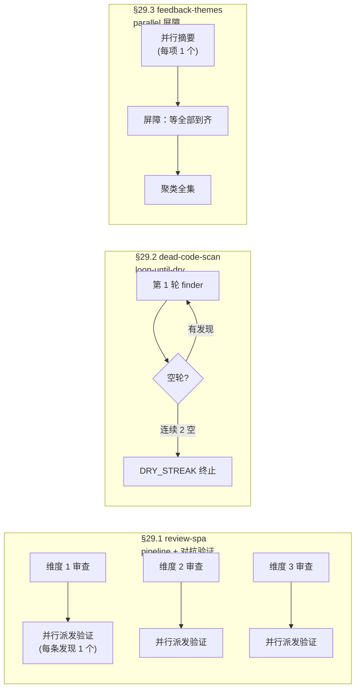
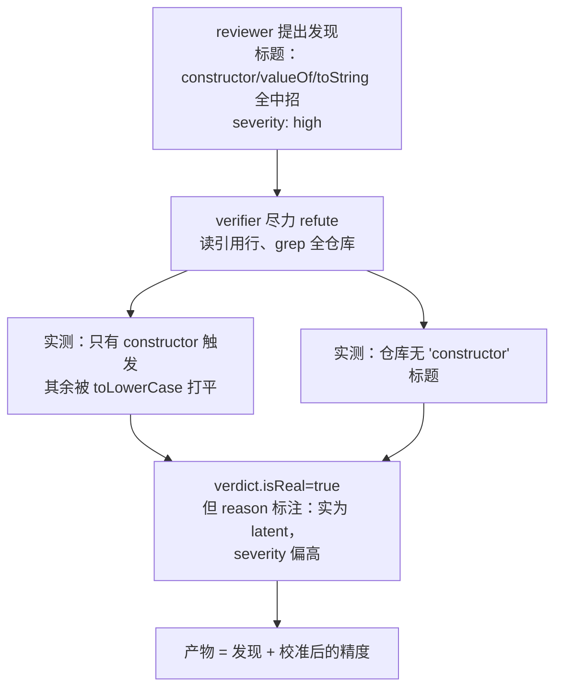
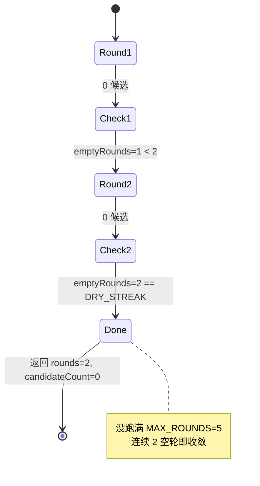
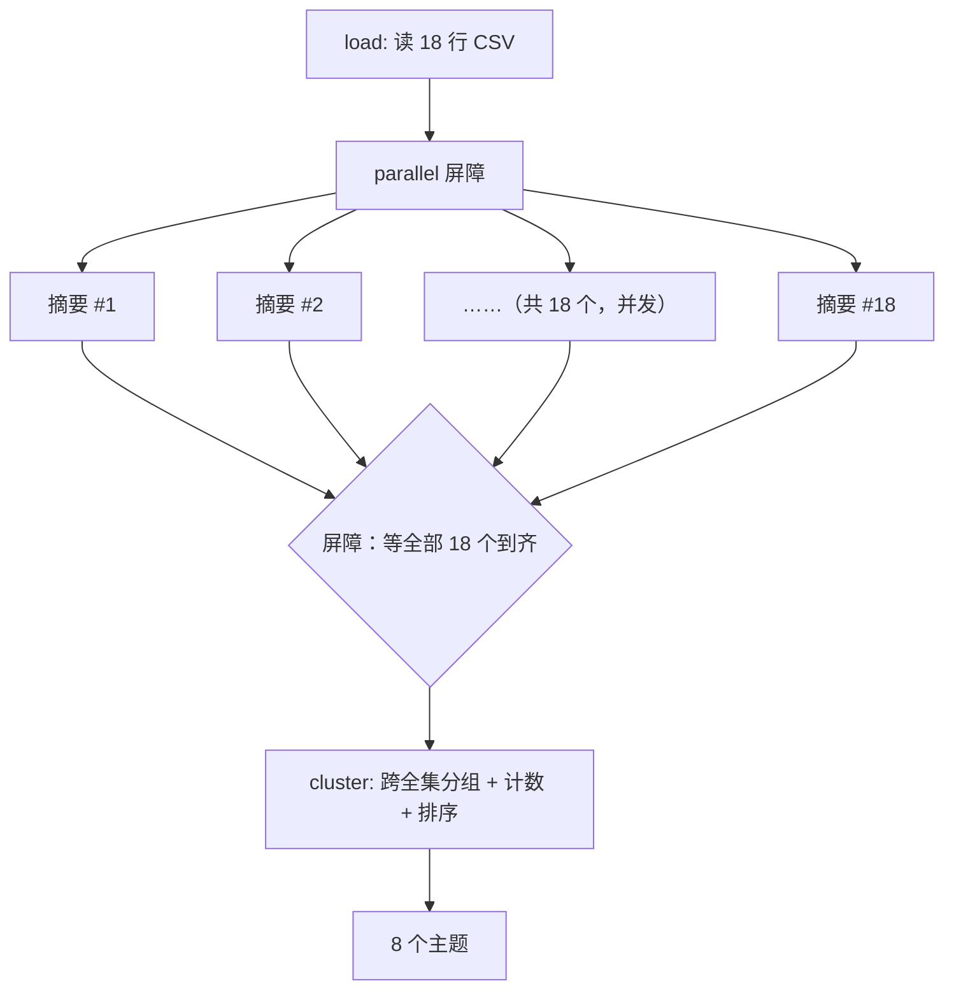

# 第 29 章 · 示例画廊

> **前面 28 章逐一讲解了 Workflow 的各个组件：pipeline、parallel、对抗验证、loop-until-dry、屏障、schema、续传。本章将它们装入三个真跑过的应用级工作流，展示完整的端到端结果：Run ID、agent 数、token、wall-clock，全部可溯源。**
>
> 这是一座画廊，不是对机制的再次讲解。三幅作品（多维代码审查、死代码扫描、反馈聚类）各对应一种编排形态，每一幅都附带真实运行时的数字和产物。本章展示的是「实际运行结果」，而非「预期效果」。

---

三个示例脚本都放在 `assets/examples/` 下，都在同一个会话里**真跑过**（`CLAUDE_CODE_WORKFLOWS=1`，Claude Code v2.1.150，主循环 Opus 4.7 (1M)），跑的记录在 `assets/transcripts/examples-r5.md`（R11 已在 v2.1.156 复核：这几种编排形态的核心机制仍成立，见 `assets/transcripts/examples-r11.md`）。三者各占一种编排形态：



三种形态的差异，先用一张表明确：

| 形态 | 代表脚本 | 何时各 agent 完成 | 何时进入下一步 | 适用场景 |
|---|---|---|---|---|
| **pipeline + 验证** | review-spa | 各维度独立完成 | 本维度一审完**立即**验证，不等最慢维度 | 多条独立链，希望「谁先好谁先走」 |
| **loop-until-dry** | dead-code-scan | 逐轮串行 | 连续 N 空轮才停 | 一轮可能揭示新目标的递进式清扫 |
| **parallel 屏障** | feedback-themes | 全部并发完成 | **必须等全部到齐**才能聚类 | 下一步需要全集（聚类、汇总、排序） |

下面逐幅展开。每一节按同一结构组织：**模式 → 脚本（编排取舍）→ 真实运行（Run ID + 用量表）→ 结果 → 教学点**。三种形态的机制本身分别在 [第 08 章](#/zh/p2-08)（pipeline / parallel）、[第 17 章](#/zh/p4-17)（对抗验证）、[第 18 章](#/zh/p4-18)（loop-until-dry）中详述，本章只展示它们真跑起来的结果。

---

## 29.1 review-spa：pipeline 多维审查 + 对抗验证

### 模式

对一份代码做**多个维度**的审查（bugs / security / a11y），每个维度自成一条链；某个维度审完后，**立即**对其每条发现做对抗验证，不等其他维度。这是两个模式的组合：「pipeline 让每条链独立推进」和「对抗验证只保留通过验证的发现」（分别在 [第 08 章](#/zh/p2-08) 和 [第 17 章](#/zh/p4-17) 中讲过），本节展示它们组合后的实战效果。

审查的真实目标是本书自身的 `index.html`（一份约 600 行的 vanilla-JS SPA），即 dogfooding，以自身前端为测试对象。

### 脚本：编排取舍

脚本位于 `assets/examples/review-spa.js`。骨架是一个 `pipeline()`，3 个维度各形成一条两阶段的链：

```javascript
  const reviewed = await pipeline(
    DIMENSIONS,
    // Stage 1 — 审查一个维度。
    d => agent(d.prompt, { label: `review:${d.key}`, phase: 'Review', schema: FINDINGS }),
    // Stage 2 — 对该维度的每条发现，并行验证。
    (review, d) => parallel(
      (review?.findings ?? []).map(f => () =>
        agent(
          `Adversarially verify this finding about ${TARGET}. Read the cited lines and try hard to refute it; ` +
          `if you cannot, it is real.\nTitle: ${f.title}\nEvidence: ${f.evidence}\nSeverity: ${f.severity}`,
          { label: `verify:${d.key}`, phase: 'Verify', model: 'haiku', schema: VERDICT },
        ).then(v => ({ ...f, dimension: d.key, verdict: v })),
      ),
    ),
  )
```

以下三个设计取舍值得关注：

**取舍一：为什么用 `pipeline`，而不是「先全部审完、再统一验证」？** 因为 pipeline 的语义是「每个 item 独立流过全部 stage，阶段之间没有屏障」（见 [第 08 章](#/zh/p2-08)）。bugs 维度一审完，其 6 条发现**立即**进入验证，无需等待 a11y 那条更慢的链审完。如果改为「先 `parallel` 审三个维度，再 `parallel` 验所有发现」，就多了一道不必要的屏障：最快的维度被最慢的那条拖住。pipeline 让审查和验证**交错推进**，wall-clock更短。

**取舍二：审查用 schema=`FINDINGS`，验证用 schema=`VERDICT`。** 两个阶段各有一份强类型契约。审查阶段要求 reviewer 返回 `{findings:[{title, evidence, severity}]}`；验证阶段要求 verifier 返回 `{isReal:boolean, reason}`。schema 在工具调用层完成校验、返回已验证的对象（见 [第 06](#/zh/p2-06)、[07 章](#/zh/p2-07)），因此 `review?.findings` 和 `f.verdict?.isReal` 可直接作为结构化数据使用，无需 `JSON.parse`。

**取舍三：验证 agent 被要求「尽力反驳」。** prompt 写的是「try hard to refute it; if you cannot, it is real」，这是对抗验证的核心原则：默认怀疑，无法反驳的才算真。脚本最后的 `.filter(f => f.verdict?.isReal)` 只保留通过验证的发现。

<div class="callout info">

**关于 `model: 'haiku'`**：脚本给验证 agent 标了 `model: 'haiku'`（验证是相对简单的核对任务，本意是用小模型节省费用）。但**本会话设了 `CLAUDE_CODE_SUBAGENT_MODEL=claude-opus-4-7[1m]`，它覆盖一切 per-call model**（见 `_grounding.md` §A2、Run `wf_9c94951d-58c`），所以这些标着「haiku」的 verifier 实际全跑的 Opus。这也是这次运行 token 偏高的原因之一。这个成本陷阱 §29.3 会专门展开。

</div>

### 真实运行

- **Run ID**：`wf_97b81e86-a0b`（Task `wq64i8tjl`）
- **目标**：`index.html`（~600 行 vanilla-JS SPA）

| 指标 | 值 |
|---|---|
| agent_count | **22**（3 reviewer + 19 verifier） |
| total_tokens | **991,554** |
| tool_uses | **148**（reviewer/verifier 反复 Read 同一文件） |
| duration_ms | **395,166**（≈6.6 分钟） |
| 返回 | `{ confirmedCount: 18, confirmed: [...] }` |

agent_count=22 可以逐一分解：3 个 reviewer（每个维度 1 个），加上对三个维度全部发现并行派发的 19 个 verifier，合计 22。

### 结果

18 条发现通过了对抗验证（`verdict.isReal=true`），按维度分布：**bugs 6 条 / security 4 条 / a11y 8 条**。下面每类列举几条要点（完整 18 条见 `assets/transcripts/examples-r5.md`）。以下发现及行号都是**该次运行对当时 `index.html` 的快照**；前端后来经过打磨，部分发现已修复或位置发生了变化（原因见本章末 §29 的三点说明），不应逐行号对照。

**bugs（6）**：最严重的一条是 `slugify` 去重使用了裸 `{}` 作为 `seen` map（L322/521），`seen={}` 继承 `Object.prototype`，导致标题 "constructor" 得到的 id 变成 `constructor-NaN`（`++function` 求值为 `NaN`）。修复方法是改用 `Object.create(null)`。其余几条涵盖锚点解析、dedup 碰撞、深链覆盖语言偏好、硬编码中文报错、scroll/resize 共用一个 `ticking` 标志。

**security（4）**：全是**潜在 / 供应链类**的，没有攻击者能伸手的输入面，包括 mermaid SVG 在 sanitize 之后又经 `innerHTML` 注入（只靠 `securityLevel:'strict'` 兜底）、4 个 CDN 脚本没挂 SRI、`ghLink.href` 没做 scheme 校验、manifest 字段转义前后不一致。

**a11y（8）**：最具实际影响的一条是整个 `#content` 带了 `aria-live="polite"`（L289/488），导致每次翻页都会将整章内容朗读一遍。其余几条涵盖缺少 `aria-current`、移动端抽屉背景未设置 `inert`、首页切换时焦点未跟随移动、mermaid SVG 没有替代文本、代码块无法通过键盘滚动等。

### 教学点：对抗验证纠正了 reviewer 的夸大

本节最重要的结论是：**验证阶段不仅判断真假，还纠正了 reviewer 的夸大之处**。`verdict.reason` 中那些澄清精度的内容，本身就是有价值的产物：

- **#1/#2 标题夸大被发现**：reviewer 的标题列出了 `constructor / valueOf / toString / ...` 一系列原型键，声称全部会触发问题，但 verifier 实测表明**只有 `constructor` 真正触发**，其余键被 `.toLowerCase()` 转换为 `valueof`/`tostring` 后不会命中；而且 grep 遍历全仓库**没有 "constructor" 这个标题**。因此该条被**降级为 latent**（潜在、当前不触发），原来标注的 high severity 被判定偏高。
- **#2 一处假子主张被证伪**：reviewer 声称 `#overview-1` 这类普通 dedup 锚点也无法跳转，但 verifier 实测表明**正常 dedup（`-1`/`-2`）的主查找完全命中、可正常跳转**，有问题的只有 `constructor-NaN` 这一个特例。这个假子主张被当场识别。
- **#3 措辞错误被指正**：reviewer 把「第 3 个 `Setup`」写成了「第 2 个」（底层机制是对的，只是描述指向了错误的位置）。



<div class="callout tip">

**发现通过验证不等于全盘接受。** 一条发现 `isReal=true`，只说明它不是凭空编造的；至于 severity 是否准确、措辞是否精确、是「今天就触发」还是「仅为潜在」，需要查看 `verdict.reason`。本次运行据此将 18 条分为三档：「当前可触发、非 latent」的高优先项（如移除 `#content` 的 `aria-live`）、「真实但影响有限」的普通项、「latent / 供应链 / 瞬态」的可选防御项。**对抗验证的价值不仅在于过滤假发现，更在于为每条真发现赋予可靠的优先级**，这是 [第 17 章](#/zh/p4-17) 对抗验证的实战意义。

</div>

---

## 29.2 dead-code-scan：loop-until-dry 死代码扫描

### 模式

逐轮扫描一个目标，查找「已定义但全文无引用」的符号，**连续多轮为空才停止**。这是 loop-until-dry 形态（[第 18 章](#/zh/p4-18)）：用 `while` 循环反复派遣 agent，直到连续空轮（「干」了）为止。因为确认一个符号为死代码后，可能使另一个符号也变得可删，因此不能只扫一轮就停。

扫描的真实目标同样是 `index.html`（SPA 内联的 vanilla JS）。

### 脚本：编排取舍

脚本位于 `assets/examples/dead-code-scan.js`，核心是一个带两个终止条件的 `while`：

```javascript
  const DRY_STREAK = 2 // 连续这么多空轮就停
  const MAX_ROUNDS = 5 // 硬上限，保证循环必然终止

  const found = []
  let emptyRounds = 0
  let round = 0

  while (emptyRounds < DRY_STREAK && round < MAX_ROUNDS) {
    round++
    phase('Find')
    const { items } = await agent(
      `Round ${round}. Read ${TARGET} and search the same file for references. List vanilla-JS symbols ` +
      `(functions, const/let bindings, event handlers) that are DEFINED but never REFERENCED anywhere in the file. ` +
      `Report only — do NOT edit any file. Ignore anything already reported: ` +
      `${found.map(r => r.symbol).join(', ') || 'nothing yet'}.`,
      { label: `find:round-${round}`, phase: 'Find', schema: DEAD },
    )

    if (items.length === 0) {
      emptyRounds++
      log(`Round ${round}: clean (${emptyRounds}/${DRY_STREAK} empty rounds)`)
      continue
    }

    emptyRounds = 0
    found.push(...items)
  }
```

两个设计取舍：

**取舍一：两个终止条件（`DRY_STREAK` + `MAX_ROUNDS`）。** `emptyRounds < DRY_STREAK` 是「连续空轮即停」的正常出口；`round < MAX_ROUNDS` 是「无论如何最多跑 5 轮」的硬上限。后者是安全网，即使 agent 每轮都报告新内容（即便全是噪声），循环也不会无限运行。这与 `_grounding.md` 中「生命周期 `agent()` 总数上限 1000」的 runaway-loop backstop 思路一致：循环类工作流**必须**自带硬上限（详见 [第 18 章 §18.3](#/zh/p4-18)）。

**取舍二：report-only，不修改文件。** prompt 中明确写了 `Report only — do NOT edit any file`。这是扫描类任务应有的安全策略：先报告、由人审查、再决定是否修改，而非允许 agent 自动删除代码。错删死代码可能引入隐蔽 bug，因此默认不做修改（参见 [第 16](#/zh/p3-16)、[18 章](#/zh/p4-18)）。

**取舍三：每轮把已经报过的符号回填进 prompt（`Ignore anything already reported: ...`）。** 这样后面几轮就不会把同一个符号又报一遍，空轮也判得干净。

### 真实运行

- **Run ID**：`wf_2283ab37-710`（Task `w4ii328zm`）
- **目标**：`index.html`

| 指标 | 值 |
|---|---|
| agent_count | **2**（2 轮 × 1 finder） |
| total_tokens | **116,344** |
| tool_uses | **14**（finder 多次 Read/grep 同一文件） |
| duration_ms | **246,496**（≈4.1 分钟） |
| 返回 | `{ rounds: 2, candidateCount: 0, candidates: [] }` |

### 结果

**两轮均为 0 候选。** 第 1 轮干净（`emptyRounds=1`），第 2 轮仍然干净（`emptyRounds=2`），连续 2 个空轮达到 `DRY_STREAK`，循环正常退出，**没有**消耗 5 轮上限。agent_count=2 正好对应「2 轮 x 1 finder」。

最终产物：`index.html` 中**没有已定义但从未被引用的符号**，这是一份干净的检查报告。

### 教学点：零发现也能正确终止



本节的关键在于一个反直觉的结论：**「什么都没找到」的工作流同样是一次成功的运行。** 编写循环类工作流时，常见的担心是「找不到东西会不会死循环、会不会跑满上限」。本次运行明确回答了这个问题：loop-until-dry 的终止条件是「连续 N 个空轮」，因此**即使第一轮就零发现，连续两个空轮同样让它正常收敛**，不会跑满 `MAX_ROUNDS`。

<div class="callout tip">

**两条工程纪律。** ①**循环必须有硬上限**：`DRY_STREAK` 决定「正常何时停止」，`MAX_ROUNDS` 兜底「最多跑几轮」，两者缺一不可。只有前者，遇到持续噪声会失控；只有后者，会过早终止本来能收敛的扫描。②**扫描默认 report-only**：删除代码、修改文件等破坏性操作，应先输出候选清单交由人审查，而非让 agent 自行执行。本次 0 候选恰好展示了非破坏性扫描最安全的形态：只检查，不做任何改动。

</div>

---

## 29.3 feedback-themes：parallel 屏障聚类

### 模式

将一批反馈**并行摘要**，再把**全集**聚类成排序后的主题。关键在于：聚类这一步**必须等所有摘要到齐**才能运行，无法单独对一条反馈做聚类。这是 `parallel()` 作为**屏障**（而非 pipeline）的典型场景（[第 08 章](#/zh/p2-08) 对比了两者）。

输入是一份明确标注好的**合成样本** `assets/samples/feedback-sample.csv`（18 行，列 `id,text`）；但**运行本身是真的**，Run ID、token、聚类输出都能往回查。

### 脚本：编排取舍

脚本位于 `assets/examples/feedback-themes.js`，分三段执行：单 agent 加载 → `parallel` 屏障摘要 → 单 agent 聚类：

```javascript
  phase('Load')
  const { items } = await agent(
    `Read ${SOURCE} (a CSV with columns id,text). Return every row as an item with its id and text.`,
    { label: 'load', phase: 'Load', schema: ITEMS },
  )

  // 故意用屏障：下一步跨全集聚类，必须先拿到所有摘要。
  const summaries = await parallel(items.map(it => () =>
    agent(
      `Summarize this feedback in one sentence and name the single issue it is about.\nID ${it.id}: ${it.text}`,
      { label: `summarize:${it.id}`, phase: 'Summarize', model: 'haiku' },
    ).then(summary => ({ id: it.id, summary })),
  ))

  const labelled = summaries.filter(Boolean)

  phase('Cluster')
  const { themes } = await agent(
    `Here are ${labelled.length} summarized feedback items. Cluster them into themes, count the items ` +
    `under each, pick one representative quote per theme, and rank the themes by count (descending).\n\n` +
    labelled.map(l => `- [${l.id}] ${l.summary}`).join('\n'),
    { label: 'cluster', phase: 'Cluster', schema: THEMES },
  )
```

设计取舍：

**取舍一：为什么这里用 `parallel` 屏障，而 §29.1 用 `pipeline`？** 区别在于「下一步是否需要全集」。§29.1 的验证只需要**本维度**的发现，因此 pipeline 让各维度交错推进、互不等待。这里的聚类需要**18 条摘要全部到齐**才能分组、计数、排序，少一条聚类结果就可能不同。因此必须使用屏障：`parallel()` 等全部摘要返回后才进入聚类步骤。**「下一步是否需要全集」是选择 pipeline 还是屏障的判定标准。**

**取舍二：`.filter(Boolean)`。** `parallel()` 的语义是「某个 agent 异步出错时，该位置填 `null`，但调用本身不 reject」（完整失败语义见 [第 08 章 §8.8](#/zh/p2-08)）。因此拿到 `summaries` 后，先用 `.filter(Boolean)` 过滤掉失败的位置，再传给聚类。这是使用 `parallel` 的标准防御写法。

### 真实运行

- **Run ID**：`wf_b3febb70-ad9`（Task `wh31drag1`）
- **输入**：`assets/samples/feedback-sample.csv`（18 行）

| 指标 | 值 |
|---|---|
| agent_count | **20**（1 load + 18 summarize + 1 cluster） |
| total_tokens | **607,307** |
| tool_uses | **3** |
| duration_ms | **122,391**（≈2.0 分钟） |
| 返回 | `{ itemCount: 18, themeCount: 8, themes: [...] }` |

agent_count=20 正好对应「1 个加载 + 18 个摘要（每行一个）+ 1 个聚类」，与 18 行输入一致。

### 结果

18 项反馈聚成了 **8 个主题**（按 count 从多到少排，引用的是真实聚类输出）：

| 排序 | 主题 | count | 代表引用（节选） |
|---|---|---|---|
| 1 | Onboarding 体验摩擦（步骤不清、缺前置、价值兑现慢） | 4 | "the first-run experience requires reading three documentation pages before the app delivers any value." |
| 2 | 性能与加载速度（仪表盘 / 分析 / 图表渲染） | 3 | "the dashboard takes nearly 8 seconds to load, making the app feel sluggish" |
| 3 | 计费准确性与清晰度（定价定义、重复扣费、收件人配置） | 3 | "Customer was charged twice this month and waited four days for a support response" |
| 4 | 错误处理质量（提示无用、崩溃） | 2 | "error messages are too generic and unhelpful" |
| 5 | 功能请求（导出、高级用户导航） | 2 | "add an export-to-CSV button on the reports screen" |
| 6 | 无障碍与 UI 缺陷（对比度、Esc 关闭模态） | 2 | "Modal dialogs cannot be closed with the Escape key" |
| 7 | 文档缺口（失败/恢复场景） | 1 | "the lack of guidance on recovering from a failed migration." |
| 8 | 搜索国际化（非拉丁 / Unicode 支持） | 1 | "the search box fails to return any results for queries containing non-Latin characters (e.g., Japanese)" |

count 加起来 = 4+3+3+2+2+2+1+1 = 18，跟输入的项数自洽。

### 教学点一：屏障的正确场景



聚类是一个「全集函数」，它消费的是**整批**摘要，少一条结果就可能不同。这种「下一步必须消费全部上游结果」的依赖，正是屏障存在的理由。反过来，如果某一步只依赖**单条**上游结果（如 §29.1 的验证，只看本维度的发现），就应该用 pipeline 让它们交错运行。**判定规则：下一步依赖全集 → 屏障（parallel）；下一步只依赖单条 → 流水线（pipeline）。**

### 教学点二：成本实测——haiku 标签被 Opus 静默覆盖

这是本章最需注意的成本陷阱。脚本为 18 个摘要 agent 全部标注了 `model: 'haiku'`（摘要是简单任务，本意是节省费用）。但本会话设置了环境变量 `CLAUDE_CODE_SUBAGENT_MODEL=claude-opus-4-7[1m]`，**它覆盖所有 per-call model**（见 `_grounding.md` §A2、Run `wf_9c94951d-58c`）。结果是：18 个标注「haiku」的 agent **实际全部运行了 Opus 1M**，单次运行消耗了 **607,307 token**。

<div class="callout warn">

**`CLAUDE_CODE_SUBAGENT_MODEL` 是用户/CI 控制的变量，脚本无法覆盖。** 一旦设置了这个环境变量，工作流脚本中的 `model: 'haiku'`（或任何 per-call model）就**被静默忽略**：agent 不会报错，而是直接以环境变量指定的模型运行。本次的 607k token，是 18 个「haiku」agent 实际运行 Opus 的直接结果，与 `_grounding.md` §A2 的实测结论一致（Run `wf_9c94951d-58c`：5 个带不同 `model` 选项的 agent 全部运行了 Opus）。

严格来说，「haiku 实际运行 Opus」是**两层环境变量叠加**的结果：除了 `CLAUDE_CODE_SUBAGENT_MODEL`，本会话还设置了 `ANTHROPIC_DEFAULT_HAIKU_MODEL`/`SONNET`/`OPUS`，将模型别名整体重映射到 Opus（Run `wf_e8cb23ff-829`）。因此即使没有 `CLAUDE_CODE_SUBAGENT_MODEL`，仅别名重映射这一层就足以将 `model: 'haiku'` 解析为 Opus。这两层都由用户/CI 控制，脚本无法干预（两层的精确映射和细节见 [附录 A · A.4](#/zh/app-a)）。

**这意味着**：在设置了该变量的会话中，`model: 'haiku'` **不会节省费用**。要实际节省费用，需要由用户或 CI 调整 `CLAUDE_CODE_SUBAGENT_MODEL`，脚本作者无法控制。因此「标注了 haiku，费用应该很低」这个假设，在受控的 CI/会话环境中**可能完全不成立**，应以实际 token 用量为准。

</div>

将三次运行的「标称模型」和「实际运行模型」并列对比，陷阱就很明显：

| 脚本 | 脚本里标的 model | 实际跑的模型 | 原因 |
|---|---|---|---|
| review-spa | verifier 标 `haiku` | Opus 1M | 环境变量覆盖 |
| feedback-themes | 18 个 summarize 标 `haiku` | Opus 1M | 环境变量覆盖 |
| （对照）`wf_9c94951d-58c` | 5 个 agent 标 haiku/opus/inherit/省略 | 全 Opus 1M | 环境变量覆盖 |

---

## 29.4 如何读这些数字

三幅作品看完，将贯穿其中的读数方法归纳为四条可复用的直觉。这些是从真实运行中提炼的**估算方法**，不涉及新机制。下次编写工作流、查看完成通知中的 `usage` 时，可以据此判断数字是否合理。

**方法一：token 约等于 agent 数乘以每 agent 上下文（约 3 万）。** 这是最实用的粗估公式（该法则的定义与推导见 [第 09 章 §9.3](#/zh/p2-09)）。用三次运行验证：

| 脚本 | agent 数 | total_tokens | 每 agent 均摊 |
|---|---|---|---|
| review-spa | 22 | 991,554 | ≈45,071 |
| dead-code-scan | 2 | 116,344 | ≈58,172 |
| feedback-themes | 20 | 607,307 | ≈30,365 |

`feedback-themes` 最接近「每 agent 约 3 万」（摘要 agent 上下文较短）；`review-spa` 和 `dead-code-scan` 偏高，原因是 reviewer/finder 反复 Read 同一个 600 行文件，上下文更重（参见 `tool_uses`：review-spa 高达 148、dead-code-scan 为 14）。因此这个公式给出的是**下界量级**，重复读取文件、长 prompt、对抗验证都会将其推高。核心要点：**token 主要由 agent 数量驱动**，要节省 token，首先考虑能否减少 agent 数量。

**方法二：wall-clock由关键路径决定，并发将 N 个压缩到「最慢的那一个」。** 对比 token 和wall-clock的关系，会发现两者**不成正比**：

| 脚本 | agent 数 | total_tokens | duration_ms | 形态 |
|---|---|---|---|---|
| review-spa | 22 | 991,554 | 395,166 | pipeline + 并行派发 |
| feedback-themes | 20 | 607,307 | **122,391** | parallel 屏障 |

`feedback-themes` 使用了 20 个 agent、60 万 token，wall-clock却只有 **2 分钟**，因为 18 个摘要 agent **并发**运行，wall-clock被压缩到「最慢的一条摘要 + 加载 + 聚类」这条关键路径上，而非 18 个串行累加。相比之下 `review-spa` 需要 6.6 分钟，是因为 pipeline 中每条链都是「审查→验证」两阶段串行，加上并行派发的验证 agent 数量较多。**并发节省的是wall-clock，不是 token**：token 消耗不变，但 N 个 agent 同时运行，只需等待最慢的那一个。

**方法三：对抗验证 / 并行派发是 token 消耗的大头。** `review-spa` 的 22 个 agent 中有 19 个是 verifier，对抗验证「每条发现派一个验证 agent」的并行派发模式，是其接近百万 token 的主要原因。这笔开销**是值得的**：额外的 token 换来了「将 #1/#2 降级为 latent、识别出 #2 的假子主张」这样的校准价值（见 §29.1 教学点）。但需要注意：**为每条发现配一个验证 agent，token 会随发现数线性增长**。发现数量较多时，可以考虑只对 high severity 的发现做对抗验证，为 token 设定边界（配合 [第 21 章](#/zh/p4-21) 的 `budget`）。

**方法四：脚本可复跑，数字可溯源。** 这三个脚本都可以用 `Workflow({ scriptPath: 'assets/examples/<脚本>.js' })` 重新运行（异步返回，完成后由 `<task-notification>` 回传 `usage`/`result`）。本章每一个 Run ID、agent 数、token、wall-clock都记录在 `assets/transcripts/examples-r5.md` 中，可以逐条核实。本书后来将这三个脚本**原样重跑了一次**（`wf_ca7aa11f-6fb` / `wf_ccda2a68-fab` / `wf_0771c834-a9f`，记录在 `assets/transcripts/examples-r6.md`），结果验证了方法四：**agent 数和编排形态稳定复现**（dead-code 仍为 2 agent / 2 轮干净、feedback 仍为 20 agent），但**发现数 / 主题数会随目标演进和聚类粒度小幅波动**（review-spa 18 → 14 条，因为 `index.html` 已按第一次的发现进行了优化；feedback 8 → 6 主题，是聚类粒度的差异）。如需逐位复现，应使用续传（[第 22 章](#/zh/p4-22)）。

<div class="callout info">

**为什么复跑的数字可能与本章不一致？** 三个原因。①**模型环境**：本章使用 Opus 1M 主循环加 `CLAUDE_CODE_SUBAGENT_MODEL` 覆盖（见 §29.3），更换模型环境后 token 和wall-clock都会变化。②**目标内容会变化**：`review-spa`/`dead-code-scan` 扫描的是 `index.html`，该文件随本书迭代持续变化，发现数自然不同（例如前端优化后，a11y 的发现可能减少）。③**模型非完全确定性**：同一脚本、同一目标，reviewer 的措辞和发现条数也可能小幅波动。因此本章的数字是**某次真实运行的快照**，不是常量；其用途是帮助建立量级直觉，而非用于逐位复现。如需逐位复现，应使用**续传**（同脚本 + 同 args = 100% 缓存命中，见 [第 22 章](#/zh/p4-22)），那是确定性的保证。

</div>

---

## 29.5 本章小结

- 三幅「真跑过」的应用级作品，各对应一种核心编排形态，全部数字都能溯源到 `assets/transcripts/examples-r5.md`：
  - **§29.1 review-spa**（`wf_97b81e86-a0b`，22 agent / 991,554 token / 395,166ms）：pipeline 多维审查 + 对抗验证，18 条确认（bugs 6 / sec 4 / a11y 8）。教学点是**对抗验证把 reviewer 的夸大纠了回来**（多条降级为 latent、一处假子主张被揪出）：发现扛下来 ≠ 全盘照收。
  - **§29.2 dead-code-scan**（`wf_2283ab37-710`，2 agent / 116,344 token / 246,496ms）：loop-until-dry，2 轮全干净、0 候选、`DRY_STREAK` 终止。教学点是**零发现也能正确终止**，report-only 不动手，循环必须有硬上限。
  - **§29.3 feedback-themes**（`wf_b3febb70-ad9`，20 agent / 607,307 token / 122,391ms）：parallel 屏障，18 项→8 主题。教学点是**屏障的正确场景**（聚类要全集）加上**成本陷阱**：`CLAUDE_CODE_SUBAGENT_MODEL` 盖掉脚本里的 `model:'haiku'`，18 个「haiku」agent 实跑 Opus，单次 607k token。
- **§29.4 读数四方法**：①token 约等于 agent 数乘以每 agent 约 3 万（重复读取文件会推高）；②wall-clock由关键路径决定，并发将 N 个压缩到最慢一个（节省wall-clock不节省 token）；③对抗验证 / 并行派发是 token 消耗的大头；④脚本可用 `Workflow({ scriptPath })` 复跑，数字溯源到 `examples-r5.md`。

本章将全书的组件组装成了可运行的完整系统。展示了真实运行的结果后，下一步可以查阅附录中每个 API 的完整签名和边界，将这些直觉转化为随时可查的参考。

> 继续阅读：[附录 A · API 完整参考](#/zh/app-a)
>
> 回过头看：这三幅里跑顺了的那个，按 `s` 存成命令（见[《操作面板》§6](#/zh/p2-ops)），或者收进你的库（见[第 25 章](#/zh/p5-25)）。
